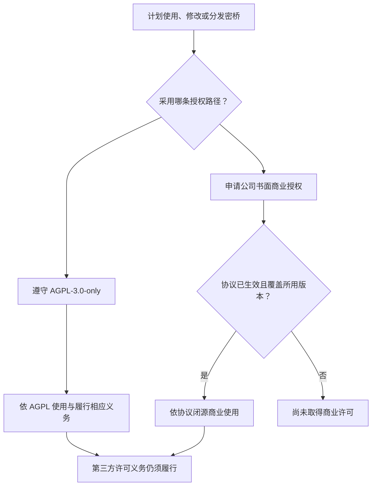

# 许可选择 / Licensing

[项目首页](README.zh-CN.md) / 许可选择

Copyright (c) 2026 数链创元（天津）信息技术有限责任公司

SecretBridge采用双许可模式：**AGPL-3.0-only 开源许可，或由公司另行出具的书面商业许可**。以下说明适用于公司拥有版权或已取得充分再许可权的项目内容；第三方代码、外部贡献与许可证文本的权利边界见[版权声明](COPYRIGHT.md)。

## 选择适合的授权路径

该图说明授权选择，不替代许可证条款或对具体集成方式的法律判断。

| 项目 | 开源路径 | 商业授权路径 |
| :--- | :--- | :--- |
| 授权依据 | [GNU AGPL v3原文](LICENSE)，仅第3版 | 公司与被授权方另行达成的有效书面协议 |
| 商业使用 | 允许，须遵守AGPL适用条件 | 按协议约定 |
| 闭源修改、集成与分发 | 不能一概视为允许或禁止；依具体行为及AGPL义务判断 | 可在明确授权的版本、用途和范围内约定允许 |
| 对应源码 | 履行适用的分发与网络交互源码提供义务 | 公司所授权内容按协议；第三方义务不免除 |
| 保修与支持 | 依AGPL，不承诺商业SLA | 仅以协议约定为准 |
| 许可费用 | AGPL本身不要求向公司购买商业许可 | 如有费用，由双方另行约定 |

## 开源授权

除另有许可声明的内容外，公司自有项目代码与文档依 **GNU Affero General Public License version 3 only**（`AGPL-3.0-only`）提供。完整条文保留于[LICENSE](LICENSE)，不增加“禁止商用”等限制，不将条文改写为自定义AGPL。

AGPL允许商业活动。其对分发、修改及修改版网络交互的要求应结合实际用途判断；第13条不能被简化为“任何网络调用都要公开整个公司的代码”。提供对应源码不等于公开密码、客户数据或无关系统资料。以[AGPL条文](https://www.gnu.org/licenses/agpl-3.0.html)为准。

已依法取得的AGPL许可不会因为本项目新增商业授权选项而被追溯撤销。公开分支的SPDX标识仍为 `AGPL-3.0-only`；商业授权的可获得性不是一份自动生效的第二许可。

## 公司书面商业授权

希望在不适用公司所授权内容之AGPL条件的另行许可下开展闭源商业使用、修改、嵌入或分发，可申请[商业授权](COMMERCIAL_LICENSE.md)。授权须覆盖实际使用的版本及行为；未获有效授权时，不得仅凭本页推定已经获得闭源分发等权利。

本页不构成商业许可合同，不代表公司已对任何申请人签约、授权、报价或提供保证。商业授权也不改变其他接收者已获得的开源权利。

## 第三方与外部贡献

公司不能通过自己的商业协议取消第三方的GPL、LGPL、MPL、NOTICE、署名、源码或运行时分发要求。商业版必须逐项核验其完整构成，不得把“本项目双许可”写成“全部依赖可闭源”。

外部贡献默认依贡献时明确的开源条款处理。仅有DCO签署不等于授予公司闭源再许可权；未获充分授权的贡献不得自动纳入商业授权范围。详见[贡献与再许可政策](docs/贡献与再许可.md)和[依赖许可风险评估](docs/依赖许可风险评估.md)。

## English summary

Copyright (c) 2026 数链创元（天津）信息技术有限责任公司.

Company-owned SecretBridge code and documentation are available under **AGPL-3.0-only**, or under a **separate written commercial license** issued by the company for material it has the right to license. AGPL permits commercial use subject to its terms. A commercial agreement may permit proprietary use, modification, integration and distribution within its agreed scope.

This page does not itself grant a commercial license. Third-party obligations and separately owned contribution rights remain applicable. Existing compliant recipients retain their AGPL rights. See [commercial licensing](COMMERCIAL_LICENSE.md) for the application process.

---

[版权声明](COPYRIGHT.md) · [第三方声明](THIRD_PARTY_NOTICES.md) · [贡献指南](CONTRIBUTING.md)
