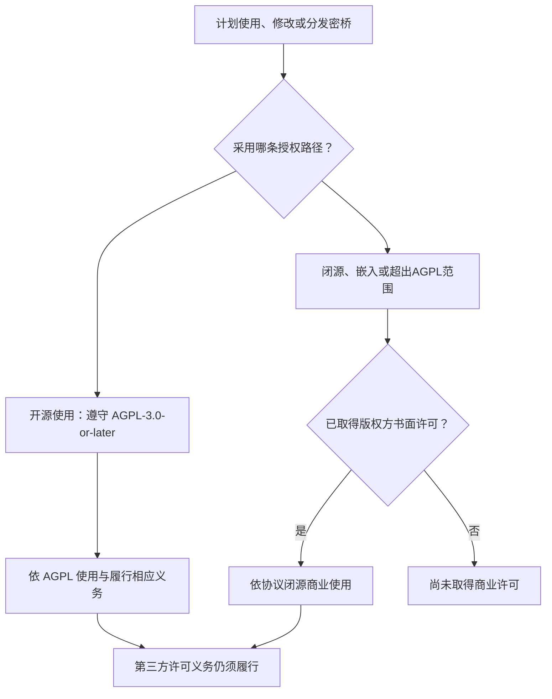

# 许可选择 / Licensing

[项目首页](README.zh-CN.md) / 许可选择

Copyright (c) 2026 数链创元（天津）信息技术有限责任公司

本仓库采用 **GNU Affero General Public License v3.0 or later**（`AGPL-3.0-or-later`）开源许可。如需将代码改造后闭源商用，将其嵌入、链接或打包进不按AGPL履约的商业软件，或实施任何超出开源许可范围的事项，须事先联系版权方取得书面商业许可。公司只能许可其拥有版权或已取得充分再许可权的内容；第三方代码、外部贡献与许可证文本的权利边界见[版权声明](COPYRIGHT.md)。

## 选择适合的授权路径

该图说明授权选择，不替代许可证条款或对具体集成方式的法律判断。

| 项目 | 开源路径 | 商业授权路径 |
| :--- | :--- | :--- |
| 授权依据 | [GNU AGPL v3原文](LICENSE)，第3版或任何以后版本 | 公司与被授权方另行达成的有效书面协议 |
| 商业使用 | 允许，须遵守AGPL适用条件 | 按协议约定 |
| 改造后商用 | 可以，但发布和网络服务须履行适用的AGPL义务 | 闭源或不按AGPL履约时，须取得书面许可 |
| 嵌入、链接或打包进商业软件 | 仅在整个组合与交付方式符合适用AGPL义务时使用 | 商业软件不按AGPL履约时，须取得书面许可 |
| 超出开源许可范围的使用 | 不允许 | 仅在商业协议明确授权的范围内允许 |
| 对应源码 | 履行适用的分发与网络交互源码提供义务 | 公司所授权内容按协议；第三方义务不免除 |
| 保修与支持 | 依AGPL，不承诺商业SLA | 仅以协议约定为准 |
| 许可费用 | AGPL本身不要求向公司购买商业许可 | 如有费用，由双方另行约定 |

## 开源授权

除另有许可声明的内容外，公司自有项目代码与文档依 **GNU Affero General Public License version 3 or any later version**（`AGPL-3.0-or-later`）提供。完整第3版条文保留于[LICENSE](LICENSE)；使用者可以选择第3版或Free Software Foundation以后发布的版本。

AGPL允许商业活动。其对分发、修改及修改版网络交互的要求应结合实际用途判断；第13条不能被简化为“任何网络调用都要公开整个公司的代码”。提供对应源码不等于公开密码、客户数据或无关系统资料。以[AGPL条文](https://www.gnu.org/licenses/agpl-3.0.html)为准。

已依法取得的AGPL许可不会因为项目同时提供商业授权渠道而被追溯撤销。公开分支的SPDX标识为 `AGPL-3.0-or-later`；商业授权必须另行签署，不会因访问或下载本仓库而自动生效。

## 公司书面商业授权

下列用途须申请[商业授权](COMMERCIAL_LICENSE.md)：

- 将本项目代码修改、改造或派生后，以闭源或其他不遵守AGPL的方式商用；
- 将本项目代码嵌入、链接、集成或打包进不按AGPL履约的商业软件、设备或服务；
- 对外提供不满足AGPL适用条件的专有分发或网络服务；
- 任何需要使用、复制、修改、分发、再许可或利用本项目，但超出AGPL授权范围的事项。

授权须覆盖实际使用的版本、模块和行为；未获有效书面授权时，不得仅凭沟通、下载或本页内容推定已经取得相关权利。商业使用如完整遵守AGPL，则可直接依开源许可进行。

本页不构成商业许可合同，不代表公司已对任何申请人签约、授权、报价或提供保证。商业授权也不改变其他接收者已获得的开源权利。

## 第三方与外部贡献

公司不能通过自己的商业协议取消第三方的GPL、LGPL、MPL、NOTICE、署名、源码或运行时分发要求。商业版必须逐项核验其完整构成，不得把“本项目双许可”写成“全部依赖可闭源”。

外部贡献默认依贡献时明确的开源条款处理。仅有DCO签署不等于授予公司闭源再许可权；未获充分授权的贡献不得自动纳入商业授权范围。详见[贡献与再许可政策](docs/贡献与再许可.md)和[依赖许可风险评估](docs/依赖许可风险评估.md)。

## English summary

Copyright (c) 2026 数链创元（天津）信息技术有限责任公司.

This repository is licensed under **GNU Affero General Public License v3.0 or later** (`AGPL-3.0-or-later`). A separate written commercial license is required for proprietary commercial use of modified versions, embedding, linking or packaging in commercial software that will not comply with the AGPL, and any exercise of rights outside the open-source license. AGPL-compliant commercial use remains available under the open-source license.

This page does not itself grant a commercial license. Third-party obligations and separately owned contribution rights remain applicable. Existing compliant recipients retain their AGPL rights. See [commercial licensing](COMMERCIAL_LICENSE.md) for the application process.

---

[版权声明](COPYRIGHT.md) · [第三方声明](THIRD_PARTY_NOTICES.md) · [贡献指南](CONTRIBUTING.md)
