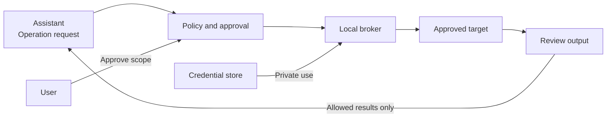

# SecretBridge · 密桥

**Controlled credential use for AI-assisted operations.**

[简体中文](README.zh-CN.md) · [Documentation](docs/README.md) · [Contribute](CONTRIBUTING.md) · [Security](SECURITY.md)

> [!IMPORTANT]
> **Design-stage project.** Product and engineering specifications are available; the desktop application, credential broker and installers are not. Platform support is a development target. Do not use real credentials.

## Why SecretBridge?

Giving an assistant a password also exposes that password to its surrounding context and tools. SecretBridge is designed to keep credential use behind a local, explicit authorization boundary: an assistant requests an operation; a trusted broker performs it; reviewed results return to the assistant.

| Capability | Intended experience |
| :--- | :--- |
| Credential-use delegation | Configure credentials locally; expose approved operations, not a secret-reading API. |
| Explicit approvals | Review the target, parameters, permissions and output scope before an operation starts. |
| Persistent terminals | Reconnect to sessions without tying their lifetime to a window or one assistant request. |
| Controlled results | Release approved fields and filtered output; retain an attributable audit trail. |
| Cross-platform desktop | Consistent workflows with native credential, IPC and process backends. |

All capabilities above are planned. See [milestone acceptance criteria](ROADMAP.md) for implementation progress.

## How it works

The assistant does not receive the stored secret. Ordinary terminals and credential-bearing operations use separate execution paths; a credentialed session is not an unrestricted shell.

> [!WARNING]
> Masking is not isolation. An assistant with unrestricted access under the credential owner's OS account may bypass application controls. A secure deployment requires a tested identity/process boundary and narrowly scoped adapters. Read the [security model](docs/安全模型与验收.md) before evaluating real-world use.

## Choose a starting point

| Your goal | Start here |
| :--- | :--- |
| Understand the workflow and limitations | [User orientation](docs/使用指南.md) — Chinese |
| Find the right technical document | [Documentation hub](docs/README.md) |
| Contribute code, design or tests | [Contributor guide](CONTRIBUTING.md) and [development setup](docs/开发者入门.md) |
| Review architecture and platform behavior | [Architecture](docs/开发设计.md) and [platform/UI specification](docs/跨平台与UI规范.md) |
| Report a vulnerability privately | [Security policy](SECURITY.md) |

The English and Chinese homepages cover the same product scope. Detailed engineering documents are currently in Simplified Chinese; English translations are welcome.

## Platform targets

| Platform | First validation baseline | Runtime status |
| :--- | :--- | :--- |
| Windows | Windows 11 · x64 | Not implemented |
| Linux | Ubuntu 24.04 · x64 · GNOME/KDE | Not implemented |
| macOS | macOS 14+ · arm64/x64 | Not implemented |

Other OS versions and architectures require separate validation. Actual support will be documented for each future release.

## Contribute

The project is in its design stage. Contributions to product design, security review, platform integration, accessibility and documentation are welcome. Read the [contributor guide](CONTRIBUTING.md) and [development setup](docs/开发者入门.md) before starting.

## License and community

Copyright (c) 2026 **数链创元（天津）信息技术有限责任公司**.

This repository is open-source software licensed under the **GNU Affero General Public License v3.0 or later** (`AGPL-3.0-or-later`). A separate written commercial license is required to use a modified version on proprietary terms, embed, link or package the code in commercial software that will not comply with the AGPL, or exercise rights beyond the open-source license. See [licensing](LICENSING.md), [commercial licensing](COMMERCIAL_LICENSE.md) and [copyright](COPYRIGHT.md).

Third-party components remain subject to their own terms under either licensing path. See [third-party notices](THIRD_PARTY_NOTICES.md) and the [dependency license assessment](docs/依赖许可风险评估.md).

Contributions follow the [contribution guide](CONTRIBUTING.md) and [community standards](CODE_OF_CONDUCT.md). Report ordinary issues through [GitHub Issues](https://github.com/qq940500529/secretbridge/issues); report vulnerabilities through the private channel in [SECURITY.md](SECURITY.md).

---

[Documentation](docs/README.md) · [Roadmap](ROADMAP.md) · [Changelog](CHANGELOG.md)
