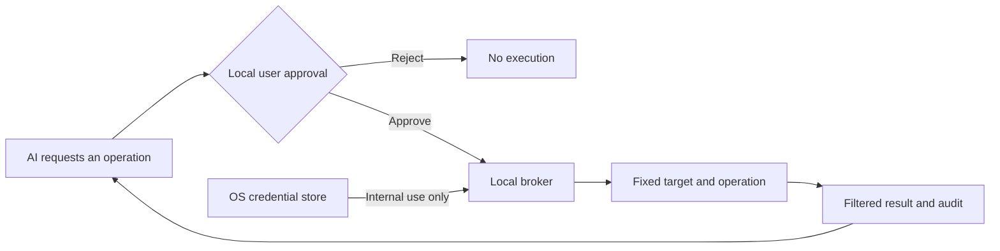

<div align="center">

# SecretBridge · 密桥

**Keep credentials local. Let a human set the approval policy.**

[简体中文](README.zh-CN.md) · [Download Beta](https://github.com/qq940500529/secretbridge/releases/tag/v0.2.0-beta.8) · [Docs](docs/README.md) · [Deploy](docs/AI辅助部署.md) · [Feedback](https://github.com/qq940500529/secretbridge/issues/new?template=bug_report.md) · [Security](SECURITY.md)

[](LICENSE)
[](rust-toolchain.toml)
[](.node-version)

</div>

> [!IMPORTANT]
> SecretBridge `0.2.0-beta.8` is public prerelease software for individual, single-machine use. Start with synthetic credentials, keep independent backups, and read the [License Agreement and Disclaimer](docs/最终用户许可与免责声明.md). There is no secret-reading or export API; AI reads terminal results only through the broker's redacted MCP cursor.

## Why SecretBridge

Giving an AI a password puts that secret in conversation, command or logging context. SecretBridge changes the workflow: an AI requests a fixed operation, the user reviews it locally, and the broker uses the credential internally while returning only the approved result.



## What it provides

- **Write-only credential handling:** passwords, tokens and private keys live in the OS credential store; SQLite keeps references and public state.
- **Human-controlled approval:** review each request by default, or set a one-hour per-conversation reuse policy in the local Web console. Allowing every operation in one AI conversation requires an explicit high-risk confirmation and shows a persistent warning while active.
- **Authenticator confirmation:** bind a standard TOTP authenticator by QR code or manual key, then confirm one reviewed approval from an AI conversation with a single-use six-digit code.
- **Controlled connectors:** fixed programs, HTTP, SSH, SFTP, Git HTTPS, PostgreSQL and MySQL.
- **Secure continuous terminals:** ordinary commands and human-approved credential commands can share one broker-owned shell; output is redacted before Web replay or MCP reads.
- **Bounded results:** filter credential-task output before persistence; constrain HTTP and database fields and size.
- **Traceable state:** version approvals, runs and fixed audit events; configuration changes invalidate stale grants.
- **Local delivery:** background start/status/stop, login startup, upgrade, rollback, uninstall, backup and restore.

The open-source edition focuses on individual local use. Organizational identity, central policy, managed nodes and multi-party approval are a separate enterprise direction, not a hidden prerequisite for open-source 1.0. See the [edition boundary](docs/开源版与企业版.md) (Chinese).

## Quick start

For a first deployment, give the prompt below to a permission-aware local AI coding assistant. It works from any directory or new conversation; an existing clone is not required.

```text
Deploy SecretBridge from https://github.com/qq940500529/secretbridge on this machine.

1. You may start from any directory; do not assume the repository is cloned. First check the current AI client's existing MCP configuration, PATH and the documented default SecretBridge installation location. Check only explicit locations, not the whole user directory. If an executable is found, run `status`. Reuse a healthy, suitable installation without downloading, overwriting or reinstalling it; start that installation if it is stopped. If there are signs of a custom installation but its location is unknown, ask me once instead of creating a duplicate.
2. Only after confirming that no usable installation exists, look for the latest GitHub Release. Download, verify and install a matching package. If no suitable Release exists, clone latest `main` into a new non-sensitive directory, read `AGENTS.md` and the deployment documents, then build and install with pinned tools and lock files.
3. Preserve existing files and ask before administrator access or changes outside the working directory. Never request or expose real credentials.
4. Start or reuse SecretBridge, confirm healthy `status` and a loopback-only listener, and obtain the current absolute `binary` path from `status` or `install`.
5. Connect it to the MCP-capable AI client I use. Show and back up the exact configuration before requesting approval to change it; use `binary` as `command` and `["--mcp-stdio"]` as `args`; keep a custom data directory consistent and never store credentials or pairing tokens in MCP configuration. Reload the client, confirm the tools are visible, and call the read-only `secretbridge_terminal_capabilities` tool. If configuration cannot be changed safely, provide paste-ready configuration and exact reload steps instead of guessing its path.
6. In an interactive desktop session, use the official `open` command to open the local management page after installation or when pairing, license acceptance or authenticator setup is still needed. Guide me through those human steps without requesting my PIN, TOTP setup key or credentials. If there is no desktop session or opening the browser fails, show the local access method and exact next step; do not change the loopback listener or firewall. Avoid interrupting an already initialized installation.
7. Check final service health after initialization. Report whether an existing installation was reused or a new one was installed, the version or commit, installation location, MCP verification result, management-page outcome and uninstall command.
```

The [AI-assisted deployment guide](docs/AI辅助部署.md) explains permissions and safety boundaries and links to the AI-readable runbook. Review commands before allowing them to run. Maintainers who need full source and package acceptance should use the validation flow in that guide instead.

You do not need to determine whether SecretBridge is already installed, choose a package, prepare a checkout, install a toolchain or discover MCP launch arguments yourself. When you change AI application, model or conversation, the assistant should reuse the same local installation and add only the current client's MCP configuration. The broker accepts loopback addresses only, and `open` creates a one-time browser pairing link. Manual source builds, MCP setup, upgrades and uninstall behavior are documented in [installation and background operation](docs/后台运行与安装交付.md).

## Typical workflow

1. Save a disposable synthetic credential and confirm that the UI cannot read it back.
2. Register a fixed connection and its trust settings.
3. Define a task, ordinary parameters, credential slots and result scope.
4. Let an AI or user request approval; decide in the Web console, or reply with a current authenticator code so the AI can relay that one-time confirmation through MCP.
5. Run the approved operation and inspect its bounded result and audit events.
6. Delete synthetic credentials and stop the broker when the evaluation ends.

Detailed engineering documents are currently in Simplified Chinese. Start with the [documentation hub](docs/README.md) and [user guide](docs/使用指南.md).

## Validation targets

| Platform | Current baseline | Default shell |
|---|---|---|
| Windows | Windows 11 x64 | PowerShell / CMD |
| Linux | Ubuntu 24.04 x64 | Bash |
| macOS | macOS 14+ arm64/x64 | Zsh |

Other versions and architectures are experimental until separately validated. Beta packages are unsigned; each public release states its supported environments and known limitations.

## Help test the Beta

Broader real-machine validation is now community-led. After installing the latest Beta, use synthetic data to check installation, browser pairing, credential-store write/overwrite/delete, approval and rejection, redaction, restart or login recovery, upgrade/rollback and uninstall on your own environment. Do not weaken TLS, SSH host verification, the credential store or other system protections to make a test pass.

The [community verification backlog](docs/社区验证待办.md) lists outstanding real-desktop and platform scenarios. These checks are tracked separately from completed implementation issues.

Report a reproducible ordinary defect through the [Beta bug form](https://github.com/qq940500529/secretbridge/issues/new?template=bug_report.md). Include the package version, platform, install method, sanitized steps and cleanup result—never a real credential, private endpoint, user path or business record. Use the [private security advisory form](https://github.com/qq940500529/secretbridge/security/advisories/new) for a possible vulnerability.

## Security boundary

- MCP cannot read secrets, setup keys, QR codes or PINs. It can only relay a user-supplied, single-use TOTP code for one identified pending approval; without that code it cannot approve its own request.
- On first launch, the local management page requires a user-chosen PIN/passphrase of at least 12 characters. It signs the user in and unlocks encrypted diagnostic records. The page then asks whether to add an optional authenticator; binding TOTP keeps the PIN active. Losing the PIN makes previously encrypted diagnostics unrecoverable. Never give the PIN to an AI or include it in an issue.
- TLS, SSH host verification and target-system permissions must not be disabled to make a test pass.
- Output filtering reduces accidental echo risk; it is not a program sandbox and cannot decide whether all business data is safe to share with a model.
- Malicious software already running arbitrary code as the credential owner may bypass application controls and access that account's processes, files or credential store.
- Use short-lived, least-privilege accounts for real systems and synthetic data in reports.

See the [security model](docs/安全模型与验收.md) and [automated security acceptance](docs/自动化安全验收.md). Report vulnerabilities privately through [SECURITY.md](SECURITY.md).

## Project links

| Goal | Start here |
|---|---|
| Deploy and use | [Documentation](docs/README.md) |
| See what remains | [Roadmap](ROADMAP.md) · [Changelog](CHANGELOG.md) |
| Develop locally | [Developer setup](docs/开发者入门.md) · [Architecture](docs/开发设计.md) |
| Contribute | [Contribution guide](CONTRIBUTING.md) · [Code of conduct](CODE_OF_CONDUCT.md) |
| Understand licensing | [Licensing](LICENSING.md) · [Commercial license](COMMERCIAL_LICENSE.md) |
| Review first-run terms | [License Agreement and Disclaimer](docs/最终用户许可与免责声明.md) |
| Report a problem | [Public bug report](https://github.com/qq940500529/secretbridge/issues/new?template=bug_report.md) · [Private security report](https://github.com/qq940500529/secretbridge/security/advisories/new) |

Copyright (c) 2026 数链创元（天津）信息技术有限责任公司. Open-source code is licensed under `AGPL-3.0-or-later`; third-party components retain their own licenses. See [THIRD_PARTY_NOTICES.md](THIRD_PARTY_NOTICES.md).
