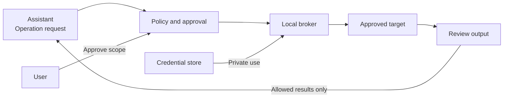

<div align="center">

# SecretBridge · 密桥

**Controlled credential use for AI-assisted operations.**

[简体中文](README.zh-CN.md) · [Documentation](docs/README.md) · [Contribute](CONTRIBUTING.md) · [Security](SECURITY.md)

[](LICENSE)
[](COMMERCIAL_LICENSE.md)
[](ROADMAP.md)

[](Cargo.toml)
[](crates/secretbridge-server/Cargo.toml)
[](web/package.json)
[](web/package.json)
[](web/package.json)

</div>

> [!IMPORTANT]
> **M2 controlled-operation development with M0 security gates still open.** The local Web console can store passwords and API tokens in the operating-system credential store. A local MCP stdio server can request approval, start an approved single-use run, inspect bounded status/events and cancel an active run. Approval decisions remain in the trusted Web console. Secrets have no read/export tool or API, and arbitrary SQL or credentialed shell access remains unavailable.

## Why SecretBridge?

Giving an assistant a password also exposes that password to its surrounding context and tools. SecretBridge is designed to keep credential use behind a local, explicit authorization boundary: an assistant requests an operation; a trusted broker performs it; reviewed results return to the assistant.

| Capability | Intended experience |
| :--- | :--- |
| Credential-use delegation | Configure credentials locally; expose approved operations, not a secret-reading API. |
| Explicit approvals | Review the target, parameters, permissions and output scope before an operation starts. |
| Persistent terminals | Reconnect to sessions without tying their lifetime to a window or one assistant request. |
| Controlled results | Release approved fields and filtered output; retain an attributable audit trail. |
| Cross-platform experience | A consistent browser console with native credential and process backends. |

One-time pairing, expiring/revocable page sessions and a reconnectable synthetic PTY are implemented. Credential metadata and PostgreSQL target details are versioned in SQLite; passwords and API tokens are stored under opaque UUID entries in the OS credential store. Secret mutations require a paired session, exact Origin and optimistic version, while responses expose only `available` or `not_configured`. The PostgreSQL adapter runs a fixed `SELECT 1` inside a read-only serializable transaction with certificate and hostname verification, and returns only enumerated status. The MCP surface contains eight fixed tools and omits approval decisions, secret access, SQL, shell input, connection strings and target addresses. PTY reconnection uses output cursors, concurrent attachments enforce one writer with read-only observers, and ordinary terminals never receive credentials. The status API explicitly reports the identity posture as unverified same-user compatibility. See [milestone acceptance criteria](ROADMAP.md) for remaining work.

## How it works



The assistant does not receive the stored secret. Ordinary terminals and credential-bearing operations use separate execution paths; a credentialed session is not an unrestricted shell.

> [!WARNING]
> Masking is not isolation. An assistant with unrestricted access under the credential owner's OS account may bypass application controls. A secure deployment requires a tested identity/process boundary and narrowly scoped adapters. Read the [security model](docs/安全模型与验收.md) before evaluating real-world use.

## Choose a starting point

| Your goal | Start here |
| :--- | :--- |
| Understand the workflow and limitations | [User orientation](docs/使用指南.md) — Chinese |
| Find the right technical document | [Documentation hub](docs/README.md) |
| Contribute code, design or tests | [Contributor guide](CONTRIBUTING.md) and [development setup](docs/开发者入门.md) |
| Review architecture and platform behavior | [Architecture](docs/开发设计.md) and [platform/UI specification](docs/跨平台与UI规范.md) |
| Report a vulnerability privately | [Security policy](SECURITY.md) |

The English and Chinese homepages cover the same product scope. Detailed engineering documents are currently in Simplified Chinese; English translations are welcome.

## Run the development prototype

Install Node.js 24, pnpm 11 and the stable Rust 1.98 toolchain or newer:

```sh
pnpm install --frozen-lockfile
pnpm build
cargo run -p secretbridge-server
```

The service binds only to `127.0.0.1:8787` and opens the system browser. Its bootstrap token travels in the URL fragment and is removed immediately after the page consumes it; navigation and refresh do not persist the session. **Credentials** writes passwords and API tokens directly to the OS credential store without a read route. **Targets** stores validated PostgreSQL endpoint metadata but no connection string or password, and only offers `verify_full` TLS. **Policies**, **Approvals**, **Runs** and **Audit** drive the fixed PostgreSQL status check or an offline synthetic check; neither accepts caller-provided SQL or operation parameters. The **Secure terminal** page runs only SecretBridge's built-in synthetic process—never PowerShell, `cmd`, `sh`, or a user command—and has no access to stored secrets. The project does not use—and does not plan to introduce—a desktop shell.

To start the local Web console and MCP stdio transport in the same process, configure the built executable as an MCP server with the single argument `--mcp-stdio`. This mode reserves stdout for JSON-RPC and sends diagnostics to stderr. The process owns the Web service lifecycle and port, so do not start a second SecretBridge instance on the same bind address. See the [user guide](docs/使用指南.md#mcp-stdio) for the tool list and configuration example.

## Platform targets

| Platform | First validation baseline | Runtime status |
| :--- | :--- | :--- |
| Windows | Windows 11 · x64 | Local prototype and CI synthetic paths verified |
| Linux | Ubuntu 24.04 · x64 · GNOME/KDE | CI synthetic paths verified; desktop integration pending |
| macOS | macOS 14+ · arm64/x64 | CI synthetic paths verified; desktop integration pending |

Other OS versions and architectures require separate validation. Actual support will be documented for each future release.

## Contribute

The project is in M2 development while M0 security verification remains open. Contributions to security review, platform integration, accessibility, testing and documentation are welcome. Read the [contributor guide](CONTRIBUTING.md) and [development setup](docs/开发者入门.md) before starting.

## License and community

Copyright (c) 2026 **数链创元（天津）信息技术有限责任公司**.

This repository is open-source software licensed under the **GNU Affero General Public License v3.0 or later** (`AGPL-3.0-or-later`). A separate written commercial license is required to use a modified version on proprietary terms, embed, link or package the code in commercial software that will not comply with the AGPL, or exercise rights beyond the open-source license. See [licensing](LICENSING.md), [commercial licensing](COMMERCIAL_LICENSE.md) and [copyright](COPYRIGHT.md).

Third-party components remain subject to their own terms under either licensing path. See [third-party notices](THIRD_PARTY_NOTICES.md) and the [dependency license assessment](docs/依赖许可风险评估.md).

Contributions follow the [contribution guide](CONTRIBUTING.md) and [community standards](CODE_OF_CONDUCT.md). Report ordinary issues through [GitHub Issues](https://github.com/qq940500529/secretbridge/issues); report vulnerabilities through the private channel in [SECURITY.md](SECURITY.md).

---

[Documentation](docs/README.md) · [Roadmap](ROADMAP.md) · [Changelog](CHANGELOG.md)
