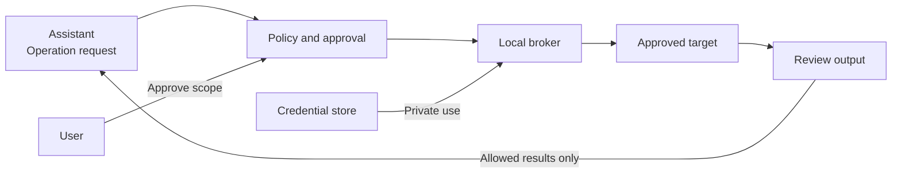

<div align="center">

# SecretBridge · 密桥

**Controlled credential use for AI-assisted operations.**

[简体中文](README.zh-CN.md) · [Documentation](docs/README.md) · [Contribute](CONTRIBUTING.md) · [Security](SECURITY.md)

[](LICENSE)
[](COMMERCIAL_LICENSE.md)

[](Cargo.toml)
[](crates/secretbridge-server/Cargo.toml)
[](web/package.json)
[](web/package.json)
[](web/package.json)

</div>

> [!IMPORTANT]
> This is a local prototype under active feature development. It provides persistent terminals, an operating-system credential store, fixed program tasks and explicit single-use or time-window approvals. Named slots support stdin, child environment, arguments and temporary files; Web and MCP can read filtered run output incrementally. Secrets have no read/export tool or API. Ordinary terminals never receive injected credentials; output filtering is not a program sandbox. Ordinary parameters support types, required values, defaults, choices and length constraints; approval freezes the values, with optional time-limited repetition of the same task. More connectors remain in development.

## Why SecretBridge?

Giving an assistant a password also exposes that password to its surrounding context and tools. SecretBridge is designed to keep credential use behind a local, explicit authorization boundary: an assistant requests an operation; a trusted broker performs it; reviewed results return to the assistant.

| Capability | Intended experience |
| :--- | :--- |
| Credential-use delegation | Configure credentials locally; expose approved operations, not a secret-reading API. |
| Explicit approvals | Review the target, parameters, permissions and output scope before an operation starts. |
| Persistent terminals | Reconnect to sessions without tying their lifetime to a window or one assistant request. |
| Controlled results | Release approved fields and filtered output; retain an attributable audit trail. |
| Cross-platform experience | A consistent browser console with native credential and process backends. |

One-time pairing, expiring/revocable page sessions and reconnectable real PTYs are implemented. The broker detects an installed platform shell, keeps the process alive across browser and MCP disconnects, and preserves bounded output for cursor-based replay. Terminal creation supports a session name, an existing absolute working directory and bounded ordinary environment variables. Web and MCP clients coordinate through input leases; approvals, runs and terminal lists refresh from live notifications. Credential metadata, targets, templates, approvals, runs and audit events are versioned in SQLite; passwords and API tokens are stored under opaque UUID entries in the OS credential store. The PostgreSQL adapter runs a fixed read-only check with certificate and hostname verification, supports an explicitly configured private CA file, and returns only enumerated status. MCP cannot decide approvals or read secrets. Ordinary terminals do not inject credentials or claim to sanitize arbitrary file or command output. See [AI terminals and realtime state](docs/AI终端与实时状态.md) and the [feature-first roadmap](ROADMAP.md).

## How it works

Native [HTTP credential tasks](docs/HTTP凭据任务.md) support fixed endpoints, authentication slots in headers or JSON bodies, ordinary parameters and selected response fields without exposing tokens to an assistant or requiring curl. HTTPS uses platform trust roots; status-only results are the default.

[SSH credential tasks](docs/SSH凭据任务.md) support explicitly trusted host fingerprints, password or Ed25519/ECDSA private-key authentication, fixed POSIX remote commands and redacted streaming output. [File transfer and Git tasks](docs/文件传输与Git任务.md) add single-file SFTP upload/download with explicit replacement, and Git HTTPS token authentication for remote-branch inspection, fetch and non-forced push. [Database credential tasks](docs/数据库凭据任务.md) provide PostgreSQL/MySQL connection checks, server versions and registered read-only queries with bound values, selected columns and precision-preserving table results. Git over SSH and unrestricted SQL consoles are not included.

See [credential command tasks](docs/凭据命令任务.md) for execution and output, and [parameterized tasks and authorization](docs/参数化任务与授权.md) for defaults, confirmed values and repeated grants.



The assistant does not receive the stored secret. Ordinary terminals and credential-bearing operations use separate execution paths; a credentialed session is not an unrestricted shell.

> [!NOTE]
> SecretBridge limits the normal tools exposed to an assistant. Software that already has unrestricted code execution under the same operating-system account may still bypass the application and access that account's resources. See the [security model](docs/安全模型与验收.md).

## Choose a starting point

| Your goal | Start here |
| :--- | :--- |
| Understand the workflow and limitations | [User orientation](docs/使用指南.md) — Chinese |
| Reproduce the native PostgreSQL TLS adapter test | [PostgreSQL live validation](docs/PostgreSQL实机验证.md) — Chinese |
| Understand the complete future product | [Mature architecture and feature specification](docs/成熟态软件架构与功能说明.md) — Chinese |
| Find the right technical document | [Documentation hub](docs/README.md) |
| Contribute code, design or tests | [Contributor guide](CONTRIBUTING.md) and [development setup](docs/开发者入门.md) |
| Review architecture and platform behavior | [Architecture](docs/开发设计.md) and [platform/UI specification](docs/跨平台与UI规范.md) |
| Report a vulnerability privately | [Security policy](SECURITY.md) |

The English and Chinese homepages cover the same product scope. Detailed engineering documents are currently in Simplified Chinese; English translations are welcome.

## Run the development prototype

Install Node.js 24, pnpm 11 and the stable Rust 1.98 toolchain or newer:

```sh
pnpm install --frozen-lockfile
pnpm build
cargo run -p secretbridge-server
```

The service binds only to `127.0.0.1:8787` and opens the system browser. Its bootstrap token travels in the URL fragment and is removed immediately after the page consumes it. **Credentials** writes passwords and API tokens to the OS credential store without a read route. **Targets** stores validated PostgreSQL endpoint metadata but no connection string or password. **Policies**, **Approvals**, **Runs** and **Audit** drive a fixed PostgreSQL status check or offline synthetic check; neither accepts caller-provided SQL. **Terminal** starts a real platform shell: PowerShell or CMD on Windows, Bash on Linux, and Zsh on macOS. Ordinary terminal environment variables are process-local and are never populated from the credential store. The project uses a browser UI and does not plan to introduce a desktop shell.

Start the long-lived broker once with no arguments, then configure the same executable as an MCP stdio bridge with the single argument `--mcp-stdio`. The bridge reserves stdout for JSON-RPC, sends diagnostics to stderr and connects to the broker through a token-authenticated Windows named pipe or Unix domain socket. Closing an MCP client stops only its bridge process; the Web console, run state and terminal sessions remain owned by the broker. See the [user guide](docs/使用指南.md#mcp-stdio) for startup order, the tool list and the current same-user security limitation.

## Platform targets

| Platform | First validation baseline | Runtime status |
| :--- | :--- | :--- |
| Windows | Windows 11 · x64 | PowerShell and CMD PTY integration covered by automated acceptance |
| Linux | Ubuntu 24.04 · x64 · GNOME/KDE | Bash PTY integration covered by automated acceptance |
| macOS | macOS 14+ · arm64/x64 | Zsh PTY integration covered by automated acceptance |

Other OS versions and architectures require separate validation. Actual support will be documented for each future release.

## Contribute

The project is under active feature development, prioritizing immediate AI terminal control, credential injection, reusable tasks and common connectors. Contributions to cross-platform implementation, UI, testing and documentation are welcome. Read the [contributor guide](CONTRIBUTING.md) and [development setup](docs/开发者入门.md) before starting.

## License and community

Copyright (c) 2026 **数链创元（天津）信息技术有限责任公司**.

This repository is open-source software licensed under the **GNU Affero General Public License v3.0 or later** (`AGPL-3.0-or-later`). A separate written commercial license is required to use a modified version on proprietary terms, embed, link or package the code in commercial software that will not comply with the AGPL, or exercise rights beyond the open-source license. See [licensing](LICENSING.md), [commercial licensing](COMMERCIAL_LICENSE.md) and [copyright](COPYRIGHT.md).

Third-party components remain subject to their own terms under either licensing path. See [third-party notices](THIRD_PARTY_NOTICES.md) and the [dependency license assessment](docs/依赖许可风险评估.md).

Contributions follow the [contribution guide](CONTRIBUTING.md) and [community standards](CODE_OF_CONDUCT.md). Report ordinary issues through [GitHub Issues](https://github.com/qq940500529/secretbridge/issues); report vulnerabilities through the private channel in [SECURITY.md](SECURITY.md).

---

[Documentation](docs/README.md) · [Roadmap](ROADMAP.md) · [Changelog](CHANGELOG.md)
