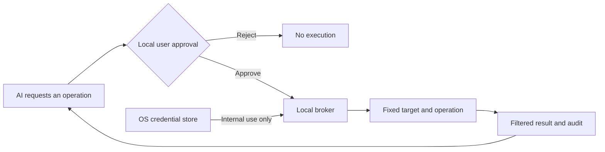

<div align="center">

# SecretBridge · 密桥

**Keep credentials local. Let explicit approval decide each operation.**

[简体中文](README.zh-CN.md) · [Docs](docs/README.md) · [Deploy](docs/AI辅助部署.md) · [Contribute](CONTRIBUTING.md) · [Security](SECURITY.md)

[](LICENSE)
[](rust-toolchain.toml)
[](.node-version)

</div>

> [!IMPORTANT]
> SecretBridge is prerelease software for individual, single-machine use. No GitHub Release exists yet. Evaluate source builds only with synthetic credentials. There is no secret-reading or export API, and an ordinary terminal is not a credential sandbox.

## Why SecretBridge

Giving an AI a password puts that secret in conversation, command or logging context. SecretBridge changes the workflow: an AI requests a fixed operation, the user reviews it locally, and the broker uses the credential internally while returning only the approved result.



## What it provides

- **Write-only credential handling:** passwords, tokens and private keys live in the OS credential store; SQLite keeps references and public state.
- **Explicit approval:** review the target, parameters, grant mode, lifetime and output scope before execution.
- **Controlled connectors:** fixed programs, HTTP, SSH, SFTP, Git HTTPS, PostgreSQL and MySQL.
- **Reconnectable terminals:** keep a real platform shell alive across browser or MCP disconnects without injecting SecretBridge credentials.
- **Bounded results:** filter credential-task output before persistence; constrain HTTP and database fields and size.
- **Traceable state:** version approvals, runs and fixed audit events; configuration changes invalidate stale grants.
- **Local delivery:** background start/status/stop, login startup, upgrade, rollback, uninstall, backup and restore.

The open-source edition focuses on individual local use. Organizational identity, central policy, managed nodes and multi-party approval are a separate enterprise direction, not a hidden prerequisite for open-source 1.0. See the [edition boundary](docs/开源版与企业版.md) (Chinese).

## Quick start

For a first deployment, use a permission-aware local AI coding assistant that shows commands and stops on failed checks. The [AI-assisted deployment guide](docs/AI辅助部署.md) contains a copyable prompt, an AI-readable runbook and a complete manual alternative.

Manual builds require Node.js 24, pnpm 11 and Rust 1.98:

```sh
pnpm install --frozen-lockfile
pnpm build
cargo build --release --locked -p secretbridge-server
./target/release/secretbridge-server start --no-open
./target/release/secretbridge-server open
```

The Windows executable is `secretbridge-server.exe`. The broker accepts loopback addresses only, and `open` creates a one-time browser pairing link. See [installation and background operation](docs/后台运行与安装交付.md) for packages, upgrades and uninstall behavior.

## Typical workflow

1. Save a disposable synthetic credential and confirm that the UI cannot read it back.
2. Register a fixed connection and its trust settings.
3. Define a task, ordinary parameters, credential slots and result scope.
4. Let an AI or user request approval; only the user decides in the Web console.
5. Run the approved operation and inspect its bounded result and audit events.
6. Delete synthetic credentials and stop the broker when the evaluation ends.

Detailed engineering documents are currently in Simplified Chinese. Start with the [documentation hub](docs/README.md) and [user guide](docs/使用指南.md).

## Validation targets

| Platform | Current baseline | Default shell |
|---|---|---|
| Windows | Windows 11 x64 | PowerShell / CMD |
| Linux | Ubuntu 24.04 x64 | Bash |
| macOS | macOS 14+ arm64/x64 | Zsh |

Other versions and architectures are experimental until separately validated. Current packages are unsigned development artifacts; each future public release will state its supported environments.

## Security boundary

- MCP cannot read secrets or approve its own requests.
- TLS, SSH host verification and target-system permissions must not be disabled to make a test pass.
- Output filtering reduces accidental echo risk; it is not a program sandbox and cannot decide whether all business data is safe to share with a model.
- Malicious software already running arbitrary code as the credential owner may bypass application controls and access that account's processes, files or credential store.
- Use short-lived, least-privilege accounts for real systems and synthetic data in reports.

See the [security model](docs/安全模型与验收.md) and [automated security acceptance](docs/自动化安全验收.md). Report vulnerabilities privately through [SECURITY.md](SECURITY.md).

## Project links

| Goal | Start here |
|---|---|
| Deploy and use | [Documentation](docs/README.md) |
| See what remains | [Roadmap](ROADMAP.md) · [Changelog](CHANGELOG.md) |
| Develop locally | [Developer setup](docs/开发者入门.md) · [Architecture](docs/开发设计.md) |
| Contribute | [Contribution guide](CONTRIBUTING.md) · [Code of conduct](CODE_OF_CONDUCT.md) |
| Understand licensing | [Licensing](LICENSING.md) · [Commercial license](COMMERCIAL_LICENSE.md) |

Copyright (c) 2026 数链创元（天津）信息技术有限责任公司. Open-source code is licensed under `AGPL-3.0-or-later`; third-party components retain their own licenses. See [THIRD_PARTY_NOTICES.md](THIRD_PARTY_NOTICES.md).
