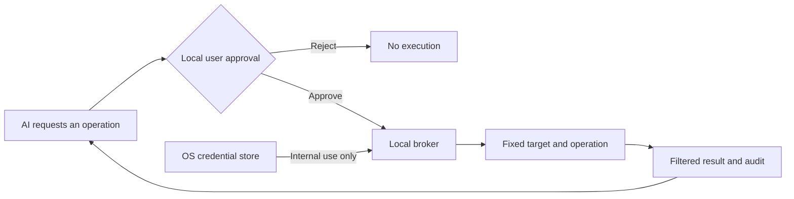

# SecretBridge · 密桥

**Keep credentials local. Let a human set the approval policy.**

[简体中文](./README.zh-CN.md) · [Download Beta](https://github.com/qq940500529/secretbridge/releases/tag/v0.2.0-beta.9) · [Docs](./docs/README.md) · [Deploy](./docs/getting-started/AI辅助部署.md) · [Feedback](https://github.com/qq940500529/secretbridge/issues/new?template=bug_report.md) · [Security](./SECURITY.md)

> [!IMPORTANT]
> The repository now contains unreleased `0.3.0-beta.1` development source. It is not compatible with earlier installation layouts, databases or binaries; do not install it over an existing deployment. The download link above still points to the published `0.2.0-beta.9` release. Start evaluations with synthetic credentials, keep independent backups, and read the [License Agreement and Disclaimer](./docs/最终用户许可与免责声明.md). There is no secret-reading or export API; AI reads terminal results only through the broker's redacted MCP cursor.

## Why SecretBridge

Giving an AI a password puts that secret in conversation, command or logging context. SecretBridge changes the workflow: an AI requests a fixed operation, the user reviews it locally, and the broker uses the credential internally while returning only the approved result.

## What it provides

- **Write-only credential handling:** passwords, tokens and private keys live in the OS credential store; SQLite keeps references and public state.
- **Human-controlled approval:** review each request by default, or set a one-hour per-conversation reuse policy in the local Web console. Allowing every operation in one AI conversation requires an explicit high-risk confirmation and shows a persistent warning while active.
- **Authenticator confirmation:** bind a standard TOTP authenticator by QR code or manual key, then confirm one reviewed approval from an AI conversation with a single-use six-digit code.
- **Controlled connectors:** fixed programs, HTTP, SSH, SFTP, Git HTTPS, PostgreSQL and MySQL.
- **Secure continuous terminals:** ordinary commands and human-approved credential commands can share one broker-owned shell; output is redacted before Web replay or MCP reads.
- **Bounded results:** filter credential-task output before persistence; constrain HTTP and database fields and size.
- **Traceable state:** version approvals, runs and fixed audit events; configuration changes invalidate stale grants.
- **Local delivery:** background start/status/stop, login startup, upgrade, rollback, uninstall, backup and restore.

The open-source edition focuses on individual local use. Organizational identity, central policy, managed nodes and multi-party approval are a separate enterprise direction, not a hidden prerequisite for open-source 1.0. See the [edition boundary](./docs/开源版与企业版.md) (Chinese).

## Quick start

Use the [installation guide](./docs/getting-started/安装与服务管理.md) to select a package, verify its checksum, start the local broker and open the management page. The [AI-assisted deployment guide](./docs/getting-started/AI辅助部署.md) documents the additional checks when a local assistant carries out these steps. The broker accepts loopback addresses only, and `open` creates a one-time browser pairing link.

The architecture-refactor source branch is not an upgrade for an existing installation. It does not promise compatibility with earlier binaries, installation layouts or databases. Keep existing data untouched and use a separate, empty data directory when evaluating a build from this branch. Follow the published Release instructions for an installed release.

## Typical workflow

1. Save a disposable synthetic credential and confirm that the UI cannot read it back.
2. Register a fixed connection and its trust settings.
3. Define a task, ordinary parameters, credential slots and result scope.
4. Let an AI or user request approval; decide in the Web console, or reply with a current authenticator code so the AI can relay that one-time confirmation through MCP.
5. Run the approved operation and inspect its bounded result and audit events.
6. Delete synthetic credentials and stop the broker when the evaluation ends.

Detailed engineering documents are currently in Simplified Chinese. Start with the [documentation hub](./docs/README.md) and [user guide](./docs/user-guide/使用指南.md).

AI clients with Skill support can install the versioned [SecretBridge operations Skill](./skills/secretbridge-operations/SKILL.md) after connecting MCP. It guides tool choice, approval handoff, output cursors and recovery; the broker continues to enforce authorization. See the [installation and responsibility guide](./docs/user-guide/AI客户端接入.md) (Chinese). MCP-only clients continue to use the advertised tool schemas and minimal server instructions.

## Validation targets

| Platform | Current baseline | Default shell |
|---|---|---|
| Windows | Windows 11 x64 | PowerShell / CMD |
| Linux | Ubuntu 24.04 x64 | Bash |
| macOS | macOS 14+ arm64 | Zsh |

These are Beta validation targets, not verified minimum OS guarantees. macOS Intel and other versions or architectures are experimental until separately validated. The [platform evidence matrix](./docs/release/支持矩阵与性能基线.md) records automated and real-device evidence separately, with review dates. Beta packages are unsigned; each public release states only its verified environments and known limitations.

## Help test the Beta

Broader real-machine validation is now community-led. After installing the latest Beta, use synthetic data to check installation, browser pairing, credential-store write/overwrite/delete, approval and rejection, redaction, restart or login recovery, upgrade/rollback and uninstall on your own environment. Do not weaken TLS, SSH host verification, the credential store or other system protections to make a test pass.

The [community verification backlog](./docs/community/社区验证待办.md) lists outstanding real-desktop and platform scenarios. These checks are tracked separately from completed implementation issues.

Report a reproducible ordinary defect through the [Beta bug form](https://github.com/qq940500529/secretbridge/issues/new?template=bug_report.md). Include the package version, platform, install method, sanitized steps and cleanup result—never a real credential, private endpoint, user path or business record. Use the [private security advisory form](https://github.com/qq940500529/secretbridge/security/advisories/new) for a possible vulnerability.

## Security boundary

- MCP cannot read secrets, setup keys, QR codes or PINs. It can only relay a user-supplied, single-use TOTP code for one identified pending approval; without that code it cannot approve its own request.
- On first launch, the local management page asks you to accept the agreement, then set a PIN/passphrase of at least 6 characters and save the one-time recovery key in a secure place. The PIN signs you in and unlocks encrypted diagnostics; repeated failures trigger increasing wait times. A correct recovery key can reset a lost PIN without losing those records, and is replaced after use. A longer passphrase is safer against offline guessing if a database copy is stolen. Never give the PIN or recovery key to an AI or include either in an issue.
- TLS, SSH host verification and target-system permissions must not be disabled to make a test pass.
- Output filtering reduces accidental echo risk; it is not a program sandbox and cannot decide whether all business data is safe to share with a model.
- Malicious software already running arbitrary code as the credential owner may bypass application controls and access that account's processes, files or credential store.
- Use short-lived, least-privilege accounts for real systems and synthetic data in reports.

See the [security model](./docs/security/安全模型.md) and [automated security acceptance](./docs/testing/自动化安全验收.md). Report vulnerabilities privately through [SECURITY.md](./SECURITY.md).

## Project links

| Goal | Start here |
|---|---|
| Deploy and use | [Documentation](./docs/README.md) |
| See what remains | [Roadmap](./ROADMAP.md) · [Changelog](./CHANGELOG.md) |
| Develop locally | [Developer setup](./docs/development/开发者入门.md) · [Architecture](./docs/development/架构设计.md) |
| Contribute | [Contribution guide](./CONTRIBUTING.md) · [Code of conduct](./CODE_OF_CONDUCT.md) |
| Understand licensing | [Licensing](./LICENSING.md) · [Commercial license](./COMMERCIAL_LICENSE.md) |
| Review first-run terms | [License Agreement and Disclaimer](./docs/最终用户许可与免责声明.md) |
| Report a problem | [Public bug report](https://github.com/qq940500529/secretbridge/issues/new?template=bug_report.md) · [Private security report](https://github.com/qq940500529/secretbridge/security/advisories/new) |

Copyright (c) 2026 数链创元（天津）信息技术有限责任公司. Open-source code is licensed under `AGPL-3.0-or-later`; third-party components retain their own licenses. See [THIRD_PARTY_NOTICES.md](./THIRD_PARTY_NOTICES.md).
