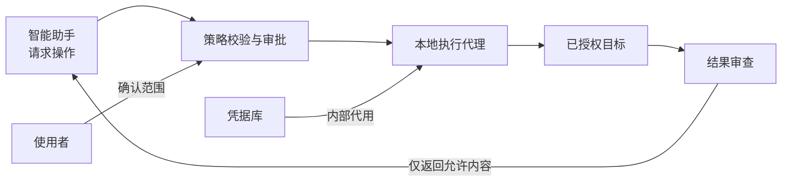

<div align="center">

# 密桥 SecretBridge

**让凭据留在本机，让授权决定操作。**

[English](README.md) · [文档中心](docs/README.md) · [参与贡献](CONTRIBUTING.md) · [安全报告](SECURITY.md)

[](LICENSE)
[](COMMERCIAL_LICENSE.md)
[](ROADMAP.md)

[](Cargo.toml)
[](crates/secretbridge-server/Cargo.toml)
[](web/package.json)
[](web/package.json)
[](web/package.json)

</div>

> [!IMPORTANT]
> **当前进入M1工作流开发，M0安全门槛仍未全部关闭。** 仓库已有可运行的本机Web管理端、回环地址Rust服务、一次性浏览器配对、隔离的合成终端，以及只保存在内存中的凭据引用和逻辑目标目录。目录不接收秘密值和网络地址；真实凭据保存、注入、业务系统访问和系统Shell执行仍被禁用。

## 密桥解决什么问题？

将密码直接交给智能助手，会使秘密进入对话上下文或执行工具。密桥的目标是提供一条受控的本地执行通道：助手提出操作请求，用户确认权限，代理内部使用凭据，再返回经过审查的结果。

| 能力方向 | 使用体验 |
| :--- | :--- |
| 凭据代用 | 在本机配置凭据，向助手开放允许的操作，而非读取密码的接口。 |
| 明确审批 | 执行前确认目标、参数、权限和结果范围。 |
| 持久终端 | 窗口关闭或助手断线后，可以重新连接同一会话。 |
| 安全返回 | 筛选结果字段、过滤输出，并保留可追溯的审计事件。 |
| 三平台体验 | 浏览器管理端保持一致，后台服务分别适配各系统的凭据和进程机制。 |

当前已实现合成模式状态接口、一次性配对、可过期／撤销的页面会话、可断线重连的合成PTY，以及经过认证的凭据引用和逻辑目标配置页面。这些配置只保存在服务内存中，重启即清空。终端按输出游标续传未读内容，在多个连接间强制单写入者、其余只读，并限制向停滞浏览器写入的等待时间；状态接口明确标记当前只是“同用户兼容模式，身份隔离未验证”。其余能力及准入条件见[路线图](ROADMAP.md)。

## 一次操作如何完成？



凭据不作为工具结果返回。普通终端与使用凭据的操作分开管理，已登录的受控会话也不能直接变成任意命令终端。

> [!WARNING]
> 输出打码不能替代权限隔离。如果助手拥有凭据所有者同账号的任意执行权限，仍可能绕过应用取密。真实部署必须先验证系统身份与进程边界，详见[安全模型](docs/安全模型与验收.md)。

## 从哪里开始？

| 你希望了解 | 阅读入口 |
| :--- | :--- |
| 工作流程、适用场景和当前限制 | [使用指南](docs/使用指南.md) |
| 各类文档与阅读顺序 | [文档中心](docs/README.md) |
| 本地检查、开发约定和贡献流程 | [开发者入门](docs/开发者入门.md) · [贡献指南](CONTRIBUTING.md) |
| 系统实现与交互设计 | [开发设计](docs/开发设计.md) · [跨平台与UI规范](docs/跨平台与UI规范.md) |
| 术语、接口与安全边界 | [术语表](docs/术语表.md) · [安全模型与验收](docs/安全模型与验收.md) |

中英文首页保持相同的产品范围；详细工程文档当前以简体中文维护。

## 运行开发原型

需要Node.js 24、pnpm 11及Rust 1.98或更新的稳定工具链：

```sh
pnpm install --frozen-lockfile
pnpm build
cargo run -p secretbridge-server
```

服务仅监听`127.0.0.1:8787`并打开系统默认浏览器。启动令牌位于URL片段中，页面读取后立即清除；换页或刷新不会持久化会话。“凭据”和“连接目标”页面只接收非秘密、非地址元数据，重启服务后清空。“安全终端”页面只能运行密桥内置的合成程序，不会启动PowerShell、`cmd`、`sh`或用户命令；WebSocket断开和重连不会终止该合成PTY，页面从上次输出游标继续读取。受限的`flood`和`wait`命令只用于韧性验证。该原型不使用、也不计划引入桌面壳。

## 平台目标

| 平台 | 首轮验证基线 | 应用状态 |
| :--- | :--- | :--- |
| Windows | Windows 11 · x64 | 本地原型与CI合成路径已验证 |
| Linux | Ubuntu 24.04 · x64 · GNOME/KDE | CI合成路径已验证，桌面集成待验证 |
| macOS | macOS 14+ · arm64/x64 | CI合成路径已验证，桌面集成待验证 |

其他系统版本和架构需要独立验证。实际支持范围以未来发布版本的兼容性说明为准。

## 参与项目

项目处于M1开发阶段，M0安全验证仍在并行推进。欢迎参与安全评审、三平台适配、可访问性、测试与文档完善。开始贡献前请阅读[贡献指南](CONTRIBUTING.md)与[开发者入门](docs/开发者入门.md)。

## 许可与社区

Copyright (c) 2026 **数链创元（天津）信息技术有限责任公司**。

本仓库采用 **GNU Affero General Public License v3.0 or later**（`AGPL-3.0-or-later`）开源许可。如需将代码改造后闭源商用，将其嵌入、链接或打包进不按AGPL履约的商业软件，或实施任何超出开源许可范围的事项，须事先联系版权方取得书面商业许可。详见[许可说明](LICENSING.md)、[商业授权](COMMERCIAL_LICENSE.md)与[版权声明](COPYRIGHT.md)。

无论采用开源许可还是商业许可，第三方组件仍须遵守其各自条款，详见[第三方声明](THIRD_PARTY_NOTICES.md)与[依赖许可风险评估](docs/依赖许可风险评估.md)。

普通问题通过[GitHub Issues](https://github.com/qq940500529/secretbridge/issues)提交；安全漏洞使用[私人报告流程](SECURITY.md)。贡献者应遵循[贡献指南](CONTRIBUTING.md)与[社区准则](CODE_OF_CONDUCT.md)，不要提交真实凭据或业务数据。

---

[文档中心](docs/README.md) · [路线图](ROADMAP.md) · [变更记录](CHANGELOG.md)
