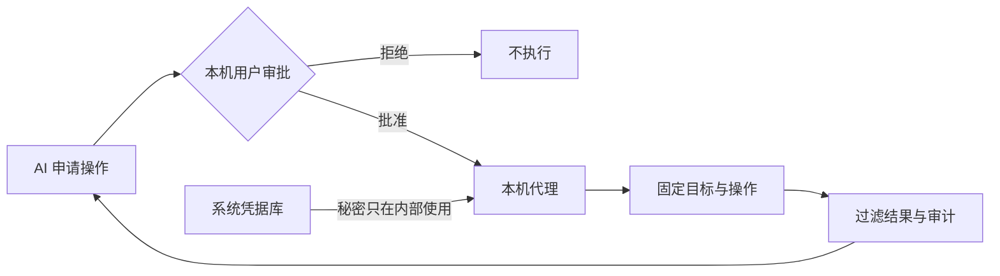

<div align="center">

# 密桥 SecretBridge

**让凭据留在本机，让授权决定操作。**

[English](README.md) · [下载 Beta](https://github.com/qq940500529/secretbridge/releases/tag/v0.2.0-beta.8) · [文档](docs/README.md) · [部署](docs/AI辅助部署.md) · [问题反馈](https://github.com/qq940500529/secretbridge/issues/new?template=bug_report.md) · [安全](SECURITY.md)

[](LICENSE)
[](rust-toolchain.toml)
[](.node-version)

</div>

> [!IMPORTANT]
> SecretBridge `0.2.0-beta.8` 是面向个人、单机使用的公开预发行版。请先使用合成凭据、保留独立备份，并阅读[许可协议与免责协议](docs/最终用户许可与免责声明.md)。它不提供凭据读取／导出接口；AI 只能通过代理的 MCP 脱敏游标读取终端结果。

## 它解决什么问题

把密码交给 AI，会让秘密进入对话、命令或日志。SecretBridge 把凭据使用改成受控流程：AI 申请固定操作，用户在本机检查并批准，代理内部使用凭据，只返回允许的结果。



## 主要能力

- **写入而不回读**：密码、令牌和私钥保存在操作系统凭据库；SQLite 只记录引用与状态。
- **人工设定审批要求**：默认逐项核对目标、参数、有效期和结果范围；也可在本机 Web 页面为单个 AI 会话设置一小时复用策略。允许会话内所有操作必须明确确认高风险，并在有效期内持续显示警示。
- **身份验证器确认**：通过二维码或手动密钥绑定标准 TOTP 身份验证器；用户核对审批后，可在 AI 对话中回复一次性六位验证码来确认该请求。
- **受控连接器**：固定程序、HTTP、SSH、SFTP、Git HTTPS、PostgreSQL 和 MySQL。
- **安全连续终端**：普通命令与经用户批准的凭据命令可复用同一个代理托管 Shell；输出进入 Web 或 MCP 前先脱敏。
- **受限结果**：凭据任务在保存前过滤输出，数据库和 HTTP 可限制返回字段与规模。
- **可追溯状态**：授权、运行和固定审计事件带版本保存；配置变化会使旧授权失效。
- **本机交付**：后台启动、状态、停止、登录自启动、升级、回滚、卸载、备份和恢复。

当前开源版专注个人本机使用。组织身份、集中策略、受管节点和多人审批属于独立企业产品方向，不是开源版 1.0 的前置条件。参见[版本边界](docs/开源版与企业版.md)。

## 快速开始

首次部署可以把下面的提示词直接交给能够展示命令、请求权限并在失败时停止的本机 AI 编码助手。不必先下载仓库，也不必切换到仓库目录；可在任意文件夹或全新对话中开始。

```text
请在当前机器部署 SecretBridge，仓库地址：https://github.com/qq940500529/secretbridge

1. 可以从任意目录开始，不要假设仓库已经下载。先从当前 AI 客户端已有 MCP 配置、PATH 和 SecretBridge 文档规定的默认安装位置检查本机是否已经安装；只检查明确位置，不扫描整个用户目录。如果找到可执行文件，先运行 status。已有安装健康且版本可用时直接复用，不要下载、覆盖或重复安装；服务未运行时使用该安装启动。看到自定义安装迹象但无法定位时，只询问我一次，不要另建重复安装。
2. 仅在确认没有可用安装时，检查 GitHub 最新 Release；有适合当前平台的安装包就下载、校验摘要和包元数据后安装。没有可用 Release 时，才把最新 main 克隆到新建的非敏感目录，阅读 AGENTS.md 和部署文档，使用锁定工具版本与依赖构建并安装。
3. 保留已有文件；需要管理员权限或修改工作目录以外内容时先征求同意。不要索取或泄露真实凭据。
4. 启动或复用 SecretBridge，确认 status 正常且服务只监听本机回环地址，并从 status 或 install 结果取得当前绝对 binary 路径。
5. 把它接入我使用的 MCP AI 客户端：先展示并备份将修改的配置，征得同意后，以 binary 作为 command、以 ["--mcp-stdio"] 作为 args；自定义数据目录必须保持一致，配置中不得写入凭据或配对令牌。重载客户端，确认工具可见，并调用只读的 secretbridge_terminal_capabilities 验证连接；不能安全自动配置时，给出可直接粘贴的配置和明确重载步骤，不要猜测配置路径。
6. 最后报告是复用了已有安装还是完成了新安装、版本或提交、安装位置、MCP 验证结果和卸载命令。
```

[AI 辅助部署](docs/AI辅助部署.md)说明权限和安全边界；供助手直接读取的流程见 [AI 部署执行指南](docs/AI部署执行指南.md)。执行前仍应检查助手准备运行的命令。维护者需要完整源码与安装包验收时，再执行详细指南中的质量门禁。

用户不需要自己判断是否已经安装、选择安装包、准备仓库、配置工具链或查找 MCP 启动参数；这些工作由助手完成。更换 AI 软件、模型或对话时应复用同一份本机安装，只为当前客户端补充 MCP 配置。服务只接受回环地址，首次打开会生成一次性浏览器配对链接。人工源码构建、MCP 接入、升级和卸载见[安装与后台运行](docs/后台运行与安装交付.md)。

## 日常流程

1. 在“凭据”保存一次性测试凭据，确认页面不能回读。
2. 在“连接”登记固定目标和信任设置。
3. 在“任务”定义操作、普通参数、凭据插槽和结果范围。
4. AI 或用户申请授权；在 Web 页面决定，或核对请求后回复当前身份验证器验证码，由 AI 通过 MCP 转交这一次确认。
5. 启动运行并查看受限结果和审计事件。
6. 不再需要时删除合成凭据并停止服务。

完整说明见[使用指南](docs/使用指南.md)和[工作台说明](docs/工作台使用说明.md)。

## 支持范围

| 平台 | 当前验收基线 | 默认 Shell |
|---|---|---|
| Windows | Windows 11 x64 | PowerShell / CMD |
| Linux | Ubuntu 24.04 x64 | Bash |
| macOS | macOS 14+ arm64/x64 | Zsh |

其他版本和架构属于实验性环境，必须单独验证。Beta 安装包尚未签名；支持状态和已知限制以每个公开 Release 的说明为准。

## 参与 Beta 测试

更广泛的实机验证现由社区用户共同完成。安装最新 Beta 后，请只使用合成数据，在自己的环境中检查安装、浏览器配对、凭据库写入／覆盖／删除、批准与拒绝、输出脱敏、重启或登录恢复、升级／回滚和卸载。不得为通过测试而关闭 TLS、SSH 主机验证、凭据库保护或其他系统安全机制。

待认领的真实桌面与跨平台场景见[社区验证待办](docs/社区验证待办.md)。这些验证记录与已经完成的实现类 Issue 分开维护。

可复现的普通缺陷请使用 [Beta 问题表单](https://github.com/qq940500529/secretbridge/issues/new?template=bug_report.md)。请提供包版本、平台、安装方式、已脱敏的复现步骤和清理结果；不要提交真实凭据、私人地址、用户路径或业务记录。可能属于漏洞的问题请使用[私密安全报告](https://github.com/qq940500529/secretbridge/security/advisories/new)。

## 安全边界

- MCP 不能读取秘密、绑定密钥、二维码或 PIN。它只能为一个明确的待审批请求转交用户主动提供且仅可使用一次的 TOTP 验证码；没有验证码时不能批准自己的请求。
- TLS、SSH 主机指纹和目标系统权限不能为了通过测试而关闭。
- 输出过滤降低意外回显风险，但不等于程序沙箱，也不能判断所有业务数据是否适合发送给模型。
- 能以同一操作系统账号执行任意代码的恶意程序，可能绕过应用边界访问进程、文件或凭据库。
- 真实系统应使用短期、最小权限账号；问题报告只使用合成数据。

详见[安全模型](docs/安全模型与验收.md)和[自动化安全验收](docs/自动化安全验收.md)。安全漏洞请按 [SECURITY.md](SECURITY.md) 私下报告。

## 文档与参与

| 目标 | 入口 |
|---|---|
| 部署和使用 | [文档中心](docs/README.md) |
| 了解后续工作 | [路线图](ROADMAP.md) · [变更记录](CHANGELOG.md) |
| 建立开发环境 | [开发者入门](docs/开发者入门.md) · [开发设计](docs/开发设计.md) |
| 提交代码或文档 | [贡献指南](CONTRIBUTING.md) · [行为准则](CODE_OF_CONDUCT.md) |
| 了解许可 | [许可说明](LICENSING.md) · [商业许可](COMMERCIAL_LICENSE.md) |
| 查看首次运行条款 | [许可协议与免责协议](docs/最终用户许可与免责声明.md) |
| 反馈问题 | [公开缺陷报告](https://github.com/qq940500529/secretbridge/issues/new?template=bug_report.md) · [私密安全报告](https://github.com/qq940500529/secretbridge/security/advisories/new) |

Copyright (c) 2026 数链创元（天津）信息技术有限责任公司。开源代码采用 `AGPL-3.0-or-later`；第三方组件遵循各自许可，参见 [THIRD_PARTY_NOTICES.md](THIRD_PARTY_NOTICES.md)。
