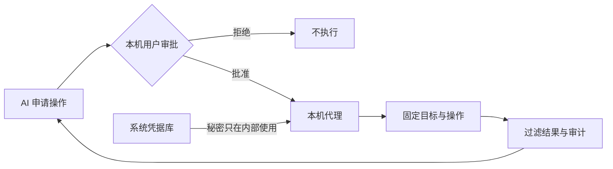

<div align="center">

# 密桥 SecretBridge

**让凭据留在本机，让授权决定操作。**

[English](./README.md) · [下载 Beta](https://github.com/qq940500529/secretbridge/releases) · [文档](./docs/README.md) · [部署](./docs/getting-started/AI辅助部署.md) · [问题反馈](https://github.com/qq940500529/secretbridge/issues/new?template=bug_report.md) · [安全](./SECURITY.md)

[](LICENSE)
[](rust-toolchain.toml)
[](.node-version)

</div>

> [!IMPORTANT]
> `0.3.0-beta.2` 源码版本不兼容旧版安装目录、数据库或二进制；请勿用它直接覆盖已有安装。评估时请使用独立的空白数据目录和合成凭据，保留独立备份，并阅读[许可协议与免责协议](./docs/最终用户许可与免责声明.md)。本产品不提供凭据读取／导出接口；AI 只能通过代理的 MCP 脱敏游标读取终端结果。

## 首选：让本机 AI 助手协助部署

把下面的提示词复制给**能够在这台电脑执行命令并征求你确认的 AI 助手**。它会先检查并复用已有安装，优先选择适配的正式发行包，再配置你当前使用的 MCP 客户端；你无需预先下载仓库或自行判断构建工具链。详细步骤和失败处理见[AI 辅助部署](./docs/getting-started/AI辅助部署.md#自动执行提示词)。

```text
请在当前电脑安装或复用 SecretBridge，仓库地址：https://github.com/qq940500529/secretbridge 。先阅读仓库中的 docs/getting-started/AI辅助部署.md 和 docs/getting-started/安装与服务管理.md，并按“自动执行提示词”的完整要求工作。先检查当前 MCP 配置、PATH 和文档规定的安装位置；健康的已有安装直接复用。没有可用安装时，优先下载并校验适合本机的最新 GitHub Release，只有没有适用包时才从 main 构建。修改系统或客户端配置前展示目标和命令并等待我确认；不要读取、回显或记录真实凭据与配对令牌。完成后配置当前 AI 客户端的 MCP、验证只读连接，并在本机打开管理页；协议确认、PIN 设置及恢复密钥保存由我亲自完成。失败时停止并说明原因，不要绕过校验或扩大网络暴露。
```

AI 不能在当前设备执行命令时，使用[逐步指导提示词](./docs/getting-started/AI辅助部署.md#逐步指导提示词)；希望全程自己操作时，使用[人工安装与后台运行](./docs/getting-started/安装与服务管理.md)。

## 它解决什么问题

把密码交给 AI，会让秘密进入对话、命令或日志。SecretBridge 把凭据使用改成受控流程：AI 申请固定操作，用户在本机检查并批准，代理内部使用凭据，只返回允许的结果。



## 主要能力

- **写入而不回读**：密码、令牌和私钥保存在操作系统凭据库；SQLite 只记录引用与状态。
- **人工设定审批要求**：默认逐项核对目标、参数、有效期和结果范围；也可在本机 Web 页面为单个 AI 会话设置一小时复用策略。允许会话内所有操作必须明确确认高风险，并在有效期内持续显示警示。
- **身份验证器确认**：通过二维码或手动密钥绑定标准 TOTP 身份验证器；用户核对审批后，可在 AI 对话中回复一次性六位验证码来确认该请求。
- **受控连接器**：固定程序、HTTP、SSH、SFTP、Git HTTPS、PostgreSQL 和 MySQL。
- **安全连续终端**：普通命令与经用户批准的凭据命令可复用同一个代理托管 Shell；输出进入 Web 或 MCP 前先脱敏。
- **受限结果**：凭据任务在保存前过滤输出，数据库和 HTTP 可限制返回字段与规模。
- **可追溯状态**：授权、运行和固定审计事件带版本保存；配置变化会使旧授权失效。
- **本机交付**：后台启动、状态、停止、登录自启动、升级、回滚、卸载、备份和恢复。

当前开源版专注个人本机使用。组织身份、集中策略、受管节点和多人审批属于独立企业产品方向，不是开源版 1.0 的前置条件。参见[版本边界](./docs/开源版与企业版.md)。

## 快速开始

请从上方的[AI 辅助部署提示词](#首选让本机-ai-助手协助部署)开始。服务只接受回环地址；首次设置 PIN 前 `open` 会生成一次性配对链接，设置后则打开普通登录页。

此版本不能作为既有安装的原地升级包。请保持原有数据不动，在独立的空白数据目录中评估；已安装版本应按对应 Release 文档操作。

支持 Skill 的 AI 客户端可在接通 MCP 后安装版本化的 [SecretBridge AI 操作 Skill](./skills/secretbridge-operations/SKILL.md)，用于工具选择、审批交接、游标读取和错误恢复。安装与职责说明见 [AI 操作 Skill 与 MCP 职责](./docs/user-guide/AI客户端接入.md)。仅支持 MCP 的客户端仍可使用工具 schema 和服务端的最小指引。

## 日常流程

1. 在“凭据”保存一次性测试凭据，确认页面不能回读。
2. 在“连接”登记固定目标和信任设置。
3. 在“任务”定义操作、普通参数、凭据插槽和结果范围。
4. AI 或用户申请授权；在 Web 页面决定，或核对请求后回复当前身份验证器验证码，由 AI 通过 MCP 转交这一次确认。
5. 启动运行并查看受限结果和审计事件。
6. 不再需要时删除合成凭据并停止服务。

完整说明见[使用指南](./docs/user-guide/使用指南.md)和[工作台说明](./docs/user-guide/工作台.md)。

## 支持范围

| 平台 | 当前验收基线 | 默认 Shell |
|---|---|---|
| Windows | Windows 11 x64 | PowerShell / CMD |
| Linux | Ubuntu 24.04 x64 | Bash |
| macOS | macOS 14+ arm64/x64 | Zsh |

其他版本和架构属于实验性环境，必须单独验证。Beta 安装包尚未签名；支持状态和已知限制以每个公开 Release 的说明为准。

## 参与 Beta 测试

更广泛的实机验证现由社区用户共同完成。安装最新 Beta 后，请只使用合成数据，在自己的环境中检查安装、浏览器配对、凭据库写入／覆盖／删除、批准与拒绝、输出脱敏、重启或登录恢复、升级／回滚和卸载。不得为通过测试而关闭 TLS、SSH 主机验证、凭据库保护或其他系统安全机制。

待认领的真实桌面与跨平台场景见[社区验证待办](./docs/community/社区验证待办.md)。这些验证记录与已经完成的实现类 Issue 分开维护。

可复现的普通缺陷请使用 [Beta 问题表单](https://github.com/qq940500529/secretbridge/issues/new?template=bug_report.md)。请提供包版本、平台、安装方式、已脱敏的复现步骤和清理结果；不要提交真实凭据、私人地址、用户路径或业务记录。可能属于漏洞的问题请使用[私密安全报告](https://github.com/qq940500529/secretbridge/security/advisories/new)。

## 安全边界

- MCP 不能读取秘密、绑定密钥、二维码或 PIN。它只能为一个明确的待审批请求转交用户主动提供且仅可使用一次的 TOTP 验证码；没有验证码时不能批准自己的请求。
- 首次打开管理页先阅读协议，再在同一引导页设置至少 6 位 PIN/口令，并将只显示一次的恢复密钥保存到安全位置。连续输错会按次数递增等待时间；遗失 PIN 后可用恢复密钥重设并保留加密诊断，旧恢复密钥会失效。较长口令更能抵御数据库副本的离线猜测。随后可选择绑定身份验证器；不要向 AI 提供 PIN 或恢复密钥。
- TLS、SSH 主机指纹和目标系统权限不能为了通过测试而关闭。
- 输出过滤降低意外回显风险，但不等于程序沙箱，也不能判断所有业务数据是否适合发送给模型。
- 能以同一操作系统账号执行任意代码的恶意程序，可能绕过应用边界访问进程、文件或凭据库。
- 真实系统应使用短期、最小权限账号；问题报告只使用合成数据。

详见[安全模型](./docs/security/安全模型.md)和[自动化安全验收](./docs/testing/自动化安全验收.md)。安全漏洞请按 [SECURITY.md](./SECURITY.md) 私下报告。

## 文档与参与

| 目标 | 入口 |
|---|---|
| 部署和使用 | [文档中心](./docs/README.md) |
| 了解后续工作 | [路线图](./ROADMAP.md) · [变更记录](./CHANGELOG.md) |
| 建立开发环境 | [开发者入门](./docs/development/开发者入门.md) · [开发设计](./docs/development/架构设计.md) |
| 提交代码或文档 | [贡献指南](./CONTRIBUTING.md) · [行为准则](./CODE_OF_CONDUCT.md) |
| 了解许可 | [许可说明](./LICENSING.md) · [商业许可](./COMMERCIAL_LICENSE.md) |
| 查看首次运行条款 | [许可协议与免责协议](./docs/最终用户许可与免责声明.md) |
| 反馈问题 | [公开缺陷报告](https://github.com/qq940500529/secretbridge/issues/new?template=bug_report.md) · [私密安全报告](https://github.com/qq940500529/secretbridge/security/advisories/new) |

Copyright (c) 2026 数链创元（天津）信息技术有限责任公司。开源代码采用 `AGPL-3.0-or-later`；第三方组件遵循各自许可，参见 [THIRD_PARTY_NOTICES.md](./THIRD_PARTY_NOTICES.md)。
