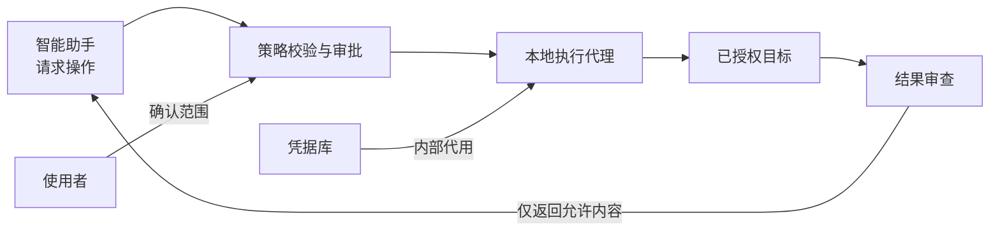

<div align="center">

# 密桥 SecretBridge

**让凭据留在本机，让授权决定操作。**

Windows · Linux · macOS &nbsp; | &nbsp; AGPL-3.0-only ＋另行商业授权

[English](README.md) · [文档中心](docs/README.md) · [参与贡献](CONTRIBUTING.md) · [安全报告](SECURITY.md)


</div>

> [!IMPORTANT]
> **当前处于设计阶段。** 已提供设计文档和仓库检查工具，尚无桌面应用、凭据代理或安装包。三平台兼容性是开发目标；请勿使用真实凭据。

## 密桥解决什么问题？

将密码直接交给智能助手，会使秘密进入对话上下文或执行工具。密桥的目标是提供一条受控的本地执行通道：助手提出操作请求，用户确认权限，代理内部使用凭据，再返回经过审查的结果。

| 能力方向 | 使用体验 |
| :--- | :--- |
| 凭据代用 | 在本机配置凭据，向助手开放允许的操作，而非读取密码的接口。 |
| 明确审批 | 执行前确认目标、参数、权限和结果范围。 |
| 持久终端 | 窗口关闭或助手断线后，可以重新连接同一会话。 |
| 安全返回 | 筛选结果字段、过滤输出，并保留可追溯的审计事件。 |
| 三平台体验 | 统一操作流程，分别适配各系统的凭据、通信和进程机制。 |

以上为待实现能力。开发状态与准入条件见[路线图](ROADMAP.md)。

## 一次操作如何完成？



凭据不作为工具结果返回。普通终端与使用凭据的操作分开管理，已登录的受控会话也不能直接变成任意命令终端。

> [!WARNING]
> 输出打码不能替代权限隔离。如果助手拥有凭据所有者同账号的任意执行权限，仍可能绕过应用取密。真实部署必须先验证系统身份与进程边界，详见[安全模型](docs/安全模型与验收.md)。

## 从哪里开始？

| 你希望了解 | 阅读入口 |
| :--- | :--- |
| 工作流程、适用场景和当前限制 | [使用指南](docs/使用指南.md) |
| 各类文档与阅读顺序 | [文档中心](docs/README.md) |
| 本地检查、开发约定和贡献流程 | [开发者入门](docs/开发者入门.md) · [贡献指南](CONTRIBUTING.md) |
| 系统实现与交互设计 | [开发设计](docs/开发设计.md) · [跨平台与UI规范](docs/跨平台与UI规范.md) |
| 术语、接口与安全边界 | [术语表](docs/术语表.md) · [安全模型与验收](docs/安全模型与验收.md) |

中英文首页保持相同的产品范围；详细工程文档当前以简体中文维护。

## 平台目标

| 平台 | 首轮验证基线 | 应用状态 |
| :--- | :--- | :--- |
| Windows | Windows 11 · x64 | 尚未实现 |
| Linux | Ubuntu 24.04 · x64 · GNOME/KDE | 尚未实现 |
| macOS | macOS 14+ · arm64/x64 | 尚未实现 |

其他系统版本和架构需要独立验证。首页CI徽章只表示三个系统的**仓库检查**结果，不代表应用兼容性。

## 获取仓库并运行检查

当前贡献流程仅需要 Git 与 Python 3.11+：

```sh
git clone https://github.com/qq940500529/secretbridge.git
cd secretbridge
python tools/check_repository.py
python -m unittest discover -s tests -v
```

这些命令检查文档与仓库内容，不会启动桌面应用。检查范围、预期输出和常见问题见[开发者入门](docs/开发者入门.md)。

## 许可与社区

Copyright (c) 2026 **数链创元（天津）信息技术有限责任公司**。公司自有内容采用 **AGPL-3.0-only 开源许可，或公司另行出具的书面商业许可**。取得有效商业授权后，可在协议范围内闭源商业使用；本仓库不自动授予该权限。详见[许可选择](LICENSING.md)、[商业授权](COMMERCIAL_LICENSE.md)与[版权声明](COPYRIGHT.md)。

AGPL本身允许符合其条款的商业使用。无论选择哪条路径，都须遵循[第三方许可义务](THIRD_PARTY_NOTICES.md)；候选组件的风险见[依赖许可评估](docs/依赖许可风险评估.md)。

普通问题通过[GitHub Issues](https://github.com/qq940500529/secretbridge/issues)提交；安全漏洞使用[私人报告流程](SECURITY.md)。贡献者应遵循[贡献指南](CONTRIBUTING.md)与[社区准则](CODE_OF_CONDUCT.md)，不要提交真实凭据或业务数据。

---

[文档中心](docs/README.md) · [路线图](ROADMAP.md) · [变更记录](CHANGELOG.md)
