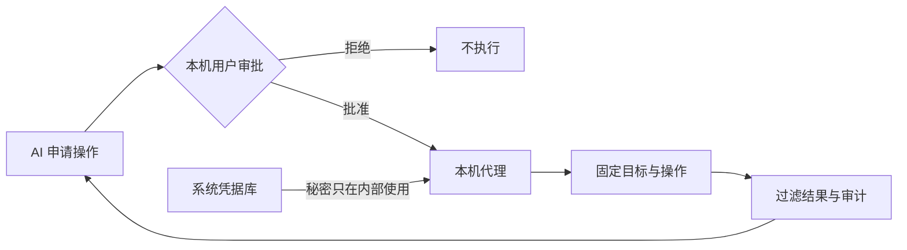

<div align="center">

# 密桥 SecretBridge

**让凭据留在本机，让授权决定操作。**

[English](README.md) · [文档](docs/README.md) · [部署](docs/AI辅助部署.md) · [贡献](CONTRIBUTING.md) · [安全](SECURITY.md)

[](LICENSE)
[](rust-toolchain.toml)
[](.node-version)

</div>

> [!IMPORTANT]
> SecretBridge 是面向个人、单机使用的预发行软件，尚未发布 GitHub Release。评估源码构建时只使用合成凭据。它不提供凭据读取／导出接口；普通终端不是凭据隔离沙箱。

## 它解决什么问题

把密码交给 AI，会让秘密进入对话、命令或日志。SecretBridge 把凭据使用改成受控流程：AI 申请固定操作，用户在本机检查并批准，代理内部使用凭据，只返回允许的结果。



## 主要能力

- **写入而不回读**：密码、令牌和私钥保存在操作系统凭据库；SQLite 只记录引用与状态。
- **明确审批**：执行前核对目标、参数、授权方式、有效期和结果范围。
- **受控连接器**：固定程序、HTTP、SSH、SFTP、Git HTTPS、PostgreSQL 和 MySQL。
- **持续终端**：浏览器或 MCP 断开后可重新连接同一个真实 Shell；普通终端不注入凭据。
- **受限结果**：凭据任务在保存前过滤输出，数据库和 HTTP 可限制返回字段与规模。
- **可追溯状态**：授权、运行和固定审计事件带版本保存；配置变化会使旧授权失效。
- **本机交付**：后台启动、状态、停止、登录自启动、升级、回滚、卸载、备份和恢复。

当前开源版专注个人本机使用。组织身份、集中策略、受管节点和多人审批属于独立企业产品方向，不是开源版 1.0 的前置条件。参见[版本边界](docs/开源版与企业版.md)。

## 快速开始

首次部署推荐使用能够展示命令、请求权限并在失败时停止的本机 AI 编码助手。复制可执行提示词并了解安全边界，请阅读 [AI 辅助部署](docs/AI辅助部署.md)；供助手直接读取的步骤在 [AI 部署执行指南](docs/AI部署执行指南.md)。完整人工流程也在同一文档中。

手动构建需要 Node.js 24、pnpm 11 和 Rust 1.98：

```sh
pnpm install --frozen-lockfile
pnpm build
cargo build --release --locked -p secretbridge-server
./target/release/secretbridge-server start --no-open
./target/release/secretbridge-server open
```

Windows 可执行文件名为 `secretbridge-server.exe`。服务只接受回环地址，首次打开会生成一次性浏览器配对链接。安装包、后台运行、升级和卸载见[安装与后台运行](docs/后台运行与安装交付.md)。

## 日常流程

1. 在“凭据”保存一次性测试凭据，确认页面不能回读。
2. 在“连接”登记固定目标和信任设置。
3. 在“任务”定义操作、普通参数、凭据插槽和结果范围。
4. AI 或用户申请授权；用户只在 Web 页面批准、拒绝或撤销。
5. 启动运行并查看受限结果和审计事件。
6. 不再需要时删除合成凭据并停止服务。

完整说明见[使用指南](docs/使用指南.md)和[工作台说明](docs/工作台使用说明.md)。

## 支持范围

| 平台 | 当前验收基线 | 默认 Shell |
|---|---|---|
| Windows | Windows 11 x64 | PowerShell / CMD |
| Linux | Ubuntu 24.04 x64 | Bash |
| macOS | macOS 14+ arm64/x64 | Zsh |

其他版本和架构属于实验性环境，必须单独验证。当前发行包未签名；正式支持状态以每个公开 Release 的说明为准。

## 安全边界

- MCP 不能读取秘密或替用户作出审批决定。
- TLS、SSH 主机指纹和目标系统权限不能为了通过测试而关闭。
- 输出过滤降低意外回显风险，但不等于程序沙箱，也不能判断所有业务数据是否适合发送给模型。
- 能以同一操作系统账号执行任意代码的恶意程序，可能绕过应用边界访问进程、文件或凭据库。
- 真实系统应使用短期、最小权限账号；问题报告只使用合成数据。

详见[安全模型](docs/安全模型与验收.md)和[自动化安全验收](docs/自动化安全验收.md)。安全漏洞请按 [SECURITY.md](SECURITY.md) 私下报告。

## 文档与参与

| 目标 | 入口 |
|---|---|
| 部署和使用 | [文档中心](docs/README.md) |
| 了解后续工作 | [路线图](ROADMAP.md) · [变更记录](CHANGELOG.md) |
| 建立开发环境 | [开发者入门](docs/开发者入门.md) · [开发设计](docs/开发设计.md) |
| 提交代码或文档 | [贡献指南](CONTRIBUTING.md) · [行为准则](CODE_OF_CONDUCT.md) |
| 了解许可 | [许可说明](LICENSING.md) · [商业许可](COMMERCIAL_LICENSE.md) |

Copyright (c) 2026 数链创元（天津）信息技术有限责任公司。开源代码采用 `AGPL-3.0-or-later`；第三方组件遵循各自许可，参见 [THIRD_PARTY_NOTICES.md](THIRD_PARTY_NOTICES.md)。
