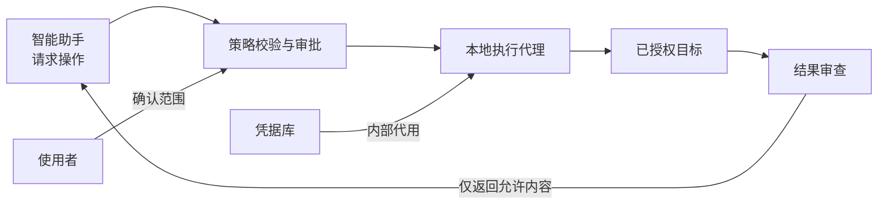

<div align="center">

# 密桥 SecretBridge

**让凭据留在本机，让授权决定操作。**

[English](README.md) · [文档中心](docs/README.md) · [参与贡献](CONTRIBUTING.md) · [安全报告](SECURITY.md)

[](LICENSE)
[](COMMERCIAL_LICENSE.md)

[](Cargo.toml)
[](crates/secretbridge-server/Cargo.toml)
[](web/package.json)
[](web/package.json)
[](web/package.json)

</div>

> [!IMPORTANT]
> 当前版本是功能开发中的本机原型。提供真实持久终端、操作系统凭据库、固定程序任务与限时审批；命名插槽支持标准输入、环境变量、参数和临时文件注入，Web与MCP可持续读取过滤后的运行输出。秘密值没有读取或导出工具／接口。普通终端仍不注入凭据，输出过滤不等于程序沙箱；普通参数支持类型、必填、默认值、枚举和长度校验；审批固定参数快照，可选择单次确认或限时重复执行。更多连接器将继续完善。

## 密桥解决什么问题？

将密码直接交给智能助手，会使秘密进入对话上下文或执行工具。密桥的目标是提供一条受控的本地执行通道：助手提出操作请求，用户确认权限，代理内部使用凭据，再返回经过审查的结果。

| 能力方向 | 使用体验 |
| :--- | :--- |
| 凭据代用 | 在本机配置凭据，向助手开放允许的操作，而非读取密码的接口。 |
| 明确审批 | 执行前确认目标、参数、权限和结果范围。 |
| 持久终端 | 窗口关闭或助手断线后，可以重新连接同一会话。 |
| 安全返回 | 筛选结果字段、过滤输出，并保留可追溯的审计事件。 |
| 三平台体验 | 浏览器管理端保持一致，后台服务分别适配各系统的凭据和进程机制。 |

当前已实现一次性配对、可过期／撤销的页面会话和可断线重连的真实PTY。后台按平台探测可用Shell，浏览器断开后进程继续运行，近期输出可按单调游标恢复；创建时可以指定会话名称、存在的绝对工作目录和有界的普通环境变量。Web与MCP共享终端，由独立输入租约协调操作；审批、任务和终端列表支持实时刷新。凭据元数据、连接目标、模板、审批、运行与审计在SQLite中带版本保存；密码和API令牌以不透明UUID写入操作系统凭据库。PostgreSQL适配器只执行固定只读检查并返回枚举状态，支持显式配置私有CA文件；单次批准最多消费一次，限时授权只重复已确认参数，配置漂移默认失效。MCP没有审批决定或取密工具；普通终端不会注入凭据，也不宣称能脱敏任意文件或命令输出。详见[AI终端与实时状态](docs/AI终端与实时状态.md)及[功能优先路线图](ROADMAP.md)。

## 一次操作如何完成？

原生 [HTTP 凭据任务](docs/HTTP凭据任务.md)支持固定接口、请求头与 JSON 请求体认证、普通参数和返回字段筛选；无需把令牌交给助手，也无需安装 curl。HTTPS 使用平台信任根，默认只返回状态码。SSH、Git、MySQL 及数据库查询仍在后续计划中。

固定程序的配置与输出读取见[凭据命令任务](docs/凭据命令任务.md)；默认值、普通参数和重复授权见[参数化任务与授权](docs/参数化任务与授权.md)。



凭据不作为工具结果返回。普通终端与使用凭据的操作分开管理，已登录的受控会话也不能直接变成任意命令终端。

> [!NOTE]
> 密桥限制的是提供给AI的正常工具接口。如果其他程序已经拥有当前操作系统账号下的任意执行权限，它仍可能绕过本应用访问同账号资源。详见[安全模型](docs/安全模型与验收.md)。

## 从哪里开始？

| 你希望了解 | 阅读入口 |
| :--- | :--- |
| 工作流程、适用场景和当前限制 | [使用指南](docs/使用指南.md) |
| 复现 PostgreSQL 原生 TLS 适配器实测 | [PostgreSQL 实机验证](docs/PostgreSQL实机验证.md) |
| 理解未来成熟软件的完整功能和架构 | [成熟态软件架构与功能说明](docs/成熟态软件架构与功能说明.md) |
| 各类文档与阅读顺序 | [文档中心](docs/README.md) |
| 本地检查、开发约定和贡献流程 | [开发者入门](docs/开发者入门.md) · [贡献指南](CONTRIBUTING.md) |
| 系统实现与交互设计 | [开发设计](docs/开发设计.md) · [跨平台与UI规范](docs/跨平台与UI规范.md) |
| 术语、接口与安全边界 | [术语表](docs/术语表.md) · [安全模型与验收](docs/安全模型与验收.md) |

中英文首页保持相同的产品范围；详细工程文档当前以简体中文维护。

## 运行开发原型

需要Node.js 24、pnpm 11及Rust 1.98或更新的稳定工具链：

```sh
pnpm install --frozen-lockfile
pnpm build
cargo run -p secretbridge-server
```

服务仅监听`127.0.0.1:8787`并打开系统默认浏览器。启动令牌位于URL片段中，页面读取后立即清除；换页或刷新不会持久化会话。“凭据”页把密码和API令牌直接写入操作系统凭据库，不提供回读；“连接目标”页保存经过校验的PostgreSQL地址元数据，不保存连接串或密码，并固定使用`verify_full` TLS。“执行策略”“审批中心”“运行任务”和“审计记录”可驱动固定PostgreSQL状态检查或离线合成检查，两者都不接受调用方SQL。“终端”页在Windows提供PowerShell与CMD，在Linux提供Bash，在macOS提供Zsh；普通环境变量只进入本次进程，不会从凭据库自动填充。该项目使用浏览器Web界面，不计划引入桌面壳。

先以无参数方式启动一次长期后台代理，再把同一个可执行文件配置为MCP服务并仅传入`--mcp-stdio`。桥接进程把stdout专用于JSON-RPC、把诊断信息写入stderr，并通过带随机令牌的Windows命名管道或Unix domain socket连接后台代理。MCP客户端关闭时只结束自己的桥接进程，Web控制台、运行状态和终端会话继续由后台代理持有。启动顺序、工具清单和当前同用户安全限制见[使用指南](docs/使用指南.md#mcp-stdio)。

## 平台目标

| 平台 | 首轮验证基线 | 应用状态 |
| :--- | :--- | :--- |
| Windows | Windows 11 · x64 | PowerShell与CMD PTY已纳入自动化验收 |
| Linux | Ubuntu 24.04 · x64 · GNOME/KDE | Bash PTY已纳入自动化验收 |
| macOS | macOS 14+ · arm64/x64 | Zsh PTY已纳入自动化验收 |

其他系统版本和架构需要独立验证。实际支持范围以未来发布版本的兼容性说明为准。

## 参与项目

项目处于功能开发阶段，当前优先完成AI即时终端控制、凭据注入、任务模板和常用连接器。欢迎参与跨平台实现、UI、测试与文档完善。开始贡献前请阅读[贡献指南](CONTRIBUTING.md)与[开发者入门](docs/开发者入门.md)。

## 许可与社区

Copyright (c) 2026 **数链创元（天津）信息技术有限责任公司**。

本仓库采用 **GNU Affero General Public License v3.0 or later**（`AGPL-3.0-or-later`）开源许可。如需将代码改造后闭源商用，将其嵌入、链接或打包进不按AGPL履约的商业软件，或实施任何超出开源许可范围的事项，须事先联系版权方取得书面商业许可。详见[许可说明](LICENSING.md)、[商业授权](COMMERCIAL_LICENSE.md)与[版权声明](COPYRIGHT.md)。

无论采用开源许可还是商业许可，第三方组件仍须遵守其各自条款，详见[第三方声明](THIRD_PARTY_NOTICES.md)与[依赖许可风险评估](docs/依赖许可风险评估.md)。

普通问题通过[GitHub Issues](https://github.com/qq940500529/secretbridge/issues)提交；安全漏洞使用[私人报告流程](SECURITY.md)。贡献者应遵循[贡献指南](CONTRIBUTING.md)与[社区准则](CODE_OF_CONDUCT.md)，不要提交真实凭据或业务数据。

---

[文档中心](docs/README.md) · [路线图](ROADMAP.md) · [变更记录](CHANGELOG.md)
