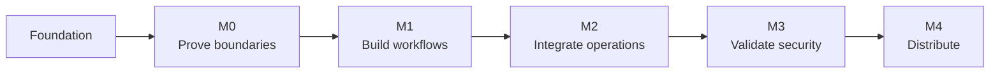

# Roadmap

[Home](README.md) / Roadmap

Milestones describe acceptance gates rather than promised dates. **M3 security-pilot preparation is now in progress alongside the remaining M0 platform validation.** The development build can store real secrets, perform one fixed PostgreSQL check and produce repeatable self-validation evidence, but unresolved identity, platform, independent-review and real-target gates still block production claims.

## Progress at a glance

| Milestone | Outcome | Status |
| :--- | :--- | :--- |
| Foundation | Architecture, threat model, platform/UI targets and repository governance | Available |
| M0 · Feasibility | Synthetic credential and isolation experiments | In progress |
| M1 · Local Web workflow | UI, approvals, session supervision and reconnection | Complete |
| M2 · Controlled operations | Scoped adapter and MCP integration | Complete |
| M3 · Security pilot | Repeatable evidence, approved low-privilege testing and independent review | In progress |
| M4 · Distribution | Validated packages, source correspondence and recovery | Planned |

A later milestone may be developed in synthetic mode, but cannot enable security-dependent behavior or pass release gates while its prerequisite remains unresolved.

## Acceptance criteria

M0 — Feasibility and isolation

- [x] Keep system-command and business-operation execution synthetic-only while credential configuration is developed behind a separate write-only boundary.
- [ ] Verify the intended identity boundary on Windows, Linux and macOS.
- [x] Demonstrate one-time browser pairing, exact Origin checks and rejection of invalid tokens on a loopback-only service.
- [x] Demonstrate synthetic PTY lifetime independent of WebSocket/UI attachment, including output replay after reconnection.
- [x] Record unsupported environments, verified evidence and remaining risks in the [M0 validation record](docs/M0验证记录.md).

M1 — Local Web workflow

- [x] Implement credential-reference and target configuration.
  - `0.1.0-alpha.5` adds authenticated, memory-only metadata creation, listing, relationship validation and deletion. Persistence, editing and native secret storage remain pending; the API accepts no secret value or network endpoint.
  - `0.1.0-alpha.6` persists the same non-secret schema in a local SQLite database and adds versioned editing. Native secret storage and endpoint configuration remain pending, so this criterion is not yet complete.
  - `0.1.0-alpha.11` adds write-only native storage for passwords and API tokens plus validated PostgreSQL endpoint metadata with mandatory certificate and hostname verification. SQLite retains only non-secret state; SSH private-key storage remains outside this completed password/token criterion and requires its own adapter design.
- [x] Implement scoped approval and revocation.
  - `0.1.0-alpha.7` adds persistent, expiring and versioned approval records for two fixed synthetic operations, including approve, deny and revoke decisions. Approval-to-operation binding, policy enforcement and AI request/status transport remain pending; no operation executes from these records.
  - `0.1.0-alpha.8` binds new approvals to enabled, versioned controlled-action templates and snapshots the approved target, operation and result scope. Request/status transport, policy evaluation and operation consumption remain pending; templates and approvals still cannot execute anything.
  - `0.1.0-alpha.9` adds single-use approval consumption for observable synthetic runs, idempotent requests, cancellation, approval revalidation, safe status/events and restart interruption recovery. Policy evaluation and real adapter enforcement remain pending; the run engine is an internal simulation only.
  - `0.1.0-alpha.10` adds an explainable fixed synthetic policy, target-version snapshots and fail-closed revalidation before approval and every run transition. Real adapter enforcement and AI request/status transport remain pending.
  - `0.1.0-alpha.12` applies the same state machine to the fixed PostgreSQL check, including credential/target validation, single-use execution, cancellation, timeout and safe terminal states.
- [x] Provide bilingual navigation and clear task states; full accessibility verification remains a release gate.
- [x] Verify reconnect, input leases, bounded output backpressure and cancellation in synthetic mode.
  - Evidence covers cursor recovery, single-writer leases, a non-reading client during a 2 MiB output flood, 64 KiB retained replay, five-second outbound send limits and cancellation of a waiting child. Credential-bearing adapters must repeat the applicable tests in later milestones.
- [x] Keep ordinary terminals separate from credential-bearing operations.
  - The PostgreSQL adapter has a dedicated fixed-operation path. The synthetic PTY accepts no credential reference and never receives the password, connection configuration or database result.

M2 — Controlled operations

- [x] Implement one scoped database adapter with least-privilege access.
  - `0.1.0-alpha.12` provides a fixed PostgreSQL `SELECT 1` check with native protocol TLS verification, a read-only serializable transaction and status-only output. Least-privilege grants and behavior against an authorized real test database remain M3 evidence.
- [x] Implement MCP request, status, cancellation and safe-event tools.
  - `0.1.0-alpha.13` adds eight fixed stdio tools for template discovery, policy evaluation, approval request/status, approved run creation/status/cancellation and database-enforced safe events. Approval decisions, secret access, target addresses, SQL, shell input and raw adapter output are absent.
  - `0.1.0-alpha.14` moves stdio into a lightweight bridge attached to the independently running Web broker. A bridge disconnect no longer owns broker or terminal lifetime, and the bridge reloads its private connection document after broker restart. Verified OS identity IPC remains an M0/M3 security gate; authenticated loopback is only a same-user compatibility transport.
  - `0.1.0-alpha.15` replaces the internal loopback HTTP hop with Windows named pipes or Unix domain sockets, bounded framed messages and a defense-in-depth rotating token. Unix peers must match the private data-directory owner UID; installed Windows ACL behavior and hostile same-user isolation remain M3 evidence, so the public posture stays `unverified_same_user`.
- [x] Validate idempotency and unknown-result handling.
  - One approval maps to at most one run, idempotency keys are digested, timeout/failure/restart become explicit bounded states, and active runs are never silently replayed.
- [x] Reject arbitrary credentialed shell input and output bypasses.
  - The adapter accepts no SQL or operation arguments, returns only enumerated statuses, and uses fixed database-enforced event messages.

M3 — Security pilot

- [ ] Complete attack and leakage tests in the threat model.
  - `0.1.0-alpha.16` adds a product-level security validation center that combines current-instance SQLite integrity and bounded-payload checks with isolated approval-bypass, replay, rotation, revocation and restart-recovery scenarios. It persists fixed safe evidence with a SHA-256 digest and exports Markdown/JSON reports. OS identity, hostile same-user, real-target and independent tests remain open.
- [ ] Resolve high-risk findings before connecting real test credentials.
- [ ] Obtain explicit approval for a dedicated low-privilege test environment.
- [ ] Validate rotation, revocation and failure recovery.
  - The `alpha.16` isolated suite establishes a repeatable synthetic baseline for target-version rotation, approval revocation and interrupted-run recovery. Native-store and remote-session behavior still requires the approved pilot environment.
- [ ] Complete independent review of security-sensitive implementation.

M4 — Distribution

- [ ] Build and test each supported OS/architecture.
- [ ] Validate browser UI, native keychain/process backends, local transport, install and uninstall behavior.
- [ ] Publish signed service packages with corresponding source, SBOM and hashes.
- [ ] Validate upgrade, rollback and configuration recovery.
- [ ] Publish compatibility, known limitations and release notes.

## Release policy

> [!IMPORTANT]
> Stable status requires documented safety, usability and compatibility evidence. A successful build or repository CI run is not sufficient.

Additional platforms, adapters, remote operation and team features require separate scope and maintenance review. See [release governance](docs/开源治理与发布.md) for distribution requirements.

---

[Architecture](docs/开发设计.md) · [Security gates](docs/安全模型与验收.md) · [Changelog](CHANGELOG.md)
