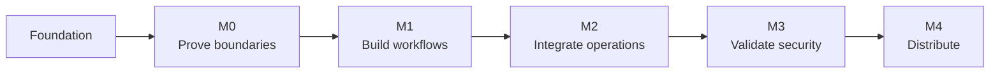

# Roadmap

[Home](README.md) / Roadmap

Milestones describe acceptance gates rather than promised dates. **M1 workflow development is now in progress alongside the remaining M0 platform validation.** Development may overlap, but unresolved M0 security gates still block real credentials, business-system connections and release claims.

## Progress at a glance

| Milestone | Outcome | Status |
| :--- | :--- | :--- |
| Foundation | Architecture, threat model, platform/UI targets and repository governance | Available |
| M0 · Feasibility | Synthetic credential and isolation experiments | In progress |
| M1 · Local Web workflow | UI, approvals, session supervision and reconnection | In progress |
| M2 · Controlled operations | Scoped adapter and MCP integration | Planned |
| M3 · Security pilot | Approved low-privilege testing and independent review | Planned |
| M4 · Distribution | Validated packages, source correspondence and recovery | Planned |

A later milestone may be developed in synthetic mode, but cannot enable security-dependent behavior or pass release gates while its prerequisite remains unresolved.

## Acceptance criteria

M0 — Feasibility and isolation

- [x] Enforce synthetic-only mode; real credential and execution paths are absent.
- [ ] Verify the intended identity boundary on Windows, Linux and macOS.
- [x] Demonstrate one-time browser pairing, exact Origin checks and rejection of invalid tokens on a loopback-only service.
- [x] Demonstrate synthetic PTY lifetime independent of WebSocket/UI attachment, including output replay after reconnection.
- [x] Record unsupported environments, verified evidence and remaining risks in the [M0 validation record](docs/M0验证记录.md).

M1 — Local Web workflow

- [ ] Implement credential-reference and target configuration.
  - `0.1.0-alpha.5` adds authenticated, memory-only metadata creation, listing, relationship validation and deletion. Persistence, editing and native secret storage remain pending; the API accepts no secret value or network endpoint.
  - `0.1.0-alpha.6` persists the same non-secret schema in a local SQLite database and adds versioned editing. Native secret storage and endpoint configuration remain pending, so this criterion is not yet complete.
- [ ] Implement scoped approval and revocation.
  - `0.1.0-alpha.7` adds persistent, expiring and versioned approval records for two fixed synthetic operations, including approve, deny and revoke decisions. Approval-to-operation binding, policy enforcement and AI request/status transport remain pending; no operation executes from these records.
  - `0.1.0-alpha.8` binds new approvals to enabled, versioned controlled-action templates and snapshots the approved target, operation and result scope. Request/status transport, policy evaluation and operation consumption remain pending; templates and approvals still cannot execute anything.
  - `0.1.0-alpha.9` adds single-use approval consumption for observable synthetic runs, idempotent requests, cancellation, approval revalidation, safe status/events and restart interruption recovery. Policy evaluation and real adapter enforcement remain pending; the run engine is an internal simulation only.
- [x] Provide bilingual navigation and clear task states; full accessibility verification remains a release gate.
- [x] Verify reconnect, input leases, bounded output backpressure and cancellation in synthetic mode.
  - Evidence covers cursor recovery, single-writer leases, a non-reading client during a 2 MiB output flood, 64 KiB retained replay, five-second outbound send limits and cancellation of a waiting child. Credential-bearing adapters must repeat the applicable tests in later milestones.
- [ ] Keep ordinary terminals separate from credential-bearing operations.
  - Synthetic run APIs, persistence and UI are structurally separate from the synthetic PTY, and accept no terminal input. This separation must be revalidated once a credential-bearing adapter exists.

M2 — Controlled operations

- [ ] Implement one scoped database adapter with least-privilege access.
- [ ] Implement MCP request, status, cancellation and safe-event tools.
- [ ] Validate idempotency and unknown-result handling.
- [ ] Reject arbitrary credentialed shell input and output bypasses.

M3 — Security pilot

- [ ] Complete attack and leakage tests in the threat model.
- [ ] Resolve high-risk findings before connecting real test credentials.
- [ ] Obtain explicit approval for a dedicated low-privilege test environment.
- [ ] Validate rotation, revocation and failure recovery.
- [ ] Complete independent review of security-sensitive implementation.

M4 — Distribution

- [ ] Build and test each supported OS/architecture.
- [ ] Validate browser UI, native keychain/process backends, local transport, install and uninstall behavior.
- [ ] Publish signed service packages with corresponding source, SBOM and hashes.
- [ ] Validate upgrade, rollback and configuration recovery.
- [ ] Publish compatibility, known limitations and release notes.

## Release policy

> [!IMPORTANT]
> Stable status requires documented safety, usability and compatibility evidence. A successful build or repository CI run is not sufficient.

Additional platforms, adapters, remote operation and team features require separate scope and maintenance review. See [release governance](docs/开源治理与发布.md) for distribution requirements.

---

[Architecture](docs/开发设计.md) · [Security gates](docs/安全模型与验收.md) · [Changelog](CHANGELOG.md)
