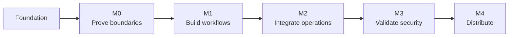

# Roadmap

[Home](README.md) / Roadmap

Milestones describe acceptance gates rather than promised dates. **M2 controlled-operation development is now in progress alongside the remaining M0 platform validation.** The development build can store real secrets and perform one fixed PostgreSQL check, but unresolved identity, platform and real-target gates still block production claims.

> [!IMPORTANT]
> 当前版本为 `0.1.0-alpha.21` 工程候选，处于 **M3 安全复核与试点准备**。本机隔离 PostgreSQL 已形成首轮真实 TLS 适配器证据，但不是生产试点或独立认证；M0 中安装后操作系统身份隔离仍未关闭，项目也不等于已经适合生产使用。

| Milestone | Outcome | Status |
| :--- | :--- | :--- |
| Foundation | Architecture, threat model, platform/UI targets and repository governance | Available |
| M0 · Feasibility | Synthetic credential and isolation experiments | In progress |
| M1 · Local Web workflow | UI, approvals, session supervision and reconnection | In progress |
| M2 · Controlled operations | Scoped adapter and MCP integration | In progress |
| M3 · Security pilot | Approved low-privilege testing and independent review | Planned |
| M4 · Distribution | Validated packages, source correspondence and recovery | Planned |

后续阶段可以在合成模式下提前开发，但不能绕过前置安全门槛启用真实能力，也不能据此改变公开安全声明。

## 3. 已完成版本档案

更细的逐项变化见 [CHANGELOG](CHANGELOG.md)，安全证据见 [M0 验证记录](docs/M0验证记录.md) 与 [安全模型](docs/安全模型与验收.md)。

### Foundation · 项目与治理基线

- 明确由本机可信代理代替 AI 使用凭据，AI 只获得受限操作与脱敏结果；
- 确定 Windows、Linux、macOS 与浏览器 Web UI，永久取消桌面壳计划；
- 建立威胁模型、跨平台规范、贡献规则、披露流程和发行治理；
- 采用 `AGPL-3.0-or-later`；闭源商用、改造后商用、嵌入或打包进商用软件及超出开源许可范围的使用须取得版权方商业许可；
- 建立依赖许可证清单、锁文件、仓库检查与三平台 CI。

### 0.1.0-alpha.1 · Web 与本机服务基线

- React/TypeScript/Vite/Tailwind 双语 Web 控制台与 Rust/Axum/Tokio 本机服务；
- 只绑定回环，一次性 URL fragment 配对、精确 Origin、内存会话和安全响应头；
- 合成模式状态 API，真实凭据与系统命令明确关闭；
- 验收：错误来源和错误令牌被拒绝，三平台构建与仓库检查通过。

### 0.1.0-alpha.2 · 合成持久终端

- 内置合成 PTY、尺寸/输入/会话容量限制；
- WebSocket 鉴权、断线重连、输出回放、resize 和显式终止；
- 页面断开不结束 PTY，令牌仅保存摘要并支持会话撤销；
- 验收：端到端覆盖断开、重连、回放和撤销，不开放系统 Shell。

### 0.1.0-alpha.3 · 监督式重连与输入租约

- 单写入者租约与只读观察者，同一客户端重连可替换旧连接；
- 单调字节游标取代整缓冲重放，显式报告保留区截断与广播缺口；
- 验收：游标续读、只读拒绝、租约释放、取消与撤销均有测试。

### 0.1.0-alpha.4 · 韧性与无障碍边界

- 公开 `unverified_same_user`，不暗示已经完成进程身份隔离；
- WebSocket 发送超时、64 KiB 回放、2 MiB 洪泛和等待取消场景；
- 窄屏、200% 缩放、跳转链接、状态播报和减少动态效果；
- 验收：停滞读者不能拖死新连接，超限不会静默丢失。

### 0.1.0-alpha.5 · 配置目录

- 内存中的凭据引用与逻辑目标，字段、容量和关系均受限；
- API 拒绝秘密字段，双语创建、列表和关系安全删除界面；
- 验收：不接收网络地址、不保存秘密、重启清空行为清楚可见。

### 0.1.0-alpha.6 · SQLite 持久配置

- 配置迁入操作系统应用数据目录的 SQLite；
- 全记录更新、乐观版本冲突、单调版本号，SQLite 工作移出异步线程；
- 验收：重启后记录保留，schema 不含秘密值和业务端点。

### 0.1.0-alpha.7 · 限时审批

- 固定目标、操作、结果范围和 1—60 分钟有效期；
- `pending → approved/denied`、`approved → revoked` 与自动过期；
- 所有决定使用预期版本，Web 提供审阅、批准、拒绝和撤销；
- 验收：审批记录不能执行、联网、取密或返回业务结果。

### 0.1.0-alpha.8 · 受控操作模板

- 模板绑定目标、固定操作、结果范围、超时和启用状态；
- 审批保存模板与目标快照，历史引用禁止被级联删除；
- 验收：模板没有命令、脚本、参数、端点或凭据字段。

### 0.1.0-alpha.9 · 可观察单次运行

- 持久化运行状态机、一次批准一次运行、摘要化幂等键；
- 乐观取消、启动恢复为明确失败、固定安全事件和单调事件序号；
- Runs/Audit 双语页面与活动轮询；
- 验收：相同请求返回原运行，冲突重放被拒绝，中断不自动重放。

### 0.1.0-alpha.10 · 可解释策略

- 固定策略返回资格、原因、强制保障和版本快照；
- 在批准、创建、开始、完成前复核，模板/目标漂移默认拒绝；
- 验收：不存在调用方注入规则或自由表达式的入口。

### 0.1.0-alpha.11 · 系统凭据库与 PostgreSQL 配置

- 密码和 API 令牌只写系统凭据库，无读取或导出 API；
- SQLite 只保存可用状态和更新时间，临时 Rust 缓冲使用 `zeroize`；
- PostgreSQL 配置结构化保存，TLS 固定 `verify_full`；
- 验收：秘密不进入 SQLite、URL、参数、环境、日志或响应。

### 0.1.0-alpha.12 · 固定 PostgreSQL 只读检查

- 只执行只读、可串行化事务中的固定 `SELECT 1` 并回滚；
- 接入策略、审批、单次消费、幂等、超时、取消和事件链；
- 只返回枚举状态，轮换/清除凭据使旧批准失效；
- 验收：替换执行器覆盖成功、失败、超时、取消、撤销与配置漂移。

### 0.1.0-alpha.13 · 有界 MCP stdio 工具

- 使用官方 Rust MCP SDK 暴露 8 个固定工具；
- 支持模板发现、策略预检、审批申请/状态、运行创建/状态/取消和安全事件；
- 审批决定只留在 Web，MCP 无取密、SQL、Shell、地址、理由或原始错误；
- 验收：协议级固定工具清单和输入 schema，未批准执行被阻断。

### 0.1.0-alpha.14 · 独立代理与桥接生命周期

- 长期 Web broker 与轻量 MCP bridge 分离；
- 桥接断开不结束控制台、受控运行或终端；
- 私有连接文档和轮换令牌使 bridge 跟随 broker 重启；
- 验收：错误认证、代理存活、代理替换和不自动重放均有测试。

### 0.1.0-alpha.15 · 原生本机 IPC

- Windows 命名管道、Linux/macOS Unix socket 取代内部回环 HTTP；
- 有界帧、连接数/大小/时间限制、未知字段拒绝和轮换令牌；
- Unix 校验目录权限与对端 UID；Windows 拒绝远端客户端；
- 验收：桥接重连和生命周期通过；安装后 Windows ACL 仍属 M0 门槛。

### 0.1.0-alpha.16 · 安全验证与证据中心

- 当前 SQLite 完整性、外键、凭据 schema 和安全事件白名单检查；
- 使用生产领域代码在隔离内存重演绕过、重放、轮换、撤销和中断恢复；
- schema v8 固定证据、读取时重算 SHA-256、双语页面和两种报告；
- 验收：9 项自动通过、1 项身份边界警告；三平台主分支 CI 通过；不连接真实目标、不声称独立认证。

### 0.1.0-alpha.17 · 安全试点准入工作区

- 汇总专用测试数据库目标、TLS 配置、凭据状态、受控模板和最近安全自检；
- 生成 10 项检查，将技术阻断与人工/外部证据分开；
- schema v9 保存最多 128 份快照，读取时重算 SHA-256；
- 鉴权历史/创建/详情/报告 API；创建不接受请求体，不能选择性跳过门槛；
- 双语“试点准入”页面、历史、候选/技术就绪统计和 Markdown/JSON 下载；
- 验收：空配置为 `blocked`；技术链完整时仅为 `attention`，报告不含目标地址或秘密。

### 0.1.0-alpha.18 · 企业工作流界面重构

- 运行界面不再展示里程碑编号、开发阶段或路线图宣传内容；
- 总览收敛为可操作的安全提示和运行状态表，不再以功能卡片陈列实现特点；
- 凭据、目标、策略、审批和运行使用“按需新增／连续记录／详情操作”的层级；
- 验证与准入采用历史主列表和单一详情工作区，检查结果按行呈现；
- 终端保持会话主从导航，终端工作区是页面唯一高强调容器；
- 验收：Web 类型、测试和生产构建通过，并以静态回归测试阻止开发阶段标签重新进入运行界面。

## 4. 下一阶段大功能包

每一项均以独立版本、PR 和验收证据交付。外部前提未满足时保持受阻，不降低标准换取完成状态。

### 0.1.0-alpha.19 · 三平台安装身份与 IPC 证据包（待开始，M0/M3）

**交付**：Windows 服务身份、目录 ACL、命名管道 DACL；Linux systemd 用户服务、目录/socket、UID 与凭据库条件；macOS launchd、Keychain、目录/socket 与对端身份；固定非秘密证据探针；敌对同用户、非所属用户、远程管道、符号链接和连接文档替换测试。

**验收**：三平台全新安装环境分别留证；非授权 OS 主体不能访问 IPC、运行目录或服务凭据；同用户不保证范围公开；只有证据满足规则时才允许改变 `identity_boundary`，不得硬编码升级状态。

### 0.1.0-alpha.20 · 获批 PostgreSQL 低权限试点（待开始，M3）

**外部前提**：目标负责人授权；专用、短期、非生产、只读账号；允许的网络窗口与证书链；不得使用生产密码代替。

**已完成工程候选**：schema v11试点登记与1—168小时有效期；绑定目标／模板版本、准入／平台快照及外部授权和权限复核引用；`registered → active → closing → closed`状态机、撤销与自动过期；固定11场景矩阵；逐项版本化证据；凭据清除与全项通过的结项门槛；鉴权API、双语主从工作台和Markdown／JSON导出。工作台不会自动连接远端，也不会把操作员填写的引用认定为真实授权。

**本机开发证据**：`alpha.21`在自行创建、隔离且不含业务数据的 Windows PostgreSQL 18.6 实例上验证了生产适配器的成功连接、凭据轮换后旧密码拒绝、私有 CA 未受信拒绝、主机名不匹配拒绝和端口不可达，并核对 TLS 1.3 与最低权限角色属性。证据只缩小实现不确定性，不能替代目标方授权、业务环境验证或第三方复核。

**仍待外部执行**：由目标负责人提供专用非生产账号、书面授权、网络窗口和证书链；独立人员复核远端授权集；在获批环境逐项执行超时、DNS、执行中断网、审批撤销、服务重启、清理等尚未覆盖的场景，并把全部11项外部证据关联到试点记录。

**验收**：准入无技术失败且外部门槛有引用；远端权限由独立人员确认；失败矩阵和恢复可重复；不触碰生产，不扩大固定 SQL 或结果范围。

### 0.1.0-alpha.21 · 安全复核与整改闭环（进行中，M3）

**已完成首轮整改**：本机真实 TLS 验证发现原适配器只能使用操作系统信任根，无法安全验证企业私有 CA。现已加入受限的进程级私有 CA PEM 设置，拒绝相对路径、符号链接、非普通文件、空文件和超过64 KiB的文件，并保持证书链与主机名校验；默认忽略的实机集成测试可复现成功、轮换、证书和网络失败路径。

**仍待完成**：

- 建立完整发现项台账，记录严重性、负责人、修复提交、复测和豁免到期；
- 由非原实现人员独立复核凭据库、IPC、会话、策略、审批、适配器、日志、导出和供应链；
- 自动生成 SBOM、许可证、漏洞和源码对应关系；
- 验收：无未解决高危问题，其余问题均关闭或有明确限时风险接受。

### 0.2.0-beta.1 · 三平台服务化安装与恢复（待开始，M4）

- Windows Service/合适的用户态启动、systemd user service、launchd agent；
- 首次启动、后台运行、停止、卸载和残留数据提示；
- 非秘密配置备份/恢复，系统凭据按平台独立处理；
- schema 升级前备份、失败回滚、降级拒绝和损坏恢复；
- 验收：三平台全新安装、覆盖升级、失败升级、卸载和恢复演练通过。

### 0.2.0-beta.2 · 可验证发行供应链（待开始，M4）

- 可追溯构建、最小发行内容、对应源码、SBOM、许可证与哈希；
- Windows/macOS 签名与公证、Linux 包签名；
- 正式发布受保护环境和人工批准；
- 依赖更新、撤回、密钥轮换和安全修复流程；
- 验收：用户可验证产物并定位对应源码。

### 0.2.0-beta.3 · 产品级 Web 体验与可访问性（待开始，M4）

- 首次引导、空状态、错误恢复、危险确认和跨页面进度；
- 键盘、焦点、屏幕阅读器、200%/400% 缩放、主题和减少动态；
- Chrome、Edge、Firefox、Safari 支持矩阵；
- 睡眠唤醒、多页面、大历史和长时间运行测试；
- 验收：WCAG 2.2 AA 目标无阻断，关键流程人工可用性测试通过。

### 0.2.0-beta.4 · 运维可观测与诊断包（待开始，M4）

- 健康、容量、队列、会话、存储和适配器诊断；
- 分级日志、固定事件、敏感扫描、保留和安全清理；
- 一键生成不含秘密、地址和业务内容的支持包；
- 崩溃、磁盘满、时钟跳变、凭据库锁定和权限变化恢复建议；
- 验收：支持包通过敏感回归，常见故障可按文档独立定位。

### 1.0.0-rc.1 · 范围冻结与安全候选（待开始，M5）

- 冻结支持矩阵、公开 API/MCP schema、数据 schema 与安全声明；
- 威胁模型复审、模糊测试、浸泡、备份恢复和升级矩阵；
- 清理实验入口、死代码、调试依赖和不支持的迁移路径；
- 验收：候选版本仅保留已证明能力，文档与二进制行为一致。

### 1.0.0-rc.2 · 发行彩排（待开始，M5）

- 空白机器完成安装、配对、配置、审批、运行、审计、备份与卸载；
- 验证源码对应、许可证、签名、SBOM、校验和、已知问题和回滚；
- 至少一次独立维护者复现构建与验收；
- 验收：无发布阻断，回滚与安全联系渠道可用。

### 1.0.0 · 本地稳定版（待开始，M5）

- 面向单人、本机、固定受控操作场景提供稳定支持；
- 明确真实能力、限制、兼容矩阵、更新和安全响应政策；
- 不承诺任意带密 Shell、通用 SQL、远程多租户或无人审批；
- 验收：M0—M5 阻断门槛关闭，发布清单签署完成。

## 5. 1.0 后候选功能包

| 候选版本 | 大功能包 | 进入条件 | 核心验收 |
|---|---|---|---|
| 1.1 | 受审适配器 SDK 与契约测试 | 1.0 API 稳定 | 第三方适配器无法绕过取密、策略、审批和输出审查 |
| 1.2 | 固定 HTTP API 与 SSH 诊断适配器 | 分别完成威胁与许可评审 | 每个动作固定 schema、最小权限、超时、取消、脱敏 |
| 1.3 | 可签名策略包与组织模板 | 签名和来源模型明确 | 更新可审计、可回滚、不能静默扩大权限 |
| 1.4 | 本机任务编排与条件步骤 | 单步骤边界稳定 | 每步独立授权，失败/补偿/未知结果显式，不共享秘密 |
| 2.0 | 团队控制面与远程代理 | 重新立项 | 多租户身份、mTLS、设备登记、集中审计和离线撤销 |

## 6. 永久非目标与变更控制

默认不进入产品：向 AI 返回秘密、通用密码导出、任意带凭据 Shell、任意 SQL、AI 批准自己的请求、把 URL token 当长期凭据、日志保留原始认证流、把回环或同用户进程天然视为可信。

若未来确需改变任一项，必须单独立项，更新威胁模型、许可证评估、数据模型、安全声明和迁移/回退方案，并由独立评审确认；不能作为已有版本的“小增强”直接加入。

## 7. 当前最近行动

1. 以 alpha.17 准入快照和 alpha.18 企业工作流界面作为 M3 操作入口；
2. 使用 alpha.19 工程候选在三平台完成全新安装与敌对主体留证，不直接修改公开身份状态；
3. 以本机隔离 PostgreSQL 证据修正适配器问题，但不把它登记为目标方授权的 alpha.20 试点；
4. 获得专用非生产环境和负责人授权后完成 alpha.20 全部11项外部矩阵；
5. 由非原实现人员继续 alpha.21 独立安全复核、发现项闭环与供应链证据；
6. M3 关闭后再进入安装、签名与发布，不提前宣称生产就绪。

---

[Architecture](docs/开发设计.md) · [Security gates](docs/安全模型与验收.md) · [Changelog](CHANGELOG.md)
