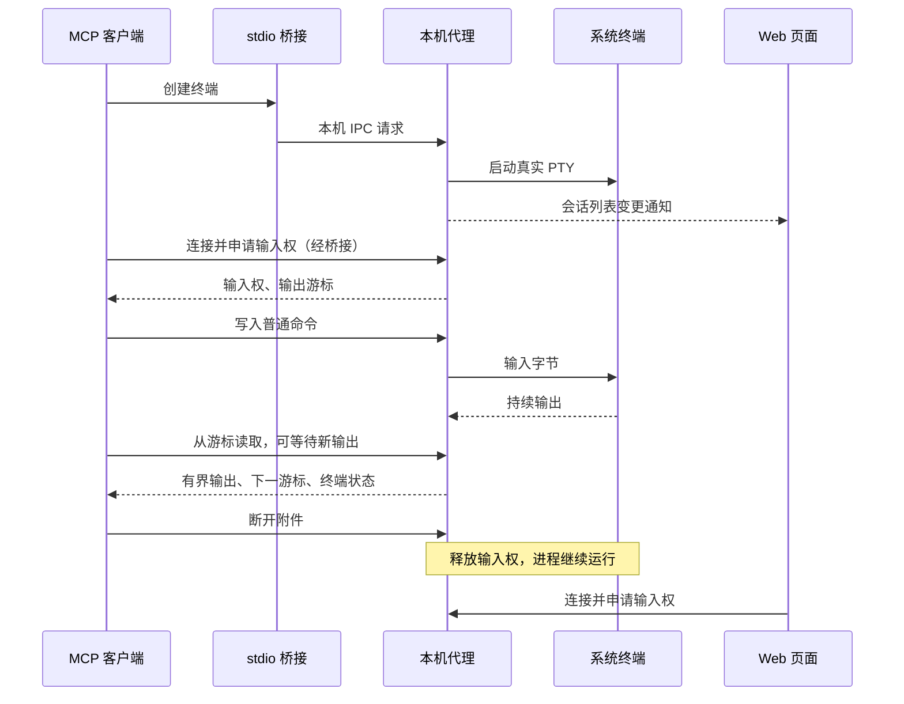

# AI 终端与实时状态

[项目首页](../README.zh-CN.md) / [使用指南](使用指南.md) / AI 终端与实时状态

Web 页面与 MCP 客户端操作同一批后台终端。终端用于构建、测试和其他普通命令；密码与令牌仍由独立的凭据执行链处理，不传入普通 Shell。

## 工作方式



## 工具清单

以下工具均以 `secretbridge_terminal_` 开头。ID 指向公开终端资源，不是认证令牌；MCP 会话身份由桥接内部生成，不能通过工具参数指定。

| 工具后缀 | 参数 | 结果与语义 |
| :--- | :--- | :--- |
| `capabilities` | 无 | 可用 Shell、平台、会话上限 |
| `list` | 无 | 会话摘要、状态、PID、Shell 退出码 |
| `create` | `rows`、`cols`；可选 `shell`、`name`、`working_directory`、`environment` | 创建进程，不自动取得输入权 |
| `attach` | `id`、可选 `request_input` | 连接当前 MCP 会话，返回输入权与游标范围 |
| `read` | `id`、`cursor`；可选 `max_bytes`、`wait_ms` | 增量字节、UTF-8 预览、下一游标、状态及截断标记 |
| `write` | `id`、`data` | 向终端写入输入；需要输入权 |
| `resize` | `id`、`rows`、`cols` | 调整 PTY 尺寸；需要输入权 |
| `interrupt` | `id` | 发送 Ctrl+C；需要输入权，不保证程序退出 |
| `detach` | `id` | 释放当前 MCP 附件及输入权，保留进程，可重复调用 |
| `close` | `id` | 强制终止并移除会话；需要输入权 |

Shell 取值为 `powershell`、`cmd`、`bash` 或 `zsh`，实际可用项以 `capabilities` 为准。未提供 Shell 时使用当前平台默认项。普通环境变量只用于进程启动，不写入配置库；不要在其中填写凭据。

## 增量读取

连接结果提供 `oldest_cursor` 与 `next_cursor`。需要回看已保留输出时从前者开始；只关心新输出时从后者开始。每次读取结束后保存返回的 `next_cursor`，作为下一次的 `cursor`。

```json
{
  "id": "<terminal-id>",
  "cursor": 0,
  "max_bytes": 8192,
  "wait_ms": 1000
}
```

| 字段 | 含义 |
| :--- | :--- |
| `cursor` | 本次实际输出的起点 |
| `next_cursor` | 本次返回字节之后的位置 |
| `oldest_cursor` | 当前仍保留的最早位置 |
| `available_cursor` | 后台目前已收到的输出末尾 |
| `has_more` | 是否还有未返回的保留输出 |
| `truncated` | 请求游标已超出保留范围，需要处理输出缺口 |
| `bytes` | 精确输出字节；使用增量解码器可以跨分片解码 |
| `text` | UTF-8 预览；编码错误或分片截断处可能出现替换字符 |
| `terminal` | 当前 Shell 状态及退出码 |

每次读取最多 16 KiB，默认 8 KiB。`wait_ms` 为 0～5000：已有输出时立即返回；没有输出且进程仍运行时可等待一次新事件。后台只保留最近 64 KiB，游标过早或超出已收到范围会明确标记截断，而不会重跑命令补数据。

Shell 退出码只代表终端进程的退出结果，不等于每条命令的退出码。当前接口不自动解析提示符或给自由输入加命令完成标记；需要明确命令结束时，应使用工具自身的结果或普通、非秘密的输出标记。

## 输入权与交接

同一终端一次只能有一个输入连接。`attach` 的 `request_input` 默认是 `false`；请求输入后仍须检查 `input_granted`。被拒绝输入权的连接可以读取输出，但不能写入、调整尺寸、发送中断或关闭进程。

- Web 正在输入时，MCP 不能抢占它的输入权。
- 不同 MCP 会话拥有不同内部身份，不能接管对方仍有效的输入附件。
- 同一 MCP 会话重新连接可替换自己的旧附件。
- 交还给用户前调用 `detach`，用户再连接页面申请输入权。
- MCP 正常断开会释放全部附件；异常退出的附件在最后一次操作后 60 秒到期，清理周期为 5 秒。
- 附件清理只释放输入权，不结束 Shell。后台代理退出或显式 `close` 才结束会话。

写入不是幂等操作。通信失败可能发生在输入已交付之后，不能盲目重发；先读取已有输出、检查状态，再由调用方决定下一步。桥接不自动重试创建或写入。

## Web 实时通知

`/api/v1/events` 使用同源 WebSocket。升级请求必须通过精确 Origin 校验，第一帧必须携带当前页面会话：

```json
{"type":"authenticate","token":"<page-session-token>"}
```

令牌不放在 URL 中。服务首先返回 `{"type":"ready"}`，随后以 `{"type":"changed"}` 通知审批、任务或终端状态发生变化。通知不包含秘密、命令、资源名称、地址或业务数据；页面通过原有认证 HTTP API 获取最新快照。

审批、运行任务与终端页面会合并短时间内的通知，断线后自动退避重连，在收到 `ready` 时重新取快照。低频兜底刷新同时处理时间到期和暂时无法连接 WebSocket 的情况。页面会话过期或撤销时，服务关闭实时连接。

## 当前边界

普通终端是当前用户权限下的代码执行能力，不是隔离沙箱。它不自动读取 SecretBridge 凭据库，但也不能阻止普通程序读取用户本来有权访问的文件、环境或系统凭据库。不得用它读取认证文件、打印秘密或绕过凭据操作审批。

当前普通输出未经通用秘密识别或跨分片脱敏处理。[凭据命令任务](凭据命令任务.md)已在独立执行器中提供四种注入方式与跨分片过滤，不能把已经替换密码的命令发送到持久终端。

---

[开发设计](开发设计.md) · [功能路线图](../ROADMAP.md) · [安全模型](安全模型与验收.md)
