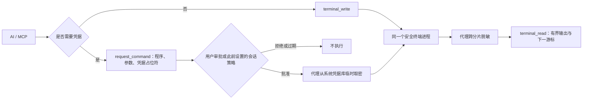

# 安全连续终端

[项目首页](../README.zh-CN.md) / [使用指南](使用指南.md) / 安全连续终端

SecretBridge 由本机代理持有真实 Shell。普通命令与需要凭据的命令可以在同一个终端进程中连续执行，因此工作目录、进程环境和前后命令形成一段可追溯的会话。AI 不能接触原始 PTY、后台日志或凭据值，只能通过 MCP 游标读取代理已经处理过的输出。

## 两种命令入口



- 普通命令：连接终端后通过 `secretbridge_terminal_write` 写入，不要在输入中放置秘密。
- 凭据命令：调用 `secretbridge_request_command`，提交绝对程序路径、逐项参数、终端 ID 和凭据占位符。SecretBridge 自动生成一次性申请，不要求用户预先建立任务模板；若用户已在 Web 中授予匹配的会话策略，申请可以直接获批。
- 审批策略和决定仍由用户控制。用户可在本机 Web 控制台操作，也可在核对具体待审批请求后主动回复当前 TOTP 验证码，由 AI 通过 MCP 转交。会话级全操作预授权属于高风险选项，生效期间页面持续显示风险标识；AI 不能设置该策略。AI 不得操作、检查或自动化 Web 控制台，不得索要页面 PIN、二维码或 TOTP 手动密钥，也不得保存或复用验证码。
- 批准后，代理在目标终端中执行命令。秘密通过标准输入、单独参数、临时环境变量或受管临时文件短暂注入；命令文本和 Shell 历史不包含秘密原文。
- 会话一旦使用过某个秘密，该秘密的脱敏模式会保留到终端关闭，避免后续命令回显旧值。

## MCP 工具

| 工具 | 用途 |
|---|---|
| `secretbridge_terminal_capabilities` | 查询平台、可用 Shell 与限制 |
| `secretbridge_terminal_list` | 列出会话、状态、PID 与退出码 |
| `secretbridge_terminal_create` | 创建由代理持有的安全终端 |
| `secretbridge_terminal_attach` | 连接会话并按需申请输入权 |
| `secretbridge_terminal_read` | 按字节游标读取代理脱敏后的输出 |
| `secretbridge_terminal_write` | 写入不含秘密的普通终端输入 |
| `secretbridge_terminal_resize` | 调整 PTY 尺寸 |
| `secretbridge_terminal_interrupt` | 尝试向前台任务发送 Ctrl+C |
| `secretbridge_terminal_detach` | 释放附件与输入权，保留进程 |
| `secretbridge_terminal_close` | 终止并移除会话 |
| `secretbridge_list_catalog` | 读取凭据与连接的非秘密元数据 |
| `secretbridge_request_command` | 为现有终端创建含凭据占位符的待审批命令 |
| `secretbridge_confirm_approval` | 使用用户主动提供的单次 TOTP 验证码确认一个指定的待审批请求 |

Shell 可能为 `powershell`、`cmd`、`bash` 或 `zsh`，以能力查询结果为准。启动环境变量不会保存，但仍不得填写密码、令牌或私钥。

MCP 的 `tools/list` 公布各工具的输入和输出 JSON Schema。响应均在 MCP `structuredContent` 中；下面列出最容易误读的字段位置，完整字段以当前工具 schema 为准：

| 步骤 / Step | 从结构化响应读取 / Read from structured response | 下一步 / Next action |
|---|---|---|
| `secretbridge_begin_conversation` | `id`（作为后续申请的 `conversation_id`） | 在同一 AI 对话中复用此 ID；AI 不设置审批策略 |
| `secretbridge_terminal_create` | `terminal.id`（不是顶层 `id`） | 用此 ID 调用 `secretbridge_terminal_attach` |
| `secretbridge_terminal_attach` | `input_granted`、`next_cursor` | 只有取得输入权才写入普通命令 |
| `secretbridge_request_command` / `secretbridge_request_ssh` | `id`、`state`、`version`、`preauthorized`、`next_actions`、可选 `console_url` | `pending` 时交由用户审批；预授权获批时先说明风险，再创建运行 |
| `secretbridge_create_run` | `run.id`、`run.state`、`execution_mode` | 保存运行 ID，不重复提交非幂等命令 |
| `secretbridge_read_run_output` | `items`、`next_cursor`、`truncated`、`state` | 使用下一游标继续读；截断时明确告知保留缺口 |

没有模板时，优先选择能表达目标语义的结构化请求；本机精确程序使用一次性 `request_command`，已登记 SSH 连接使用 `request_ssh`。稳定且重复的操作只有在用户明确希望复用时才保存为模板。错误返回的稳定代码和 `next_actions` 应指导恢复；终端忙、上下文不明或授权失效时，查询当前状态、新建终端或重新申请，不生成绕过代理的辅助脚本。

## 输出游标

`attach` 和 `read` 会返回 `oldest_cursor`、`next_cursor` 与 `available_cursor`。调用方应保存 `next_cursor` 并在下一次读取时作为 `cursor` 提交：

```json
{
  "id": "<terminal-id>",
  "cursor": 0,
  "max_bytes": 8192,
  "wait_ms": 1000
}
```

每次最多读取 16 KiB，代理保留最近 64 KiB。`truncated: true` 表示请求位置已经早于保留窗口；此时只能从 `oldest_cursor` 继续，不能通过重跑命令补数据。`bytes` 用于无损增量解码，`text` 只是 UTF-8 预览。

终端回放、WebSocket 与 MCP 读取共用同一份已脱敏缓冲区。凭据命令的完成状态写入运行记录。运行期间的连续终端交互可通过 `secretbridge_terminal_read` 读取；运行详情和服务重启后的历史脱敏输出可通过 `secretbridge_read_run_output` 读取，不应重新执行命令来恢复输出。

## 输入权与连续性

同一终端一次只有一个输入连接。连接时检查 `input_granted`；未取得输入权的客户端仍可读取输出，但不能写入、调整尺寸、中断或关闭会话。

- Web 和 MCP 不会互相抢占输入权。
- 同一 MCP 会话重新连接可替换自己的旧附件。
- 交还给用户前调用 `detach`；异常断开的附件会在空闲 60 秒后释放。
- 关闭页面或 MCP 客户端不会结束 Shell。
- 服务进程退出会结束 PTY。当前不承诺在操作系统重启后恢复进程内状态。

写入不是幂等操作。网络或 IPC 中断时，先读取现有输出并检查状态，不要盲目重发。

## 跨资源状态与清理责任

审批、运行、终端和输入租约是不同资源。下面的合同用于判断一次操作能否重试；状态应以代理返回的审批、运行和终端记录为准，不能仅凭客户端超时推断。

| 阶段 | 审批与运行 | 终端与输入租约 | 凭据临时材料与恢复 |
|---|---|---|---|
| 排队、等待执行容量 | 审批可能在等待期间过期或被撤销；开始前重新校验版本、有效期和策略，失效的运行结束为 `authorization_revoked` | 代理尚未占用目标终端的受控运行锁；普通输入仍遵循单持有者租约 | 尚未注入秘密；不得把旧审批当作新运行重放，应重新申请 |
| 执行开始 | 一条审批至多消费一次，运行有唯一 ID 和确定的终态 | 代理占用受控运行锁；活动运行期间不能把输入权授予其他写入者 | 代理按需取密并负责临时材料；客户端只读取脱敏结果 |
| 超时或取消 | 运行记录落入 `timed_out` 或 `cancelled`，不能恢复成成功 | 正在执行的终端命令被终止；上下文不确定的终端拒绝受控复用，需新建终端 | 代理清理受管临时材料并释放运行锁；检查状态后重新申请，不重发旧命令 |
| 失败、终端关闭 | 运行保留失败原因和截至结束的有界脱敏输出；审批不能再次消费 | 已关闭或上下文不明的终端不能写入；失效的输入租约返回稳定错误码 | 清理临时材料；修复目标或新建终端后重新申请 |
| 服务退出与重启 | 未完成运行标记 `service_restarted`，不自动重放；已完成记录保留 | 进程内终端及输入租约消失，新进程不能认领旧终端 ID | 启动恢复负责清理残留受管材料；重新发现能力、创建终端并申请新授权 |

`terminal_busy` 表示受控运行占用，`terminal_input_required` 表示调用方没有输入权，`terminal_context_unknown` 表示当前 Shell 所在位置无法安全确认，`terminal_closed` 表示终端已结束。遇到这些错误时，应先读取状态或新建终端；不得绕过代理直接向旧 PTY 写入。

## 安全边界

代理只对经 SecretBridge 绑定并实际取出的秘密建立脱敏规则。它覆盖原始 UTF-8、UTF-16、JSON 转义和常见百分号编码，并处理跨输出分片的匹配；它不是任意敏感信息识别器，不能保证识别 Base64、哈希、自定义变换或未登记数据。

终端仍以当前操作系统用户权限运行，不是容器或恶意代码沙箱。只能执行可信程序。AI 客户端若本身已拥有同一用户的任意本机代码执行能力，SecretBridge 无法阻止它绕过产品接口读取该用户本来可以访问的资源；部署时应同时使用最小权限账号和目标系统权限。

---

[凭据命令](凭据命令任务.md) · [安全模型](安全模型与验收.md) · [开发设计](开发设计.md)
