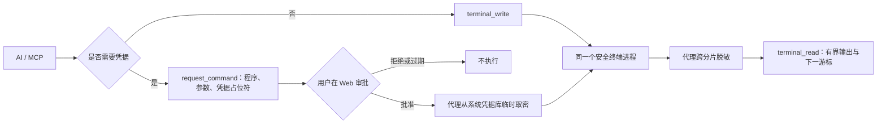

# 安全连续终端

[项目首页](../README.zh-CN.md) / [使用指南](使用指南.md) / 安全连续终端

SecretBridge 由本机代理持有真实 Shell。普通命令与需要凭据的命令可以在同一个终端进程中连续执行，因此工作目录、进程环境和前后命令形成一段可追溯的会话。AI 不能接触原始 PTY、后台日志或凭据值，只能通过 MCP 游标读取代理已经处理过的输出。

## 两种命令入口



- 普通命令：连接终端后通过 `secretbridge_terminal_write` 写入，不要在输入中放置秘密。
- 凭据命令：调用 `secretbridge_request_command`，提交绝对程序路径、逐项参数、终端 ID 和凭据占位符。SecretBridge 自动生成待审批草案，不要求用户预先建立任务模板。
- 审批只能由本机用户在 Web 控制台完成。AI 不得操作、检查或自动化 Web 控制台，也不得索要页面 PIN。
- 批准后，代理在目标终端中执行命令。秘密通过标准输入、单独参数、临时环境变量或受管临时文件短暂注入；命令文本和 Shell 历史不包含秘密原文。
- 会话一旦使用过某个秘密，该秘密的脱敏模式会保留到终端关闭，避免后续命令回显旧值。

## MCP 工具

| 工具 | 用途 |
|---|---|
| `secretbridge_terminal_capabilities` | 查询平台、可用 Shell 与限制 |
| `secretbridge_terminal_list` | 列出会话、状态、PID 与退出码 |
| `secretbridge_terminal_create` | 创建由代理持有的安全终端 |
| `secretbridge_terminal_attach` | 连接会话并按需申请输入权 |
| `secretbridge_terminal_read` | 按字节游标读取代理脱敏后的输出 |
| `secretbridge_terminal_write` | 写入不含秘密的普通终端输入 |
| `secretbridge_terminal_resize` | 调整 PTY 尺寸 |
| `secretbridge_terminal_interrupt` | 尝试向前台任务发送 Ctrl+C |
| `secretbridge_terminal_detach` | 释放附件与输入权，保留进程 |
| `secretbridge_terminal_close` | 终止并移除会话 |
| `secretbridge_list_catalog` | 读取凭据与连接的非秘密元数据 |
| `secretbridge_request_command` | 为现有终端创建含凭据占位符的待审批命令 |

Shell 可能为 `powershell`、`cmd`、`bash` 或 `zsh`，以能力查询结果为准。启动环境变量不会保存，但仍不得填写密码、令牌或私钥。

## 输出游标

`attach` 和 `read` 会返回 `oldest_cursor`、`next_cursor` 与 `available_cursor`。调用方应保存 `next_cursor` 并在下一次读取时作为 `cursor` 提交：

```json
{
  "id": "<terminal-id>",
  "cursor": 0,
  "max_bytes": 8192,
  "wait_ms": 1000
}
```

每次最多读取 16 KiB，代理保留最近 64 KiB。`truncated: true` 表示请求位置已经早于保留窗口；此时只能从 `oldest_cursor` 继续，不能通过重跑命令补数据。`bytes` 用于无损增量解码，`text` 只是 UTF-8 预览。

终端回放、WebSocket 与 MCP 读取共用同一份已脱敏缓冲区。凭据命令的完成状态写入运行记录，但它的连续终端输出应通过 `secretbridge_terminal_read` 读取；不要改用 `secretbridge_read_run_output`，也不要重新执行命令。

## 输入权与连续性

同一终端一次只有一个输入连接。连接时检查 `input_granted`；未取得输入权的客户端仍可读取输出，但不能写入、调整尺寸、中断或关闭会话。

- Web 和 MCP 不会互相抢占输入权。
- 同一 MCP 会话重新连接可替换自己的旧附件。
- 交还给用户前调用 `detach`；异常断开的附件会在空闲 60 秒后释放。
- 关闭页面或 MCP 客户端不会结束 Shell。
- 服务进程退出会结束 PTY。当前不承诺在操作系统重启后恢复进程内状态。

写入不是幂等操作。网络或 IPC 中断时，先读取现有输出并检查状态，不要盲目重发。

## 安全边界

代理只对经 SecretBridge 绑定并实际取出的秘密建立脱敏规则。它覆盖原始 UTF-8、UTF-16、JSON 转义和常见百分号编码，并处理跨输出分片的匹配；它不是任意敏感信息识别器，不能保证识别 Base64、哈希、自定义变换或未登记数据。

终端仍以当前操作系统用户权限运行，不是容器或恶意代码沙箱。只能执行可信程序。AI 客户端若本身已拥有同一用户的任意本机代码执行能力，SecretBridge 无法阻止它绕过产品接口读取该用户本来可以访问的资源；部署时应同时使用最小权限账号和目标系统权限。

---

[凭据命令](凭据命令任务.md) · [安全模型](安全模型与验收.md) · [开发设计](开发设计.md)
