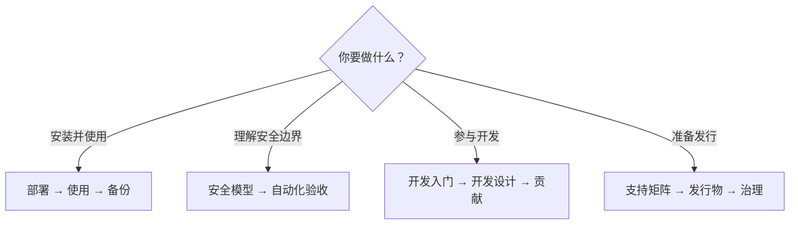

# SecretBridge 文档

[项目首页](../README.zh-CN.md) / 文档

这里按读者要完成的事情组织文档。当前公开 Beta 面向个人、单机使用；请优先使用 [Release 安装包](https://github.com/qq940500529/secretbridge/releases/tag/v0.2.0-beta.5)，并先以合成凭据完成环境评估。

## 安装与使用

| 任务 | 文档 |
|---|---|
| 首次部署 | [AI 辅助部署](AI辅助部署.md)（推荐） · [供 AI 读取的执行指南](AI部署执行指南.md) · [安装与后台运行](后台运行与安装交付.md) |
| 了解日常流程 | [使用指南](使用指南.md) · [工作台说明](工作台使用说明.md) · [术语表](术语表.md) |
| 终端与实时状态 | [AI 终端与实时状态](AI终端与实时状态.md) |
| 迁移、备份和恢复 | [配置迁移与备份恢复](配置迁移与备份恢复.md) |
| 参与真实环境测试 | [Beta 测试与反馈](Beta测试与反馈.md) |
| 查看首次运行条款 | [最终用户许可与免责声明](最终用户许可与免责声明.md) |

### 受控任务

| 类型 | 文档 |
|---|---|
| 本机固定程序 | [凭据命令任务](凭据命令任务.md) · [参数与授权](参数化任务与授权.md) |
| HTTP | [HTTP 凭据任务](HTTP凭据任务.md) |
| SSH | [SSH 凭据任务](SSH凭据任务.md) |
| SFTP 与 Git HTTPS | [文件传输与 Git 任务](文件传输与Git任务.md) |
| PostgreSQL 与 MySQL | [数据库凭据任务](数据库凭据任务.md) |

## 安全与验收

| 主题 | 文档 |
|---|---|
| 威胁模型与边界 | [安全模型与验收](安全模型与验收.md) |
| 凭据泄漏和原生凭据库回归 | [自动化安全验收](自动化安全验收.md) |
| 跨平台与界面 | [跨平台与 UI 规范](跨平台与UI规范.md) |
| 支持范围与资源基线 | [支持矩阵与性能基线](支持矩阵与性能基线.md) |
| 稳定性与故障注入 | [稳定性与故障注入验收](稳定性与故障注入验收.md) |
| PostgreSQL TLS 实机复现 | [PostgreSQL 实机验证](PostgreSQL实机验证.md) |

## 开发与维护

| 任务 | 文档 |
|---|---|
| 建立开发环境 | [开发者入门](开发者入门.md) |
| 理解模块与数据边界 | [开发设计](开发设计.md) |
| 验证发行包和 SBOM | [发行物验证与 SBOM](发行物验证与SBOM.md) |
| 依赖漏洞和许可证 | [依赖漏洞与发行门槛](依赖漏洞与发行门槛.md) · [依赖许可风险评估](依赖许可风险评估.md) |
| 版本与仓库治理 | [开源治理与发布](开源治理与发布.md) · [路线图](../ROADMAP.md) |
| 贡献与权利边界 | [贡献指南](../CONTRIBUTING.md) · [贡献与再许可](贡献与再许可.md) · [许可说明](../LICENSING.md) |
| 开源版与企业版范围 | [版本边界](开源版与企业版.md) |

## 文档约定

- 用户文档只描述当前可用行为；未来计划放入路线图或 Issue。
- 命令以仓库当前 `main` 和锁定工具版本为准，失败时不得通过关闭安全检查绕过。
- 测试数字、提交号和一次性验收结果写入 Issue／PR，不复制到长期说明中。
- 示例只使用合成值。日志、截图和问题报告不得包含凭据、私有地址或本机身份信息。
- 文档出现冲突时，以安全模型、当前代码和自动化测试为准，并提交 Issue 修正文档。

---

[项目首页](../README.zh-CN.md) · [路线图](../ROADMAP.md) · [安全报告](../SECURITY.md)
