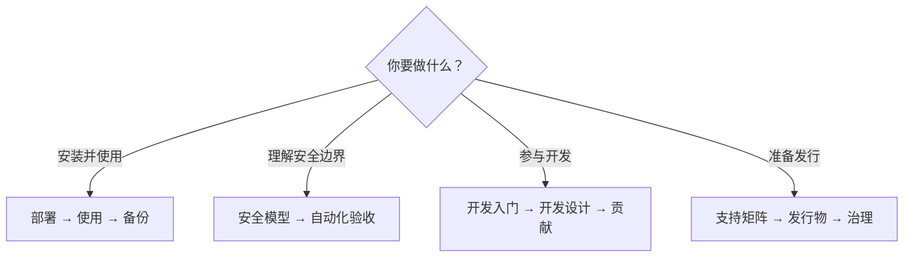

# SecretBridge 文档

[项目首页](../README.zh-CN.md) / 文档

这里按读者要完成的事情组织文档。`0.3.0-beta.2` 不支持覆盖旧版安装；请使用独立的空白数据目录与合成凭据评估。[Beta 发行包](https://github.com/qq940500529/secretbridge/releases)以发布页为准。

## 首先部署：把提示词交给本机 AI 助手

打开[AI 辅助部署：自动执行提示词](./getting-started/AI辅助部署.md#自动执行提示词)，复制提示词给能在当前电脑执行命令的 AI 助手。它会先复用健康的已有安装，再优先选择适配的发行包，最后接入当前 MCP 客户端。安装命令、客户端配置改动需要你确认；首次配对由程序打开浏览器完成，PIN 和恢复密钥由你本人设置与保存。

如果 AI 只能提供说明而不能操作电脑，改用[逐步指导提示词](./getting-started/AI辅助部署.md#逐步指导提示词)；不使用 AI 时再进入[人工安装与后台运行](./getting-started/安装与服务管理.md)。

## 安装与使用

| 任务 | 文档 |
|---|---|
| 首次部署 | [AI 辅助部署](./getting-started/AI辅助部署.md)（推荐） · [供 AI 读取的执行指南](./getting-started/自动化部署运行手册.md) · [安装与后台运行](./getting-started/安装与服务管理.md) |
| 了解日常流程 | [使用指南](./user-guide/使用指南.md) · [工作台说明](./user-guide/工作台.md) · [术语表](./user-guide/术语表.md) |
| 安全连续终端与实时状态 | [安全连续终端](./user-guide/连续终端.md) |
| 为 AI 客户端安装操作 Skill | [AI 操作 Skill 与 MCP 职责](./user-guide/AI客户端接入.md) |
| 迁移、备份和恢复 | [配置迁移与备份恢复](./user-guide/备份与恢复.md) |
| 参与真实环境测试 | [Beta 测试与反馈](./community/测试与反馈.md) · [社区验证待办](./community/社区验证待办.md) |
| 查看首次运行条款 | [最终用户许可与免责声明](./最终用户许可与免责声明.md) |

### 受控任务

| 类型 | 文档 |
|---|---|
| 本机固定程序 | [凭据命令任务](./user-guide/tasks/凭据命令任务.md) · [参数与授权](./user-guide/tasks/参数化任务与授权.md) |
| HTTP | [HTTP 凭据任务](./user-guide/tasks/HTTP凭据任务.md) |
| SSH | [SSH 凭据任务](./user-guide/tasks/SSH凭据任务.md) |
| Telnet 旧设备（默认关闭） | [Telnet 凭据任务](./user-guide/tasks/Telnet凭据任务.md) |
| SFTP 与 Git HTTPS | [文件传输与 Git 任务](./user-guide/tasks/文件传输与Git任务.md) |
| PostgreSQL 与 MySQL | [数据库凭据任务](./user-guide/tasks/数据库凭据任务.md) |

## 安全与验收

| 主题 | 文档 |
|---|---|
| 威胁模型与边界 | [安全模型与验收](./security/安全模型.md) |
| 凭据泄漏和原生凭据库回归 | [自动化安全验收](./testing/自动化安全验收.md) |
| 跨平台与界面 | [跨平台与 UI 规范](./development/跨平台与UI规范.md) |
| 支持范围与资源基线 | [支持矩阵与性能基线](./release/支持矩阵与性能基线.md) |
| 稳定性与故障注入 | [稳定性与故障注入验收](./testing/稳定性与故障注入.md) |
| AI 操作 Skill 的合成验收 | [AI 操作 Skill 验收](./testing/AI操作Skill验收.md) |
| PostgreSQL TLS 实机复现 | [PostgreSQL 实机验证](./testing/PostgreSQL实机验证.md) |

## 开发与维护

| 任务 | 文档 |
|---|---|
| 建立开发环境 | [开发者入门](./development/开发者入门.md) |
| 了解 CI 如何按变更选择检查 | [持续集成检查范围](./development/持续集成检查范围.md) |
| 理解模块与数据边界 | [开发设计](./development/架构设计.md) |
| 核对结构重构的公开契约 | [结构重构契约核对](./development/issue-133-architecture/契约核对.md) |
| 维护 Skill 与 MCP 契约 | [AI 操作 Skill 与 MCP 职责](./user-guide/AI客户端接入.md) |
| 验证发行包和 SBOM | [发行物验证与 SBOM](./release/发行物验证与SBOM.md) |
| 依赖漏洞和许可证 | [依赖漏洞与发行门槛](./release/依赖漏洞与发行门槛.md) · [依赖许可风险评估](./governance/依赖许可风险评估.md) |
| 版本与仓库治理 | [开源治理与发布](./governance/开源治理.md) · [路线图](../ROADMAP.md) |
| 贡献与权利边界 | [贡献指南](../CONTRIBUTING.md) · [贡献与再许可](./governance/贡献与再许可.md) · [许可说明](../LICENSING.md) |
| 开源版与企业版范围 | [版本边界](./开源版与企业版.md) |

## 文档约定

- 用户文档只描述当前可用行为；未来计划放入路线图或 Issue。
- 命令以仓库当前 `main` 和锁定工具版本为准，失败时不得通过关闭安全检查绕过。
- 测试数字、提交号和一次性验收结果写入 Issue／PR，不复制到长期说明中。
- 示例只使用合成值。日志、截图和问题报告不得包含凭据、私有地址或本机身份信息。
- 文档出现冲突时，以安全模型、当前代码和自动化测试为准，并提交 Issue 修正文档。

---

[项目首页](../README.zh-CN.md) · [路线图](../ROADMAP.md) · [安全报告](../SECURITY.md)
