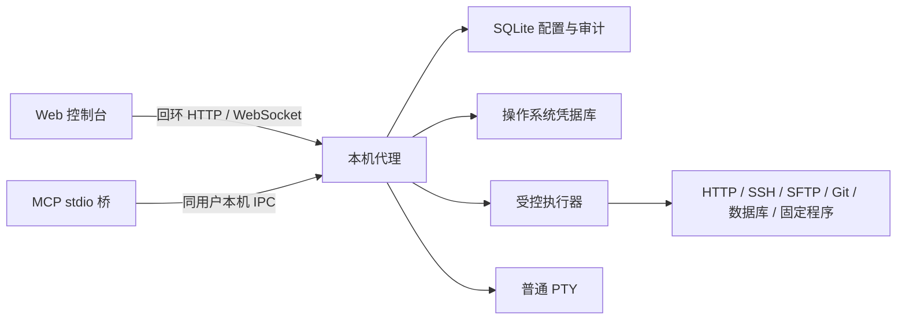

# 开发设计

[文档中心](../README.md) / 开发设计

本文说明仓库的当前模块归属和不可跨越的安全边界。此轮目录重构不承诺旧版二进制、安装布局或数据库格式兼容；对已安装实例的升级不属于这里描述的全新部署流程。

## 系统结构



代理拥有页面会话、配置目录、凭据库适配器、任务状态和终端进程。Web 与 MCP 只是客户端；关闭客户端不会自动停止代理或已有终端。

## 模块职责

| 位置 | 责任 |
|---|---|
| `backend/src/lib.rs` | 本机代理的共享状态与公开入口；装配仍在此处，避免把它误称为纯领域层 |
| `backend/src/adapters/http/` | HTTP 路由、页面会话、Origin 校验、WebSocket 与诊断端点 |
| `backend/src/adapters/mcp/` | MCP 工具、操作分发与工具错误；不实现本机帧传输 |
| `backend/src/adapters/native_ipc/` | 连接文档、鉴权、帧收发及平台端点；向 MCP 操作分发交付已验证的请求 |
| `backend/src/adapters/persistence/` | SQLite 对象、查询、事务及 schema；该目录目前仍包含部分业务规则 |
| `backend/src/adapters/executors/` | 固定程序、HTTP、SSH、SFTP、Git、数据库和 Telnet 执行器 |
| `backend/src/adapters/secrets/` | 原生凭据库与测试内存实现 |
| `backend/src/adapters/terminal/` | PTY 生命周期、游标、重连和输入租约 |
| `backend/src/application/` | 凭据写入协调、备份恢复、连接检查、通知、输出脱敏与运行状态 |
| `backend/src/domain/parameters.rs` | 不依赖 HTTP、SQLite 或执行器的参数类型与校验；存储边界将校验错误映射为目录错误 |
| `backend/src/runtime/` | 生命周期控制和启动诊断 |
| `backend/local-access/` | Windows ACL 与 Unix 文件/socket 私有权限 |
| `skills/secretbridge-operations/` | AI 操作方法与合成示例；不承担授权或凭据校验，详见 [职责归属](../user-guide/AI客户端接入.md) |
| `frontend/src/app/`、`features/`、`api/`、`shared/ui/` | 页面装配、业务工作区、按资源划分的请求客户端和复用控件 |

大型生产模块的测试位于同目录独立 `*_tests.rs` 文件；仓库检查限制 Rust 模块不超过 2,500 行、Markdown 不超过 240 行，避免重新堆积。

## 数据与版本

SQLite 保存非秘密配置、审批、运行、过滤后的结果、审计事件和对象版本。密码、令牌和私钥只保存于操作系统凭据库，API 只有写入、覆盖和删除，没有读取路由。

`backend/src/adapters/persistence/schema.rs` 是 schema 版本的唯一事实源，当前值为 24。此轮源码重构不承诺旧版数据库迁移；备份恢复仅在其声明支持的格式内使用，不能把旧版数据目录直接交给新版程序。

凭据变更跨越 SQLite 与原生凭据库，无法使用同一个事务。`CredentialService` 先抢占版本并把凭据标记为不可用，使并发写入和旧授权立即失败；原生写入成功后再发布可用状态。任何中间失败都不能留下“可执行但秘密状态未知”的记录。

## Web 与 IPC 边界

- HTTP 只接受回环地址；修改请求同时要求页面会话和精确 Origin。
- 启动令牌位于 URL fragment，只能配对一次；页面会话只持久化令牌摘要和到期时间，可撤销，并能在有效期内跨正常服务重启恢复。
- Web 静态资源随本地程序提供，不加载远程运行时代码。
- MCP 桥接使用带随机令牌的命名管道或 Unix socket；stdout 只写 JSON-RPC。
- 同用户 IPC 缩小可达面，但不是对同账号任意代码执行的强隔离。

## 凭据任务执行链

```text
validate fixed template and ordinary parameters
  -> verify current approval and object versions
  -> resolve opaque credential bindings in broker memory
  -> execute with timeout, cancellation and concurrency limits
  -> filter output before decoding or persistence
  -> store only bounded sanitized results and fixed events
  -> clear transient buffers and files
```

执行器不得通过字符串拼接调用系统 Shell，也不得把凭据写入 URL、命令历史、配置导出或审计。每种注入方式和协议都需要成功、拒绝、超时、取消、清理失败和回显测试。

## 安全连续终端

安全终端启动本机 Shell，支持断线重连、64 KiB 有界回放、字节游标、尺寸调整和单写入者租约。普通输入与获批凭据命令复用同一 PTY；凭据先加入会话级跨分片脱敏器，再通过临时材料注入，原始 PTY 字节不会直接进入 Web 或 MCP。代理退出后旧 PTY 不会伪装成已恢复。

AI 只能用 MCP 控制终端和读取脱敏游标，不得自动化 Web 控制台。动态命令以精确程序、逐项参数、连接 ID、终端 ID 和不透明凭据引用构成审批快照；用户自建模板是复用方式，不是执行前提。

## 错误与审计

外部接口只返回稳定、有限的错误类别，例如配置无效、未授权、版本冲突、凭据锁定／不可用、连接失败、超时、取消和服务中断。底层库错误、地址、路径、认证报文和凭据不得穿过接口或普通日志。

审计记录请求、审批决定、运行状态和固定结果类型，不保存秘密、完整认证输入或未过滤输出。

## 验证层次

1. Rust、Python 和 Web 单元／集成测试；
2. HTTP、WebSocket、MCP、本机 IPC 与真实 PTY 测试；
3. Chromium、Firefox 和 WebKit 生产构建工作流；
4. PostgreSQL、MySQL、SSH、SFTP、Git 和本机 HTTP 真实服务；
5. 三平台包生命周期、原生凭据库与重启恢复；
6. 许可证、漏洞、SBOM、确定性打包和发行门槛。

单元测试通过不能替代真实凭据库、桌面会话或重启证据。外部条件测试必须明确标注所需环境，不能静默跳过后宣称全部通过。

## 扩展检查表

- 新能力是否仍然没有取密接口？
- 目标、参数、授权和结果范围是否在执行前冻结？
- 失败、取消、重启和重复请求是否有确定状态？
- 所有秘密表示是否在持久化和返回前处理？
- 临时文件、子进程环境和连接是否有有界清理？
- 是否加入真实服务、浏览器、安装或平台验收，而不仅是模拟测试？
- 用户文档是否只说明当前行为，并给出清楚的限制和恢复方法？

---

[开发者入门](./开发者入门.md) · [安全模型](../security/安全模型.md) · [贡献指南](../../CONTRIBUTING.md)
