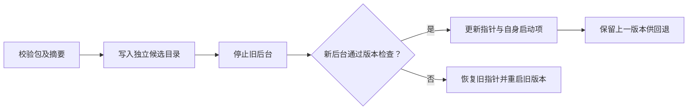

# 后台运行与安装交付

[文档中心](../README.md) / 后台运行与安装交付

SecretBridge 使用原生后台服务与浏览器管理端，不需要桌面壳。启动程序返回后，服务继续持有终端、任务和 SQLite；关闭浏览器或 MCP 客户端不会停止服务。

## 获取安装包

维护者可在 GitHub Actions 的 **Native packages** 工作流选择提交并手动构建，也可用 `v*` 标签触发。产物是 Windows ZIP、Linux/macOS tar.gz 和各自的 SHA-256 文件，按构建机器的原生架构命名。开源版采用未签名原生发行包，不等同于安装向导或应用商店软件；系统可能显示未知发布者或安全确认提示。首次从源码部署建议从 [AI 辅助部署](./AI辅助部署.md)开始；其中也包含不使用 AI 的完整命令。

当前 Beta 的最低系统验证目标是 Windows 11 x64、Ubuntu 24.04 x86_64、macOS 14 arm64；macOS Intel 与其他组合仍属实验性。构建成功只说明该 runner 上的包通过自动化检查，不证明目标最低桌面版本已通过。安装前核对当前 Release 页声明和[支持矩阵的证据台账](../release/支持矩阵与性能基线.md)；正式 1.0 发行前须对同一候选提交与发行包复核最低版本。相关社区实机待办见[社区验证待办](../community/社区验证待办.md)。

每包包含原生程序、Web 资源、包清单、CycloneDX 1.6 SBOM、项目许可、第三方许可正文和对应源码快照 `SOURCE.tar.gz`。`SOURCE.json` 记录构建基线、源码摘要、规范化时间和是否有未提交修改；正式打包拒绝脏工作区。不要只复制可执行文件，也不要把旧 Web 资源覆盖进新包。

## 避免重复安装

更换 AI 软件、模型或对话时，先复用当前用户已经安装的 SecretBridge，不要再次下载或创建另一份数据目录。按以下顺序检查：

1. 查看当前 AI 客户端已有 `secretbridge` MCP 项的 `command`，或检查 PATH 中的 `secretbridge`。
2. 如果没有候选命令，只查看当前平台的默认安装记录；不要递归扫描用户目录或其他磁盘。

| 平台 | 默认安装记录 |
| :--- | :--- |
| Windows | `%LOCALAPPDATA%\SecretBridge\application\installation.json` |
| Linux | `${XDG_DATA_HOME:-$HOME/.local/share}/secretbridge/application/installation.json` |
| macOS | `$HOME/Library/Application Support/SecretBridge/application/installation.json` |

安装记录只用于定位程序，不能手工修改。它的 `active` 必须是 `release-` 加 16 位十六进制字符；活动程序位于同一 `application` 目录下的 `releases/ACTIVE/bin/secretbridge`，Windows 文件名增加 `.exe`。用候选程序执行 `status`，结果中的 `installation.binary` 是当前活动程序的权威路径。已有安装健康且版本适用时直接复用；`running` 为 `false` 时用该活动程序执行 `start`，不需要重新安装。

如果已有配置表明使用了自定义 `SECRETBRIDGE_DATA_DIR` 或 `SECRETBRIDGE_INSTALL_DIR`，但路径未知，应询问用户提供原安装位置；不要在默认目录再装一份。新对话本身不是升级理由，升级必须说明版本差异并征得同意。共享诊断时不要复制安装记录中的个人路径。

## 安装和首次启动

解压到临时下载位置，保留此包用于维护和卸载。安装命令接收**整个解压后包目录**，复制到用户自己的安装目录并启动后台，不要求管理员权限。安装后运行同一启动程序即可打开浏览器。

安装前可先使用包内程序调用只读校验；命令不会启动服务、创建安装目录或修改配置：

```console
secretbridge verify-package 解压后的包目录
```

成功结果包含版本、平台、架构、schema、受清单管理的文件数量/字节数和 `CycloneDX 1.6` 标记。任何清单路径、文件长度、SHA-256、Web 构建版本、目标平台或 SBOM 元数据不匹配都会返回固定错误码并以非零状态退出。校验器不会执行待检查目录中的程序；原生程序版本在打包时核对，并在候选版本激活时再次执行核对。

### Windows / PowerShell

```powershell
.\bin\secretbridge.exe install (Get-Location).Path
```

### Linux / macOS

```bash
./bin/secretbridge install "$PWD"
```

不运行 `install` 也可以直接从解压包启动，此时没有版本管理和登录自启动配置。Windows 启动后台使用无窗口子进程；开发时调用命令本身仍可能显示所在终端。

全新安装成功后，`install` 会尝试在当前桌面打开本机管理页。成功 JSON 的 `management_page` 为 `opened`、`manual_open_required` 或 `not_requested`；无桌面、浏览器打开失败和 CI 环境会报告 `manual_open_required`，并返回 `management_page_next_action=run_active_binary_open_on_local_desktop`，安装与后台健康状态仍独立报告。此时请在运行 SecretBridge 的机器上进入交互式桌面，执行成功 JSON 中 `binary` 路径对应程序的 `open` 命令。复用已有安装或升级不强制打开页面；需要避免弹窗时可用 `install PACKAGE --no-open`。配对 URL 和令牌不会出现在安装 JSON 中。

## 日常控制

下面用 `secretbridge` 代表包内程序，Windows 对应 `bin/secretbridge.exe`。

| 命令 | 作用 |
| :--- | :--- |
| `start` 或无参数 | 启动或复用后台并打开管理页；首次初始化前为一次性配对页面，设置 PIN 后为普通登录页 |
| `start --no-open` | 启动后台，不打开浏览器 |
| `open` | 让已运行的后台打开管理页；首次初始化前生成新的配对链接，设置 PIN 后打开普通登录页 |
| `status` | 查询运行版本、服务地址、schema、终端及任务数量、安装状态 |
| `verify-package PACKAGE` | 只读校验已解压包、版本合同和 SBOM，不安装或启动 |
| `install PACKAGE [--no-open]` | 安装或复用包；新装默认尝试打开管理页，JSON 报告交接结果 |
| `stop` | 取消本机任务、关闭终端并停止后台；尚未到期的页面会话摘要会保留，便于重新启动后恢复当前标签页 |
| `--serve` | 前台运行服务，不自动打开浏览器，供开发调试 |
| `--mcp-stdio` | 启动 AI 客户端桥接，不启动另一份后台 |

“设置 → 后台服务”也提供带确认的停止入口。页面收到请求确认后转为离线；请求确认不代表系统进程已经完全退出，维护脚本应使用 `stop` 等待原生控制通道关闭。

> [!WARNING]
> 停止、升级、回退或卸载会结束当前终端和运行中任务。它们不会撤回已提交给远端的操作，也不会自动重放中断任务。请先完成需要保留的工作。

控制命令使用现有带认证的命名管道或 Unix socket，不根据保存的 PID 强制结束进程。PID 只用于显示和检查自己刚启动的子进程；配对令牌不返回命令行或 MCP。旧版本没有后台控制协议时，需要先手动停止旧后台。

## 接入 AI 客户端

`status` 的 `installation.binary` 和 `install` 成功 JSON 中的 `binary` 都会给出当前已安装版本的绝对程序路径。将它登记为 MCP stdio 服务；不要使用临时解压目录或源码构建目录中的程序：

```json
{
  "mcpServers": {
    "secretbridge": {
      "command": "/absolute/path/from-install-result/secretbridge",
      "args": ["--mcp-stdio"]
    }
  }
}
```

不同 AI 客户端的配置文件位置、字段外层和重载方式可能不同，应以该客户端当前说明为准。自动部署助手只有在能够可靠识别目标配置时才能修改，并须先展示配置路径、备份和最小差异；无法确定时应给出可粘贴片段，不得猜测路径或覆盖其他 MCP 服务。

如果安装时显式设置了 `SECRETBRIDGE_DATA_DIR`，MCP 服务也必须设置为完全相同的绝对路径。默认数据目录不需要额外 `env`。配置中不需要、也不得加入凭据、页面配对链接或内部桥接令牌。

保存配置后重载 AI 客户端，确认出现 `secretbridge_*` 工具，再调用只读的 `secretbridge_terminal_capabilities`。成功返回能力信息表示 stdio 桥接已通过本机 IPC 连接正在运行的代理；这一步不会创建凭据、审批或任务。MCP 可以申请受控操作，但不能读取秘密，也不能替用户批准请求。

每次升级或回退都会输出当前活动版本的 `binary`。更新 MCP `command`，重载客户端并重复只读验证。卸载前先从 AI 客户端移除该 MCP 项；否则客户端会继续尝试启动已经不存在的程序。

## 登录自启动

安装后由用户明确选择：

```console
secretbridge autostart on
secretbridge autostart off
```

| 系统 | 当前实现 | 生效时间 |
| :--- | :--- | :--- |
| Windows | 当前用户 Startup 文件夹快捷方式，调用隐藏 PowerShell 启动脚本 | 下一次登录 |
| Linux | 当前用户 XDG autostart `.desktop` 文件 | 下次进入兼容桌面会话 |
| macOS | 当前用户 `Library/LaunchAgents` plist | 下一次登录 |

这是**用户登录启动**，不是系统级常驻服务。Linux 无桌面服务器需自行使用受控服务管理器；本包不安装 systemd 系统单元。当前没有崩溃自动重启，也不会在手动停止后立即拉起。

安装记录保存自身创建的文件及摘要。用户修改过启动项后，程序拒绝覆盖或删除，并返回 `startup_file_changed`；请先备份并处理该文件。升级更新自身启动项，保存失败则恢复旧内容。程序不会要求系统登录密码。

Linux 文件遵循 [Desktop Application Autostart](https://specifications.freedesktop.org/autostart/latest/) 与 [Exec 引用规则](https://specifications.freedesktop.org/desktop-entry/latest/exec-variables.html)。macOS 生命周期参考 [Apple LaunchAgent 文档](https://developer.apple.com/library/archive/documentation/MacOSX/Conceptual/BPSystemStartup/Chapters/CreatingLaunchdJobs.html)。企业策略可能禁止脚本或自启动，请由使用者确认。

## 升级与回退

从新下载包的程序运行 `install 新包目录`。程序先校验平台、架构、schema 和每个文件的摘要，再将文件写入独立候选目录；校验通过后提交不可变版本目录，停止旧后台并启动候选版本。可执行文件、Web 元信息和运行时版本不一致时拒绝激活；成功后才更新安装指针和启动项。失败会恢复旧指针、旧启动项并重新启动原版本，恢复也失败时明确返回 `installation_recovery_failed`。



```console
secretbridge rollback
```

回退切换安装记录中的上一版本，不是恢复业务数据。当前开发版本使用 schema 24；此预发布功能不承诺与旧版 PIN/TOTP 身份验证配置兼容。旧程序不能打开新数据库，因此回退程序前必须恢复与旧版本匹配的独立备份。回退命令不会撤销数据库变更。恢复流程见[配置迁移与备份恢复](../user-guide/备份与恢复.md)。

若旧版本在一次失败升级后卸载，它可能因无法识别新包 schema 而保留已校验的新版本目录。新包安装器会在安装记录确实不存在时重建记录并复用与当前清单完全匹配的目录，同时保留其他未知文件；损坏的安装记录仍会失败关闭，不会被静默覆盖。

## 卸载和数据选择

请从保留的下载包执行卸载，特别是 Windows：正在执行的已安装程序可能被系统占用，不能可靠删除自身。

```console
secretbridge uninstall
secretbridge uninstall --remove-configuration
```

默认卸载保留 SQLite 配置、任务历史和系统凭据库条目。显式增加 `--remove-configuration` 会删除已识别的主数据库、WAL/SHM 和程序命名的迁移前 SQLite 快照；它不会递归删除数据目录，不删除用户备份或其他文件，**也不会删除系统凭据库条目**。如需彻底移除秘密值，请先在凭据页面清除对应值。

安装目录只移除清单登记的文件及空目录，未知文件保留。返回的 `unknown_files_retained` 告知是否有剩余文件；保留未知文件的目录不能直接作为新安装根，请人工处理后重装或选用另一个目录。卸载时文件仍被占用会返回错误，不宣称已经完成。

## 目录与环境变量

数据目录默认沿用操作系统应用数据位置，安装目录默认是数据目录下的 `application`。特殊部署可设置：

| 变量 | 用途 |
| :--- | :--- |
| `SECRETBRIDGE_DATA_DIR` | 绝对数据目录；启动程序、后台和 MCP 必须一致 |
| `SECRETBRIDGE_INSTALL_DIR` | 独立绝对安装目录；不能等于数据目录或驱动器根 |
| `SECRETBRIDGE_BIND` | 回环监听地址，默认 `127.0.0.1:8787` |
| `SECRETBRIDGE_WEB_ROOT` | 直接运行时的 Web 目录；安装后使用已校验版本资源 |

不要在安装后随意改变数据目录；安装记录与数据位置绑定。自启动记录仅保存这些普通运行参数，不保存业务密码、令牌或数据库认证信息。

Linux/macOS 的 Unix socket 有系统路径长度上限，数据目录不能任意深嵌套；遇到启动失败且使用了很长的自定义数据路径，请选择较短的绝对数据目录。默认应用数据目录按常规账号名称设计；人工验收仍需覆盖特殊用户名和路径。

## 开发构建和验收

构建环境需要 Rust、Node.js、pnpm、Python 3.11+。未附许可正文的 Rust 包会从其 `.cargo_vcs_info.json` 指定的 upstream commit 取回原许可证；优先使用已登录的 GitHub CLI，CI 使用只读 `GH_TOKEN`，没有 CLI 则使用 HTTPS。许可证不可获取时构建失败，不生成缺声明的发行包。

```bash
pnpm install --frozen-lockfile
pnpm build
cargo build --release --locked
python tools/release/package_release.py --binary target/release/secretbridge --output dist/packages
python tools/release/package_release.py --binary target/release/secretbridge --output dist/packages-second
python tools/release/verify_reproducible_packages.py dist/packages dist/packages-second
python tools/release/test_packaged_delivery.py dist/packages/secretbridge-VERSION-PLATFORM-ARCH.tar.gz
```

Windows 构建路径加 `.exe`，验收传入 `.zip`。`--allow-dirty` 仅用于本地调试，源码快照会标记脏状态，不可作为正式发行证明。使用新输出目录，不覆盖同名包。正式打包以 Git 提交时间规范化归档元数据，也可显式传入整数 `SOURCE_DATE_EPOCH`；同一源码、Web、原生程序和工具链输入必须生成逐字节相同的归档及摘要。

自动验收隔离 `HOME`、`APPDATA`、XDG、安装根和数据根，测试真实解包、后台启动、重复安装、摘要拒绝、失败恢复、升级/回退、启动项生成/移除、配置重开及两种卸载路径。它不写真实秘密值，不注册当前用户实际登录启动项。

macOS 开发机可以用一个汇总入口复用上述发行包生命周期、真实 zsh 终端和一次性 Apple Keychain 条目，并在本机 Chrome 中加载打包后 Web 资源。Web 工作流使用合成 API 夹具，只验证配对、导航和非敏感操作，不代表真实业务连接。Playwright 可以安装到仓库外的临时目录，不进入应用依赖：

```bash
npm install --prefix /tmp/secretbridge-playwright --ignore-scripts playwright@1.55.0
PLAYWRIGHT_MODULE=/tmp/secretbridge-playwright/node_modules/playwright \
PLAYWRIGHT_CHANNEL=chrome \
python tools/acceptance/test_macos_native_acceptance.py dist/packages/secretbridge-VERSION-macos-ARCH.tar.gz
```

脚本对输出中的仓库和家目录路径做占位符处理；退出时删除解包、浏览器夹具、隔离安装和测试数据。Keychain 测试自身在正常、删除后失败和模拟异常路径中都验证一次性条目不可读。

## 社区 Beta 实机验证

自动化检查不能代替不同硬件、桌面会话、凭据库和浏览器组合上的实机行为。剩余的广泛人工验证由 Beta 用户在自己的环境中完成；维护者汇总可复现证据，不要求普通用户搭建完整开发工具链。

1. 优先安装最新 Release 中与平台匹配的包，先核对 SHA-256 和包元数据。
2. 仅创建可立即删除的合成凭据，验证写入、覆盖、删除和不可用错误。
3. 验证配对、批准、拒绝、脱敏、审计、停止／启动、登录或整机重启恢复。
4. 有上一公开 Beta 时，先备份再验证升级和受支持的回滚；最后卸载并检查残留。
5. 通过 [Beta 问题表单](https://github.com/qq940500529/secretbridge/issues/new?template=bug_report.md)提交版本、平台、安装方式、脱敏步骤和清理结果。不要上传凭据值、私人地址、用户目录或业务数据；安全问题使用[私密报告](https://github.com/qq940500529/secretbridge/security/advisories/new)。

未签名包的系统提示、真实桌面辅助技术、注销／重启后的用户会话和本机凭据库交互仍必须依赖实机结果。CI 的进程重启不等同于整机重启或登录会话验证，用户未报告的平台组合不能表述为已经验证。
