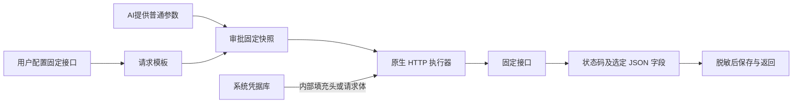

# HTTP 凭据任务

[文档中心](../../README.md) / [参数与授权](./参数化任务与授权.md) / HTTP 凭据任务

HTTP 任务由后台直接发起请求，不需要安装 curl、拼接 Shell 命令或把令牌交给智能助手。用户配置固定接口和认证插槽，智能助手填写允许的普通参数，审批通过后取得经过筛选和脱敏的结果。

## 配置与运行

1. 在“凭据”中保存接口令牌或密码。不要把秘密写入模板的固定文本。
2. 创建一个连接目标，用来组织相关任务。
3. 在“操作模板”中新建“凭据任务（程序 / HTTP）”，执行方式选择 HTTP / HTTPS。
4. 填写方法和固定 URL。URL 不接受账户、密码、查询串或片段；查询参数在独立表格中配置。
5. 添加认证插槽，绑定凭据引用；在请求头或 JSON 请求体中选择“凭据插槽”。Authorization 可设置前缀 `Bearer `，末尾包含一个空格。
6. 如需 AI 填写公司、数量等内容，在“普通参数”中声明其名称、类型与约束，再在请求字段中引用。普通参数不会被当作插槽递归替换。
7. 留空返回字段可仅取得状态码；需要业务信息时，添加输出名与 JSON Pointer，例如 `version` → `/data/version`。
8. 在审批中心确认具体请求、参数和授权方式，通过后在运行任务中执行。智能助手也可使用同一 MCP 请求审批、运行和读取输出。



## 字段来源

| 来源 | 请求头 | 查询参数 | JSON 请求体 | 行为 |
|---|---|---|---|---|
| 固定文本 | 支持 | 支持 | 支持 | 保持字符串，不自动展开占位符 |
| 普通参数 | 支持 | 支持 | 支持 | 头和查询转换为文本；请求体保持字符串、整数或布尔类型 |
| 凭据插槽 | 支持 | 不支持 | 支持 | 内部取密，可添加非秘密前缀，不向 AI 返回原文 |

每组最多 32 个字段、8 个凭据插槽、16 个普通参数、32 个返回字段。字段名不能重复；请求头按大小写不敏感检查。所有插槽必须被实际使用。Host、Content-Length、Transfer-Encoding、Connection、Accept-Encoding 和 Content-Type 由客户端管理，不能自定义；JSON 请求体自动使用 `application/json`。GET 和 HEAD 不配置请求体。

URL 固定到具体路径，不提供动态主机或路径参数；查询参数自动进行 URL 编码。当前请求体是顶层 JSON 对象，不提供嵌套模板、数组、上传、表单或任意原始请求体。

## 审批、重复与取消

HTTP 与本机程序共用现有的模板版本、凭据轮换失效、普通参数快照、单次或限时授权。更改接口、方法、返回字段或绑定凭据后，旧审批不能执行新配置。AI 不可以决定批准，也不可以在创建运行时传入新参数。

同一审批与幂等键重试只返回原运行；限时重复执行必须使用新的键。幂等仅覆盖本地请求去重，**不能保证远端接口“恰好执行一次”**。断线、超时或取消发生时，远端可能已完成写入；执行 POST、PUT、PATCH 或 DELETE 前，应了解服务端的幂等支持。不要看到失败就自动重复业务操作。

最多 4 个凭据任务并发。超时按模板时限和剩余授权期限中的较短值计算。取消停止本地等待及连接使用，不承诺撤销远端已发生的变更。

## 返回结果

默认接受所有 2xx 状态；可以明确指定最多 32 个 200–599 状态码。非接受状态只返回状态码与 `accepted:false`，不读取或返回错误响应正文。

未选择返回字段时，不收集正文。选择字段时，正文最大 256 KiB，必须是有效 JSON；JSON Pointer 采用 `/` 分隔，`~1` 表示 `/`、`~0` 表示 `~`。空 Pointer 明确选择整个 JSON 值，可能扩大输出范围，应谨慎使用。选定字段不存在时任务失败，不默默返回空值。

示例脱敏输出：

```json
{"kind":"http","status_code":200,"accepted":true,"fields":{"version":"1.2.3","echo":"[REDACTED]"}}
```

输出经过现有过滤器后才写入 SQLite 或返回 Web/MCP。筛选后的序列化结果也限制为 256 KiB，避免重复选择同一大字段放大输出。过滤器覆盖凭据原文、常见 JSON 转义和百分号编码等形式，不识别任意哈希、Base64、加密或自定义变形。如果所选内容中的数字或键名恰好匹配秘密，过滤后的文本可能不再是可解析的 JSON；输出接口返回的是脱敏文本，不承诺 JSON 结构始终保持。响应中未绑定的其他秘密不会自动被识别，应只选择必要字段。

HTTP 任务没有系统进程退出码，输出页的 `exit_code` 为 `null`；应结合运行状态、`status_code`、`accepted` 和 `error_code` 判断结果。错误只使用固定代码，不返回 reqwest 原始异常、响应头或响应正文。

| 错误代码 | 建议 |
|---|---|
| `connection_failed` | 检查服务地址、网络与 HTTPS 证书；不等于确认远端未执行 |
| `tls_configuration_failed` | 检查系统证书服务；不通过关闭验证解决 |
| `invalid_header` | 检查参数或凭据是否含换行等非法头值 |
| `invalid_json_response` | 接口未返回有效 JSON，可改为仅检查状态 |
| `response_field_missing` | 核对字段路径和接口版本 |
| `response_too_large` | 缩小服务端响应，或改为仅检查状态 |
| `response_read_failed` | 连接在读取时中断，先确认远端业务结果 |
| `timed_out` / `cancelled` | 本地等待已结束，远端变更不保证回滚 |

## 传输与边界

HTTPS 默认验证平台信任根和主机名；本功能不提供跳过验证或独立私有 CA 文件。企业私有 CA 需先进入操作系统的信任配置。HTTP 可用于可信本机测试，但没有网络加密，界面会提示风险。

不跟随重定向、不读取环境代理、不使用 Cookie 容器、不导出 TLS 会话密钥、不返回原始响应头。HTTP/2、压缩解码和系统代理 feature 未启用。认证材料仍会发送给用户确认的目标服务器，这正是凭据代用的用途，不是阻止服务器取得认证信息的机制。

为保持旧模板兼容，持久化仍使用 `operation:"command_execution"` 与 `command.http` 扩展；HTTP 模板的程序路径、工作目录、程序参数必须为空，插槽注入方式为 `protocol`。MCP 模板摘要新增 `execution_kind:"http"`，只包含插槽名称与注入方式，不返回绑定凭据 ID；运行操作标签仍兼容旧接口。SQLite 保持 schema v14，旧程序模板无需修改。

## 开发验收

真实本机 HTTP 服务覆盖认证头、密码请求体、URL 编码、整数与布尔参数、字段筛选、秘密回显、幂等重试、限时重复、重定向、错误正文、响应上限、非法 JSON、缺失字段、超时和取消；原生 MCP stdio／IPC 测试覆盖申请审批、用户确认、运行和游标读取。使用合成令牌，不访问业务账户。该验收不等同于所有外部服务或企业证书部署已经验证。
