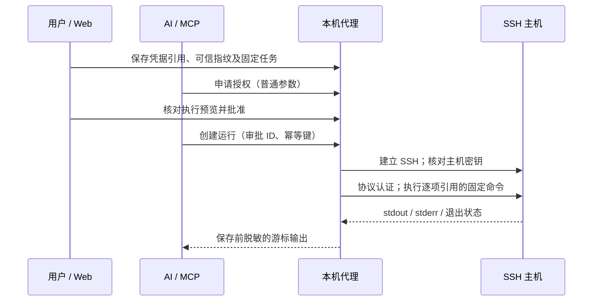

# SSH 凭据任务

[文档中心](../../README.md) / SSH 凭据任务

SSH 任务在后台代理内部连接远程主机，使用保存的密码或私钥认证。助手只能申请已登记的任务、等待用户授权并读取脱敏结果；不能指定新的认证目标或回读认证材料。

## 配置步骤

1. 在凭据页面新建密码或 SSH 密钥引用。密码通过掩码输入；私钥通过选择本机文件录入，保留换行，内容不在页面展示，点击保存后清空页面缓冲。单个秘密最多 8 KiB，系统凭据服务可能另有更小限制。加密私钥的解密口令使用另一个密码引用；不得填写在任务参数中。
2. 创建 SSH 主机目标，再创建“凭据任务”，执行方式选择“SSH”。目标用于归类；实际连接主机、端口和用户名固定在任务配置内。
3. 填写可信的 `SHA256:` 主机指纹。通过服务器控制台、管理员或其他可信渠道确认公钥指纹，例如管理员可在主机上运行 `ssh-keygen -lf /etc/ssh/ssh_host_ed25519_key.pub -E sha256`。网络扫描只能收集公钥，不能证明其可信；本产品不会自动接受首次连接。
4. 选择密码或私钥引用。当前支持 Ed25519 / ECDSA 私钥及相应主机密钥，不支持 RSA、DSA、主机证书或 SSH Agent。加密私钥可绑定独立口令引用。
5. 填写远程程序绝对路径、逐项参数和普通参数定义。远程环境必须支持 POSIX Shell；本机代理可运行于 Windows、Linux 或 macOS。Windows 原生 PowerShell/CMD SSH 服务不是当前远程命令格式的支持对象。
6. 保存模板，申请授权，在审批预览中确认主机、用户名、指纹、认证插槽与解析后的命令。批准后执行，在运行详情中持续读取 stdout / stderr。

当前没有连接器专用“自动探测并信任”按钮。主机指纹变更必须编辑模板并重新授权；不得为解决连接失败关闭校验。

## 参数和命令边界

| 配置项 | 来源 | 是否允许审批时改变 |
| :--- | :--- | :--- |
| 主机、端口、用户名、可信指纹 | 固定配置 | 否 |
| 密码、私钥、解密口令 | 协议凭据插槽 | 否；轮换后使关联模板授权失效 |
| 远程程序路径 | 固定绝对路径 | 否 |
| 远程程序的每个参数 | 固定值或已定义的普通参数 | 普通值在申请时确定，批准后冻结 |
| 连接超时 | 模板超时与授权剩余时间的较小值 | 否 |

SSH exec 协议传输的是一条字符串而不是 argv。代理对程序路径和每个参数分别进行 POSIX 单引号引用，保留空字符串、空格、换行、Unicode、单引号及字面量 `$(...)`，不递归展开插槽文本。认证秘密不会加入这条远程命令，也不会写入持久终端环境。

MCP 的一次性 `secretbridge_request_ssh` 可直接使用已登记的 SSH 连接、账号和密码凭据，无需先建任务模板或生成 AskPass。它接受远程程序绝对路径、逐项参数、可选的绝对工作目录、超时与人已核实的 SHA-256 主机指纹。工作目录只作为经过 POSIX 引号保护的 `cd` 参数，之后用 `exec` 运行目标程序；相对路径和控制字符会被拒绝。第一次连接时，先让用户通过可信渠道取得并核对指纹，再把核实值提交给申请；若主机密钥变化，现有指纹会在认证前被拒绝，须由用户调查并重新核对，不能自动接受新值。

示例：程序 `/usr/bin/printf`，固定参数 `%s`，第二个参数绑定普通参数 `message`。参数中的 Shell 符号作为该参数的字面值发送，不会由连接器插入新的命令。

仅登记可信程序。若主动配置 `/bin/sh -c` 并将普通参数用作脚本，脚本本身仍会解释其内容；逐项引用不把用户选择的脚本变成安全沙箱。当前不提供交互式密码提示、PTY、端口转发、文件传输、远程环境变量或远程持久终端。

## 输出、状态和取消

- stdout / stderr 在解码及保存前分别使用现有跨分片脱敏器，支持 UTF-8 分片；Web 与 MCP 读取同一份已过滤的游标输出。
- SSH 返回真实远程退出码：`0` 为成功，非零为失败；连接、认证、拒绝执行、信号退出或缺失退出状态不伪造退出码。
- 输出沿用每个分片最多 4096 UTF-8 字节、最多保留 64 分片和游标缺口提示。识别范围与[凭据命令任务](./凭据命令任务.md)相同，不承诺识别任意变换、跨 stdout/stderr 拼接或未知秘密。
- 取消、超时和本地结束会唤醒协议运输任务并关闭真实连接，不仅丢弃客户端句柄。断开不保证远程子进程终止，不保证业务操作撤回；不自动重连或重试命令。
- 单次或限时授权、模板版本、轮换失效、幂等键与并发限制沿用[参数化任务与授权](./参数化任务与授权.md)。幂等防止同一运行重复派发，不能保证远端业务恰好执行一次；结果不确定时先人工核对。
- 原生认证库内部可能产生短期缓冲副本，不能保证每个依赖内部副本立即清零。当前同用户进程权限边界不变，不隔离恶意程序或具有同用户权限的任意文件访问。
- 代理日志只接受应用自身的 target；即使配置全局 `RUST_LOG=trace`，第三方协议库原始日志也不会进入代理 stderr。排障使用固定任务错误代码，而不是开启未经脱敏的协议抓取日志。

固定失败输出为 `{"kind":"ssh","error_code":"…"}`，不附加上游异常或服务器错误正文。

| 代码 | 下一步 |
| :--- | :--- |
| `host_key_rejected` | 通过可信渠道核对主机公钥与算法；确认变更后编辑模板并重新授权 |
| `connection_failed` | 检查地址、端口、网络及支持的密钥交换/主机算法 |
| `authentication_failed` | 核对账户、凭据和服务器认证策略；不自动改用其他认证方式 |
| `invalid_private_key` | 核对私钥格式、算法和解密口令 |
| `channel_failed` / `command_rejected` | 检查服务器是否允许 session/exec，以及账号权限 |
| `exit_status_missing` / `invalid_exit_status` / `remote_signal` | 检查服务器执行记录；连接器没有可确认的正常进程结果 |
| `timed_out` / `cancelled` | 连接已关闭，先核对远程操作再决定是否重新申请运行 |
| `output_storage_failed` | 检查本机目录、数据库及磁盘状态 |

## 配置兼容与验证

配置增加可选 `command.ssh`，与 `command.http` 互斥，协议插槽仅用于认证。旧程序及 HTTP 配置仍可加载；SQLite schema 保持 v14。MCP 模板摘要的 `execution_kind` 为 `ssh`，运行的旧兼容标签仍为 `credential_command`，不能据此推定有本机子进程。

测试使用临时真实 TCP SSH 服务和运行时生成的密钥，不连接业务服务器、不提交私钥文件。覆盖密码、明文及加密私钥认证、指纹不符时认证未发生、参数引用、真实退出码、分片秘密与 UTF-8、失败、取消/超时后运输连接关闭、Web 配置—审批—执行—读输出、SQLite 重开与原生 MCP/IPC 游标读取。

SFTP 固定单文件上传／下载复用同一 SSH 认证与主机校验，但不执行远程 Shell；Git HTTPS 使用独立的令牌任务，详见[文件传输与 Git 任务](./文件传输与Git任务.md)。Git SSH 尚未实现。

---

[使用指南](../使用指南.md) · [功能路线图](../../../ROADMAP.md) · [开发设计](../../development/架构设计.md)
