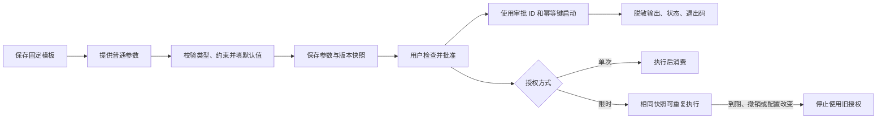

# 参数化任务与授权

[文档中心](../../README.md) / [凭据命令任务](./凭据命令任务.md) / 参数化任务与授权

常用任务可以保存固定程序、工作目录、参数顺序、普通参数定义和凭据插槽。每次申请只提供普通参数；批准后，参数值和模板版本固定下来。Web 与 MCP 使用同一条执行链，秘密仍只在代理内部注入。

## 从模板到运行



1. 在“执行策略”创建凭据命令任务，按[凭据命令任务](./凭据命令任务.md)配置程序与插槽。
2. 在“普通参数”添加参数名、显示名称、类型、是否必填、默认值、允许值和最大字符数。
3. 在程序参数的对应行填写完整的 `{{param:company}}`。凭据使用 `{{secret:password}}`，两种命名空间不同。
4. 在审批申请中填写本次参数，选择授权方式和有效期。未填写的字段使用模板默认值。
5. 批准前检查保存的参数快照和实际参数顺序。审批记录中的值不会随模板默认值变化。
6. 在“运行任务”启动并展开详情，查看参数、持续输出、退出码、耗时及失败后的处理建议。

普通参数必须是非秘密数据，会保存在 SQLite 并向 MCP 调用者返回。不要填写密码、令牌、私钥或包含秘密的完整连接串。

## 参数规则

| 配置 | 规则 |
|---|---|
| 名称 | 1—64 个 ASCII 字母、数字或下划线，以字母或下划线开头；同一模板不能重名 |
| 显示名称 | 非空，最多 80 个字符 |
| 文本 `string` | 按 Unicode 字符数校验，最多 2048 字符；单值最多 8192 UTF-8 字节，拒绝 NUL |
| 整数 `integer` | 严格整数，范围为 ±9007199254740991，保证浏览器与代理精确一致；不接受数字字符串或小数 |
| 是／否 `boolean` | JSON 布尔值 `true` 或 `false`；不接受字符串 `"true"` |
| 必填 | 没有输入或默认值时拒绝；必填文本也不能是空字符串 |
| 默认值 | 必须满足参数类型、枚举和长度约束；申请时一次性解析并保存 |
| 允许值 | 最多 32 项，类型必须一致；留空表示不限枚举 |
| 未填写的非必填字段 | 无默认值时分别使用空文本、整数 `0` 或 `false`；这些回退值也必须符合枚举 |
| 模板容量 | 最多 16 个普通参数；参数定义及解析后的参数值各最多 8 KiB JSON |
| 多余字段 | 拒绝未定义参数，不忽略拼写错误 |

每个占位符必须占据完整的一个程序参数，不支持 `--company={{param:company}}`。应写成两行：`--company` 和 `{{param:company}}`。值保持一个独立 argv 项，空值也不会删除或增加参数。普通参数值中的分号、空格或形如 `{{secret:password}}` 的文本不会被代理解释或再次展开。

这不是任意程序输入的安全保证：用户若明确配置 Shell、解释器或把参数交给会解释脚本的程序，目标程序仍可能执行该值。应配置可信程序及明确的参数语义。

## 授权方式

| 方式 | 执行次数 | 使用场景 |
|---|---|---|
| 每次确认 `every_run` | 每条审批最多一次；下一次执行要新建审批并确认 | 常规默认方式，每次审阅任务 |
| 仅当前一次 `once` | 只允许当前审批执行一次，不建立复用授权 | 明确表达一次性操作意图 |
| 有效期内允许 `time_window` | 到期前可用不同幂等键重复执行相同已确认快照 | 同一参数下重复检查或明确可重复的工作 |

前两种方式执行端同样遵守单次消费规则，不因名称不同而扩大权限。限时授权也不是允许 AI 自由修改参数的通行证。想更换参数，必须重新申请并获得用户批准。

有效期为 60—3600 秒。到期后的新运行被拒绝，正在执行的命令最长运行时间受剩余授权期限和模板超时共同限制。撤销会取消该审批关联的活动运行；程序终止和清理仍是尽力执行，不代表目标业务操作必然回滚。

上述表格规定**单条审批允许执行几次**；人还可以在[工作台的 AI 会话页](../工作台.md#ai-会话审批与通知)选择**后续申请如何获得审批**。默认每条申请都由人确认。“同样任务审批一次”只复用完全一致的已人工批准快照；“同一会话审批一次”会允许该会话的所有操作在固定一小时内自动获批，须在 Web 页面明确勾选高风险确认，且可随时撤销。MCP 无法设置这些策略。

更改模板、目标，或轮换／清除绑定凭据，会使旧授权无法启动新运行。单次执行失败、取消或超时后仍视为已消费，不自动重试。

## MCP 调用示例

先调用 `secretbridge_begin_conversation` 登记会话摘要并保存返回的会话 ID，再调用 `secretbridge_list_action_templates` 获取参数定义，最后使用 `secretbridge_request_approval`：

```json
{
  "action_template_id": "00000000-0000-0000-0000-000000000001",
  "conversation_id": "00000000-0000-0000-0000-000000000003",
  "expires_in_seconds": 300,
  "authorization_mode": "time_window",
  "parameters": { "company": "100" }
}
```

返回 `pending` 表示等待用户决定，不能立即执行；返回 `approved` 且 `preauthorized: true` 表示当前会话的人工预授权策略已生效，应向用户指出风险和范围。`secretbridge_get_approval` 返回状态、已解析普通参数和授权方式，但不返回秘密、理由或决定备注。

用户在 Web 批准后，调用 `secretbridge_create_run`：

```json
{
  "approval_id": "00000000-0000-0000-0000-000000000002",
  "idempotency_key": "company-100-check-001"
}
```

创建运行不再传入参数，因此不能在确认后替换任务内容。同一幂等键和审批 ID 总是返回同一运行；限时授权需要再次执行时使用新键。不能用换键的方式猜测一次网络超时是否执行成功，先查询已有记录。

Web页面在尚未收到启动确认时保留请求键，切换授权后回来重试也复用该键。收到确认后，下一次明确启动才生成新键。这项保留只在当前任务页面的内存中；刷新、离开页面或关闭浏览器后，先检查运行记录，不把新的点击当成旧请求的自动恢复。

启动后通过 `secretbridge_get_run`、`secretbridge_read_run_output` 和 `secretbridge_list_run_events` 查询结果。输出游标规则见[凭据命令任务](./凭据命令任务.md)。

## 升级与排错

schema v14 保存授权方式和普通参数快照，移除运行表对审批 ID 的全局唯一约束，改由事务内的授权规则控制消费。升级保留运行、幂等键、事件、退出码和已保存脱敏输出。已有审批保持单次模式。

- 参数被拒绝：检查类型、必填、默认值、枚举、长度和多余字段。
- 授权不可用：检查期限、撤销状态、是否已经消费，以及模板／目标／凭据是否变化。
- 程序失败或超时：先检查输出与目标实际状态，确认是否已有部分业务效果，再决定是否重新申请并执行。
- 清理失败：先检查本机目录权限和临时凭据文件，不直接重复任务。

代理不会自动重放中断的运行，也不宣称提供业务事务回滚或精确一次的外部系统操作。
