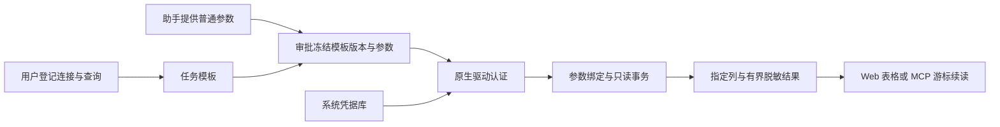

# 数据库凭据任务

[文档中心](../../README.md) / 数据库凭据任务

通过原生 PostgreSQL 或 MySQL 驱动执行登记的操作。密码只用于驱动认证，不进入 SQL、命令行、连接 URL、临时认证文件或终端；智能助手使用任务名称、普通参数和已批准的输出。

## 支持范围

| 操作 | 执行内容 | 返回内容 |
|---|---|---|
| 连接检查 | 在只读事务中执行固定 `SELECT 1` | `connection_ok` 一列 |
| 版本查询 | 在只读事务中执行固定 `SELECT version()` | `version` 一列 |
| 只读查询模板 | 用户登记一个 SELECT／WITH 查询，普通值使用驱动绑定 | 仅登记的列、行数、截断标记与清理状态 |

支持 PostgreSQL 14—17 与 MySQL 8.0/8.4；CI 分别在最低支持线和当前主线的真实容器上运行认证、TLS、只读查询、超时、取消和恢复回归。更新的同主版本通常可用，但在进入矩阵前属于兼容候选。MySQL 查询使用 `max_execution_time`；当前不宣称支持 MariaDB。连接器不捆绑数据库、客户端命令行程序或容器镜像，Docker 只用于一次性开发验收。



## 配置步骤

1. 在“凭据引用”中保存类型为“密码”的数据库认证凭据，建议使用专用只读账户。
2. 在“目标连接”中建立数据库类型的逻辑目标。该目标用于任务归属和审批版本；新连接器的实际连接字段保存在任务模板中，不从旧 PostgreSQL 检查配置自动继承。
3. 在“执行策略”中新建“凭据任务”，执行方式选择“数据库查询”。选择数据库类型、操作、主机、端口、数据库和用户名。
4. 选择已保存的密码引用及 TLS 方式；业务远端使用证书与主机名完整验证。
5. 对查询模板填写 SQL、允许返回的列和行数上限，在普通参数区登记相应类型、默认值和约束。
6. 申请审批，核对连接、SQL、参数、输出列和行数后批准。Web 与 MCP 均可执行同一模板，并从运行历史查看结果。

模板修改、关联密码轮换和目标版本变化会使旧授权失效。单次及限时相同参数授权、幂等去重、四任务并发上限、超时、撤销和取消沿用现有执行底座。服务重启会标记中断，不自动再次查询。

## SQL 与普通参数

SQL 不带末尾分号。普通值使用 **未加引号的** `{{param:名称}}`，不能以参数代替表名、列名、排序表达式或 SQL 片段。

PostgreSQL 示例：

```sql
SELECT item_code, amount, updated_at
FROM public.item_prices
WHERE company_code = {{param:company}}
  AND enabled = {{param:enabled}}
ORDER BY updated_at DESC
```

MySQL 示例：

```sql
SELECT item_code, amount, updated_at
FROM item_prices
WHERE company_code = {{param:company}}
  AND item_code LIKE {{param:pattern}}
ORDER BY updated_at DESC
```

分别登记文本参数 `company`、布尔参数 `enabled` 或文本参数 `pattern`；LIKE 的 `%` 由普通值显式提供。整数以 i64、布尔以原生布尔／整数值、文本以文本绑定。PostgreSQL 文本参数固定为 `TEXT`，比较日期、UUID 或其他类型时应在 SQL 中显式 `CAST({{param:date}} AS date)`。可选参数缺省值沿用普通任务规则：文本为空串、整数为 0、布尔为 false；不隐式改为数据库 NULL。

每个已登记参数必须实际使用，允许重复引用；最多 16 个参数定义、64 次占位引用。原生 `$1`／`?` 占位符和多语句不接受。扫描器不替换字符串、引号标识符、注释或 PostgreSQL dollar-quoted 字符串内的内容；引号内采用 SQL 双写转义，不支持反斜线转义，也不接受 MySQL 可执行／提示注释。

执行器将查询封装为派生 SELECT，显式投影输出列并追加结果上限。SQL 长度上限 16 KiB，只接受可作为派生 SELECT 执行的查询。应为表达式设置清晰且唯一的别名；不保证所有数据库特有 SELECT 语法均可封装。

## 结果与精度

查询必须显式登记 1—32 个输出列；其他列不会加入执行器返回的结果。列名由驱动侧固定 SQL 标识符引用，不直接拼入未转义 SQL。

- 行数上限可配置 1—1000；读取额外一行以判断是否达到上限。
- 已过滤行数据受约 192 KiB 输出预算限制，预留字段与摘要空间；达到预算时返回已完成行并设置 `truncated:true`。
- 达到预算时不等待排空剩余结果或完整回滚响应，而是保留已完成行并取消、关闭本次只读连接，避免把有效截断结果变成超时。
- 单个超大行、不可转换结果或非 UTF-8 MySQL 字节数据返回固定错误代码，不偷偷丢弃单元格。MySQL 协议包限制为 256 KiB；PostgreSQL 单行 JSON 文本也检查 256 KiB 上限。这些是结果预算，不是远端工作量或进程内存沙箱。
- 单元格统一为**文本或 NULL**，避免浏览器解析时丢失长整数和高精度小数。PostgreSQL 使用数据库文本转换；MySQL DECIMAL 以驱动返回的文本保留，浮点值保持自身浮点语义，不承诺十进制精度。
- Web 使用表格展示，NULL 与空字符串区分；MCP 仍使用现有游标增量读取 JSON，不增加任意 SQL 执行接口。数据库任务没有进程退出码。

```json
{
  "kind": "database",
  "engine": "postgres",
  "operation": "query",
  "columns": ["item_code", "amount"],
  "rows": [["ITEM-001", "12345678901234567890.123456"]],
  "row_count": 1,
  "truncated": false,
  "cleanup_ok": true
}
```

过滤在 JSON 编码及 SQLite 保存前执行，能处理包含引号的认证密码回显。已知密码的原文会被替换为 `[REDACTED]`；任意编码、散列或业务系统变换不在识别保证内。输出列筛选和密码过滤不等于业务数据脱敏，请核对数据是否可向助手释放。

## TLS 与私有 CA

默认 `verify_full`：验证证书链与主机名，不能通过界面关闭远端验证。每个模板可指定一个绝对路径的私有 CA 文件；必须为非符号链接普通文件，大小 1—64 KiB。CA 不是认证秘密，但路径和文件应由可信用户维护。CA 文件内容的外部变化目前不会自动推动模板版本。

PostgreSQL 默认使用操作系统平台信任根，指定私有 CA 时采用显式 CA 配置。MySQL 使用驱动的 WebPKI/Mozilla 信任根，私有 CA 作为补充信任根；不会自动继承 Windows 或企业系统信任库，因此企业 MySQL 私有证书应显式配置 CA。两者均保留主机名验证。

`loopback_plaintext` 只允许数值回环地址，例如 `127.0.0.1` 或 `::1`，不允许 DNS 名 `localhost`、私有 CA 或业务远端。它用于本机开发数据库，不是远端 TLS 降级开关。

旧 `postgres_connection_check` 内置操作仍兼容原来的目标配置和进程级 `SECRETBRIDGE_POSTGRES_CA_CERT`。新数据库任务使用自身模板的 CA 字段，不继承该进程级设置。

## 超时、取消与失败

本机截止时间覆盖连接、认证、查询与事务回滚。另设 PostgreSQL 事务级 `statement_timeout` 或 MySQL 会话级 `max_execution_time`；部分 MySQL 函数等不适用服务器语句限时，仍由本机截止时间处理。

任务完成、失败或中断后尝试清理，最多额外约 2 秒。PostgreSQL 中断使用原生 CancelRequest 并终止连接驱动任务；MySQL 通过相同账户建立短期连接，按任务自身的连接 ID 请求 `KILL CONNECTION`，随后关闭原连接。不会终止其他用户或任意编号的会话。数据库可能拒绝取消请求或延迟停止工作，`cleanup_ok:false` 提醒核查数据库端会话；它不是所有远端工作已回滚的证明。

| 错误代码 | 建议 |
|---|---|
| `credential_unavailable` | 在本机重新保存或绑定密码 |
| `connection_failed` | 核对地址、端口、权限、认证、证书及服务可用性 |
| `tls_configuration_failed` | 检查 CA 路径、文件类型、大小及证书格式 |
| `read_only_transaction_failed` | 核对数据库版本与事务支持 |
| `query_failed` | 检查 SQL、参数显式转换、返回别名、账户权限及只读限制 |
| `result_too_large` | 减少返回列或字段长度，不仅减少行数 |
| `unsupported_binary_result` | 在 SQL 中明确转换为所需文本，勿返回认证材料 |
| `timed_out`／`cancelled` | 核查任务状态和数据库会话后再决定重试 |

不会向 Web、MCP、审计或普通日志返回原始驱动异常文本。只读事务可以阻止已测试的普通表写入，包括查询函数内的写入；但**可信用户登记的 SQL 与最小权限账户仍是前提**。只读事务不等于函数、扩展、外部网络、文件或临时对象的沙箱，也不允许将含秘密的 SQL 常量登记进模板。

## 开发验收

真实协议测试覆盖两种数据库的认证、连接／版本、类型绑定、恶意形状普通值、所选字段、精度、NULL、行数截断、错误认证、缺失列、函数写入拒绝、超时、API 取消、私有 CA 成功、未信任 CA／主机名拒绝、Web 和原生 MCP/IPC。

Linux 或安装 Docker 的开发机可执行：

```sh
bash tools/acceptance/test_database_connectors.sh
```

脚本建立唯一命名、仅回环映射的临时 PostgreSQL/MySQL 容器、合成密码与两天有效期的测试证书，结束时删除自身容器和证书目录。不操作业务实例。默认使用 PostgreSQL 17 与 MySQL 8.4；可通过 `SECRETBRIDGE_TEST_PG_IMAGE` 和 `SECRETBRIDGE_TEST_MYSQL_IMAGE` 选择 CI 矩阵镜像。CI 覆盖 PostgreSQL 14/MySQL 8.0 和 PostgreSQL 17/MySQL 8.4；常规三平台回归默认跳过需要这些真实服务的测试。

Windows 原生服务也可验证，显式准备空测试数据库 `secretbridge`、同名账户及测试代码中的合成密码，设置 `SECRETBRIDGE_TEST_PG_PORT`、`SECRETBRIDGE_TEST_MYSQL_PORT` 和 `SECRETBRIDGE_TEST_DB_CA`。MySQL 函数写入拒绝测试需在临时实例开启 `log_bin_trust_function_creators`；不要在业务实例更改此选项。

当前不包含自由 SQL 控制台、数据库持久会话、跨查询事务、写入模板、Oracle/SQL Server、数据库浏览器、分页续查、结果导出或 SSH 数据库隧道。

---

[参数化任务与授权](./参数化任务与授权.md) · [路线图](../../../ROADMAP.md)
