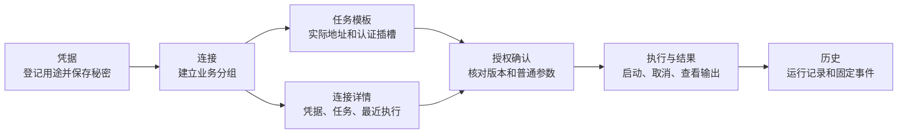

# 工作台使用说明

[文档中心](../README.md) / 工作台

秘桥将日常操作组织为六个入口。列表负责查找和选择，右侧详情负责查看状态与下一步操作；新增与编辑在独立弹窗完成，不挤占列表空间。窄屏改为上下主从布局，手机宽度使用底部导航。

## 从配置到结果

| 入口 | 内容 | 常用操作 |
|---|---|---|
| 凭据 | 名称、用途、类型和配置状态 | 新建引用、写入或替换秘密、清除秘密、编辑元数据 |
| 连接 | 业务用途分组、环境和关联凭据 | 新建连接、查看关联任务、申请授权、查看最近五次执行 |
| 任务 | 侧边栏二级入口：任务模板、授权与确认、执行与结果 | 可直接打开各页，配置连接器、普通参数和凭据插槽，人工批准并执行 |
| 终端 | 持久系统 Shell 会话 | 创建、连接、重连、输入、调整大小、终止 |
| 历史 | 执行历史、事件记录、AI 会话 | 搜索运行、按会话 ID 查看摘要及任务、设置该会话的审批要求；历史入口不提供新增运行按钮 |
| 设置 | 服务状态、存储方式、审批通知、浏览器身份验证、数据维护 | 切换语言与通知渠道、查看当前 PIN/TOTP 状态、更换或停用验证方式、解除配对、配置迁移、备份预检与诊断下载 |

> [!NOTE]
> “连接”是现有接口中 `Target` 的界面名称。它用于组织业务用途，不是自动继承地址的连接配置文件。HTTP、SSH、SFTP、Git、数据库任务的实际地址和身份仍在各自模板中配置；连接详情同时展示分组关联凭据和任务插槽真正使用的凭据。不要仅凭分组名称批准任务。

## 完成一次凭据任务

1. 使用后台服务提供的一次性配对链接打开控制台。令牌随初始化从地址栏移除；浏览器只在当前标签页的 `sessionStorage` 保存页面令牌，代理只在 SQLite 中保存不可逆摘要和到期时间。有效会话可跨正常服务重启恢复，但不会进入配置导出或 SQLite 备份。
2. 进入 **凭据**，新建引用，填写名称、类型及可选用途。保存后，在该引用详情输入密码、令牌或私钥并保存。成功后输入框清空，页面只显示配置状态，不回读原值。
3. 进入 **连接**，新建业务分组并选择环境、可选关联凭据。数据库分组可以留空 PostgreSQL 主机字段；这些可选字段仅用于旧内置 PostgreSQL 连接检查，不用于 MySQL 或新查询模板。
4. 在连接详情点击 **新建任务**，进入任务模板并点击新建按钮。连接分组自动选中；选择“凭据任务”和执行方式，填写实际地址、认证引用、普通参数、返回字段与超时。保存后可在主从详情中审阅配置。
5. 点击 **申请授权**，确认所选模板、参数、授权方式和有效期。待审批请求会在已配对管理页弹出；弹窗显示待处理总数，按申请时间从早到晚逐项审查，批准或拒绝一项后自动显示下一项。点击“稍后处理”会收起当前队列；侧边栏 **任务 → 授权与确认** 保留全部审批记录和操作入口。默认每项都由人批准；若人在历史中的 AI 会话页事先授予复用策略，符合该会话策略的后续申请可自动获批。
6. 在侧边栏点击 **任务 → 执行与结果**，新建运行请求并选择可用授权。过期和不属于当前任务的授权不会列入可选项；限时授权仅复用已确认的同一组参数。启动后自动展开该次运行，显示输出和固定事件。
7. 执行完成后在连接详情或历史中回查结果。连接详情保留最近五次运行入口；历史搜索可查询服务返回的运行记录，输出仍遵循后端有界保留窗口。

AI 通过 MCP 提交的一次性命令只产生供本次审批和审计使用的草稿，不进入任务模板目录或配置导出。若确实需要复用，可在审批详情点击“显式保存为模板”；保存命令、普通参数和凭据引用，但不保存临时终端 ID，后续仍需重新申请授权。旧测试数据中绑定了临时终端的已保存模板会自动停用；在任务模板页点击编辑，核对命令和凭据槽位，按需启用并保存以解除绑定。配置导出会去掉这类终端 ID，并将对应模板标记为停用，避免导入后误用旧终端引用。

页面初始化、刷新以及更换验证方式后，设置页会重新读取本机 PIN/TOTP 配置状态；读取失败会显示可重试错误，不会把未知状态当成未配置。更换或停用已有验证方式需要在页面再次确认，停用 TOTP 会记录不含验证码的固定事件。

## AI 会话审批与通知

AI 客户端应在每段新对话开始时调用 `secretbridge_begin_conversation`，登记不含秘密的简短摘要，并在后续申请中传入返回的会话 ID。未传入 ID 的旧客户端仍可申请，但每次申请会形成独立会话，无法享受同会话复用。**历史 → AI 会话** 汇总会话 ID、摘要、申请、审批状态及关联执行。

会话审批要求由已配对的人在管理页设置，AI 的 MCP 工具不能修改：

| 要求 | 后续申请 |
|---|---|
| 逐个任务审批（默认） | 每条申请进入待审批队列 |
| 同样任务审批一次 | 人已批准的同一模板版本、目标版本、操作、结果范围、超时、命令配置和解析后参数，在固定一小时窗口内可复用；不同内容重新审批 |
| 同一会话审批一次 | 人勾选高风险确认后，**此 AI 会话内任何后续操作**在固定一小时内均可直接获批，包含授予时已有的待审批项；不逐一限制目标或操作。页面始终显示醒目的高风险标识，可随时切回逐项审批并撤销尚有效的预授权 |

预授权不会绕过模板/目标/凭据版本校验、执行权限、超时、输出过滤或单次消费规则；创建运行时仍重新检查策略。全会话授权到期后新申请恢复人工审批。请只在完全信任当前 AI 会话时启用全操作授权。

页内审批弹窗始终显示，不受通知渠道选择影响。**设置 → 审批通知渠道**控制额外提醒：浏览器通知使用浏览器 `Notification` 接口，点击可返回管理页，但需要页面保持打开和浏览器授权；系统级通知由本机后台调用操作系统通知接口，页面关闭后仍可提醒，但需服务运行和系统允许通知。两者都只显示通用待审批提示，不写入目标、命令、账号或凭据。通知被拦截时仍可在页内弹窗和授权记录中处理申请。

历史中的“事件记录”可用审批 ID 关联身份验证事件与运行事件。固定安全事件支持按来源、类别、时间、运行结果、失败错误码、连接和任务筛选，并导出 JSON、JSONL 或 CSV。三种导出格式均使用版本 2：包含筛选条件、获取到的记录数和 `truncation: unknown`；不能把记录数当成服务端完整历史的证明。JSONL 第一行是 `metadata`，其后每行是 `event`；CSV 第一行是以 `# ` 开头的同一元数据 JSON，其后为固定列。导出不含凭据值、验证码、命令输出或参数，但操作时间和关联标识可能属于个人信息，分享前请预览。

各执行方式的限制见[凭据命令任务](./tasks/凭据命令任务.md)、[HTTP 凭据任务](./tasks/HTTP凭据任务.md)、[SSH 凭据任务](./tasks/SSH凭据任务.md)、[Telnet 凭据任务](./tasks/Telnet凭据任务.md)、[文件传输与 Git 任务](./tasks/文件传输与Git任务.md)、[数据库凭据任务](./tasks/数据库凭据任务.md)。本机命令可在安全连续终端中运行；AI 只能提交凭据占位符并等待用户审批，不能读取秘密或原始 PTY。

## 查找、编辑与键盘

- 主从列表支持按名称及类型、环境或状态说明搜索；没有匹配记录时明确提示，不保留误导性的旧详情。
- 搜索不修改数据。删除当前记录后自动展示另一可见记录；清空搜索恢复完整列表。
- 新建、编辑、授权和启动运行使用从右侧向左滑入的抽屉。抽屉仍由浏览器原生模态 `dialog` 承载：打开时焦点进入抽屉，`Tab` 和 `Shift+Tab` 留在其中；`Esc` 或关闭按钮退出，焦点返回触发位置。窄屏时抽屉占满可用宽度，减少动态偏好下取消非必要滑动。
- 提交进行中禁止关闭弹窗，避免误以为请求已经取消。成功后关闭；可重试的保存失败保留输入，并在弹窗内显示错误。
- 中英文切换位于页面顶部；在手机宽度底部图标通过可访问名称标识入口。窄屏详情上下排列，长名称换行，不以页面级隐藏溢出代替可访问布局。
- 浏览器合成验收还会在 3840px 与 1440px 宽度、200% 缩放下展开审批审查区并检查页面溢出；长命令逐字节显示由组件测试覆盖。该自动检查不能替代真实 Windows 4K 显示器和屏幕阅读器验收。
- 待审批弹窗使用浏览器原生模态对话框；“稍后处理”只关闭提示，不改变审批状态。有新申请时会再弹出，顶部“待审批”按钮可随时重新打开。操作或目标快照缺失、版本变化、停用或终端不可用时，弹窗和授权记录均隐藏当前配置的误导性详情、禁止批准，并提示拒绝后重新申请。

## 出错时

| 情况 | 处理方式 |
|---|---|
| 未配对或配对失败 | 确认后台在线，获取新的配对链接；刷新已消费链接不能恢复一次性令牌 |
| 保存失败 | 在弹窗内检查错误和字段，直接重试；不要重新创建同一记录 |
| 版本冲突 | 页面刷新该类记录，按最新版本重新编辑；旧版本不能覆盖最新状态 |
| 关联信息读取失败 | 在连接详情点击重试；不把加载失败误报为没有任务或没有执行 |
| 运行提交结果不确定 | 先查运行记录；再次提交同一授权复用既有请求键，避免重复执行业务操作 |
| 输出读取失败 | 页面自动重试；输出保留窗口之外的内容不能由界面恢复 |
| 不再使用页面 | 在设置中解除当前页面配对，仅撤销该页面会话；它不是停止后台服务或终止终端的按钮 |
| 迁移或恢复配置 | 在设置中先预检再确认追加导入；完整恢复使用全新目录维护命令，重新录入秘密值与授权，见[配置迁移与备份恢复](./备份与恢复.md) |

## 设计与验证依据

编辑抽屉采用原生 `dialog.showModal()`，遵循 [WAI-ARIA 模态弹窗模式](https://www.w3.org/WAI/ARIA/apg/patterns/dialog-modal/) 的焦点及退出约定。列表、搜索和主操作分离，参考 [Carbon 数据表使用规范](https://v10.carbondesignsystem.com/components/data-table/usage/) 的操作组织方式；这里是主从工作区，并未引入 Carbon 组件依赖。

无窗口浏览器脚本覆盖完整模拟 API 流程、保存失败重试、焦点返回、搜索、中英文及 720/390/320 像素逻辑宽度。720 像素可检查 1440 像素屏幕在 200% 缩放下类似的布局空间，但不等同于所有浏览器原生缩放实测。真实平台字号、输入法、屏幕阅读器和非开发者可用性观察仍列入发布前体验验收；不宣称已取得可访问性认证。

首次初始化要求设置 PIN，并询问是否绑定身份验证器。更换 PIN 或绑定、更换、解绑身份验证器，均须重新输入当前 PIN；TOTP 的变更不删除 PIN。读取身份验证配置失败时，页面显示错误和重试，不会当作未配置。运行详情可下载保留窗口内的脱敏输出或含时间戳的 JSON 记录；若超过窗口，页面会提示较早内容已截断。运行结束后可删除保留输出，运行状态和安全事件仍保留。
