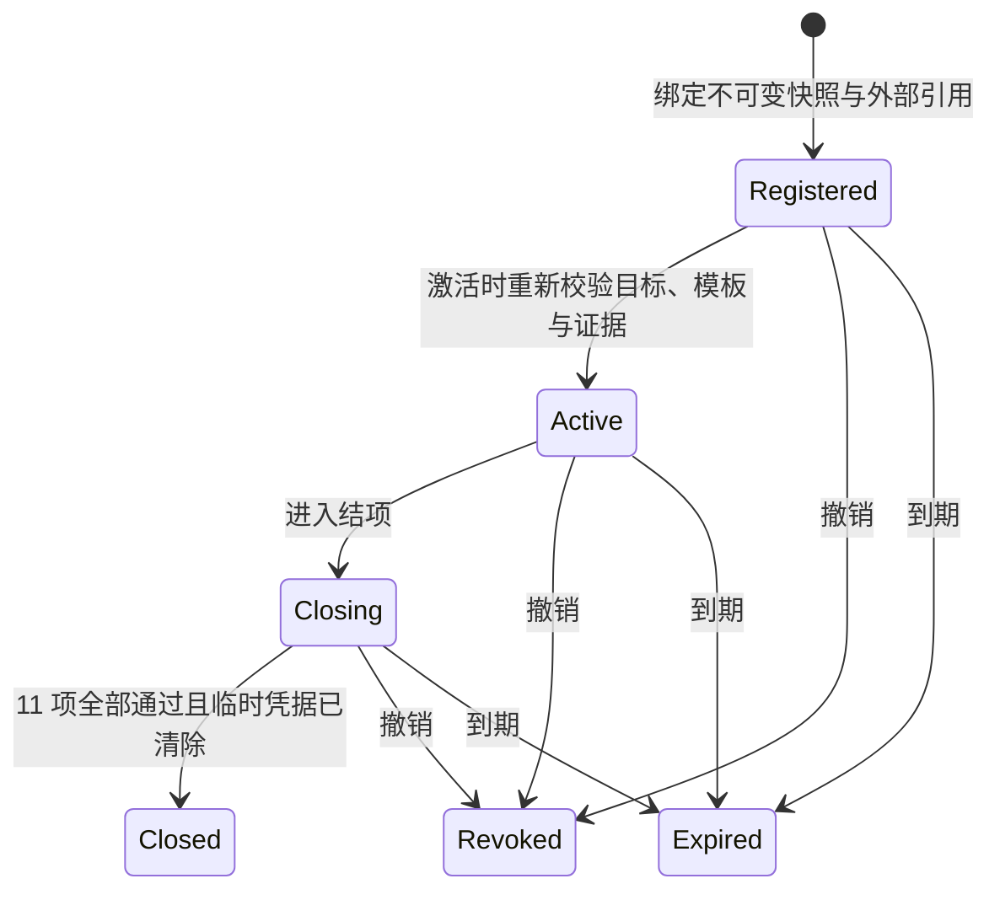

# 低权限试点工作台

[项目首页](../README.zh-CN.md) / [文档中心](README.md) / 低权限试点工作台

低权限试点工作台把一次获批、限时、非生产 PostgreSQL 试点需要的技术快照、外部引用、验证矩阵和结项条件固化为可追踪记录。它是治理与留证工具，不是远端执行器：登记、填写证据或导出报告都不会自动连接数据库。

> [!CAUTION]
> 操作人员填写的授权编号、最小权限复核编号、证据编号和复核人编号只是外部材料的引用。SecretBridge 不验证引用背后的签发人、内容或有效性，也不将其描述为已获授权、已验证权限或执行成功。

## 使用前提

登记入口只接受同时满足以下条件的现有对象：

1. 目标为 `test` 环境的数据库，并具有完整的 PostgreSQL `verify_full` 配置；
2. 目标关联密码型凭据，凭据状态为 `available`；
3. 模板已启用，只执行固定 `postgres_connection_check`，结果范围为 `status_only`；
4. 准入快照摘要有效、至少有一个技术就绪目标且没有失败项；
5. 平台证据摘要有效且状态不为 `blocked`；
6. 已取得可追溯的目标方授权编号和最小权限复核编号；
7. 有效期为 1 至 168 小时。

准入或平台状态为 `attention` 时仍可登记，是因为当前产品不能替外部责任人作出结论。引用必须在组织自己的工单、文档或审批系统中真实存在并可独立核对。

## 操作流程

激活时会重新读取目标与模板。如果任一对象被修改、禁用、删除，或证据摘要被篡改，激活失败。试点激活后才能填写场景结果；每次更新场景均要求当前版本，陈旧页面不能覆盖较新的记录。

进入结项不会隐藏未完成项。只有 11 项全部标为 `passed`，并且关联的临时凭据在“凭据”页清除后，结项按钮才可用，服务端也会再次强制校验。`not_applicable` 可用于保留调查过程，但不能满足结项门槛。

## 固定验证矩阵

| 顺序 | 场景代码 | 需要证明的行为 |
|---:|---|---|
| 1 | `connection_success` | 获批的固定连接检查成功 |
| 2 | `authentication_rejected` | 无效或已撤销凭据以固定安全状态失败 |
| 3 | `connection_timeout` | 连接超时有界且可观察 |
| 4 | `dns_failure` | DNS 失败不暴露解析细节 |
| 5 | `tls_untrusted_certificate` | 不受信证书被拒绝且不泄露原始错误 |
| 6 | `tls_hostname_mismatch` | 证书主机名不匹配被拒绝 |
| 7 | `network_unreachable` | 网络中断得到有界固定结果 |
| 8 | `credential_rotation` | 凭据轮换使旧授权失效 |
| 9 | `approval_revocation` | 授权撤销会停止排队或活动工作 |
| 10 | `service_restart_unknown_result` | 服务重启保留明确的未知或中断结果 |
| 11 | `credential_revoked_on_close` | 临时试点凭据在结项前清除 |

结果只能为 `not_run`、`passed`、`failed` 或 `not_applicable`。除 `not_run` 外，证据编号与复核人编号必填。引用最长 96 个字符，只允许 ASCII 字母、数字和 `-_.:/#`，避免把描述性内容、秘密或原始错误复制到治理库。

## 工作台布局

- 顶部按需展开登记区，缺少前置项时明确提示应返回哪个模块补齐；
- 左侧按到期时间和状态连续列出试点记录；
- 右侧只展示当前记录，顶部集中显示对象、授权、期限和状态操作；
- 验证矩阵使用单一表格逐行填写证据，不将新增、状态和列表堆成卡片墙；
- 刷新会同步凭据清除状态；Markdown 和 JSON 报告便于进入正式审查档案。

## 数据与安全边界

SQLite schema v11 新增 `pilot_campaigns` 和 `pilot_scenario_evidence`。每个试点保存目标与模板的 ID/版本快照、准入与平台证据 ID、外部引用、期限、状态及乐观并发版本；固定场景由服务端创建，调用方不能删减或新增。

报告不会包含目标地址、数据库名、用户名、秘密值或原始连接错误。报告中明确说明它只是本地治理记录，不是目标方授权证明、最小权限证明或远端执行证明。试点 API 不进入 MCP 工具面，AI 不能通过现有 MCP 自行登记、激活、填写证据、撤销或结项。

## 验收清单

- [ ] 未配对请求被拒绝，写操作缺少精确 Origin 时被拒绝；
- [ ] 生产目标、非固定模板、无凭据、损坏摘要和超期时长不能登记；
- [ ] 登记后固定生成 11 项 `not_run` 场景；
- [ ] 激活前修改目标或模板会导致失败；
- [ ] 未激活记录不能填证据，陈旧版本不能覆盖新值；
- [ ] 任一场景未通过或临时凭据未清除时不能结项；
- [ ] 到期记录自动转为 `expired`，撤销和关闭后不能继续编辑；
- [ ] 页面、API 与导出均不出现秘密、目标地址或原始错误；
- [ ] 真实试点另行保存目标负责人授权、独立权限复核和每项外部证据。

---

继续阅读：[安全试点准入中心](试点准入中心.md) · [安全模型与验收](安全模型与验收.md) · [完整路线图](../ROADMAP.md)
