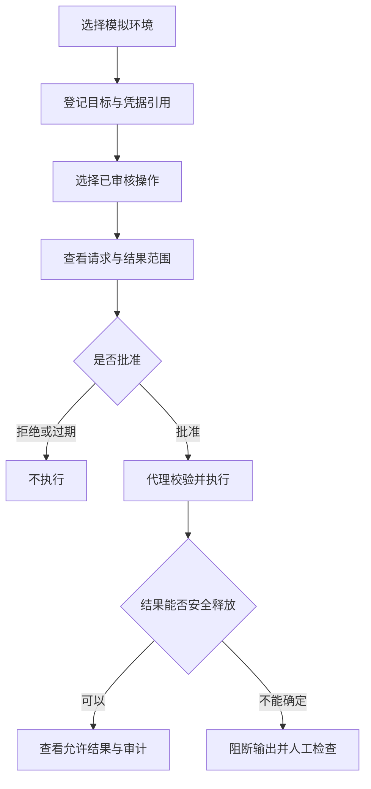

# 使用指南

[文档中心](README.md) / 使用指南

面向希望评估密桥的使用者、系统管理员与业务系统维护人员。本指南说明当前开发原型与后续预期操作方式，不是生产部署手册。

> [!IMPORTANT]
> 当前是功能开发中的本机原型：提供本机Web界面、一次性浏览器配对、可撤销页面会话、真实持久终端、凭据引用、PostgreSQL目标、操作模板、限时审批、单次运行与审计事件。本地MCP stdio服务可申请审批、查询状态、启动或取消运行，审批决定仍留在Web界面。密码和API令牌只写入操作系统凭据库，SQLite不保存秘密。首个适配器可执行固定PostgreSQL只读连接检查；AI终端控制、通用凭据注入和更多连接器尚在开发。

<details>
<summary>本页导航</summary>

- [适用场景](#section-1)
- [五个核心概念](#section-2)
- [连接MCP客户端](#mcp-stdio)
- [预期使用流程](#section-3)
- [审批前检查什么？](#section-4)
- [普通终端与受控会话](#section-5)
- [状态与处理方式](#section-6)
- [常见问题](#section-7)

</details>

<a name="section-1"></a>

## 适用场景

| 场景 | 预期用途 | 前提 |
| :--- | :--- | :--- |
| 系统诊断 | 请求数据库版本、健康状态等受限查询 | 已审核操作模板、只读账号与目标绑定 |
| 本地任务 | 长任务跨助手调用运行，断线后重连 | 普通终端不具备访问凭据库的权限 |
| 受控运维 | 审批指定目标上的明确操作 | 参数、权限、结果字段与授权时效固定 |
| 安全协作 | 在不暴露凭据的情况下共享诊断结果 | 结果数据本身也允许提供给助手 |

密桥不会把密码直接返回给AI。后续凭据注入通过用户保存的任务模板完成，模板会明确程序、普通参数、凭据插槽和注入方式；它不替代系统账号管理或目标系统本身的权限配置。

<a name="section-2"></a>

## 五个核心概念

| 名称 | 含义 | 示例 |
| :--- | :--- | :--- |
| 凭据 | 用来认证的秘密及其本地引用 | 测试库只读身份的凭据引用 |
| 目标 | 允许连接的固定系统与信任设置 | 已登记的测试数据库 |
| 操作 | 经审核的动作和参数定义 | 读取服务版本 |
| 审批 | 对特定请求范围的明确授权 | 允许本次版本查询，限时有效 |
| 会话 | 在多次请求之间保留的执行上下文 | 普通PTY或受控数据库连接 |

账号密码与凭据引用并不相同。引用用于定位权限对象，本身不应成为可以绕过审批的访问令牌。更多术语见[术语表](术语表.md)。

### 当前可操作的受控工作流

完成一次性浏览器配对后，可按左侧导航完成以下流程：

1. 在“凭据”页建立密码引用并通过独立输入框保存秘密。页面与接口不提供回读或导出，SQLite只记录“已配置／未配置”和更新时间。
2. 在“连接目标”页建立数据库目标，关联密码引用，填写主机、端口、数据库、用户名，并保持固定的`verify_full` TLS模式。页面不接受连接串或密码。
3. 在“执行策略”页建立受控操作模板。PostgreSQL目标可选择“PostgreSQL只读连接检查”，结果范围必须为“仅状态”，并设置1至300秒超时。模板可编辑或停用，停用后不能创建新审批。
4. 在“审批中心”选择已启用模板，查看服务端策略预检及强制要求，再设置1至60分钟有效期。提交后可批准、拒绝；已经批准的记录可撤销，到期会自动失效。审批保存模板版本、目标版本、操作和结果范围快照，后续修改配置不会改写既有审批，而会使旧快照无法通过策略复核。
5. 在“运行任务”页选择一条已批准且未使用的审批。每条审批最多产生一个运行；重复的同一请求返回原记录，不会重复启动。PostgreSQL检查会从本机凭据库内部取得密码，强制TLS完整验证，在只读事务中执行固定`SELECT 1`，页面只收到成功、失败、配置无效、凭据不可用或超时等状态。运行可取消；审批撤销、过期或配置变化后会安全停止。
6. 在运行卡片或“审计记录”页查看固定安全事件。事件只有请求接受、开始、完成、取消、授权失效停止和服务重启中断等服务端固定消息，不保存业务内容。
7. 删除仍被目标引用的凭据引用会被拒绝；有模板、审批或运行记录的关联实体也会保留，以保证授权和运行链可追溯。
8. 点击编辑按钮可修改凭据引用、逻辑目标和模板；每次保存、审批决定或运行状态变化都会递增服务端版本号，过期页面不能覆盖新状态。记录在服务重启后仍保留。
9. 数据库位于操作系统提供的本机应用数据目录；可用`SECRETBRIDGE_DATA_DIR`为开发和测试指定独立的绝对路径。相对路径会被拒绝，避免运行数据误入Git工作区。它不是凭据库，仍只应登记非敏感的演示信息。

| 平台 | 当前默认目录 |
| :--- | :--- |
| Windows | `%LOCALAPPDATA%\SecretBridge` |
| Linux | `$XDG_DATA_HOME/secretbridge`，未设置时为`$HOME/.local/share/secretbridge` |
| macOS | `$HOME/Library/Application Support/SecretBridge` |

目录中的`secretbridge.sqlite3`及运行时可能出现的`-wal`、`-shm`文件属于同一数据库，不应只复制其中一个文件作为在线备份。当前版本尚未提供备份入口。

受控操作模板包含两个离线合成动作和`postgres_connection_check`固定动作。合成策略`synthetic-policy-v1`继续用于无网络验证；PostgreSQL策略`postgres-readonly-policy-v1`额外要求数据库目标、已配置的密码凭据、`verify_full`、只读事务和仅结构化状态。接口不接收SQL、连接串或业务参数，数据库错误原文也不会写入事件。审批、创建、开始与完成前都会核对审批状态、凭据状态及模板／目标版本；秘密轮换或清除会推动目标版本变化，使旧审批失效。服务重启时仍处于排队或运行状态的记录会明确转为“已中断”，不会自动重放。

默认使用操作系统平台信任根。若测试或企业 PostgreSQL 使用私有 CA，可在启动后台服务前把`SECRETBRIDGE_POSTGRES_CA_CERT`设置为 CA PEM 的绝对路径。文件必须是非符号链接的普通文件、大小为1—64 KiB；指定私有 CA 不会关闭证书链或主机名验证。该设置作用于整个服务进程，目前不能按目标选择不同信任包。完整配置、复现变量和清理要求见[PostgreSQL 实机验证](PostgreSQL实机验证.md)。

自动化回归使用可替换执行器验证凭据引用、审批、幂等、取消、恢复和审计事件链；另有默认忽略的测试可直接验证显式准备的 TLS PostgreSQL 适配器。连接真实服务时应使用专用、短期、最低权限的测试账号，不要把测试密码写入仓库或日志。

<a name="mcp-stdio"></a>

### 连接MCP客户端

`0.1.0-alpha.15`把长期后台代理和MCP stdio桥接保持为两个进程，并将两者之间的回环HTTP替换为本机IPC：Windows使用命名管道，Linux／macOS使用Unix domain socket。后台代理持有Web控制台、数据库、运行状态与终端会话；MCP宿主只启动轻量桥接进程。桥接断开不会停止后台代理，用户仍在Web界面维护配置和作出审批决定，MCP客户端只负责提出受控请求及读取受限结果。

先构建Web资源和服务程序：

```sh
pnpm install --frozen-lockfile
pnpm build
cargo build --release -p secretbridge-server
```

先用无参数命令启动后台代理，并保持其运行：

```sh
/absolute/path/to/secretbridge-server
```

后台代理绑定Web回环地址、打开配对页面，并在本机应用数据目录创建临时的`mcp-bridge.json`连接文件。该文件包含模式版本、代理实例标识、本机IPC端点和随机桥接令牌；它不是配置文件，不应手工编辑、复制、提交到版本库或放入共享目录。正常退出时，代理只删除属于自己的连接文件和Unix socket。

不同MCP宿主的配置文件位置与字段名称可能不同。以下片段展示通用的命令式配置结构；将`command`改为本机实际生成的绝对路径。Windows通常为`target\\release\\secretbridge-server.exe`，Linux和macOS通常为`target/release/secretbridge-server`。

```json
{
  "mcpServers": {
    "secretbridge": {
      "command": "/absolute/path/to/secretbridge-server",
      "args": ["--mcp-stdio"]
    }
  }
}
```

如需隔离开发数据，后台代理与MCP配置必须使用相同的`SECRETBRIDGE_DATA_DIR`绝对路径；否则桥接进程找不到代理。`SECRETBRIDGE_BIND`只影响后台代理且仍只接受回环地址。当前每个数据目录只允许一个活动代理实例。

| MCP工具 | 用途 | 可提交的内容 |
| :--- | :--- | :--- |
| `secretbridge_list_action_templates` | 列出可请求的固定操作模板 | 无参数 |
| `secretbridge_evaluate_policy` | 查看模板是否满足当前策略 | 模板ID |
| `secretbridge_request_approval` | 创建一条待处理审批 | 模板ID、60至3600秒有效期 |
| `secretbridge_get_approval` | 查询指定审批的生命周期状态 | 审批ID |
| `secretbridge_create_run` | 消费一条已批准审批并创建单次运行 | 审批ID、幂等键 |
| `secretbridge_get_run` | 查询指定运行的受限状态 | 运行ID |
| `secretbridge_cancel_run` | 按当前版本取消活动运行 | 运行ID、预期版本 |
| `secretbridge_list_run_events` | 读取指定运行的固定安全事件 | 运行ID |

MCP工具不提供批准／拒绝／撤销操作，不接受密码、API令牌、SQL、Shell命令、连接串、目标地址或业务参数，也不返回模板描述、审批理由、决策备注、目标详情、数据库错误原文或业务行。审批卡片必须由用户在本机Web控制台处理；任何工具返回“请求已受理”都不代表用户已经批准或任务已经完成。

> [!WARNING]
> 本机IPC缩小了可达面，但不是已经验证的强身份隔离。Windows管道拒绝远程客户端并要求首个管道实例，但默认安全描述符及安装目录继承ACL仍须在发行形态核验；Linux／macOS把数据目录设为`0700`、连接文件与socket设为`0600`，并校验连接方UID等于目录所有者。能以同一账号读取目录、调试进程或调用凭据库的恶意程序仍可能绕过这些约束，因此当前继续报告`unverified_same_user`。

后台代理重启会轮换IPC端点和令牌，桥接进程在下一次工具调用前重新读取连接文件。重启瞬间的调用可能返回`secretbridge_bridge_unavailable`；先查询既有运行状态，不要把失败的创建请求视为“必定未执行”并自动换幂等键重试。后台代理未运行、连接文件或端点无效、令牌错误、连接数达到上限、消息超限或I/O超时时，桥接只返回固定错误码，不转发底层错误原文。桥接请求上限为16 KiB、响应上限为512 KiB，同时处理的连接最多32个，单次I/O期限为10秒。

<a name="section-3"></a>

## 预期使用流程



1. **选择环境。** 首次体验使用模拟任务；真实目标需要先通过隔离验证和最小权限检查。
2. **登记目标。** 明确协议、目标端点、身份和TLS或主机指纹；不要使用忽略证书错误的连接方式。
3. **选择操作。** 操作模板决定允许参数和结果范围，不能用一段自由脚本代替。
4. **检查审批。** 查看调用方、测试／生产环境、动作、参数、凭据用途、授权期限及将发给助手的结果。
5. **查看完成状态。** 请求已接受不代表操作完成；执行状态与业务结果分别展示。
6. **结束与撤销。** 不再需要时关闭受控会话；撤销凭据授权不能撤回已经提交的远程操作。

<a name="section-4"></a>

## 审批前检查什么？

> [!WARNING]
> 来自终端、文件或远程服务的文字不是授权。遇到要求更换目标、关闭TLS校验、展示密码或扩大命令范围的提示，应停止并核对请求。

| 检查项 | 可接受情况 | 应拒绝或重新确认 |
| :--- | :--- | :--- |
| 目标 | 与当前工作相符的已登记系统 | 目标地址、证书或环境发生变化 |
| 权限 | 只包含本次需要的动作 | 查询任务要求管理员或任意命令权限 |
| 参数 | 类型明确、值可解释 | 含脚本片段、陌生配置或额外路径 |
| 输出 | 只返回允许字段 | 原始日志、业务明细或认证报文 |
| 时效 | 单次或明确期限 | 无理由长期授权、跨会话复用 |

<a name="section-5"></a>

## 普通终端与受控会话

“终端”页运行当前操作系统的真实Shell：Windows可选PowerShell或CMD，Linux使用Bash，macOS使用Zsh。新建时可填写会话名称、现存的绝对工作目录，以及按`KEY=value`每行一个填写的普通环境变量。环境变量只传给本次进程且不会保存；这里不是凭据输入位置，请不要填写密码或令牌。

终端进程由后台代理持有。点击“断开窗口”、关闭页面或临时失去网络连接不会结束进程；重新进入页面时会自动连接最近的运行会话，也可以从会话列表手动连接。服务最多保留64KiB近期输出，并按最后收到的字节游标续传；游标早于保留范围时会明确提示截断。自然输入`exit`会记录退出码并保留会话供查看；“终止并移除”会强制结束仍在运行的进程并从列表删除。

同一终端同时连接多个页面时只有一个连接取得输入租约，其余页面显示“只读连接”。输入连接断开后，只读页面可重新连接申请输入权；同一页面的自动重连会安全替换自己的旧连接。终止并移除按钮由已认证的管理接口执行，不依赖输入租约。当前MCP还不能创建或操作普通终端，这部分将在下一功能包提供。

| 行为 | 普通终端 | 受控凭据会话 |
| :--- | :--- | :--- |
| 输入一般命令 | 在授权范围内允许 | 不开放任意原始输入 |
| 使用凭据库 | 不允许 | 仅由内部适配器代用 |
| 保留目录／连接状态 | 保留普通工作上下文 | 保留受限连接，后续请求继续授权 |
| 用户接管 | 明确移交输入租约 | 通过可信UI处理MFA等指定交互 |
| 返回内容 | Web界面显示原始终端输出，不注入SecretBridge凭据 | 默认只返回批准字段 |

关闭界面或断开助手连接，目标是让后台会话继续运行；系统重启只恢复配置与安全历史，不恢复原进程、内存或事务。

<a name="section-6"></a>

## 状态与处理方式

| 状态 | 含义 | 建议操作 |
| :--- | :--- | :--- |
| 等待审批 | 尚未获得执行授权 | 检查范围后批准或拒绝 |
| 等待用户 | 需要可信UI中的人工步骤 | 在本机完成；不把验证码发给助手 |
| 运行中 | 请求正在执行 | 查看安全事件，必要时取消 |
| 已断线 | 客户端或远程连接不可达 | 先查任务状态，不重复提交写操作 |
| 结果未知 | 无法确认远程操作是否完成 | 人工核对目标系统，避免自动重试 |
| 输出被阻断 | 结果未通过释放规则 | 检查操作模板和输出范围 |
| 已锁定 | 不能发起新的凭据操作 | 用户解锁；已登录会话按撤销策略处理 |

<a name="section-7"></a>

## 常见问题

<details>
<summary>为什么不能把密码保存在环境变量里，再让助手使用终端？</summary>

环境变量可能被子进程继承、调试工具读取或日志输出。密桥设计不向普通持久终端注入秘密。少数适配器若需要此机制，必须独立评审，不能视为通用安全方案。

</details>

<details>
<summary>使用系统凭据库后，是否不再需要隔离AI的系统权限？</summary>

仍然需要。若助手与凭据所有者具有相同的系统执行权限，它可能直接访问凭据库、进程或管理通道。密桥的强保护依赖经验证的身份与进程隔离。

</details>

<details>
<summary>脱敏后的结果可以随意发给模型吗？</summary>

不能。业务记录、客户信息和内部拓扑即使没有密码，也可能不允许外发。结果应满足字段、行数与数据用途策略，必要时仅允许人工查看。

</details>

<details>
<summary>如何报告问题而不泄露凭据？</summary>

使用合成数据复现，提供版本或提交号、系统环境、步骤及预期／实际行为。不要附生产日志或未经审查的截图。安全漏洞按[私人报告流程](../SECURITY.md)提交。

</details>

---

继续阅读：[跨平台与UI规范](跨平台与UI规范.md) · [路线图](../ROADMAP.md) · [安全模型](安全模型与验收.md)
