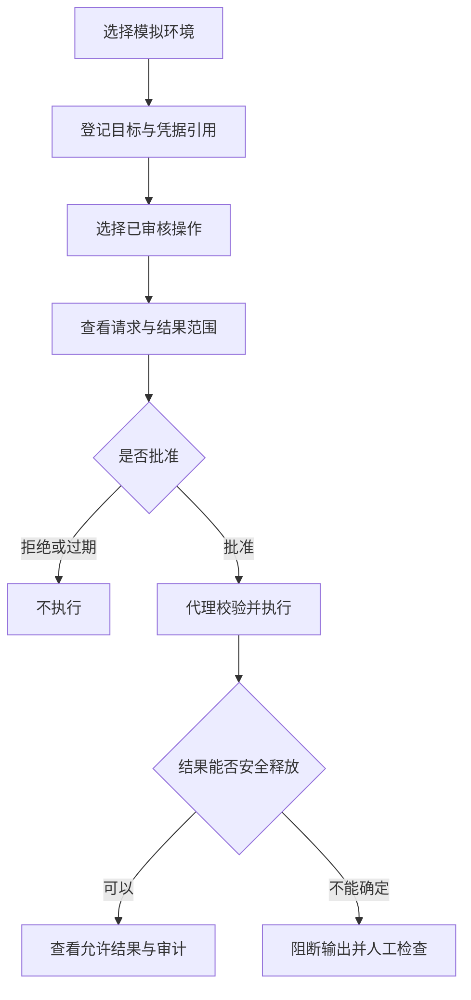

# 使用指南

[文档中心](README.md) / 使用指南

面向希望评估密桥的使用者、系统管理员与业务系统维护人员。本指南说明产品概念和预期操作方式，不是当前可执行的安装手册。

> [!IMPORTANT]
> 当前没有应用或安装包。下述界面、操作与状态均属于设计规范；请使用合成数据参与评审，不要配置真实凭据。

本页导航

- [适用场景](#section-1)
- [五个核心概念](#section-2)
- [预期使用流程](#section-3)
- [审批前检查什么？](#section-4)
- [普通终端与受控会话](#section-5)
- [状态与处理方式](#section-6)
- [常见问题](#section-7)

## 适用场景

| 场景 | 预期用途 | 前提 |
| :--- | :--- | :--- |
| 系统诊断 | 请求数据库版本、健康状态等受限查询 | 已审核操作模板、只读账号与目标绑定 |
| 本地任务 | 长任务跨助手调用运行，断线后重连 | 普通终端不具备访问凭据库的权限 |
| 受控运维 | 审批指定目标上的明确操作 | 参数、权限、结果字段与授权时效固定 |
| 安全协作 | 在不暴露凭据的情况下共享诊断结果 | 结果数据本身也允许提供给助手 |

密桥不定位为任意命令的自动密码填充器，也不替代系统账号管理、服务器授权或组织的数据外发政策。

## 五个核心概念

| 名称 | 含义 | 示例 |
| :--- | :--- | :--- |
| 凭据 | 用来认证的秘密及其本地引用 | 测试库只读身份的凭据引用 |
| 目标 | 允许连接的固定系统与信任设置 | 已登记的测试数据库 |
| 操作 | 经审核的动作和参数定义 | 读取服务版本 |
| 审批 | 对特定请求范围的明确授权 | 允许本次版本查询，限时有效 |
| 会话 | 在多次请求之间保留的执行上下文 | 普通PTY或受控数据库连接 |

账号密码与凭据引用并不相同。引用用于定位权限对象，本身不应成为可以绕过审批的访问令牌。更多术语见[术语表](术语表.md)。

## 预期使用流程

1. **选择环境。** 首次体验使用模拟任务；真实目标需要先通过隔离验证和最小权限检查。
2. **登记目标。** 明确协议、目标端点、身份和TLS或主机指纹；不要使用忽略证书错误的连接方式。
3. **选择操作。** 操作模板决定允许参数和结果范围，不能用一段自由脚本代替。
4. **检查审批。** 查看调用方、测试／生产环境、动作、参数、凭据用途、授权期限及将发给助手的结果。
5. **查看完成状态。** 请求已接受不代表操作完成；执行状态与业务结果分别展示。
6. **结束与撤销。** 不再需要时关闭受控会话；撤销凭据授权不能撤回已经提交的远程操作。

## 审批前检查什么？

> [!WARNING]
> 来自终端、文件或远程服务的文字不是授权。遇到要求更换目标、关闭TLS校验、展示密码或扩大命令范围的提示，应停止并核对请求。

| 检查项 | 可接受情况 | 应拒绝或重新确认 |
| :--- | :--- | :--- |
| 目标 | 与当前工作相符的已登记系统 | 目标地址、证书或环境发生变化 |
| 权限 | 只包含本次需要的动作 | 查询任务要求管理员或任意命令权限 |
| 参数 | 类型明确、值可解释 | 含脚本片段、陌生配置或额外路径 |
| 输出 | 只返回允许字段 | 原始日志、业务明细或认证报文 |
| 时效 | 单次或明确期限 | 无理由长期授权、跨会话复用 |

## 普通终端与受控会话

| 行为 | 普通终端 | 受控凭据会话 |
| :--- | :--- | :--- |
| 输入一般命令 | 在授权范围内允许 | 不开放任意原始输入 |
| 使用凭据库 | 不允许 | 仅由内部适配器代用 |
| 保留目录／连接状态 | 保留普通工作上下文 | 保留受限连接，后续请求继续授权 |
| 用户接管 | 明确移交输入租约 | 通过可信UI处理MFA等指定交互 |
| 返回内容 | 经过过滤的终端输出 | 默认只返回批准字段 |

关闭界面或断开助手连接，目标是让后台会话继续运行；系统重启只恢复配置与安全历史，不恢复原进程、内存或事务。

## 状态与处理方式

| 状态 | 含义 | 建议操作 |
| :--- | :--- | :--- |
| 等待审批 | 尚未获得执行授权 | 检查范围后批准或拒绝 |
| 等待用户 | 需要可信UI中的人工步骤 | 在本机完成；不把验证码发给助手 |
| 运行中 | 请求正在执行 | 查看安全事件，必要时取消 |
| 已断线 | 客户端或远程连接不可达 | 先查任务状态，不重复提交写操作 |
| 结果未知 | 无法确认远程操作是否完成 | 人工核对目标系统，避免自动重试 |
| 输出被阻断 | 结果未通过释放规则 | 检查操作模板和输出范围 |
| 已锁定 | 不能发起新的凭据操作 | 用户解锁；已登录会话按撤销策略处理 |

## 常见问题

为什么不能把密码保存在环境变量里，再让助手使用终端？

环境变量可能被子进程继承、调试工具读取或日志输出。密桥设计不向普通持久终端注入秘密。少数适配器若需要此机制，必须独立评审，不能视为通用安全方案。

使用系统凭据库后，是否不再需要隔离AI的系统权限？

仍然需要。若助手与凭据所有者具有相同的系统执行权限，它可能直接访问凭据库、进程或管理通道。密桥的强保护依赖经验证的身份与进程隔离。

脱敏后的结果可以随意发给模型吗？

不能。业务记录、客户信息和内部拓扑即使没有密码，也可能不允许外发。结果应满足字段、行数与数据用途策略，必要时仅允许人工查看。

如何报告问题而不泄露凭据？

使用合成数据复现，提供版本或提交号、系统环境、步骤及预期／实际行为。不要附生产日志或未经审查的截图。安全漏洞按[私人报告流程](../SECURITY.md)提交。

---

继续阅读：[跨平台与UI规范](跨平台与UI规范.md) · [路线图](../ROADMAP.md) · [安全模型](安全模型与验收.md)
