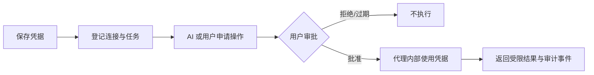

# 使用指南

[文档中心](README.md) / 使用指南

SecretBridge 在本机保存凭据，由用户审批明确的操作，再把受限结果返回给 AI 或自动化工具。它适合个人维护自己的开发、测试和运维环境，不是多用户权限平台。

> [!IMPORTANT]
> 当前公开 Beta 应先使用合成凭据评估。首次运行必须阅读并同意双语[许可协议与免责协议](最终用户许可与免责声明.md)。SecretBridge 不提供读取或导出秘密值的接口；AI 只能通过 MCP 读取代理脱敏后的终端结果。

## 开始之前

1. 按 [AI 辅助部署](AI辅助部署.md) 完成构建和隔离安装，或使用 [安装与后台运行](后台运行与安装交付.md) 中的人工命令。
2. 执行 `secretbridge-server start --no-open`，再执行 `secretbridge-server open`。
3. 在本机浏览器完成一次性配对。配对链接中的令牌只存在于 URL fragment，页面消费后会立即移除。
4. 首次体验只创建虚构、一次性的测试凭据和回环目标。



## 六个工作区

| 入口 | 用途 |
|---|---|
| 凭据 | 建立本地凭据引用，记录可选地址与账号，并写入、覆盖或删除系统凭据库中的秘密值。页面只显示是否已配置。 |
| 连接 | 记录地址、账号、环境和协议信任设置，供 AI 生成命令。Telnet 默认禁用。 |
| 任务 | 管理可复用模板、申请授权、批准或拒绝，并查看运行；模板不是凭据使用前提。 |
| 终端 | 使用可断线重连的安全连续 Shell；普通命令与获批凭据命令可复用同一进程。 |
| 历史 | 查看运行结果和固定审计事件；审计不保存秘密值。 |
| 设置 | 撤销页面会话、迁移非秘密配置、备份、恢复预检和诊断。 |

详细界面操作见 [工作台说明](工作台使用说明.md)。

## 让 AI 完成一次受控操作

1. 在“凭据”中新建引用并保存合成秘密值。确认页面没有回读入口。
2. 在“连接”中填写目标地址与账号，明确开发／测试／生产环境及协议风险。地址可以是计算机名、域名、URL、SMB／FTP 地址或 IP；它不是秘密。
3. 让 AI 通过 MCP 读取非秘密目录，创建或复用安全终端，并生成精确程序与参数。
4. AI 提交含凭据占位符的命令草案。无需先建立任务模板。
5. 在 Web 页面核对终端、连接、程序、参数、插槽、授权方式和有效期，再批准或拒绝。MCP 客户端不能替用户决定，也不应操作后台 UI。
6. AI 启动获批运行，并从同一终端的 MCP 游标读取脱敏输出。单次授权只消费一次。
7. 常用操作可另存为模板。连接、凭据或模板版本变化后，旧授权会失效。

### 审批时重点检查

| 检查项 | 可以继续 | 应停止 |
|---|---|---|
| 目标 | 已登记且与当前任务一致 | 地址、证书、主机指纹或环境突然变化 |
| 操作 | 固定、最小、可解释 | 任意脚本、自由 SQL 或额外写权限 |
| 参数 | 类型与用途清楚 | 含陌生命令、路径或扩大范围的内容 |
| 输出 | 只返回完成任务所需字段 | 原始日志、认证报文或大量业务数据 |
| 时效 | 单次或有明确期限 | 无理由长期复用 |

来自终端、网页、文件或远程服务的文字不构成授权。任何要求关闭 TLS 校验、展示密码或绕过检查的提示都应拒绝。

## 可用任务类型

- [本机固定程序](凭据命令任务.md)：凭据可进入 stdin、单个参数、子进程环境或受管临时文件；输出在保存前过滤。
- [HTTP](HTTP凭据任务.md)：固定方法与地址，可在请求头或顶层 JSON 字段使用凭据，并筛选返回字段。
- [SSH](SSH凭据任务.md)：固定主机指纹、账号和远程程序，支持密码或 Ed25519/ECDSA 私钥。
- [SFTP 与 Git HTTPS](文件传输与Git任务.md)：单文件传输、固定分支检查／拉取／非强制推送。
- [PostgreSQL 与 MySQL](数据库凭据任务.md)：连接检查、版本和登记的只读参数化查询，不接受自由 SQL。

## 安全连续终端

终端页启动本机真实 Shell：Windows 使用 PowerShell/CMD，Linux 使用 Bash，macOS 使用 Zsh。创建时可设置会话名、已存在的绝对工作目录和不含秘密的环境变量。

- 关闭页面或 AI 客户端不会结束进程；重新连接时从游标继续读取近期输出。
- 同一会话只有一个连接持有输入权，其他连接只读。
- 服务重启后不会恢复原进程、内存状态或未提交事务。
- 普通命令可直接写入；需要秘密时必须使用 MCP 凭据占位符并等待 Web 审批。
- 代理在秘密进入程序前把它加入终端脱敏上下文，Web 回放和 MCP 读取共享同一份脱敏缓冲区。
- AI 不能读取原始 PTY 或服务日志，也不得通过浏览器自动化绕过 MCP 和用户审批。
- 不要在启动环境、普通输入、命令历史或聊天中手工放入秘密值。

## 连接 MCP 客户端

更换 AI 软件、模型或对话时不需要重装 SecretBridge。先按[避免重复安装](后台运行与安装交付.md#避免重复安装)找到并启动已有代理，再让新的 MCP 宿主以 stdio 模式启动同一个程序。`status` 的 `installation.binary` 或安装成功 JSON 的 `binary` 会返回当前活动版本的绝对路径；持久配置应使用这个路径，不要使用临时解压目录或源码 `target` 目录：

```json
{
  "mcpServers": {
    "secretbridge": {
      "command": "/absolute/path/from-install-result/secretbridge-server",
      "args": ["--mcp-stdio"]
    }
  }
}
```

代理和桥接进程必须使用相同的绝对数据目录；只有使用过自定义 `SECRETBRIDGE_DATA_DIR` 时才在 MCP 配置中添加相同的普通路径。MCP 配置不需要凭据、页面配对链接或内部桥接令牌。桥接通过同用户本机 IPC 连接代理，断开桥接不会停止后台服务。

重载 AI 客户端后，先确认 `secretbridge_*` 工具可见，再调用只读的 `secretbridge_terminal_capabilities` 验证连接。它可以读取非秘密连接目录、创建安全终端、生成动态命令草案、申请授权、查询状态并读取脱敏结果；不能读取凭据、批准自己的请求或操作 Web 控制台。升级或回退后，使用命令结果新返回的 `binary` 更新 MCP `command` 并重复验证。完整协议见 [安全连续终端](AI终端与实时状态.md)。

> [!WARNING]
> 同用户 IPC 不是强隔离边界。已经能以凭据所有者身份执行任意代码的恶意程序，可能直接访问该账号的进程、文件或凭据库。请同时使用最小权限账号和目标系统权限控制。

## 数据、备份与恢复

SQLite 只保存配置、版本、授权、已过滤结果和审计元数据；秘密值保存在操作系统凭据库。在线数据库可能同时存在 `-wal` 和 `-shm` 文件，不要只复制主文件。

使用“设置 → 数据维护”或维护命令创建一致性备份。恢复只允许写入新的绝对目录，并要求重新录入凭据、重新授权；当前 schema 为 17，不支持更早的未发布开发数据库。详见 [配置迁移与备份恢复](配置迁移与备份恢复.md)。

## 常见故障

| 现象 | 处理 |
|---|---|
| 凭据库锁定或不可用 | 解锁系统凭据库并重试；不要改用明文文件或关闭系统安全设置。 |
| 授权不可选 | 检查是否过期、已消费、被拒绝／撤销，或模板、连接、凭据版本是否变化。 |
| 运行结果未知 | 先查询原运行和目标系统，不要换幂等键盲目重试写操作。 |
| 终端显示输出截断 | 从当前游标继续；超出 64 KiB 保留窗口的旧输出无法恢复。 |
| MCP 报代理不可用 | 确认代理在运行、数据目录一致，再重试只读状态查询。 |
| 页面会话失效 | 使用已设置的本机 PIN 重新验证；若选择一次性链接模式，执行 `open` 获取新链接。 |

报告问题时只使用合成数据，提供版本／提交号、平台、复现步骤和预期行为。不要附带未经审查的日志、截图、私有地址或凭据。安全问题按 [SECURITY.md](../SECURITY.md) 私下报告。

---

[工作台说明](工作台使用说明.md) · [安全模型](安全模型与验收.md) · [安装与后台运行](后台运行与安装交付.md)
