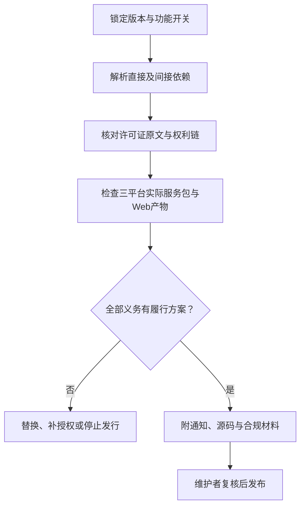

# 依赖许可风险评估

[文档中心](README.md) / 依赖许可风险评估

**评估日期：2026-09-11。适用对象：当前锁定依赖与后续候选组件，不是最终发行物合规证明。**

仓库已提交`Cargo.lock`与`pnpm-lock.yaml`，采用本机Web管理端与Rust后台服务，不使用桌面壳。下表区分已锁定直接依赖和候选组件；直接依赖许可核对不能替代间接依赖、平台产物和最终分发包审查。

> [!IMPORTANT]
> 公司商业授权仅覆盖公司有权许可的内容。框架主页显示MIT或Apache，不代表其插件、系统运行时、间接依赖、字体或安装包内全部文件具有相同许可。

本页导航

- [结论与风险分级](#section-1)
- [核心框架与工具](#section-2)
- [需要单独审查的组件](#section-3)
- [发布前的完整核验](#section-4)

## 结论与风险分级

当前开发原型采用Rust／Axum服务、React／TypeScript／Vite管理端及SQLite非秘密元数据存储。已核对的直接依赖以宽松许可为主，没有发现与本仓库AGPL-3.0-or-later冲突的直接依赖；但在完整SBOM、间接依赖许可证据与三平台实际产物审查完成前，**不能据此批准商业分发包**。

| 级别 | 含义 | 决策 |
| :--- | :--- | :--- |
| 较低 | 核心许可较宽松，仍需保留声明并核对版本 | 可进入选型验证，不等于直接批准发行 |
| 条件性 | 依分发形态、修改、系统组件或弱Copyleft义务判断 | 完成专门清单后审批 |
| 高 | 直接改造／链接方案可能与专有发行目标冲突 | 不作为闭源核心底座，除非另获足够权利 |
| 待定 | 未选版本、未读完整条款或没有依赖图 | 阻止正式发行批准 |

## 核心框架与工具

| 组件与关系 | 已核对的许可依据 | 主要义务或边界 | 风险／建议 |
| :--- | :--- | :--- | :--- |
| Axum 0.8.9、Tokio 1.53.1、Tower HTTP 0.7.1等M0 Rust运行依赖 | 各crate元数据声明MIT或MIT／Apache-2.0；确切列表由`Cargo.lock`解析 | 发行时保留适用许可与通知；双许可组件记录实际采用路径；继续核对间接依赖和feature | 较低／已锁定 |
| React 19.3.0、React DOM 19.3.0 | [MIT](https://github.com/facebook/react/blob/main/LICENSE) | Web产物包含运行时代码，发行时保留MIT通知 | 较低／已锁定 |
| Radix Tooltip 1.2.16、Tailwind CSS 4.3.3、Vite 8.3.0 | 上游分别声明MIT；具体包和间接依赖由`pnpm-lock.yaml`锁定 | 区分运行时代码、构建工具和平台二进制包；保留适用通知 | 较低／已锁定 |
| Lucide React 1.44.0 | 上游包声明ISC | 图标组件代码进入前端产物，保留ISC通知；不要混入来源不明图标 | 较低／已锁定 |
| TypeScript 7.0.2 | [Apache-2.0](https://github.com/microsoft/TypeScript/blob/main/LICENSE.txt) | 构建工具；若分发受保护内容，保留条款并按要求处理NOTICE和修改说明 | 较低／已锁定 |
| lightningcss 1.32／1.33及平台包，间接构建依赖 | 包元数据声明MPL-2.0 | 由Tailwind工具链解析／压缩CSS；当前不进入Web运行产物。若随构建环境或产品分发其文件，须保留MPL覆盖文件的许可和对应源码权利 | 条件性／已记录 |
| webbrowser 1.2.4 | crate声明MIT或Apache-2.0 | 仅调用系统默认浏览器；记录选用许可，不把浏览器本身视为随包分发 | 较低／已锁定 |
| xterm.js 6.0.0与Fit addon 0.11.0，Web终端运行依赖 | [MIT](https://github.com/xtermjs/xterm.js/blob/master/LICENSE) | 已锁定并进入Web产物；保留版权和MIT条款，新增addon或扩展需单独登记 | 较低／已锁定 |
| portable-pty 0.9.0，PTY运行依赖 | [pty/Cargo.toml](https://github.com/wezterm/wezterm/blob/main/pty/Cargo.toml)声明MIT | 已锁定；此处只评估子crate，不将整个WezTerm仓库当作单一MIT；发行时连同间接依赖复核 | 较低／已锁定 |
| serial2 0.2.38、shared_library 0.1.9、zerocopy 0.8.57等新增间接依赖 | 元数据声明BSD-2-Clause／Apache-2.0／MIT的不同组合 | 由PTY及其平台实现引入；许可表达式已进入门禁允许表，发行时仍需随实际平台产物生成通知清单 | 较低／已锁定 |
| sha2 0.10.9，令牌摘要运行依赖 | crate元数据声明MIT或Apache-2.0 | 仅用于内存令牌摘要，不代替密码哈希；记录采用的许可路径并保留适用条款 | 较低／已锁定 |
| rusqlite 0.40.2、libsqlite3-sys 0.38.2与bundled SQLite 3.53.2，元数据存储 | [rusqlite仓库](https://github.com/rusqlite/rusqlite)声明MIT；[SQLite官方说明](https://www.sqlite.org/copyright.html)将原始交付代码置于公有领域 | 已锁定且关闭不需要的默认feature，仅启用bundled；发行时保留rusqlite与绑定层MIT通知，核对实际捆绑SQLite版本；未启用SQLCipher | 较低／已锁定，特定法域对公有领域的认可仍需发行审查 |
| keyring 4.2.0及Windows Native、Apple Keychain、Linux Secret Service平台后端 | [crate清单](https://docs.rs/crate/keyring/4.2.0/source/Cargo.toml)声明MIT或Apache-2.0；平台后端随默认`v1` feature锁定 | 运行时调用操作系统凭据服务；三平台会解析不同条件依赖，实际安装包需分别生成SBOM与通知；系统凭据服务本身不视为随包再分发 | 较低／已锁定；默认聚合feature后续可改为按平台显式后端以缩小供应链 |
| zeroize 1.9.0，秘密临时缓冲清理 | [crate元数据](https://docs.rs/crate/zeroize/1.9.0)声明MIT或Apache-2.0 | 作为运行依赖进入服务；记录采用许可路径。内存清理只降低残留，不代表浏览器、交换区或崩溃转储获得完整保护 | 较低／已锁定 |
| actions/checkout，已引用CI工具 | [固定提交LICENSE](https://github.com/actions/checkout/blob/11d5960a326750d5838078e36cf38b85af677262/LICENSE)，MIT | CI拉取执行，未随应用交付；Action传递依赖和执行权限另做供应链审查 | 较低；只说明许可，不代表安全审计通过 |
| actions/setup-node，已引用CI工具 | 固定提交使用，上游仓库声明MIT | CI拉取执行，未随应用交付；固定提交仍需关注维护与供应链通告 | 较低 |
| MCP SDK、SSH／数据库驱动及后续加密组件 | 尚未锁定具体包与版本 | 开发工具、协议规范与实际SDK分开登记；不能凭生态惯例填MIT | 待定；依赖清单建立后再批准 |

“较低”是选型阶段的相对许可负担判断，不是法律无风险结论，也不意味着依赖不存在漏洞。

## 需要单独审查的组件

### 系统浏览器与平台服务包

默认方案调用用户已安装的系统浏览器，不把Chrome、Edge、Firefox或Safari打包进密桥分发物，因此不能把这些浏览器的商标、运行时或许可算作密桥已获授权的内容。若未来改为捆绑浏览器、自动下载运行时或定制品牌版本，必须作为新的分发方案重新评估；当前架构决策不允许以桌面壳绕过这一审查。

Windows服务与签名工具、Linux软件包依赖、macOS SDK、签名和公证分别受平台协议约束。调用系统API不等于可以任意再分发SDK或系统文件；每个平台的实际服务包须与SBOM和通知清单逐项对照。

### OpenBao

[OpenBao上游LICENSE](https://github.com/openbao/openbao/blob/main/LICENSE)为MPL-2.0。MPL是文件级Copyleft，可与采用其他许可的文件构成较大作品；分发时仍需向接收者提供适用MPL覆盖文件的源码及许可通知。参考[Mozilla官方FAQ](https://www.mozilla.org/en-US/MPL/2.0/FAQ/)。

建议只将其作为可选独立凭据服务评估，不复制其服务代码进入默认核心。若修改并随产品交付其覆盖文件，必须落实相应开源义务；仅通过接口连接不等于已完成整体组合方式审查。

### KeePassXC

[上游COPYING](https://github.com/keepassxreboot/keepassxc/blob/develop/COPYING)总声明允许选择GNU GPL第2版或第3版，且按文件列出其他许可。不能仅根据主页“GPLv3”标签将全部资产视为同一条款。

**不建议以直接fork或链接KeePassXC的方式构建计划闭源商业授权的核心。** 公司自己的商业许可不能取消上游GPL要求。若仅做独立程序互操作，也需根据通信语义、耦合和实际打包方式审查，不能把“分进程”当作法律免责规则。上游图标、第三方代码和Qt等依赖须各自核对。

## 发布前的完整核验

发布审查至少保存以下内容：

| 记录 | 验收要求 |
| :--- | :--- |
| 版本证据 | 锁文件、哈希、feature／optional依赖、平台条件依赖 |
| 依赖关系 | SBOM覆盖运行、构建和安装包实际捆绑内容，并标记未交付工具 |
| 许可证据 | 每个组件的许可证原文、SPDX表达式、NOTICE、修改与来源 |
| 权利依据 | 公司代码与外部贡献商业再许可台账；排除未授权部分 |
| 履约材料 | 应提供的源码、构建／重链接资料、署名、用户获取入口 |
| 分发包复核 | Windows、Linux、macOS分别检查服务文件、Web产物、字体、图标和辅助程序 |
| 审查结论 | 审查人、日期、适用版本、限制、未决项与复审触发条件 |

自动扫描只辅助发现问题，不能证明权利链完整。升级、换源、改变链接方式或增加运行时捆绑，均须重新评估。许可风险、专利／商标风险和依赖安全漏洞分别记录；首次商业协议与复杂Copyleft组合应由专业法律人员复核。

仓库的`tools/check_dependency_licenses.py`会读取两份锁定依赖图，并在出现未评审的许可证标识或Rust包缺少许可元数据时阻断CI。允许列表只表示“已经进入人工评估范围”，不等于组件已获安全认证、没有通知义务或可用于任意商业组合。

---

[技术选型](开源选型与资料.md) · [第三方声明](../THIRD_PARTY_NOTICES.md) · [商业授权](../COMMERCIAL_LICENSE.md)
