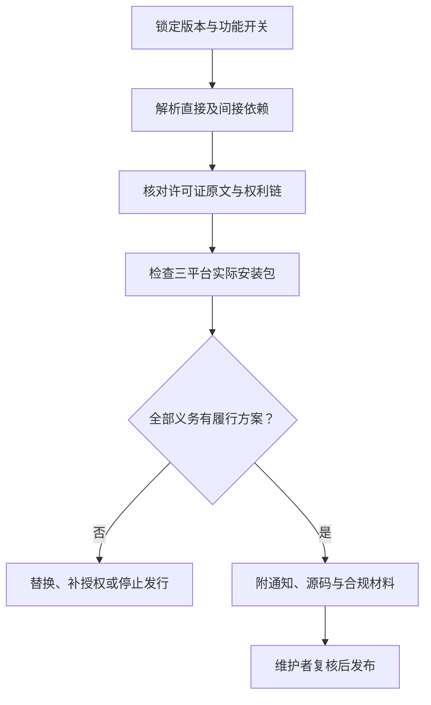

# 依赖许可风险评估

[文档中心](README.md) / 依赖许可风险评估

**评估日期：2026-09-10。适用对象：设计阶段选型，不是最终发行物合规证明。**

目前没有应用依赖锁文件、桌面应用或安装包。下表区分已引用的CI组件与候选框架；上游分支文件用于选型判断，不能代替未来锁定版本的完整依赖与产物审查。

> [!IMPORTANT]
> 公司商业授权仅覆盖公司有权许可的内容。框架主页显示MIT或Apache，不代表其插件、系统运行时、间接依赖、字体或安装包内全部文件具有相同许可。

本页导航

- [结论与风险分级](#section-1)
- [核心框架与工具](#section-2)
- [需要单独审查的组件](#section-3)
- [发布前的完整核验](#section-4)

## 结论与风险分级

保留Tauri + Rust + React／TypeScript + xterm.js作为优先验证路线。其已核对的核心许可没有显示必须将独立自有代码全部开源的要求，但现阶段**尚不能批准任何最终商业安装包**。

| 级别 | 含义 | 决策 |
| :--- | :--- | :--- |
| 较低 | 核心许可较宽松，仍需保留声明并核对版本 | 可进入选型验证，不等于直接批准发行 |
| 条件性 | 依分发形态、修改、系统组件或弱Copyleft义务判断 | 完成专门清单后审批 |
| 高 | 直接改造／链接方案可能与专有发行目标冲突 | 不作为闭源核心底座，除非另获足够权利 |
| 待定 | 未选版本、未读完整条款或没有依赖图 | 阻止正式发行批准 |

## 核心框架与工具

| 组件与关系 | 已核对的许可依据 | 主要义务或边界 | 风险／建议 |
| :--- | :--- | :--- | :--- |
| Tauri核心，候选桌面壳 | [MIT](https://github.com/tauri-apps/tauri/blob/dev/LICENSE-MIT) / [Apache-2.0](https://github.com/tauri-apps/tauri/blob/dev/LICENSE-APACHE-2.0)，按上游双许可选择 | 记录选用条款；核心许可不覆盖全部插件及WebView | 较低；优先验证 |
| React，候选UI | [MIT](https://github.com/facebook/react/blob/main/LICENSE) | 保留版权、许可与免责声明；UI配套包另查 | 较低 |
| TypeScript，候选构建工具 | [Apache-2.0](https://github.com/microsoft/TypeScript/blob/main/LICENSE.txt) | 分发其受保护内容时保留条款，按要求处理NOTICE和修改说明；不把编译工具许可简单等同于全部输出许可 | 较低 |
| xterm.js，候选终端渲染 | [MIT](https://github.com/xtermjs/xterm.js/blob/master/LICENSE) | 保留通知；addons及打包内容另查 | 较低 |
| portable-pty，候选PTY库 | [pty/Cargo.toml](https://github.com/wezterm/wezterm/blob/main/pty/Cargo.toml)声明MIT；读取时版本为0.9.0 | 此处评估子crate，不将整个WezTerm仓库当作单一MIT；crate打包许可证和依赖待锁定核验 | 较低／版本准入待完成 |
| Electron，备选桌面壳 | [MIT](https://github.com/electron/electron/blob/main/LICENSE) | Electron核心许可不能代替Chromium、Node及打包资源的通知清单 | 条件性；不是规避WebView许可义务的捷径 |
| SQLite，候选元数据存储 | [官方公有领域说明](https://www.sqlite.org/copyright.html) | 原始交付库声明为公有领域；绑定库、扩展、加密组件单独检查；特定法域认可问题需审查 | 较低／绑定未定 |
| actions/checkout，已引用CI工具 | [固定提交LICENSE](https://github.com/actions/checkout/blob/11d5960a326750d5838078e36cf38b85af677262/LICENSE)，MIT | CI拉取执行，未随应用交付；Action传递依赖和执行权限另做供应链审查 | 较低；只说明许可，不代表安全审计通过 |
| Rust库、凭据库封装、MCP SDK、SSH／数据库驱动、加密库 | 尚未锁定具体包与版本 | 开发工具、协议规范与实际SDK分开登记；不能凭生态惯例填MIT | 待定；依赖清单建立后再批准 |

“较低”是选型阶段的相对许可负担判断，不是法律无风险结论，也不意味着依赖不存在漏洞。

## 需要单独审查的组件

### WebKit／WebKitGTK 与操作系统运行时

WebKit官方说明包含[LGPL与BSD许可](https://webkit.org/licensing-webkit/)。macOS使用系统框架、Linux依赖系统WebKitGTK、以及在安装包中捆绑运行时，是不同的交付方式。

- 逐文件／包确认实际LGPL版本、修改情况及其他依赖。
- 捆绑发行时核对许可文本、对应源码提供方式，以及允许用户修改库并替换／重链接的适用要求。
- 专有EULA不得与应保障的修改调试权利冲突；静态链接不能仅靠附上一份LICENSE解决。
- 系统提供的组件并不当然要求公开整个密桥应用；也不能据此忽略自行捆绑的库。

Windows WebView2须独立审查微软运行时许可与再分发条件，选择Evergreen或Fixed Version，并记录交付路径。微软的[分发指南](https://learn.microsoft.com/en-us/microsoft-edge/webview2/concepts/distribution)用于确认技术方案，**不替代对应SDK／Runtime许可全文**。此项在确切版本、许可与安装形式确定前保持待定。

macOS框架、SDK、签名、公证和商店交付还涉及Apple相关协议，不能由Tauri开源许可覆盖。原生API可调用不等于SDK或运行时可任意再分发。

### OpenBao

[OpenBao上游LICENSE](https://github.com/openbao/openbao/blob/main/LICENSE)为MPL-2.0。MPL是文件级Copyleft，可与采用其他许可的文件构成较大作品；分发时仍需向接收者提供适用MPL覆盖文件的源码及许可通知。参考[Mozilla官方FAQ](https://www.mozilla.org/en-US/MPL/2.0/FAQ/)。

建议只将其作为可选独立凭据服务评估，不复制其服务代码进入默认核心。若修改并随产品交付其覆盖文件，必须落实相应开源义务；仅通过接口连接不等于已完成整体组合方式审查。

### KeePassXC

[上游COPYING](https://github.com/keepassxreboot/keepassxc/blob/develop/COPYING)总声明允许选择GNU GPL第2版或第3版，且按文件列出其他许可。不能仅根据主页“GPLv3”标签将全部资产视为同一条款。

**不建议以直接fork或链接KeePassXC的方式构建计划闭源商业授权的核心。** 公司自己的商业许可不能取消上游GPL要求。若仅做独立程序互操作，也需根据通信语义、耦合和实际打包方式审查，不能把“分进程”当作法律免责规则。上游图标、第三方代码和Qt等依赖须各自核对。

## 发布前的完整核验

发布审查至少保存以下内容：

| 记录 | 验收要求 |
| :--- | :--- |
| 版本证据 | 锁文件、哈希、feature／optional依赖、平台条件依赖 |
| 依赖关系 | SBOM覆盖运行、构建和安装包实际捆绑内容，并标记未交付工具 |
| 许可证据 | 每个组件的许可证原文、SPDX表达式、NOTICE、修改与来源 |
| 权利依据 | 公司代码与外部贡献商业再许可台账；排除未授权部分 |
| 履约材料 | 应提供的源码、构建／重链接资料、署名、用户获取入口 |
| 安装包复核 | Windows、Linux、macOS分别检查运行时、字体、图标和辅助程序 |
| 审查结论 | 审查人、日期、适用版本、限制、未决项与复审触发条件 |

自动扫描只辅助发现问题，不能证明权利链完整。升级、换源、改变链接方式或增加运行时捆绑，均须重新评估。许可风险、专利／商标风险和依赖安全漏洞分别记录；首次商业协议与复杂Copyleft组合应由专业法律人员复核。

---

[技术选型](开源选型与资料.md) · [第三方声明](../THIRD_PARTY_NOTICES.md) · [商业授权](../COMMERCIAL_LICENSE.md)
