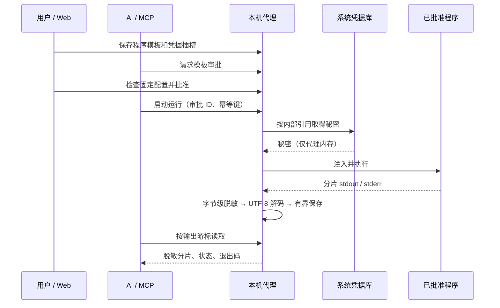

# 凭据命令任务

[文档中心](README.md) / 凭据命令任务

SecretBridge 可按用户保存、明确批准的模板启动本机程序，内部取得凭据并注入，向 Web 和 MCP 返回过滤后的 stdout/stderr。秘密不进入 AI 请求、模板定义或普通持久终端。

## 使用流程

1. 在“凭据”中创建引用并设置密码或令牌。
2. 建立一个用于标识任务用途的连接目标。目标不是网络限制或程序沙箱。
3. 在“执行策略”中新建模板，选择“凭据命令任务”，填写程序和工作目录的绝对路径。
4. 按顺序逐行填写参数。每行是一个参数，不经过 Shell 拼接；空行表示空参数。
5. 添加命名凭据插槽，选择凭据引用和注入方式。模板中不得填写秘密原文。
6. 提交审批，在审批详情检查程序、参数、插槽和模板版本，再批准。
7. 从“运行任务”或 MCP 启动运行。展开运行详情即可查看实时输出、固定事件和退出码。



## 四种注入方式

| 方式 | 模板配置 | 程序收到的内容 | 注意事项 |
|---|---|---|---|
| 标准输入 `stdin` | 一个插槽，无参数占位符 | 秘密原始 UTF-8 字节，随后 EOF | 不自动加换行；每个模板最多一个标准输入插槽 |
| 环境变量 `environment` | 指定环境变量名 | 子进程环境变量值 | 子进程及同用户调试工具可能访问；不修改代理或持久终端环境 |
| 参数 `argument` | 独立参数 `{{slot_name}}` | 对应参数替换为秘密 | 可能被进程查看工具读取；不支持在一个参数内部拼接秘密 |
| 临时文件 `file` | 独立参数 `{{slot_name}}` | 对应参数替换为临时文件路径 | 文件内容是秘密原文，不生成工具特定配置格式 |

优先选择标准输入或工具原生认证机制。工具若需要完整 JSON、INI 或其他格式，可由用户在凭据库保存所需文件内容，再使用文件插槽；不要把带秘密的配置粘贴到模板说明或 AI 对话中。

文件保存在服务数据目录的 `command-secrets` 子目录，文件名为随机 UUID。Unix 目录以 `0700`、文件以 `0600` 创建；Windows 继承用户数据目录的 ACL，使用前应确认该目录不向其他用户开放。成功、失败、超时和取消后均尝试清理；清理失败返回 `command_cleanup_failed`，不报告成功。代理取得数据目录的 IPC 所有权后会清理符合命名规则的遗留普通文件，不删除无关文件。删除不是磁盘安全擦除。

## 配置示例

以下为模板的 `command` 字段；程序、目录和引用 ID 由使用者按本机环境填写，示例不包含秘密：

```json
{
  "program": "/usr/bin/example-tool",
  "working_directory": "/tmp",
  "arguments": ["--token", "{{access_token}}"],
  "slots": [
    {
      "name": "access_token",
      "credential_id": "00000000-0000-0000-0000-000000000001",
      "injection": "argument",
      "environment_variable": null
    }
  ]
}
```

模板操作为 `command_execution`，结果范围为 `sanitized_output`。程序必须是现有文件，目录必须存在；程序不会自动安装。模板最多 32 个参数、8 个凭据插槽，插槽名使用字母、数字和下划线，以字母或下划线开头。

更改模板、目标或轮换／清除绑定凭据后，旧审批无法启动新运行。单次批准只消费一次；限时批准可重复执行相同已确认参数，重复提交相同幂等键仍只取得同一运行、不重新执行。参数配置与授权方式见[参数化任务与授权](参数化任务与授权.md)。审批决定只允许用户在 Web 完成，MCP 不提供批准、设置秘密或读取秘密工具。

## MCP 与输出游标

沿用 `secretbridge_list_action_templates`、`secretbridge_request_approval`、`secretbridge_get_approval` 和 `secretbridge_create_run`。模板列表公开普通参数定义、插槽名和方式，不公开绑定凭据 ID 或秘密。启动后读取：

```json
{
  "id": "<run-id>",
  "cursor": 0,
  "wait_ms": 1000
}
```

工具名为 `secretbridge_read_run_output`。返回 `items`，每个分片包含 `sequence`、`stream` 和 `text`；使用返回的 `next_cursor` 继续读取。

| 字段 | 含义 |
|---|---|
| `cursor` | 上一次已读取的分片序号，首次为 0；**不是普通终端的字节游标** |
| `wait_ms` | 无可用输出且运行仍活动时等待通知，0—5000 毫秒；可能提前返回空页 |
| `next_cursor` | 下一次请求应使用的序号 |
| `oldest_cursor` | 当前最早保留分片的序号 |
| `truncated` | 请求位置早于保留窗口，部分较早输出已丢弃 |
| `has_more` | 还有已保存分片，应继续读取 |
| `state` | 当前运行状态 |
| `exit_code` | 本次程序的退出码；启动失败、超时或取消等场景可能为空 |

每页最多 16 个分片，每片最多 4 KiB；每个运行保留最近 64 片、最多 256 KiB 文本。页面显示近期窗口，不提供无限日志归档。断线后续读，不得通过重新执行命令恢复输出。Web 使用现有变更通知重新读取安全输出，通知本身不携带数据。

## 超时、取消与进程生命周期

模板超时范围为 1—300 秒，实际时间还受审批剩余有效期约束；最多同时执行 4 个命令进程。取消使用已有 `secretbridge_cancel_run` 或 Web 按钮。Unix 使用独立进程组终止，Windows 使用系统 `taskkill /T /F` 并补充终止直接子进程。程序退出后最多等待约 2 秒排空输出管道，避免后代进程无限占用任务。

这是非交互任务执行器，不是凭据持久 Shell：不支持密码提示交互、任意时刻填充按键或在下一次调用沿用秘密环境。普通终端仍用于无需秘密的工作。服务重启会将未完成运行标为中断，不自动重跑；不能保证服务被强制结束后所有已经逃离进程组的后代也结束。

## 脱敏范围与限制

stdout/stderr 分别使用同一字节级过滤算法，未完成的秘密前缀不会提前释放。当前覆盖秘密的 UTF-8 原文、UTF-16 LE/BE、JSON 字符串转义和常见百分号编码；过滤后才进行增量 UTF-8 解码和保存。非 UTF-8 普通文本可能显示替换字符。错误和审计使用固定状态，不返回原始系统异常、完整命令或临时文件内容。

输出过滤不是沙箱或任意秘密识别系统：不保证识别 Base64、哈希、加密、自定义编码、故意拆到不同输出流的秘密或其他未绑定敏感数据。程序仍拥有当前用户的文件和网络权限，也必然能访问注入值。只批准可信程序；不能用它防止恶意程序将秘密主动写入其他文件或发送到远端。同用户调试和进程检查也不属于当前隔离承诺。

当前验收使用合成凭据，覆盖四种方式的真实进程、分片／编码过滤、中文分片、MCP 原生 IPC、幂等、保留缺口、凭据轮换、超时取消及文件清理。未自动连接用户的业务系统或读取既有凭据值。

---

[普通终端](AI终端与实时状态.md) · [功能路线图](../ROADMAP.md) · [安全模型](安全模型与验收.md)
