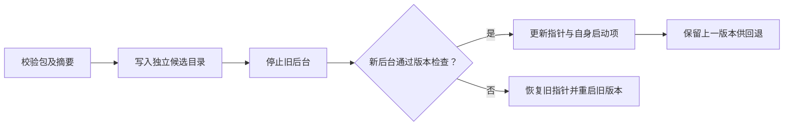

# 后台运行与安装交付

[文档中心](README.md) / 后台运行与安装交付

SecretBridge 使用原生后台服务与浏览器管理端，不需要桌面壳。启动程序返回后，服务继续持有终端、任务和 SQLite；关闭浏览器或 MCP 客户端不会停止服务。

## 获取安装包

维护者可在 GitHub Actions 的 **Native packages** 工作流选择提交并手动构建，也可用 `v*` 标签触发。产物是 Windows ZIP、Linux/macOS tar.gz 和各自的 SHA-256 文件，按构建机器的原生架构命名。这些是未签名的开发发行包，不等同于安装向导、应用商店软件或已完成系统签名的正式发行版。

每包包含原生程序、Web 资源、包清单、项目许可、第三方许可正文和对应源码快照 `SOURCE.tar.gz`。`SOURCE.json` 记录构建基线、源码摘要和是否有未提交修改；正式打包拒绝脏工作区。不要只复制可执行文件，也不要把旧 Web 资源覆盖进新包。

## 安装和首次启动

解压到临时下载位置，保留此包用于维护和卸载。安装命令接收**整个解压后包目录**，复制到用户自己的安装目录并启动后台，不要求管理员权限。安装后运行同一启动程序即可打开浏览器。

### Windows / PowerShell

```powershell
.\bin\secretbridge-server.exe install (Get-Location).Path
.\bin\secretbridge-server.exe start
```

### Linux / macOS

```bash
./bin/secretbridge-server install "$PWD"
./bin/secretbridge-server start
```

不运行 `install` 也可以直接从解压包启动，此时没有版本管理和登录自启动配置。Windows 启动后台使用无窗口子进程；开发时调用命令本身仍可能显示所在终端。

## 日常控制

下面用 `secretbridge-server` 代表包内程序，Windows 对应 `bin/secretbridge-server.exe`。

| 命令 | 作用 |
| :--- | :--- |
| `start` 或无参数 | 启动后台并打开一次性配对页面，已有后台则复用 |
| `start --no-open` | 启动后台，不打开浏览器 |
| `open` | 让已运行的后台打开新的配对页面 |
| `status` | 查询运行版本、服务地址、schema、终端及任务数量、安装状态 |
| `stop` | 取消本机任务、关闭终端、撤销页面会话并停止后台 |
| `--serve` | 前台运行服务，不自动打开浏览器，供开发调试 |
| `--mcp-stdio` | 启动 AI 客户端桥接，不启动另一份后台 |

“设置 → 后台服务”也提供带确认的停止入口。页面收到请求确认后转为离线；请求确认不代表系统进程已经完全退出，维护脚本应使用 `stop` 等待原生控制通道关闭。

> [!WARNING]
> 停止、升级、回退或卸载会结束当前终端和运行中任务。它们不会撤回已提交给远端的操作，也不会自动重放中断任务。请先完成需要保留的工作。

控制命令使用现有带认证的命名管道或 Unix socket，不根据保存的 PID 强制结束进程。PID 只用于显示和检查自己刚启动的子进程；配对令牌不返回命令行或 MCP。旧版本没有后台控制协议时，需要先手动停止旧后台。

## 登录自启动

安装后由用户明确选择：

```console
secretbridge-server autostart on
secretbridge-server autostart off
```

| 系统 | 当前实现 | 生效时间 |
| :--- | :--- | :--- |
| Windows | 当前用户 Startup 文件夹快捷方式，调用隐藏 PowerShell 启动脚本 | 下一次登录 |
| Linux | 当前用户 XDG autostart `.desktop` 文件 | 下次进入兼容桌面会话 |
| macOS | 当前用户 `Library/LaunchAgents` plist | 下一次登录 |

这是**用户登录启动**，不是系统级常驻服务。Linux 无桌面服务器需自行使用受控服务管理器；本包不安装 systemd 系统单元。当前没有崩溃自动重启，也不会在手动停止后立即拉起。

安装记录保存自身创建的文件及摘要。用户修改过启动项后，程序拒绝覆盖或删除，并返回 `startup_file_changed`；请先备份并处理该文件。升级更新自身启动项，保存失败则恢复旧内容。程序不会要求系统登录密码。

Linux 文件遵循 [Desktop Application Autostart](https://specifications.freedesktop.org/autostart/latest/) 与 [Exec 引用规则](https://specifications.freedesktop.org/desktop-entry/latest/exec-variables.html)。macOS 生命周期参考 [Apple LaunchAgent 文档](https://developer.apple.com/library/archive/documentation/MacOSX/Conceptual/BPSystemStartup/Chapters/CreatingLaunchdJobs.html)。企业策略可能禁止脚本或自启动，请由使用者确认。

## 升级与回退

从新下载包的程序运行 `install 新包目录`。程序先校验平台、架构、schema 和每个文件的摘要，再将文件写入独立候选目录；校验通过后提交不可变版本目录，停止旧后台并启动候选版本。可执行文件、Web 元信息和运行时版本不一致时拒绝激活；成功后才更新安装指针和启动项。失败会恢复旧指针、旧启动项并重新启动原版本，恢复也失败时明确返回 `installation_recovery_failed`。



```console
secretbridge-server rollback
```

回退切换安装记录中的上一版本，不是恢复业务数据。当前仅接受 schema 15 的包，不能用此命令撤销数据库迁移或支持任意历史版本降级。迁移前快照和全新目录恢复请参阅[配置迁移与备份恢复](配置迁移与备份恢复.md)。

## 卸载和数据选择

请从保留的下载包执行卸载，特别是 Windows：正在执行的已安装程序可能被系统占用，不能可靠删除自身。

```console
secretbridge-server uninstall
secretbridge-server uninstall --remove-configuration
```

默认卸载保留 SQLite 配置、任务历史和系统凭据库条目。显式增加 `--remove-configuration` 会删除已识别的主数据库、WAL/SHM 和程序命名的迁移前 SQLite 快照；它不会递归删除数据目录，不删除用户备份或其他文件，**也不会删除系统凭据库条目**。如需彻底移除秘密值，请先在凭据页面清除对应值。

安装目录只移除清单登记的文件及空目录，未知文件保留。返回的 `unknown_files_retained` 告知是否有剩余文件；保留未知文件的目录不能直接作为新安装根，请人工处理后重装或选用另一个目录。卸载时文件仍被占用会返回错误，不宣称已经完成。

## 目录与环境变量

数据目录默认沿用操作系统应用数据位置，安装目录默认是数据目录下的 `application`。特殊部署可设置：

| 变量 | 用途 |
| :--- | :--- |
| `SECRETBRIDGE_DATA_DIR` | 绝对数据目录；启动程序、后台和 MCP 必须一致 |
| `SECRETBRIDGE_INSTALL_DIR` | 独立绝对安装目录；不能等于数据目录或驱动器根 |
| `SECRETBRIDGE_BIND` | 回环监听地址，默认 `127.0.0.1:8787` |
| `SECRETBRIDGE_WEB_ROOT` | 直接运行时的 Web 目录；安装后使用已校验版本资源 |

不要在安装后随意改变数据目录；安装记录与数据位置绑定。自启动记录仅保存这些普通运行参数，不保存业务密码、令牌或数据库认证信息。

Linux/macOS 的 Unix socket 有系统路径长度上限，数据目录不能任意深嵌套；遇到启动失败且使用了很长的自定义数据路径，请选择较短的绝对数据目录。默认应用数据目录按常规账号名称设计；人工验收仍需覆盖特殊用户名和路径。

## 开发构建和验收

构建环境需要 Rust、Node.js、pnpm、Python 3.11+。未附许可正文的 Rust 包会从其 `.cargo_vcs_info.json` 指定的 upstream commit 取回原许可证；优先使用已登录的 GitHub CLI，CI 使用只读 `GH_TOKEN`，没有 CLI 则使用 HTTPS。许可证不可获取时构建失败，不生成缺声明的发行包。

```bash
pnpm install --frozen-lockfile
pnpm build
cargo build --release --locked
python tools/package_release.py --binary target/release/secretbridge-server --output dist/packages
python tools/test_packaged_delivery.py dist/packages/secretbridge-VERSION-PLATFORM-ARCH.tar.gz
```

Windows 构建路径加 `.exe`，验收传入 `.zip`。`--allow-dirty` 仅用于本地调试，源码快照会标记脏状态，不可作为正式发行证明。使用新输出目录，不覆盖同名包。

自动验收隔离 `HOME`、`APPDATA`、XDG、安装根和数据根，测试真实解包、后台启动、重复安装、摘要拒绝、失败恢复、升级/回退、启动项生成/移除、配置重开及两种卸载路径。它不写真实秘密值，不注册当前用户实际登录启动项。

仍需人工验收：三系统全新桌面账号的首次登录、注销再登录、系统脚本策略、浏览器配对和签名/隔离提示。CI 的进程重启不等同于整机重启或登录会话验证。
