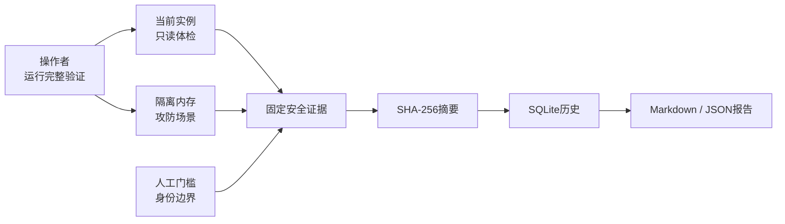

# 安全验证与证据中心

[文档中心](README.md) / 安全验证与证据中心

面向准备评估真实试点的使用者、安全评审者和维护者。本功能从`0.1.0-alpha.16`开始提供：一次操作完成当前实例体检、隔离攻防回归、证据持久化和报告导出，使同一安全结论可以复查、比较和移交。

> [!IMPORTANT]
> 验证中心是产品自检，不是第三方认证，也不会自动批准真实业务试点。当前`identity_boundary=unverified_same_user`仍是人工门槛；必须在目标操作系统、安装方式和运行身份下完成独立验证。

## 一次验证会做什么

验证分成三类：

| 类别 | 检查范围 | 是否接触现有凭据或业务系统 |
| :--- | :--- | :--- |
| 当前实例 | SQLite完整性、外键关系、凭据元数据结构、审计消息白名单 | 否；只读取配置库结构和固定状态 |
| 隔离攻防场景 | 未审批执行、单次消费与幂等重放、配置轮换、授权撤销、中断恢复 | 否；每组场景使用独立内存数据库和合成对象 |
| 人工门槛 | 操作系统身份与安装后访问边界 | 自动记录为“待人工验证”，不能由产品自检判定通过 |

每个自动场景都调用与正常运行相同的目录、策略、审批和状态迁移代码，不建立模拟成功清单，也不把单元测试数量当成运行结果。隔离场景完成后随内存数据库一起销毁。

## 使用方法

1. 启动长期后台代理并通过一次性页面令牌完成配对。
2. 打开左侧“安全验证”。
3. 选择“运行完整验证”，等待页面生成新的历史记录。
4. 检查总状态和每一项证据。任何“失败”都应阻止试点；“待人工验证”表示仍有外部工作未完成。
5. 下载Markdown供人工评审，或下载JSON供后续工具归档和比较。

运行过程不要求填写目标、命令、参数或凭据。创建接口没有请求体，从入口上避免把调用方内容带入证据。

## 结果如何解释

| 状态 | 含义 | 后续动作 |
| :--- | :--- | :--- |
| 通过 | 当前检查得到预期安全结果 | 继续检查其他门槛；单项通过不代表可上线 |
| 待人工验证 | 该结论无法由同一进程可靠证明 | 在独立环境执行对应测试并附评审记录 |
| 失败 | 当前实例或隔离场景偏离预期 | 停止试点，建立问题记录，修复后重新运行完整套件 |

当前总结果通常为“待人工验证”，因为身份边界仍未完成独立验证。只有所有检查均通过时总结果才为“通过”；任何自动检查失败会使总结果为“失败”。

## 证据完整性与数据边界

服务器按固定顺序序列化运行标识、套件版本、应用版本、平台、时间和检查项，并计算SHA-256摘要。读取报告时会重新计算摘要；若数据库中的任一证据字段被改变，`digest_verified`会变为`false`。

摘要用于发现证据被意外或事后修改，不提供签名、可信时间戳或外部见证。能够修改程序和数据库的攻击者也可能替换摘要，因此独立审查仍应记录提交号、构建来源和报告文件哈希。

持久化内容仅允许服务器生成的检查代码、分类、状态、固定说明与固定证据。报告不包含：

- 凭据值、连接串、目标地址或数据库错误原文；
- 终端输出、业务数据、审批理由或用户输入；
- SQL、Shell命令、自由参数或环境变量；
- 真实系统的连接结果。

配置库最多保留128次验证运行，达到上限后拒绝创建新记录，不会静默删除已有证据。维护者应先按组织流程导出、核对和归档，再决定如何清理未来提供的保留策略。

## Web接口

所有接口均要求有效页面会话；创建操作还要求精确Origin。

| 方法 | 路径 | 用途 |
| :--- | :--- | :--- |
| `POST` | `/api/v1/security-validations` | 运行完整套件并原子保存结果；无请求体 |
| `GET` | `/api/v1/security-validations` | 按完成时间倒序读取历史 |
| `GET` | `/api/v1/security-validations/{id}` | 读取一份完整证据 |
| `GET` | `/api/v1/security-validations/{id}/report` | 读取摘要校验结果及Markdown报告 |

这些接口不通过MCP暴露。AI客户端不能用它们替代使用者对真实试点、身份边界或独立审查的决定。

## 验收基线

合入或发布本功能时至少确认：

- 新建数据库和v1—v7数据库均升级到schema v8且保留原记录；
- 完整套件产生9项自动通过和1项身份边界警告；
- 未审批、二次消费、旧版本授权和已撤销授权都被实际拒绝；
- 活动运行恢复为`service_restarted`终态并产生固定中断事件；
- 修改持久化证据后摘要校验失败；
- 未认证读取、缺少可信Origin的创建请求被拒绝；
- Web页面可以查看历史并导出Markdown和JSON；
- Windows、Linux和macOS完成Rust测试、Web测试、构建、静态检查与依赖许可检查。

更多攻击场景和真实试点门槛见[安全模型与验收](安全模型与验收.md)，项目进度见[路线图](../ROADMAP.md)。

---

[返回文档中心](README.md) · [使用指南](使用指南.md) · [安全模型](安全模型与验收.md)
