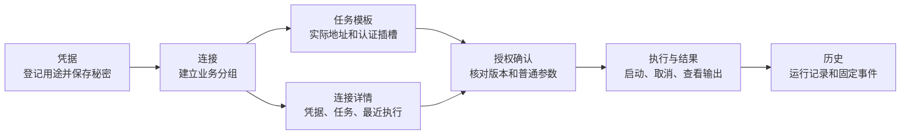

# 工作台使用说明

[文档中心](README.md) / 工作台

密桥将日常操作组织为六个入口。列表负责查找和选择，右侧详情负责查看状态与下一步操作；新增与编辑在独立弹窗完成，不挤占列表空间。窄屏改为上下主从布局，手机宽度使用底部导航。

## 从配置到结果

| 入口 | 内容 | 常用操作 |
|---|---|---|
| 凭据 | 名称、用途、类型和配置状态 | 新建引用、写入或替换秘密、清除秘密、编辑元数据 |
| 连接 | 业务用途分组、环境和关联凭据 | 新建连接、查看关联任务、申请授权、查看最近五次执行 |
| 任务 | 任务模板、授权确认、执行与结果 | 配置连接器、普通参数和凭据插槽，人工批准并执行 |
| 终端 | 持久系统 Shell 会话 | 创建、连接、重连、输入、调整大小、终止 |
| 历史 | 执行历史、事件记录 | 搜索运行、查看输出与生命周期；历史入口不提供新增运行按钮 |
| 设置 | 服务状态、存储方式、数据维护 | 切换语言、解除配对、配置迁移、备份预检与诊断下载 |

> [!NOTE]
> “连接”是现有接口中 `Target` 的界面名称。它用于组织业务用途，不是自动继承地址的连接配置文件。HTTP、SSH、SFTP、Git、数据库任务的实际地址和身份仍在各自模板中配置；连接详情同时展示分组关联凭据和任务插槽真正使用的凭据。不要仅凭分组名称批准任务。

## 完成一次凭据任务

1. 使用后台服务提供的一次性配对链接打开控制台。令牌随初始化从地址栏移除；页面会话只保留在内存，不写浏览器持久存储。
2. 进入 **凭据**，新建引用，填写名称、类型及可选用途。保存后，在该引用详情输入密码、令牌或私钥并保存。成功后输入框清空，页面只显示配置状态，不回读原值。
3. 进入 **连接**，新建业务分组并选择环境、可选关联凭据。数据库分组可以留空 PostgreSQL 主机字段；这些可选字段仅用于旧内置 PostgreSQL 连接检查，不用于 MySQL 或新查询模板。
4. 在连接详情点击 **新建任务**，进入任务模板并点击新建按钮。连接分组自动选中；选择“凭据任务”和执行方式，填写实际地址、认证引用、普通参数、返回字段与超时。保存后可在主从详情中审阅配置。
5. 点击 **申请授权**，确认所选模板、参数、授权方式和有效期。提交申请后仍需要人工点击 **批准**；进入授权页面不会自动批准。
6. 切换到 **执行与结果**，新建运行请求并选择可用授权。过期和不属于当前任务的授权不会列入可选项；限时授权仅复用已确认的同一组参数。启动后自动展开该次运行，显示输出和固定事件。
7. 执行完成后在连接详情或历史中回查结果。连接详情保留最近五次运行入口；历史搜索可查询服务返回的运行记录，输出仍遵循后端有界保留窗口。

各执行方式的限制见[凭据命令任务](凭据命令任务.md)、[HTTP 凭据任务](HTTP凭据任务.md)、[SSH 凭据任务](SSH凭据任务.md)、[文件传输与 Git 任务](文件传输与Git任务.md)、[数据库凭据任务](数据库凭据任务.md)。普通终端不是带密交互式终端，不会获得任务插槽中的秘密。

## 查找、编辑与键盘

- 主从列表支持按名称及类型、环境或状态说明搜索；没有匹配记录时明确提示，不保留误导性的旧详情。
- 搜索不修改数据。删除当前记录后自动展示另一可见记录；清空搜索恢复完整列表。
- 新建、编辑、授权和启动运行使用浏览器原生模态弹窗。打开时焦点进入弹窗，`Tab` 和 `Shift+Tab` 留在其中；`Esc` 或关闭按钮退出，焦点返回触发位置。
- 提交进行中禁止关闭弹窗，避免误以为请求已经取消。成功后关闭；可重试的保存失败保留输入，并在弹窗内显示错误。
- 中英文切换位于页面顶部；在手机宽度底部图标通过可访问名称标识入口。窄屏详情上下排列，长名称换行，不以页面级隐藏溢出代替可访问布局。

## 出错时

| 情况 | 处理方式 |
|---|---|
| 未配对或配对失败 | 确认后台在线，获取新的配对链接；刷新已消费链接不能恢复一次性令牌 |
| 保存失败 | 在弹窗内检查错误和字段，直接重试；不要重新创建同一记录 |
| 版本冲突 | 页面刷新该类记录，按最新版本重新编辑；旧版本不能覆盖最新状态 |
| 关联信息读取失败 | 在连接详情点击重试；不把加载失败误报为没有任务或没有执行 |
| 运行提交结果不确定 | 先查运行记录；再次提交同一授权复用既有请求键，避免重复执行业务操作 |
| 输出读取失败 | 页面自动重试；输出保留窗口之外的内容不能由界面恢复 |
| 不再使用页面 | 在设置中解除当前页面配对，仅撤销该页面会话；它不是停止后台服务或终止终端的按钮 |
| 迁移或恢复配置 | 在设置中先预检再确认追加导入；完整恢复使用全新目录维护命令，重新录入秘密值与授权，见[配置迁移与备份恢复](配置迁移与备份恢复.md) |

## 设计与验证依据

编辑器采用原生 `dialog.showModal()`，遵循 [WAI-ARIA 模态弹窗模式](https://www.w3.org/WAI/ARIA/apg/patterns/dialog-modal/) 的焦点及退出约定。列表、搜索和主操作分离，参考 [Carbon 数据表使用规范](https://v10.carbondesignsystem.com/components/data-table/usage/) 的操作组织方式；这里是主从工作区，并未引入 Carbon 组件依赖。

无窗口浏览器脚本覆盖完整模拟 API 流程、保存失败重试、焦点返回、搜索、中英文及 720/390/320 像素逻辑宽度。720 像素可检查 1440 像素屏幕在 200% 缩放下类似的布局空间，但不等同于所有浏览器原生缩放实测。真实平台字号、输入法、屏幕阅读器和非开发者可用性观察仍列入发布前体验验收；不宣称已取得可访问性认证。
