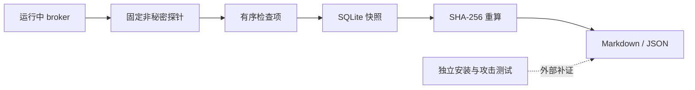

# 平台身份与 IPC 证据

[文档中心](README.md) / [安全模型](安全模型与验收.md) / [M0 验证记录](M0验证记录.md)

本页说明如何采集、阅读和导出 SecretBridge 的平台边界证据，以及哪些结论必须在已安装环境由独立人员验证。该功能只采集固定的非秘密事实，不读取凭据，也不返回用户名、SID／UID、主机名、文件路径、端点名称或运行时令牌。

> [!WARNING]
> 产品自检不是安装认证。当前公开身份边界仍为 `unverified_same_user`。即使所有本机可检查项通过，也必须补齐服务身份、ACL、凭据库和越权主体拒绝的外部证据，才可评估是否改变公开状态。

## 操作流程

1. 启动持久化 broker，并完成一次性页面配对；
2. 打开“平台证据”，选择“采集当前证据”；
3. 先查看总结果，再逐项检查运行目录、IPC、凭据库、安装环境和外部证据；
4. 下载 Markdown 或 JSON，交由独立复核人员与安装测试记录一并保存；
5. 修复本机阻断后重新采集，不覆盖旧快照。

## 结果语义

| 结果 | 含义 | 操作 |
| :--- | :--- | :--- |
| `blocked` | 本机可检查事实失败，例如目录／连接文档无效或 Unix 权限过宽 | 先修复本机问题，不进入试点 |
| `attention` | 本机事实可通过，但安装身份或越权测试仍缺外部证据 | 导出快照并完成对应平台测试 |
| `verified` | 为未来外部证据接入预留；当前产品自检不会自行给出该结论 | 必须由后续签名证据规则驱动，禁止硬编码 |

摘要验证只证明数据库中的快照内容与创建时一致，不证明当时的系统配置真实、测试独立或证据未在入库前伪造。

## 平台检查范围

| 平台 | 当前自动检查 | 仍需外部验证 |
| :--- | :--- | :--- |
| Windows | 运行目录／连接文档存在与类型；命名管道拒绝远程客户端；首实例约束；原生凭据库后端选择 | 目录和连接文档 DACL；命名管道显式 DACL；客户端令牌身份；安装服务身份；非所属／同用户敌对客户端 |
| Linux | 真实目录且非符号链接；目录无 group/other 权限；连接文档和 Unix socket 类型、权限与所有者一致性；对端 UID 检查；原生凭据库后端选择 | systemd user service 安装身份；桌面凭据库实际可用性；非所属用户、同用户替换与运行目录攻击 |
| macOS | 与 Unix 相同的目录、socket、权限、所有者一致性和对端身份检查；原生凭据库后端选择 | launchd agent 身份；Keychain 实机策略；非所属用户、同用户替换和运行目录攻击 |

Windows 当前缺少显式 DACL 与 pipe-client token 校验，因此相关项显示“待验证”，不会被远程客户端拒绝或随机令牌检查替代。Unix 的 UID 检查能拒绝其他用户，但不能阻止同一 UID 下的恶意进程。

## 数据与接口

SQLite schema v10 使用 `platform_boundary_snapshots` 和 `platform_boundary_checks` 保存最多 128 份证据。检查代码、类别、状态、固定说明和固定证据共同进入规范化摘要；读取时重新计算 SHA-256。

| 方法 | 地址 | 行为 |
| :--- | :--- | :--- |
| `GET` | `/api/v1/platform-boundary` | 按时间倒序读取历史；需要页面会话 |
| `POST` | `/api/v1/platform-boundary` | 采集完整固定套件；需要页面会话、精确 Origin 且请求体必须为空 |
| `GET` | `/api/v1/platform-boundary/{id}` | 读取快照并重算摘要 |
| `GET` | `/api/v1/platform-boundary/{id}/report` | 返回快照、摘要结果、Markdown 和范围声明 |

调用方不能提供目录、端点、检查列表、跳过项或结论。报告不包含真实系统标识和秘密；如果未来需要关联安装记录，应保存不透明证据引用，而不是把主机信息直接暴露给 AI 或普通导出。

## 外部验收清单

- Windows：以目标安装身份启动，核对目录、连接文档和命名管道 DACL；分别使用授权身份、非所属用户和远程客户端测试连接；验证连接文档替换和管道抢占失败。
- Linux：以 systemd user service 安装并重启；核对目录和 socket 所有者／权限；以不同 UID、相同 UID 敌对进程和符号链接替换测试；验证凭据库解锁与无图形会话行为。
- macOS：以 launchd agent 安装并重启；核对目录和 socket；验证 Keychain 访问控制；执行不同用户、相同用户替换和符号链接攻击。
- 三个平台均保存安装版本、测试步骤、预期结果、实际结果、复核人和产物哈希；不得把真实密码、账号、主机名或路径写入公开证据。

当前工程候选已经提供采集、持久化、摘要、API、双语界面和导出能力。上述全新安装与敌对主体测试尚未完成时，`alpha.19`仍是进行中状态。

---

[M0 验证记录](M0验证记录.md) · [试点准入中心](试点准入中心.md) · [完整路线图](../ROADMAP.md)
