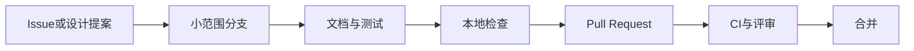

# 开发者入门

[文档中心](README.md) / 开发者入门

本页帮助贡献者获取仓库、运行现有检查并提交可审阅的变更。应用架构与计划接口位于[开发设计](开发设计.md)。

<details>
<summary>本页导航</summary>

- [环境准备](#section-1)
- [获取并检查](#section-2)
- [仓库结构](#section-3)
- [检查器覆盖范围](#section-4)
- [典型贡献流程](#section-5)
- [文档与图表约定](#section-6)
- [常见检查失败](#section-7)

</details>

<a name="section-1"></a>

## 环境准备

| 工具 | 当前要求 | 用途 |
| :--- | :--- | :--- |
| Git | 可克隆GitHub仓库 | 分支、提交与PR |
| Python | 3.11或更新版本 | 仓库检查和单元测试 |
| Node.js | 24.x | Web管理端构建、测试与开发服务器 |
| pnpm | 11.23 | 锁定Web依赖；由根目录`package.json`声明 |
| Rust | stable 1.98或更新 | 本地服务、核心库、测试与Clippy |

Python检查只使用标准库；应用依赖由`pnpm-lock.yaml`与`Cargo.lock`锁定。默认检查使用合成数据，不需要填写凭据或准备业务系统连接。

<a name="section-2"></a>

## 获取并检查

```sh
git clone https://github.com/qq940500529/secretbridge.git
cd secretbridge
git switch -c codex/improve-navigation
corepack enable
pnpm install --frozen-lockfile
python tools/check_repository.py
python tools/check_dependency_licenses.py
python -m unittest discover -s tests -v
pnpm typecheck
pnpm test
pnpm build
cargo fmt --all -- --check
cargo test --workspace --all-targets
cargo clippy --workspace --all-targets -- -D warnings
git diff --check
```

预期结果：仓库检查、前后端测试、类型检查、构建与Clippy均成功，差异检查没有格式错误。普通贡献者可以先fork，再对自己的fork执行以上步骤，向上游main发起PR。

PR CI 在 Linux、Windows 和 macOS 上保留上述检查及依赖许可证、安装包和个人规模验收，并在 Windows/macOS 上额外运行原生凭据库测试。各平台的 Rust 检查与安装包验收使用独立 runner 并行运行，避免编译占用影响代理启动和停止。CI 的一次性 debug/test 构建关闭增量编译和调试符号，正式 release 构建不受影响；固定版本的漏洞扫描器按策略和工具链缓存。首次无缓存运行仍需编译扫描器，任何并行任务失败都会使 CI 失败。

> [!NOTE]
> 自动化测试使用内存凭据库和替换执行器，不访问真实业务目标。不要把真实秘密写入测试、夹具、日志或公开证据。

构建后可启动本地开发实例：

无参数命令启动脱离终端的后台；前台调试用 `cargo run -p secretbridge-server -- --serve`。后台需要停止时运行 `cargo run -p secretbridge-server -- stop`，不是关闭启动终端。安装包构建和三平台隔离验收见[后台运行与安装交付](后台运行与安装交付.md)。

```sh
cargo run -p secretbridge-server
```

服务只绑定回环地址并打开系统默认浏览器。前端开发时可分别运行`cargo run -p secretbridge-server`和`pnpm dev:web`；Vite仅监听`127.0.0.1:5173`并代理`/api`。本项目采用浏览器管理端，不使用桌面壳。

调试MCP stdio模式前先执行`pnpm build`，在一个终端启动长期后台代理：

```sh
cargo run -p secretbridge-server
```

保持代理运行，再由支持命令式stdio服务的MCP宿主启动桥接；也可在另一终端仅验证桥接启动：

```sh
cargo run -p secretbridge-server -- --mcp-stdio
```

桥接进程的stdout专用于MCP JSON-RPC，调试日志必须保留在stderr。它读取与后台代理相同应用数据目录中的`mcp-bridge.json`，并通过Windows命名管道或Unix domain socket连接代理；它不打开浏览器、不加载SQLite、不持有Web监听端口，连接结束也不会停止后台代理。协议、令牌轮换和生命周期测试位于`crates/secretbridge-server/src/mcp.rs`，使用合成状态与临时本机IPC端点，不连接真实业务目标。

Windows 命名管道的安全描述符由独立的 `secretbridge-windows-pipe-acl` crate 通过 Windows API 创建；代理本体继续禁止 unsafe 代码。Windows CI 会检查新建管道的原生 DACL，跨账号访问仍列在[社区验证待办](社区验证待办.md)。

<a name="section-3"></a>

## 仓库结构

```text
SecretBridge/
├── README.md / README.zh-CN.md   产品入口
├── crates/                       Rust核心与本地服务
├── web/                          React／TypeScript管理端
├── docs/                        使用、实现与维护文档
├── tools/check_repository.py    有限仓库检查
├── tests/                       检查器测试
├── .github/                     CI、评审与问题模板
├── SECURITY.md                  私人漏洞报告入口
├── CONTRIBUTING.md              贡献约定
├── ROADMAP.md / CHANGELOG.md     计划与变更
├── Cargo.toml / Cargo.lock       Rust工作区与锁定依赖
├── package.json / pnpm-lock.yaml Web工作区与锁定依赖
├── LICENSE                      AGPL v3原文
├── COPYRIGHT.md / LICENSING.md   公司版权与许可选择
└── COMMERCIAL_LICENSE.md         另行书面商业授权流程
```

<a name="section-4"></a>

## 检查器覆盖范围

| 检查 | 能发现的问题 | 不覆盖 |
| :--- | :--- | :--- |
| 必需文件 | 文档与治理入口缺失 | 内容是否正确、完整 |
| 本地链接 | 缺失文件、越出仓库、无效章节锚点 | 外部站点可用性、完整Markdown语法 |
| 文档结构 | 围栏或折叠区未闭合 | GitHub所有渲染行为 |
| 有限敏感模式 | 部分token、私钥标记、个人路径和内网地址 | 任意秘密、未知编码、全部业务隐私 |
| 文件边界 | 不符合当前允许范围的产物 | 已发布到其他位置的资料 |

检查失败只显示相对路径与规则名，不应输出匹配到的秘密。不要为使检查通过而添加宽泛豁免；确需新的文件类型时，在同一PR说明用途并增加安全测试。

锚点检查支持本仓库使用的显式锚点与简单ATX标题，不是完整的GitHub渲染器。复杂标题使用显式锚点；Mermaid语法与最终图形布局仍需要渲染复核。

<a name="section-5"></a>

## 典型贡献流程



- 功能变更说明行为、授权范围和兼容性；安全边界变化需要单独设计评审。
- 文档变更检查导航、示例、图表和中英文首页的一致性。
- PR写明实际验证的平台；在一个系统运行检查不能代替其他系统的原生测试。
- 遵循[贡献指南](../CONTRIBUTING.md)中的来源、许可与签署要求。

### 连接器界面冒烟测试

真实协议、认证、操作、取消和数据重开的验收在 Rust 测试中执行。数据库可通过 `bash tools/test_database_connectors.sh` 建立仅回环暴露的临时 Docker 服务、合成凭据和测试证书；要求 Docker、OpenSSL 与 Rust。脚本仅清理自身唯一命名的容器和证书，详见[数据库凭据任务](数据库凭据任务.md)。另有交互式浏览器脚本检查 SFTP/Git/数据库编辑器的输入、执行方式切换及实际提交配置；该脚本模拟 API，不触碰系统凭据库或真实业务服务。

启动 Web 开发服务器：

```sh
pnpm --dir web exec vite --host 127.0.0.1 --port 8799 --strictPort
```

安装仓库锁定的 Playwright 浏览器后，可执行单项脚本或汇总验收：

```sh
node tools/smoke_connector_ui.mjs
node tools/smoke_workbench_ui.mjs
python tools/test_browser_acceptance.py
```

Playwright 与 axe-core 是锁定的开发依赖，不进入应用运行包。汇总验收自动启动并停止本机预览，依次执行 Chromium、Firefox 与 WebKit；也可通过 `PLAYWRIGHT_MODULE` 指定外部 Playwright 模块，或用 `PLAYWRIGHT_CHANNEL` 选择本机 Edge/Chrome。测试浏览器始终以无窗口方式运行。

工作台脚本使用内存模拟 API，覆盖六个入口、凭据保存/连接/任务/人工批准/执行/结果、保存失败重试、焦点返回、搜索、中英文和窄屏。可选 `SECRETBRIDGE_UI_SCREENSHOT` 指定 Git 仓库以外的截图位置；截图只含测试数据。它不会写入操作系统凭据库，不能替代真实服务集成测试。

<a name="section-6"></a>

## 文档与图表约定

使用GitHub原生Markdown，不依赖CSS、脚本或嵌入外站。长文提供章节导航；复杂流程使用Mermaid并配一句文字结论。详细案例可折叠，安全限制不能藏在折叠区内。图表必须与正文共享同一组状态和参与方，不添加正文未定义的权限流。

保持术语一致：credential为“凭据”，broker为“执行代理”，approval为“审批”，session为“会话”。首次使用缩写时链接[术语表](术语表.md)。

<a name="section-7"></a>

## 常见检查失败

<details>
<summary>Python无法识别或版本过低</summary>

确认当前终端调用Python 3.11+。Windows可用已安装的Python启动器选择版本；Linux/macOS可按环境使用 `python3` 替代命令中的 `python`。不要通过增加业务凭据来解决开发环境问题。

</details>

<details>
<summary>missing-local-link / missing-fragment</summary>

核对文件名大小写、相对路径和章节锚点。Windows文件系统可能容忍的路径大小写差异，在Linux检查或GitHub上仍可能失败。

</details>

<details>
<summary>unexpected-artifact / symlink-not-allowed</summary>

检查是否加入运行数据、压缩包、缓存或符号链接。先移出待提交范围；新资产类型需要明确来源、许可与检查规则，不能直接放开全部二进制文件。

</details>

<details>
<summary>检测到疑似秘密</summary>

不要将匹配值粘贴到公开Issue。先检查是否为真实凭据；若已经公开，优先在源系统撤销或轮换，再按照[安全报告流程](../SECURITY.md)处理。

</details>

---

继续阅读：[开发设计](开发设计.md) · [安全模型与验收](安全模型与验收.md) · [贡献指南](../CONTRIBUTING.md)
