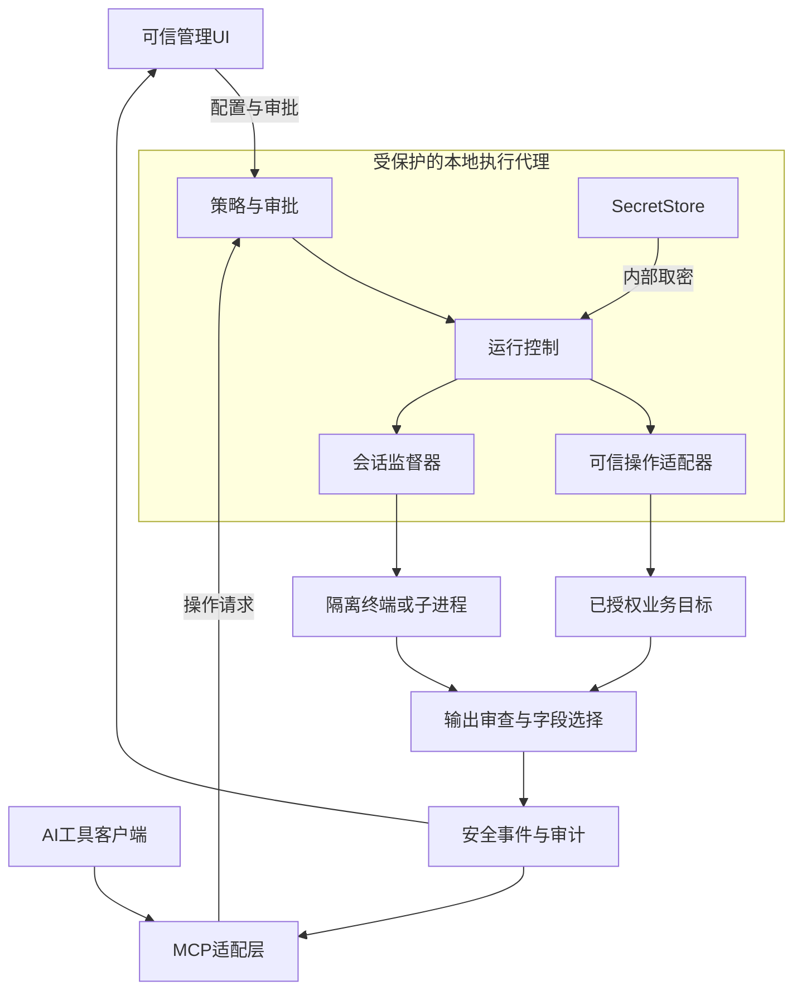
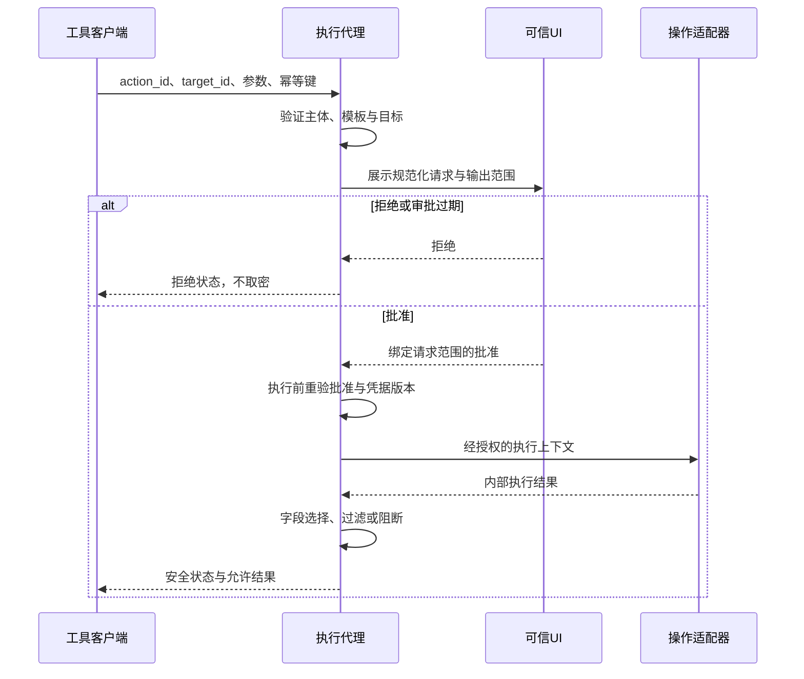
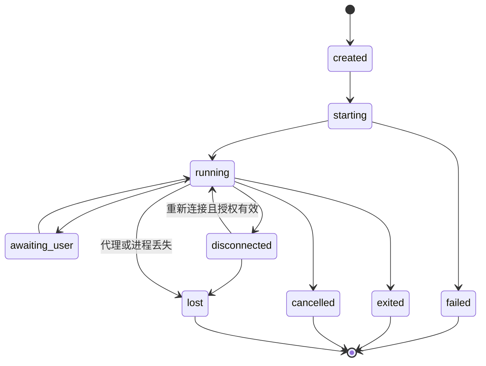

# 密桥开发设计

[文档中心](README.md)

面向核心开发者、适配器作者与安全评审者。本文定义组件职责、执行边界和接口契约；M0已实现的范围会明确标注，其余属于待实现规范。

配套的三平台、UI与发布要求见[跨平台与UI规范](跨平台与UI规范.md)及[开源治理与发布](开源治理与发布.md)，与本文共同构成当前设计。

<details>
<summary>本页导航</summary>

- [产品定位与范围](#section-1)
- [运行模式与隔离要求](#section-2)
- [界面职责](#section-3)
- [组件与信任边界](#section-4)
- [凭据存储与生命周期](#section-5)
- [执行通道与凭据代用](#section-6)
- [输出审查](#section-7)
- [持久化终端与故障语义](#section-8)
- [工具接口契约](#section-9)
- [数据模型与运行目录](#section-10)
- [实现阶段](#section-11)
- [部署前提与开放决策](#section-12)

</details>

<a name="section-1"></a>

## 产品定位与范围

用户在本机UI配置账号、密码、令牌及目标系统，AI只使用不含凭据的操作接口。代理在授权范围内调用可信程序或协议适配器，处理交互登录、长任务与会话状态，再向AI返回审查过的结果。

典型流程：用户配置“测试数据库只读连接”→建立允许的诊断模板→AI请求读取数据库版本→UI展示目标、用途、权限、返回字段并审批→代理内部取密并连接→返回版本、状态、耗时，不返回密码、连接串或认证原始报文。

凭据代用通过可信执行器的认证通道完成，不通过字符串替换生成含密码的shell命令。优先协议认证参数或隔离私有输入通道，不将凭据写入通用命令行。

### 范围

| 首版必须支持 | 分期支持 | 不作为首版承诺 |
|---|---|---|
| 中文UI、凭据新增更新停用、目标绑定、操作审批 | SSH认证、其他数据库、业务HTTP API | 任意命令均安全自动填密 |
| 持久化终端、多会话、断线重连、取消和状态查询 | OpenBao／KeePassXC等外部凭据来源 | 防住管理员、内核恶意软件或整机被控制 |
| 受控操作模板、结构化返回、输出阻断与审计 | 跨机器代理、团队审批 | 电脑重启后原进程与数据库事务原样复活 |
| 本地MCP接入、假凭据安全测试 | 签名更新、企业部署、凭据轮换对接 | 自动处理验证码或静默批准MFA |

首版操作优先只读；“查询”“诊断”标签不能替代服务器端最小权限。

<a name="section-2"></a>

## 运行模式与隔离要求

**开发／兼容模式**：UI与代理可以在同一用户下运行，验证交互及防误泄露；开发阶段仅允许合成凭据；实际测试身份须满足安全试点门槛。界面常驻标识“未验证系统隔离”。该模式不提供针对同账号任意代码执行的隔离保证。

**受控模式**：凭据所有者与AI执行环境隔离。Windows首选验证“专用低权限代理身份＋受限AI账号／隔离环境”的部署；代理并非默认LocalSystem。代理敏感数据、进程内存、策略目录对AI身份不可读写，AI也不能操作凭据录入UI、提权或绕到其他执行工具。可信UI在所有者环境运行。账号、管道ACL、令牌限制、子进程权限与网络规则均需验证，不能只启动第二个进程就称为隔离。

若现有AI宿主无法被约束，则保持兼容模式或改用隔离虚拟机／独立执行机；不自动降级后继续承诺真实凭据安全。

<a name="section-3"></a>

## 界面职责

左侧导航：总览、凭据、目标系统、操作模板、终端会话、审批中心、审计、设置。

| 页面 | 核心内容 | 重要交互与限制 |
|---|---|---|
| 总览 | 代理连接、隔离模式、待审批数、运行中会话、锁定状态 | 常驻紧急停止入口，明确停止的是新请求、当前任务还是所有会话 |
| 凭据 | 别名、类型、用户名、环境、用途、到期／轮换日期、绑定目标 | 密码默认遮蔽；写入不回传明文；更新后清空输入；首版不提供明文导出 |
| 目标系统 | 主机／端口、协议、TLS／主机指纹、测试或生产标签 | 凭据只可用于绑定目标；禁止AI自行更改地址与信任设置 |
| 操作模板 | 非敏感参数表、可执行程序／适配器、返回字段、风险、超时 | 仅可信UI管理，模板修改重新审核并使旧批准失效 |
| 终端 | 多标签、运行状态、工作目录、输入权归属、断线重连 | 区分普通终端和受控会话；窗口关闭默认留后台，退出代理需另确认 |
| 审批 | 调用方、目标、动作、参数、权限、输出范围、有效期 | 准确预览，不展示密码；单次批准默认，不提供隐式永久放行 |
| 审计 | 请求与会话ID、动作、结果、审批记录、拦截原因 | 只存审查后的记录；导出再次扫描，不能导出原始认证流 |
| 设置 | 锁定超时、保留时间、资源限额、受信任客户端、启动方式 | 自动启动需用户选择；更新、备份、恢复单独配置 |

Web适配要求：100%／125%／150%／200%缩放；窄视口侧栏折叠，弹窗可滚动，键盘可操作，生产环境同时使用文字和颜色警示。终端复制默认仅复制已脱敏内容。密码不进入前端持久状态、浏览器存储、分析埋点或错误上报；前端输入短暂存在于内存的残余风险必须承认，不声称JavaScript字符串可可靠擦除。

<a name="section-4"></a>

## 组件与信任边界

> [!IMPORTANT]
> 管理通道和执行通道使用不同权限。图中的“内部取密”只允许发生在受保护的代理与适配器中，不属于模型可调用接口。



操作请求先经过策略与审批，再进入执行。对外输出只有审查后的事件；凭据库不向MCP客户端开放。

- UI：React 19＋TypeScript 7＋Vite 8，由Rust本地服务提供静态资源并在系统浏览器打开。M0服务仅绑定回环地址，浏览器使用一次性启动令牌换取内存会话；令牌不写入LocalStorage、SessionStorage或Cookie。来源精确匹配、会话认证与后端权限校验缺一不可。项目不使用桌面壳，也不加载远程脚本。
- 代理：Rust，管理策略、授权、凭据、运行与会话生命周期。与UI解耦；生产部署形态由隔离验证决定。
- PTY：Windows使用ConPTY，Linux和macOS使用POSIX PTY；优先评估portable-pty封装，不可用时分别评估对应平台的原生API。xterm.js只负责展示和键盘输入，不是进程持久化组件。[ConPTY](https://learn.microsoft.com/en-us/windows/console/creating-a-pseudoconsole-session)、[portable-pty](https://github.com/wezterm/wezterm/tree/main/pty)
- 存储：SQLite只存非秘密元数据、策略版本、会话索引、脱敏审计；凭据由SecretStore接口后端保存。路径、账号和业务结果仍可能敏感，需ACL与保留策略，并非“非密码就可公开”。
- 通信：M0浏览器管理端通过回环HTTP访问本地服务，采用一次性配对、Bearer会话、精确Origin校验及禁止缓存的响应头；回环地址不被当作身份。后续AI适配层与受保护代理之间，Windows评估本地命名管道，Linux/macOS评估Unix domain socket并核对对端身份。管理端与AI端权限分离；同一OS身份仍不能提供强隔离保证。[命名管道安全](https://learn.microsoft.com/en-us/windows/win32/ipc/named-pipe-security-and-access-rights)
- MCP：轻量适配层计划通过stdio为AI宿主提供工具，转发到长期运行代理；stdio进程退出不带走终端。协议stdout不能混入日志，内部诊断走经脱敏的stderr。浏览器管理接口已经使用认证，不向AI暴露取密端点。[MCP传输规范](https://modelcontextprotocol.io/specification/2025-11-25/basic/transports)

<a name="section-5"></a>

## 凭据存储与生命周期

数据流：可信UI输入→受限管理接口→SecretStore写入→仅回传credential_id与状态。AI不能创建、更新、导出或读取秘密，不能获取秘密长度、尾号或可用于猜测密码的摘要。别名及资源清单也按授权过滤。

SecretStore按平台实现：macOS Keychain、Linux Secret Service；后两者的会话与权限边界见跨平台规范。Windows首版评估Credential Manager，或以受限用户范围DPAPI保护本地秘密。禁止把密钥和密文一起放在AI可访问目录；不将机器范围DPAPI当成用户隔离。采用专用代理身份时，凭据必须在该身份的正确保护范围内，需验证服务用户配置文件、重启可用性与恢复流程。[CredReadW](https://learn.microsoft.com/en-us/windows/win32/api/wincred/nf-wincred-credreadw)、[DPAPI](https://learn.microsoft.com/en-us/windows/win32/api/dpapi/nf-dpapi-cryptprotectdata)

状态：未配置→可用→锁定／过期／停用→撤销。UI空闲锁定后不再取密、不接收新凭据任务；默认终止使用该凭据的受控会话，避免把“锁库”误当“已撤销已登录连接”。普通无凭据任务可继续。允许保留受控会话只能由明确策略批准，并显示仍然有效的远程权限。

轮换更换引用的秘密版本，撤销旧授权；已有连接按策略中断，不假设密码更新能自动踢掉所有已认证会话。备份首版仅导出不含秘密的配置，恢复后重新录入；跨机加密凭据备份留待单独设计，不直接复制DPAPI文件就宣称可恢复。

<a name="section-6"></a>

## 执行通道与凭据代用

### 普通终端与受控操作

**普通持久化终端**：允许用户／AI在授权工作目录执行普通命令，明确这是代码执行权限；运行身份不能读取凭据库，也不接收秘密环境变量、认证句柄或带密历史。目录约束是策略，不是操作系统沙箱。

**受控凭据操作**：AI只能选择已审核action_id及结构化参数。代理绑定固定目标、执行器、凭据、返回schema。不得将带凭据的PTY降级为通用shell供AI自由输入；不得给同一会话再开放raw write、attach/debug或导出认证环境。

保留持久化SSH／数据库连接的能力时，以受控session_id操作，后续请求仍逐条授权。临时登录并不等于无限期、任意命令授权。

### 模板与审批

模板包括：ID、版本、固定目标、适配器、可执行文件身份、参数schema、凭据绑定、输出schema、网络范围、超时、允许角色、风险、审批规则。模板与二进制位于AI不可修改目录；验证哈希／签名、配置、动态库和插件搜索路径，避免“批准了一个程序，执行时被换成另一个”。

AI参数不直接拼接到PowerShell／cmd／sh。优先进程参数数组和固定程序，拒绝任意脚本片段、未知flag、任意配置文件、动态插件、response file与环境覆盖。即便不用shell，恶意CLI参数仍可越权，必须做语义约束。

审批绑定规范化请求摘要、主体、action版本、目标、参数、凭据版本、输出范围、session范围与有效期；执行前再次比对，禁止请求批准后更换目标。批准凭证内部保存、单次或有限次使用、防重放，不把可转用的批准token交给模型。超时默认拒绝。拒绝后不能悄悄重试换工具绕行。

### 请求与审批时序



批准不直接发送给模型作为可转用令牌。审批后任何目标、参数、模板或凭据版本变化都需要重新校验。

### 凭据注入优先级

| 手段 | 设计决策 |
|---|---|
| 协议／SDK认证字段、内部连接句柄 | 优先；秘密只在可信适配器短暂使用，严禁debug打印连接参数 |
| 程序明确支持的私有stdin／认证管道 | 单独适配和测试；不能把密码混入普通shell输入 |
| SSH agent／短期证书／Windows集成身份 | 按系统适配；限制agent能签什么、谁能访问，不能把agent socket开放给任意AI程序 |
| 临时凭据文件 | 例外兼容；专用身份ACL、短生命周期、无工作区路径、崩溃清理；不承诺安全擦除SSD |
| 子进程专用环境变量 | 默认禁用，仅个别适配器风险评审后例外；不进入持久shell或继承给后续任务 |
| 密码命令行参数、连接URI内嵌密码 | 默认禁止，可能进入进程列表、历史、崩溃报告或日志 |
| 自动匹配“Password:”并填入任意PTY | 禁止通用实现；只能针对固定可信程序、固定目标及明确认证状态机 |

PostgreSQL官方不建议用PGPASSWORD环境变量；密码文件也只是降低命令行暴露，不消除同身份读取风险。首个数据库适配器优先协议库；若必须psql，则单独评审临时passfile、参数、会话权限和清理。[环境变量](https://www.postgresql.org/docs/current/libpq-envars.html)、[密码文件](https://www.postgresql.org/docs/current/libpq-pgpass.html)

数据库首版仅发布具体查询模板与最小权限数据库身份，不因SQL以SELECT开头就放行；拒绝任意SQL、服务端文件读取、外部程序调用等扩展能力。SSH必须校验主机指纹，HTTP／数据库TLS校验失败不得自动关闭验证，重定向不得携带认证信息跨目标。

<a name="section-7"></a>

## 输出审查

严格通道默认只向AI释放声明的字段，例如状态、版本、计数、经批准的结果列。原始stdout/stderr、认证错误对象、HTTP头、连接串和崩溃内容不自动传出。无法判定安全时返回固定错误码和需人工审查状态，不返回“脱敏失败前的片段”。

普通终端和经审查兼容输出使用增量过滤：跨stdout/stderr与事件元数据一致处理，UTF-8边界完整缓冲；对于已知秘密和有限已知编码变体，保留最长匹配长度减一的尾部后再释放，结束／取消也必须过滤尾部。超长秘密、二进制或无法规范化控制序列时阻断该输出，而不是直接透传。

此方法只覆盖已知模式，不能发现任意编码、拆分、加密或逐字外泄，更不能追回已发出的流式字符。强安全来自不允许携密任意执行、最小权限与结构化出站控制，不来自承诺“所有输出百分百脱敏”。

所有通道统一：UI终端、AI事件、错误、通知、日志、审计、下载、剪贴板、导出。禁止保存原始流后再在显示层打码。禁用终端自动剪贴板写入（如OSC52）、自动链接访问、远程图片／HTML解释和可能外发数据的附加功能；不把终端输出当作可信指令。[xterm.js安全说明](https://xtermjs.org/docs/guides/security/)

业务数据同样可能不宜发给模型：支持列白名单、行数／字节上限、人工查看模式；“不含密码”不等于“所有客户与生产数据都可以发送”。

<a name="section-8"></a>

## 持久化终端与故障语义

| 事件 | 保证目标 |
|---|---|
| AI单次调用结束／聊天切换 | 后台代理保留PTY，session_id允许授权客户端重新连接 |
| UI窗口关闭 | UI脱离，代理继续；重新打开恢复标签、状态与安全历史 |
| 客户端断线 | 按cursor恢复安全事件，不能重复执行已提交的命令 |
| 代理崩溃／退出 | 丢失的会话标记lost，主动取消按cancelled确认；清理孤儿进程，不伪造仍在运行 |
| 系统注销／关机／重启 | 只恢复配置与已存安全历史；原进程、内存、事务不保证恢复 |
| 远程连接断开 | 标记disconnected，重新认证需要有效授权；不自动重放写操作 |

会话监督器持有进程、PTY与管道，不依赖MCP工具进程。Linux通过进程组及可用的systemd/cgroup管理，macOS通过launchd与进程组管理；不能将Windows Job Object视为跨平台API。采用Windows Job Object或等效进程组策略控制子进程树，验证UI关闭不会误杀代理、代理退出不会留下携权子进程。ConPTY通道读写异步处理，避免大输出和退出时互锁。

### 会话生命周期



图示主要运行路径；审批在任务启动前由请求状态管理，不能用会话存活代替审批。会话由用户、项目、客户端授权范围和目标共同绑定；session_id不是认证凭据。断线恢复只恢复连接，不重放已提交的业务操作。

同一PTY只允许一个输入租约，其他连接只读，避免两个AI或用户同时输入。受控会话不开放普通raw write；MFA由可信UI接管，AI只收到“等待用户”，不收到验证码和键盘事件。

持久目录和环境：cd、普通变量、长进程在同一PTY继续存在；不得保存秘密变量。cwd与退出码由可信监督通道或适配器确认，不仅依赖终端里的魔法标记；无法可靠获得时返回unknown，不能把伪造prompt当作命令完成。

资源限额建议初值：4个并发会话，单任务输出上限8 MiB、单事件64 KiB、AI单次读取最多256 KiB；超出给出truncated和明确范围，不静默丢失。数值是待压测的配置提案。加背压、磁盘配额和TTL；不记录原始认证缓冲。

<a name="section-9"></a>

## 工具接口契约

以下是拟开发的密桥自定义接口，不是现成MCP标准工具。接口版本独立于产品版本管理。

| 工具 | 功能 | 边界 |
|---|---|---|
| actions.list | 列出当前主体可用操作及参数 | 不列出完整凭据库 |
| actions.preview | 返回目标、参数、权限及预计返回字段 | 不取密，不含真实连接串 |
| actions.request | 请求执行，可能返回pending_approval | 批准前不执行；有幂等键 |
| runs.get／runs.cancel | 查询、取消指定任务 | 校验归属；取消后确认子进程与远端状态 |
| sessions.open／list／close | 管理普通终端或受控会话 | 类型固定，不能普通转携密后继续自由输入 |
| sessions.write | 给普通终端写入输入 | 受控凭据会话必须拒绝 |
| events.read | 按cursor读取已审查事件 | 断线恢复、上限、权限、缺失范围明确 |

不提供secrets.get、密码解密、原始环境导出、认证流下载等接口。

```json
{
  "action_id": "postgres.server_info.read",
  "target_id": "demo-test-db",
  "parameters": {"include_uptime": true},
  "idempotency_key": "demo-request-001"
}
```

示例不含真实地址与凭据。目标和凭据关系由可信UI配置。调用方身份取自可信连接，不接受模型传来的owner字段作为身份依据。

事件包字段：schema_version、run_id、session_id、sequence、cursor、timestamp、kind、status、safe_payload、redaction_count、truncated。审批等待、启动、运行、取消和失败均有显式事件；HTTP或MCP请求返回成功不等于业务操作完成。轮询／订阅只读取代理状态，不把返回消息解释成新的执行授权。

<a name="section-10"></a>

## 数据模型与运行目录

元数据实体：CredentialRef、Target、ActionTemplate、Policy、Approval、Session、Run、SafeEvent、AuditEntry。均带创建／更新时间与版本；凭据明文不在这些表中。身份、目标、策略和审计文件的ACL与完整性同样需要保护。

实现按Web UI、broker核心、协议schema、Windows／Linux／macOS平台层、适配器、MCP桥接、单元／集成／安全测试、服务安装与更新拆分。模块应随可验证功能引入；凭据保护采用经过评审的成熟方案，不自行设计加密格式。

运行数据不得放入Git工作区：用户配置与脱敏历史放受ACL保护的应用数据目录；服务凭据与策略位于专用身份受保护位置。具体路径在安装与服务账号实验通过后定稿，不能硬编码开发者个人路径。

<a name="section-11"></a>

## 实现阶段

| 阶段 | 交付 | 通过条件 |
|---|---|---|
| M0 安全可行性 | 合成模式服务、Web管理端、一次性配对、权限隔离与PTY实验 | 无真实凭据路径；错误来源和令牌被拒绝；UI退出PTY存活；证据记录 |
| M1 本地产品骨架 | 凭据UI、目标／模板、审批、日志、终端标签与重连 | 全流程只用假凭据，日志无秘密，输入与输出隔离 |
| M2 受控执行 | 一个PostgreSQL只读适配器、MCP工具、取消／幂等／事件 | 审批绕过、会话越权、编码泄漏用例通过；不开放任意带密shell |
| M3 测试环境试点 | 用户专门新建低权限测试身份、轮换撤销、失败恢复 | 安全清单无未解决高危问题，用户明确批准实际系统测试 |
| M4 可分发版本 | 三平台服务包、后台启动、卸载、签名与依赖记录 | 全新机器部署、浏览器兼容、重启恢复语义、备份恢复、升级回滚通过 |

首个可运行原型版本为0.1.0-alpha.1，后续按实际变更递增。开发工作量以M0实验结果估算，里程碑的退出条件优先于时间估算。发布前固定依赖版本／锁文件，核对许可证和漏洞，保留构建输入、服务包哈希和SBOM；仅发布通过对应验收的产物，发行内容不得包含运行时凭据。商业发行还须满足[贡献与再许可](贡献与再许可.md)及[依赖许可评估](依赖许可风险评估.md)的门槛。

<a name="section-12"></a>

## 部署前提与开放决策

首版面向Windows、Linux、macOS，提供中英文UI，主要服务单人本地诊断场景。PostgreSQL作为首个实际适配器仅是便于验证的建议，可按首个业务需求调整。

实现前需明确：AI宿主能否放进受限账号／虚拟机；是否允许安装专用账号后台代理；第一个实际目标系统；可允许的命令集合；结果数据哪些能发给模型。连接配置须由有权限的所有者提供，禁止从既有材料自动收集或导入秘密。

---

继续阅读：[跨平台与UI规范](跨平台与UI规范.md) · [安全模型与验收](安全模型与验收.md)
