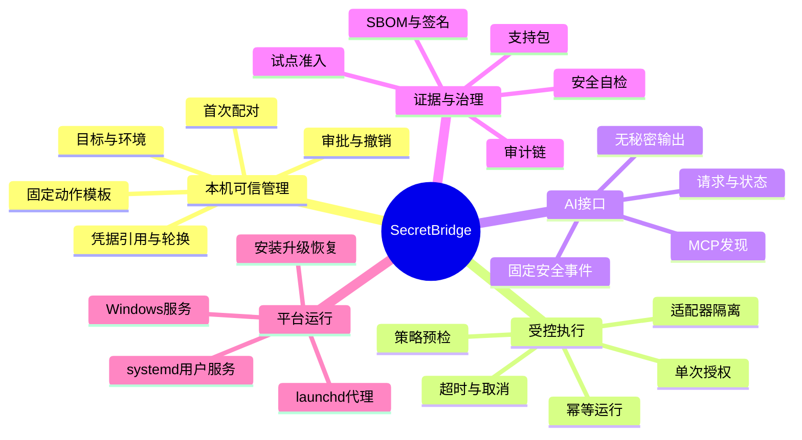
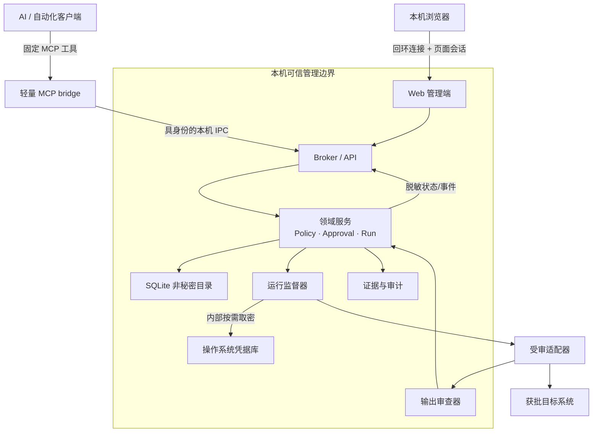
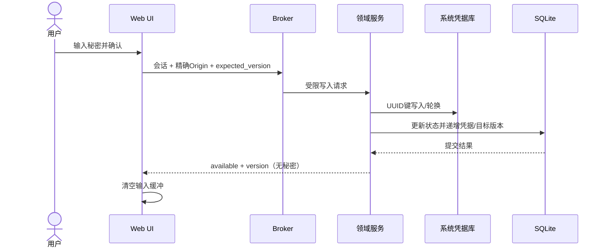
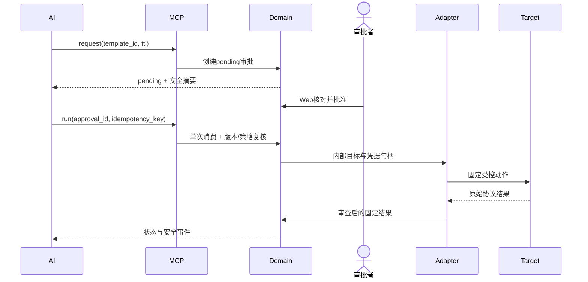
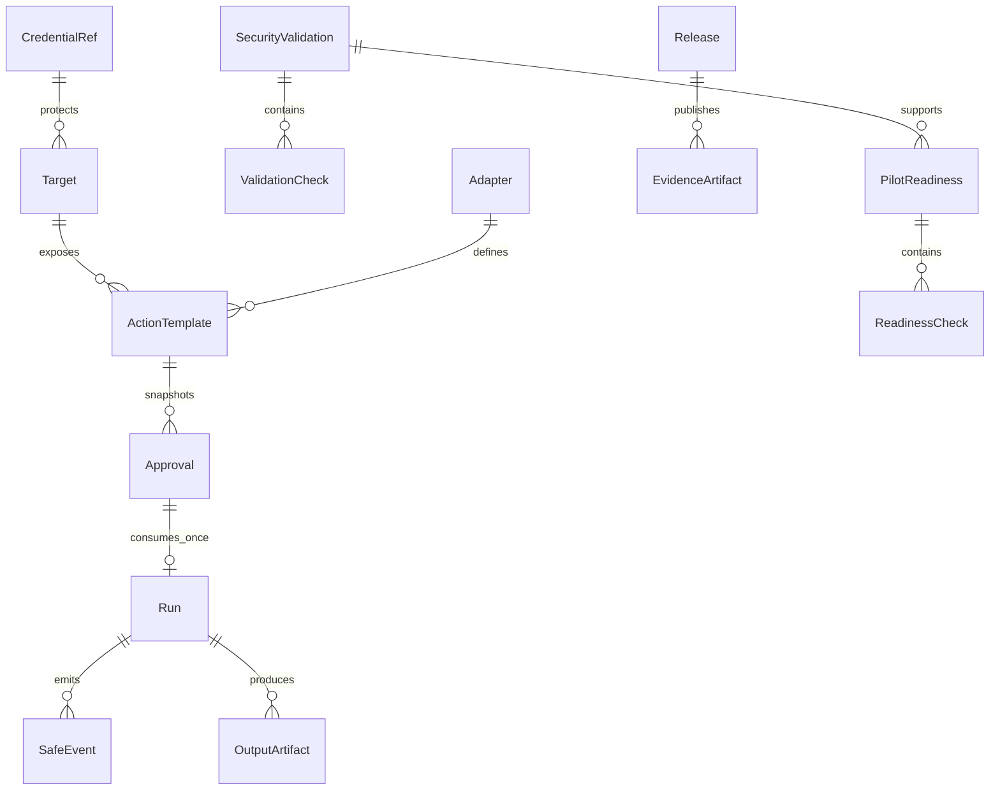
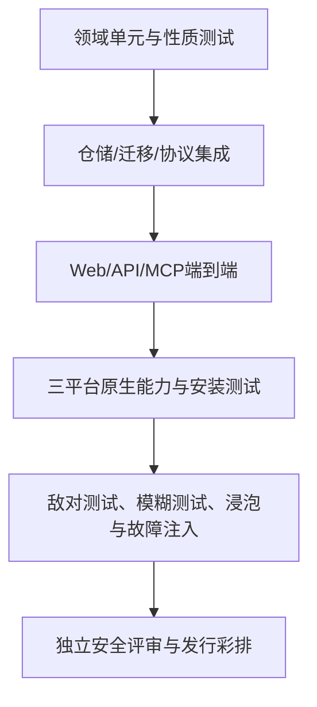

# SecretBridge 成熟态软件架构与功能说明

[文档中心](README.md) / [完整路线图](../ROADMAP.md) / [当前开发设计](开发设计.md)

本文描述 SecretBridge 完全成熟时的软件形态，用于约束未来版本的模块边界、功能范围、数据流、安全属性和验收方式。它是目标架构，不代表当前 alpha 版本已经提供全部能力。当前实现状态始终以 [完整路线图](../ROADMAP.md) 和 [变更日志](../CHANGELOG.md) 为准。

## 1. 产品定义

SecretBridge 是部署在用户可信设备上的“凭据代用与受控执行代理”。用户在本机可信 Web 界面维护凭据引用、目标、策略和审批；AI 或自动化客户端只能提交结构化、受限制的动作请求。代理在本机内部取用凭据，调用经过评审的协议适配器，然后只返回经过审查的状态或业务允许字段。

它解决的不是“怎样把密码安全发给 AI”，而是“怎样让 AI 完成需要认证的工作，却从未获得可复用密码”。

### 1.1 成熟版目标

- Windows、Linux、macOS 上一致的本机 Web 管理体验；
- 凭据明文只存在于操作系统凭据库和最短生命周期的代理内存；
- AI 仅能发现固定动作、请求审批、启动一次性运行、取消和读取脱敏事件；
- 人工审批明确显示目标、动作、权限、有效期和结果范围；
- 长任务可断线恢复观察，但网络重连不自动重放业务操作；
- 每次策略判断、授权变化和运行状态都有安全、可校验的证据；
- 三平台安装、升级、卸载、备份、恢复、签名和源码对应可验证；
- 支持经独立评审的适配器扩展，而不是开放任意带密 Shell。

### 1.2 明确非目标

- 密码保险箱浏览、秘密导出或向模型返回秘密；
- 任意 SQL、任意 Shell、任意脚本或调用方上传可执行内容；
- 由提出请求的 AI 自己作出批准；
- 依靠提示词、日志脱敏正则或“模型承诺不泄露”构成安全边界；
- 默认开放公网控制面、远程多租户或跨设备同步；
- 把同一操作系统账号下的任意恶意代码视为已经隔离；
- 在没有独立证据时宣称通过安全认证或生产验证。

## 2. 用户角色与职责

| 角色 | 主要职责 | 不允许的越权 |
|---|---|---|
| 本机所有者 | 安装、配对、管理数据和安全设置 | 不能让软件伪造目标方授权 |
| 凭据管理员 | 写入/轮换/清除秘密，关联目标 | 不能通过 UI 读回或导出秘密 |
| 审批者 | 核对动作范围并批准、拒绝、撤销 | 不能批准自由命令或扩大模板能力 |
| AI/自动化客户端 | 发现动作、预检、申请、运行、查询、取消 | 不能取密、决定审批、修改策略或目标 |
| 适配器开发者 | 实现固定协议动作和输出 schema | 不能绕过代理取密、策略、审计和取消 |
| 安全评审者 | 复核实现、依赖、部署证据和发现项 | 不能把产品自检等同独立审计 |
| 目标系统负责人 | 授权试点/使用并确认远端最小权限 | 不能由本机自动勾选替代其授权 |

## 3. 成熟态功能地图



### 3.1 首次启动与会话

- 服务仅监听回环地址，并拒绝非回环绑定；
- 启动器把一次性配对能力放在 URL fragment，浏览器网络请求不会携带该 fragment；
- 配对成功后能力立即失效，页面会话只保存在页面内存、可撤销并有短期过期；
- 所有修改请求要求已认证会话和精确 Origin；
- WebSocket 在连接后首帧认证，不把令牌放在 URL；
- 页面刷新、浏览器崩溃和服务重启的恢复语义清楚可见，不静默扩大权限。

### 3.2 凭据生命周期

- 支持密码、API 令牌，以及未来经专门设计的 SSH 私钥/证书类型；
- 元数据与秘密分离：SQLite 仅保存引用 UUID、类型、用途、状态、版本和时间；
- 秘密由 Windows Credential Manager、Linux Secret Service、macOS Keychain 等平台后端保护；
- UI 只能写入、轮换、清除和查看“是否配置”，不存在读回按钮或 API；
- 轮换/清除递增关联目标版本，使旧审批和排队运行默认失效；
- 浏览器输入保存后立即清空，代理临时缓冲最短化并进行可行的内存清理；
- 备份与支持包不包含秘密，跨设备迁移必须重新配置或使用平台批准的迁移方式。

### 3.3 目标、动作与策略

- Target 只描述经过校验的结构化连接元数据、环境和凭据引用；
- ActionTemplate 把一个固定适配器动作、一个目标、结果范围、超时和启用状态绑定；
- Policy 使用版本化的固定规则评估，而非调用方自由表达式；
- 预检给出稳定的允许/拒绝决定、原因代码、所用版本和强制保障；
- 目标、模板、凭据或策略变化使旧快照默认失效；
- 生产环境动作使用更严格的策略层级，1.0 本地版默认不开放生产写操作。

### 3.4 审批中心

- 请求页面展示动作、目标友好名称、环境、结果范围、预计时长、申请来源和过期时间；
- 审批只允许固定状态转换，并使用乐观版本防止旧页面覆盖新决定；
- 批准是一次性、限时、绑定模板/目标/策略版本的能力，不是通用令牌；
- 撤销传播到排队和运行任务；无法确认远端停止时状态为 unknown/needs-review，而非假装取消成功；
- 敏感审批备注不返回 AI；导出时按角色和用途限制字段。

### 3.5 运行与会话

- Run 从已批准且未消费的审批创建，数据库唯一约束保证一次消费；
- 幂等键只保存摘要，相同请求重试返回原运行，冲突复用被拒绝；
- 状态机覆盖排队、运行、等待用户、成功、失败、取消、中断和未知结果；
- 进程、网络和协议操作必须响应取消，取消结果区分“已请求”和“已确认”；
- 服务崩溃后不会自动重放非幂等业务动作；
- 普通终端与携凭据适配器分离，受控会话禁止转为自由输入；
- 长任务使用 cursor 读取有界事件，明确报告截断和缺失范围。

### 3.6 适配器

每个适配器由“动作清单 + 输入 schema + 权限声明 + 执行器 + 输出审查器 + 契约测试”组成。

| 层 | 要求 |
|---|---|
| Manifest | 固定动作 ID、版本、目标类型、风险级别、结果 schema、超时范围 |
| Validator | 拒绝未知字段、自由命令、越界长度和不兼容目标 |
| Credential binding | 只通过内部句柄按需取用，不把秘密复制给日志或环境 |
| Executor | 使用协议库或固定 argv，不拼接 Shell；支持超时和取消 |
| Output reviewer | 白名单字段、长度/行数限制、分类与必要脱敏 |
| Evidence | 固定事件、版本快照、结果状态、截断/未知标记 |
| Contract tests | 绕过、注入、泄漏、超时、撤销、重放、崩溃和平台矩阵 |

首个适配器只提供 PostgreSQL 固定只读连接检查。未来 HTTP、SSH、其他数据库或业务系统动作必须逐个建模，不能通过一个“通用执行适配器”规避评审。

### 3.7 MCP 与自动化接口

- MCP bridge 是无状态、轻量的 stdio 进程；长期状态归 broker；
- bridge 与 broker 使用平台本机 IPC，具备对端身份、ACL、容量和时间限制；
- AI 工具集保持小而固定：发现、预检、请求审批、查询审批、启动、查询、取消、事件；
- MCP 摘要 DTO 与内部领域对象分离，避免序列化时意外扩大数据面；
- 协议失败不会触发自动重试写操作，客户端通过幂等键和查询恢复；
- 将来如支持其他协议，必须映射到同一领域服务，不能复制一套弱化规则。

### 3.8 证据、准入与审计

- 安全验证中心运行当前实例只读检查与隔离攻击场景；
- 试点准入中心汇总技术配置、自检证据和必须由外部完成的人工门槛；
- 审计记录使用服务端固定事件、序号、版本和明确来源；
- 证据摘要用于发现落库后变化，但不是数字签名；正式发行证据另行签名；
- 支持包只包含允许的诊断字段，并在导出前运行敏感内容扫描；
- 独立评审发现项具备严重性、负责人、修复、复测与风险接受到期。

### 3.9 安装、更新与运维

- 三平台采用各自受支持的用户级/服务级监督机制；
- 安装器创建明确的程序目录、受保护数据目录和日志目录；
- 升级前备份非秘密数据库，迁移失败原子回滚，较新 schema 拒绝旧程序打开；
- 卸载区分删除程序、保留配置、删除非秘密历史和清除系统凭据；
- 发布物包含签名、哈希、SBOM、许可证、对应源码和已知限制；
- 更新不静默改变策略、适配器权限或数据保留。

## 4. 逻辑架构



### 4.1 组件职责

| 组件 | 负责 | 不负责 |
|---|---|---|
| Web UI | 配置、人工决定、状态呈现、报告导出 | 保存长期会话、读取秘密、直接连接目标 |
| Broker/API | 会话、Origin、限流、DTO、WebSocket | 实现业务协议、复制策略判断 |
| Domain | 不变量、状态机、版本、幂等、授权重检 | 读取 UI 文本决定权限 |
| Policy engine | 固定规则和原因代码 | 执行操作、保存秘密、动态 eval |
| Run supervisor | 生命周期、超时、取消、恢复和并发 | 允许普通终端继承秘密 |
| Adapter host | 固定协议动作和内部取密 | 暴露原始认证流、任意命令 |
| Output reviewer | schema、白名单、限长、截断和分类 | 依赖模型自行判断是否敏感 |
| Catalog | 非秘密元数据、状态、事件、证据 | 保存密码、私钥、可复用批准令牌 |
| Native vault | 保存秘密值 | 保存业务流程状态 |
| MCP bridge | 协议转换和有界 IPC | 持久状态、审批决定、取密 |
| Platform service | 启停、身份、目录权限、升级 | 改变业务授权 |

### 4.2 代码分层目标

```text
web/
  shell/              导航、配对、语言、全局错误
  features/           credentials、targets、approvals、runs、evidence
  api/                严格 DTO 客户端，不含秘密缓存
crates/
  secretbridge-core/  公共状态、固定 schema、稳定错误码
  domain/             策略、审批、运行和不变量
  catalog/            SQLite 仓储与迁移
  secret-store/       平台凭据库抽象
  adapter-sdk/        manifest、上下文、输出审查和契约测试
  adapters/           postgres、未来独立适配器
  broker/             Web API、会话、Origin、WebSocket
  mcp-bridge/         stdio 与本机 IPC
  platform/           Windows/Linux/macOS 服务、ACL、身份探针
  evidence/           自检、准入、报告、支持包
```

当前仓库尚未完全按上述 crate 拆分；拆分只在能够保持行为和测试证据时进行，不为目录美观制造高风险大重写。

## 5. 关键数据流

### 5.1 凭据写入与轮换



跨 Vault 与 SQLite 失败必须尝试补偿，并向用户显示“不确定/需核查”，不能假装两边一致。

### 5.2 AI 请求到一次性运行



### 5.3 重连与未知结果

- 读连接可按 cursor 重建，不改变运行状态；
- 写请求超时后，客户端用原幂等键/运行 ID 查询，不盲目重试；
- broker 重启把不能证明仍在运行的本地任务标为 interrupted/unknown；
- 对远端可能已提交的动作，必须提供专门对账或补偿动作，不能通用重放；
- 所有缺失输出和截断都显式标记范围。

## 6. 成熟态数据模型



所有领域记录包含 UUID、创建/更新时间、schema/实体版本和必要来源。删除遵循“活动引用禁止、历史默认保留、清理明确审计”；秘密值、原始连接串、认证交互和未审查输出不属于领域数据库。

| 分级 | 示例 | 存储/输出规则 |
|---|---|---|
| Secret | 密码、令牌、私钥、会话凭据 | 仅系统凭据库/短暂内存，永不导出 |
| Restricted | 目标地址、用户名、审批备注、内部错误 | 仅可信 UI 按需显示，不进入 MCP/公共报告 |
| Safe metadata | UUID、固定动作、环境、状态、版本 | 可进入受鉴权 API，按最小需要输出 |
| Public evidence | 构建哈希、SBOM、公开测试结果 | 可随发行发布，不含本机或目标信息 |

## 7. 安全架构

### 7.1 纵深防御

1. **减少能力**：没有取密、任意 SQL 或带密 Shell 接口；
2. **可靠身份**：页面配对、短期会话、Origin、本机 IPC 对端身份和目录 ACL；
3. **范围授权**：固定模板、结果范围、TTL、版本快照和一次消费；
4. **执行隔离**：普通终端与携密适配器分离，适配器最小权限；
5. **输出限制**：固定 DTO、字段白名单、容量与分类，不依赖事后正则；
6. **可恢复性**：幂等、取消、重启、未知结果、备份和回滚；
7. **可证明性**：安全测试、准入快照、审计、签名发行和独立评审。

### 7.2 信任边界

- 浏览器不是秘密持久存储；MCP 客户端和 AI 内容均不可信；
- 目标返回内容不可信，可能包含提示注入或秘密；
- 本机同用户进程并非天然可信，成熟版必须公开剩余边界；
- 第三方适配器、依赖、安装器和更新源属于供应链边界；
- 产品自检是回归证据，不是第三方认证。

### 7.3 必测攻击面

会话窃取、Origin 绕过、WebSocket token 泄漏、审批重放、版本竞态、目标替换、凭据轮换竞态、MCP schema 扩张、IPC 抢占/伪造、目录重解析、日志/报告泄漏、输出编码绕过、提示注入、依赖投毒、升级降级、崩溃残留、同用户调试与内存读取边界。

## 8. 部署架构

| 平台 | 成熟态监督方式 | 凭据库 | 本机 IPC | 重点验收 |
|---|---|---|---|---|
| Windows | 评审后的用户态启动或 Windows Service | Credential Manager | 命名管道 | 服务SID/用户、显式DACL、远程拒绝、升级签名 |
| Linux | systemd user service（优先） | Secret Service | Unix socket | UID、0700/0600、无图形会话时凭据库行为、包签名 |
| macOS | launchd user agent | Keychain | Unix socket | Keychain ACL、UID、应用签名、公证与升级 |

控制台默认只在本机浏览器打开。若未来引入远程控制面，必须进入 2.0 独立项目，不复用“回环 + 页面会话”的本机威胁模型。

## 9. 非功能要求

| 维度 | 1.0 目标 |
|---|---|
| 安全 | 默认拒绝、最小权限、无秘密读取面、关键边界有独立证据 |
| 可靠性 | 崩溃不静默重放；状态可恢复或明确 unknown；迁移原子 |
| 性能 | 控制台交互可感知响应；长任务不阻塞 API；历史和输出有界 |
| 可用性 | 新用户能按引导完成配对到首个合成运行；错误给出行动建议 |
| 可访问性 | WCAG 2.2 AA 目标、键盘、读屏、缩放和减少动态 |
| 国际化 | 中英文关键流程一致，固定错误码与显示文案分离 |
| 兼容性 | 列明 OS/架构/浏览器/凭据后端，未验证即不声称支持 |
| 可维护性 | 固定依赖、自动测试、模块边界、迁移说明和架构决策记录 |
| 可审计性 | 关键变更有来源、顺序、版本和安全事件；报告可校验 |
| 开源合规 | AGPL 义务、第三方许可证、NOTICE、SBOM 和商业许可清楚 |

## 10. API 与兼容策略

- HTTP 使用 `/api/v1`，破坏性变更进入新主版本；
- MCP 工具名、输入 schema 和安全摘要视为公开契约，未知字段默认拒绝；
- 数据库只支持向前迁移，较新 schema 由旧程序明确拒绝；
- 固定错误码与用户文案分离，避免客户端解析英文句子；
- 适配器动作 ID 和结果 schema 版本化；
- 安全收紧可在兼容版本执行，能力扩大必须显式版本与重新审批；
- 弃用至少经过一个稳定周期，并提供迁移和回退说明。

## 11. 测试与证据金字塔



每份证据记录提交、版本、平台、环境类型、预期、实际、固定结果、时间和评审者；失败必须关联修复与复测。自动化测试只使用合成秘密，真实试点证据不得进入公开仓库。

## 12. 路线图到架构的追踪

| 架构能力 | 已有基线 | 完成版本 |
|---|---|---|
| 本机配对、会话、Web UI | alpha.1—4 | 已完成，平台身份仍待 alpha.18 |
| 配置、凭据、目标 | alpha.5—11 | 已完成，三平台凭据库实机证据待 alpha.18 |
| 模板、策略、审批、运行 | alpha.7—12 | 已完成 |
| MCP 与本机 IPC | alpha.13—15 | 已完成源码基线，安装 ACL 待 alpha.18 |
| 自检与准入证据 | alpha.16—17 | 已完成 |
| 真实低权限试点 | 无 | alpha.19 |
| 独立安全整改闭环 | 文档基线 | alpha.20 |
| 三平台安装与恢复 | 设计基线 | beta.1 |
| 签名、SBOM、对应源码 | CI/许可基线 | beta.2 |
| 产品级可访问性与浏览器矩阵 | alpha.4 基线 | beta.3 |
| 诊断支持包与长期运维 | 固定事件基线 | beta.4 |
| 稳定契约与正式发行 | 无 | rc.1、rc.2、1.0 |

## 13. 架构变更原则

任何架构变更必须回答：新增了什么能力；谁因此获得什么权限；秘密会出现在哪里；失败和未知结果如何表达；旧数据如何迁移和回退；MCP/日志/报告是否扩大；三平台差异如何验证；依赖与许可证是否允许；需要更新哪些威胁和验收用例。

重大决策以 ADR 记录，至少包括背景、选项、决定、后果、迁移和撤销条件。不能仅以“当前流行”“开发更快”或“AI 推荐”作为安全敏感技术的采用理由。

---

[完整路线图](../ROADMAP.md) · [当前开发设计](开发设计.md) · [安全模型与验收](安全模型与验收.md) · [跨平台与 UI 规范](跨平台与UI规范.md)
