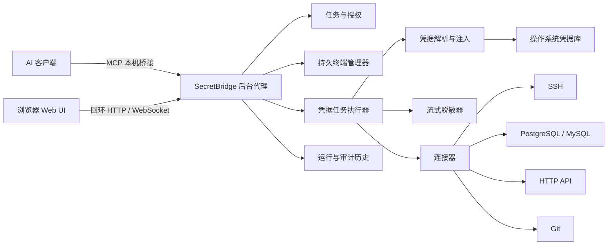
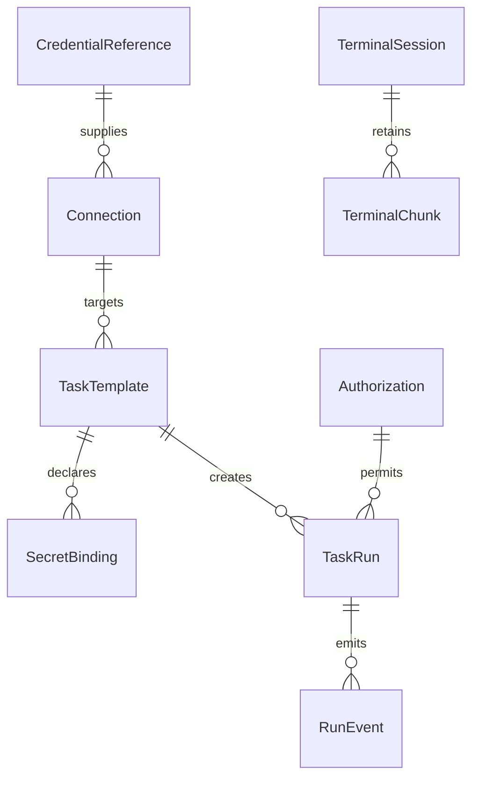
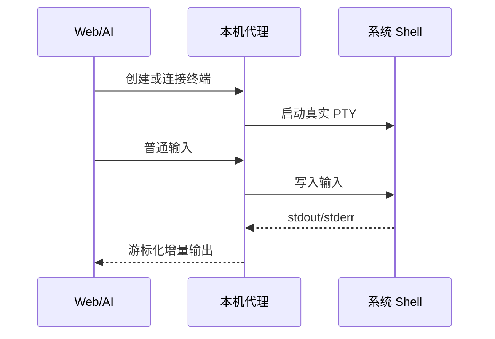
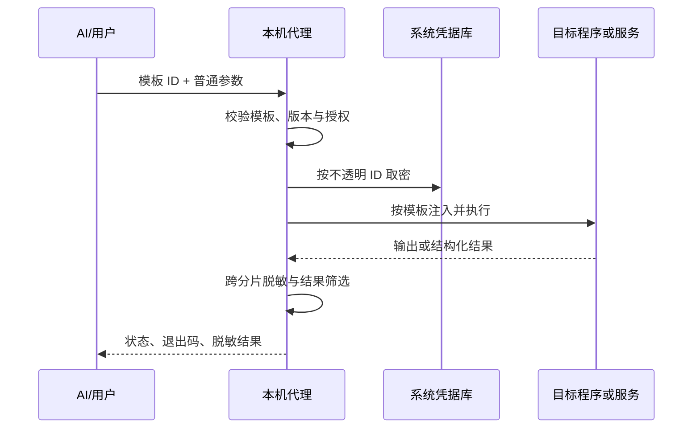

# SecretBridge 成熟态软件架构与功能说明

[项目首页](../README.zh-CN.md) / [文档中心](README.md) / 成熟态架构

本文描述 SecretBridge 完整产品的目标形态，用于约束后续功能开发。当前实现范围以[功能优先路线图](../ROADMAP.md)为准。

## 产品目标

SecretBridge 是一个运行在用户电脑上的凭据代用与任务执行代理：

- 用户在本机 UI 中保存密码、令牌和密钥；
- AI 只能引用凭据，不能调用读取或导出秘密的接口；
- 本机代理在用户允许的任务中注入凭据并执行；
- Web 界面和 AI 都能实时获得脱敏输出、状态和错误；
- 普通终端、使用凭据的任务和系统管理能力保持清楚边界。

它不是云端密码库、合规审计平台或团队审批系统。第一阶段面向单人、本机、AI辅助运维和开发场景。

## 典型使用场景

| 场景 | 用户配置 | AI 可以做什么 | AI 不会得到什么 |
|---|---|---|---|
| SSH 运维 | 主机、账号、密码或密钥、允许任务 | 发起获准命令、读取脱敏输出 | 私钥或密码原文 |
| 数据库操作 | 地址、账号、密码、查询模板 | 执行登记的连接检查或查询 | 数据库密码、任意未登记 SQL 权限 |
| HTTP API | URL 模板、认证令牌、请求模板 | 填写普通参数并调用接口 | Authorization 原文 |
| Git 操作 | 仓库、令牌或 SSH 身份 | 拉取、推送、检查远端 | 访问令牌或私钥 |
| 本机终端 | Shell、工作目录、普通环境 | 运行普通命令并持续读取 | SecretBridge 凭据库访问接口 |

## 总体架构

### Web UI

负责用户可信操作：录入或更新秘密、配置连接和任务、选择授权方式、观察终端、处理运行确认、取消任务和查看历史。秘密输入保存成功后立即清空，页面不提供回填或复制旧秘密的能力。

### 后台代理

长期持有配置、终端和运行生命周期。浏览器关闭或 MCP 客户端断开不应自动结束正常任务。代理只监听回环地址，并通过本机 IPC 与 MCP stdio 桥接通信。

### MCP 桥接

向 AI 暴露结构化工具：列出可用连接和任务、请求执行、操作普通终端、读取增量输出、查询状态和取消。工具 schema 不包含秘密值字段，也没有读取凭据、审批自己请求或修改后台安全设置的能力。

### 操作系统凭据库

Windows 使用 Credential Manager，macOS 使用 Keychain，Linux 使用 Secret Service。SQLite 只保存不透明凭据 ID、名称、类型、用途和配置状态。

### 持久终端管理器

管理真实 PowerShell、CMD、Bash 和 Zsh PTY。终端保留工作目录、普通环境和输出游标；Web 与 AI 通过输入租约协调写入。普通终端不自动加载 SecretBridge 保存的凭据。

### 凭据任务执行器

根据任务模板解析普通参数和凭据插槽，在执行瞬间取得秘密，使用指定方式注入，经过流式脱敏后返回结果。任务完成后清理临时文件、临时环境和可清理内存。

### 连接器

连接器为常见协议提供比自由命令更稳定的输入、输出和错误模型。每个连接器独立声明支持的认证、操作、超时、取消、结果字段和敏感内容。

## 核心数据模型

| 对象 | 保存内容 | 不保存内容 |
|---|---|---|
| CredentialReference | 名称、类型、用途、系统凭据库 ID、是否已配置 | 秘密原文 |
| Connection | 类型、地址、账号、TLS/主机密钥设置、凭据引用 | 密码、令牌、私钥原文 |
| TaskTemplate | 程序或连接器、参数 schema、凭据插槽、注入方式、结果规则 | 已解析的秘密 |
| Authorization | 模板与连接版本、有效期、允许次数、用户决定 | 秘密或完整输出 |
| TaskRun | 状态、时间、退出码、脱敏结果、配置版本快照 | 注入值和原始认证流 |
| TerminalSession | Shell 类型、工作目录、状态、输出游标 | 凭据库内容 |

## 两条执行路径

### 普通终端

普通终端是通用代码执行能力，但不会自动取得 SecretBridge 凭据。用户本来就在终端中拥有的系统权限不由 SecretBridge 扩大。

### 使用凭据的任务

AI 请求中不包含秘密占位值。占位符只存在于后台任务定义，解析发生在可信代理内部。

## 凭据注入方式

| 方式 | 适合场景 | 主要风险 | 产品要求 |
|---|---|---|---|
| 标准输入 | 支持从 stdin 读密码的 CLI | 程序可能回显 | 不进入终端历史，输出统一脱敏 |
| 原生协议/SDK | 数据库、HTTP、SSH | 库或远端错误携带认证信息 | 错误映射和字段筛选 |
| 临时环境变量 | 只支持环境变量的工具 | 同用户进程可能读取环境 | 仅给目标子进程，任务后销毁，不进入持久终端 |
| 命令参数 | 少数只能从 argv 取值的工具 | 进程列表和历史暴露 | 默认警告、显式选择、从不写入历史和日志 |
| 短期配置文件 | CLI 配置、证书链、凭据文件 | 文件权限、崩溃残留 | 私有临时目录、最小权限、启动恢复清理 |

注入方式不是抽象的安全等级，而是用户可以理解和选择的执行契约。产品应优先推荐目标程序的原生安全认证方式，同时允许在开发阶段使用现实工具所需的其他方式。

## 实时通信

- Web UI 使用 WebSocket 接收终端输出、任务状态、审批变化和交互请求；
- MCP 使用游标读取保证断线续传，并可在协议允许时发送进度通知；
- 写操作使用幂等键，连接中断后先查询状态，不盲目重试；
- 输出缓冲有容量和背压边界，超限时明确报告截断位置。

## 必须保留的底层安全边界

这些控制直接服务于“AI 能用但不能直接读密”，应随核心功能长期保留：

- 没有读取、导出或列举秘密原文的 Web/MCP API；
- 服务默认只监听本机，浏览器写操作校验会话和 Origin；
- 密码、令牌和密钥存入操作系统凭据库，不进入 SQLite；
- 普通终端与凭据任务分开，秘密不注入持久 Shell；
- 任务配置、日志、历史、错误和 MCP 结果不保存已知秘密；
- 跨 stdout/stderr 分片脱敏，取消和异常路径同样经过清理；
- 模板或连接变化使旧授权失效，运行具备幂等、超时和取消语义；
- 数据库和网络连接默认校验证书或主机身份，不提供静默降级开关。

同一操作系统账号下拥有任意代码执行权限的程序，仍可能直接调用系统凭据库、读取进程内存或绕过 SecretBridge。这是本机单用户模型的明确限制，不通过增加证据页面来掩盖，也不妨碍先把正常接口边界和产品功能做好。

## UI 信息架构

| 一级页面 | 主要任务 |
|---|---|
| 凭据 | 新增、更新、删除和查看配置状态 |
| 连接 | 管理数据库、SSH、HTTP、Git 等目标及关联凭据 |
| 任务 | 创建模板、填写参数、授权、执行和查看当前状态 |
| 终端 | 创建、重连和操作真实系统终端 |
| 历史 | 查询运行与简洁审计事件 |
| 设置 | 后台服务、语言、默认 Shell、数据目录、备份与诊断 |

运行界面不展示开发里程碑、安全认证宣传、试点证据或实现内部字段。

## 跨平台边界

| 平台 | 终端 | 凭据库 | 本机 IPC |
|---|---|---|---|
| Windows | PowerShell、CMD、ConPTY | Credential Manager | Named Pipe |
| Linux | Bash、兼容 PTY | Secret Service | Unix domain socket |
| macOS | Zsh、兼容 PTY | Keychain | Unix domain socket |

平台差异由 Rust 平台层封装，Web 与 MCP 使用同一领域接口。功能开发期间在 CI 验证编译和合成路径，Beta 阶段再集中完成安装包与真实桌面环境验收。

## 扩展原则

- 新连接器必须有固定 schema、真实服务测试和敏感字段说明；
- 插件不能获得通用凭据读取能力，只能声明由代理代用的插槽；
- 自由 Shell 与带密任务不能合并成一个不受约束的接口；
- 团队、多租户和远程代理属于后续独立项目，不进入首个本机稳定版。

---

[功能优先路线图](../ROADMAP.md) · [当前开发设计](开发设计.md) · [安全模型](安全模型与验收.md) · [跨平台与 UI 规范](跨平台与UI规范.md)
