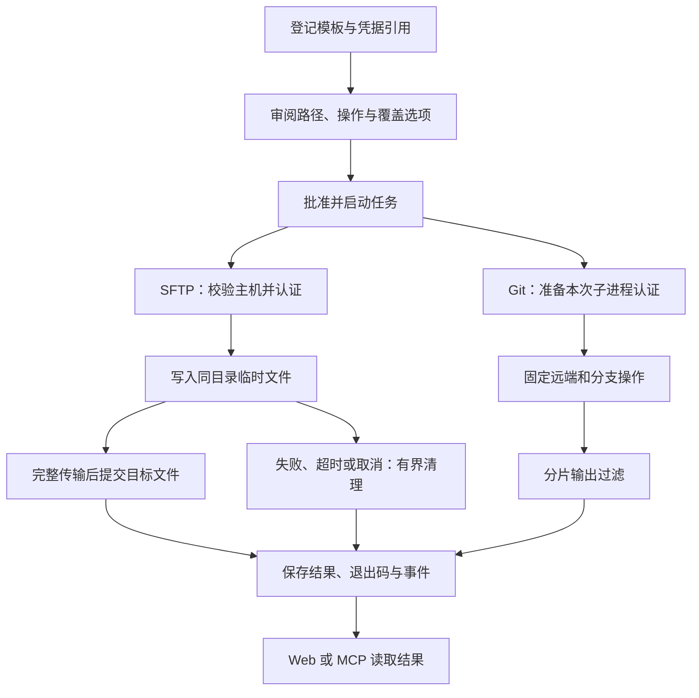

# 文件传输与 Git 任务

[文档中心](README.md) / 文件传输与 Git 任务

SFTP 和 Git 任务使用同一套模板、凭据引用、审批、运行历史和输出读取机制。智能助手可以请求登记的操作，但不能读取认证密码、私钥或访问令牌。

## 选择执行方式

在“操作模板”中新建或编辑凭据命令任务，选择执行方式：

| 执行方式 | 用途 | 认证 | 返回结果 |
|---|---|---|---|
| SFTP 文件传输 | 上传或下载一个固定路径的普通文件 | SSH 密码、Ed25519/ECDSA 私钥及可选独立口令 | 方向、完成字节数或固定错误代码、清理状态；不返回文件正文 |
| Git HTTPS | 查询远程分支、拉取或非强制推送固定分支 | 用户名 + 系统凭据库中的令牌引用 | 已过滤的 Git 输出、固定结果摘要和真实退出码 |

两种任务均不接受 AI 提供的自由路径、URL、分支或命令参数。变更模板、目标或关联凭据后，先前授权失效，需要重新申请。



## SFTP 配置与使用

1. 建立 SSH 主机目标，并保存密码或“SSH 密钥”凭据引用。加密私钥的口令保存为独立引用。
2. 选择“SFTP 文件传输”，填写主机、端口、登录用户名及经可信渠道核验的 SHA256 主机指纹。
3. 选择上传或下载，登记本机文件绝对路径和远程文件绝对路径。路径指的是**后台代理所在机器**和远程服务器，不是浏览器下载目录。
4. 配置字节上限和是否允许替换。默认拒绝覆盖；界面初始上限为 256 MiB，可设置为 1 字节至 1 GiB。空文件仍可传输。
5. 在审批中核对方向、两个路径、大小上限和覆盖开关，批准后启动任务。

本机父目录必须存在；上传源必须是普通文件。远程路径采用绝对 POSIX 路径，不接受 `.`、`..` 或目录路径。远端需要启用 SFTP 子系统；不通过远程 Shell 执行文件命令。与 SSH 命令一样，不自动接受首次连接的主机指纹，也不支持 RSA、主机证书或 SSH Agent。

### 提交与覆盖规则

- 上传：在目标同目录独占创建 `.secretbridge-<随机标识>.part`，分片写入并关闭后重命名；默认模式依赖标准 SFTP v3 的“不替换已存在目标”规则。
- 允许覆盖的上传：要求服务端声明 `posix-rename@openssh.com` 版本 1，并通过该扩展原子替换。没有扩展则拒绝，**不会先删除原文件**。
- 下载：在本机目标同目录独占创建临时文件，写完并同步后提交。默认模式使用硬链接独占创建目标，防止覆盖并发出现的文件；文件系统不支持硬链接时会明确失败，不退化为覆盖。
- 允许覆盖的下载：完整写入后使用操作系统重命名替换，拒绝明显的符号链接或非普通文件目标。

路径登记不是文件系统沙箱。父目录中的链接、外部进程修改路径或源文件，以及不遵守协议的服务端，都不属于完整隔离保证；只登记自己管理的文件和目录。传输的文件正文不会在模型响应中回显，也不会被秘密过滤器改写；不要登记凭据库、秘密文件或不应发送到目标端的文件。

### 结果与恢复

成功结果例如：

```json
{"kind":"sftp","direction":"upload","bytes_transferred":70000,"cleanup_ok":true}
```

失败返回固定代码，例如 `destination_exists`、`source_missing`、`size_limit`、`host_key_rejected`、`atomic_overwrite_unsupported`、`remote_write_failed`、`cancelled` 或 `timed_out`。不返回上游异常正文。

取消和超时停止当前传输，保留连接最多额外 2 秒用于关闭句柄及删除临时文件，然后断开真实 SSH 运输连接。`cleanup_ok:false` 表示清理未确认完成，需要在登记目录核查 `.secretbridge-*.part`。进程崩溃、断电或断网可能留下临时文件；不做任意目录的启动扫描删除。

提交之后发生取消或服务中断，不保证撤回已经完成的文件替换。重试前核对目标状态，不要将“不确定结果”当作“未修改”。

## Git 配置与使用

需要本机安装 **Git 2.31 或更新版本**，支持 `--config-env`。SecretBridge 当前不捆绑 Git，也不修改全局 Git 配置。

1. 保存 API 令牌或密码类型的凭据引用；令牌权限应满足登记的读或写操作。
2. 建立 HTTP 服务目标，在操作模板中选择“Git HTTPS”。
3. 填写可信 Git 可执行文件的绝对路径和本机仓库目录。查询远端也需要一个已存在的工作目录；拉取和推送需要有效 Git 仓库。
4. 填写不含用户名、密码、查询串或片段的 HTTPS 仓库 URL、固定分支和认证用户名。
5. 选择令牌引用和操作。审批中确认 Git 程序、仓库目录、URL、分支及操作后执行。

GitHub 常用账户名配合 Personal Access Token；其他 Git 服务按自身文档填写 Basic 认证用户名。HTTP 仅允许数值回环地址，用于本机测试；业务远端使用 HTTPS。不提供关闭 TLS 验证的界面，不跟随 HTTP 重定向。

| 操作 | 具体行为 | 不执行的动作 |
|---|---|---|
| 查询远程分支 | `ls-remote --heads` 查询固定 `refs/heads/<分支>` | 不修改工作区；不存在的分支可能得到空结果和退出码 0 |
| 拉取分支 | `fetch` 将固定分支保存到 `refs/remotes/secretbridge/<分支>` | 不 checkout、merge、pull、不自动修改当前分支、不递归处理子模块 |
| 推送分支 | 将本机 `refs/heads/<分支>` 推送到同名远程分支 | 不 force、不删除分支、不执行推送钩子、不递归处理子模块 |

### 凭据生命周期与输出

执行器在内存中构造 Basic 认证头，通过**该 Git 子进程的环境变量**交给 URL 范围内的 HTTP 配置。令牌不会进入持久模板、认证 URL、argv、磁盘临时认证文件或凭据助手。进程结束后不保留该环境配置。

本机同用户或更高权限的进程检查工具仍可能读取子进程环境；这不是系统级隔离。只使用可信 Git 程序和仓库配置，不把恶意 Git 可执行文件或仓库视为受沙箱约束的对象。继承的 `GIT_*` 诊断／配置变量会移除，系统和全局 Git 配置不加载，但受信任仓库自身的配置仍可能影响操作。私有 CA、代理或 URL 重写等仓库设置需谨慎核查。

stdout/stderr 在保存和返回前持续过滤原令牌、`用户名:令牌`、其 Base64 表示及完整认证头。最终摘要包含 `kind:git`、操作、真实退出码及 `git_failed`、`timed_out` 或 `cancelled` 等固定错误代码。不承诺过滤任意加密、哈希、变换后的秘密。

取消和超时复用本机进程树终止机制；远端可能已经接受推送，停止客户端不等于撤回远程更新。重试前检查远端分支，并留意中断后 Git 自身遗留的锁文件；不要在确认仍有任务运行前删除锁文件。

## Web、MCP 与验收

AI 使用现有工具列出模板、申请审批、启动任务、按游标读取输出或取消。模板摘要的 `execution_kind` 分别为 `sftp` 和 `git`，不公开凭据原文。审批仍由用户通过 Web 决定，单次／限时授权、版本漂移失效、幂等键和四任务并发上限继续共用。

仓库测试使用合成凭据及真实本机 SSH/SFTP 服务、由 Git `http-backend` 提供的带认证 smart-HTTP 远端，覆盖文件完整性、覆盖拒绝、原子替换、临时文件清理、清理失败、超时／取消、Git 新增提交拉取及推送、重定向拒绝、Web 和原生 MCP/IPC 调用、SQLite 重开。公开 Git 托管服务、系统真实凭据库和业务服务器连接不是这些本机测试的替代目标。

本版本不包含 Git SSH、clone、merge、force-push、递归目录传输、动态路径、断点续传或图形文件浏览器。

---

[SSH 凭据任务](SSH凭据任务.md) · [凭据命令任务](凭据命令任务.md) · [参数化任务与授权](参数化任务与授权.md) · [路线图](../ROADMAP.md)
