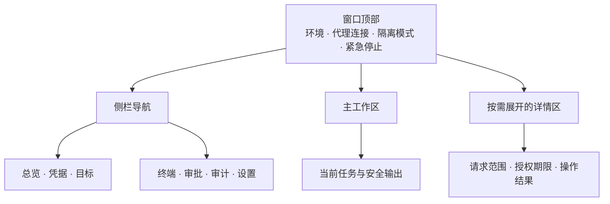

# 三平台与UI质量规范

[文档中心](README.md)

面向平台开发者、产品设计者与测试参与者。本文定义三平台适配合同、Web界面信息结构和体验验收目标；M0界面已实现，原生凭据库与进程功能仍待验证。

本页导航

- [平台适配矩阵](#section-1)
- [抽象接口](#section-2)
- [界面信息结构](#section-3)
- [视觉与交互方向](#section-4)
- [易用性与可访问性验收目标](#section-5)
- [官方依据](#section-6)

## 平台适配矩阵

| 能力 | Windows | Linux | macOS |
|---|---|---|---|
| 首轮测试目标 | Windows 11 x64 | Ubuntu 24.04 x64，GNOME/KDE | macOS 14+，arm64/x64 |
| 管理界面 | 当前版Edge／Chrome／Firefox | 当前版Chrome／Firefox | 当前版Safari／Chrome／Firefox |
| PTY | ConPTY | POSIX PTY | POSIX PTY |
| 本地IPC | Named Pipe＋显式DACL＋身份检查 | Unix socket＋文件权限＋peer credential | Unix socket＋权限＋平台peer身份验证 |
| 凭据后端 | Credential Manager／用户范围DPAPI | Secret Service兼容服务 | Keychain Services |
| 后台生命周期 | 独立代理，受控部署可用专用身份服务 | 用户服务／专用身份systemd服务 | launchd代理／经授权的受控服务 |
| 子进程回收 | Job Object及受限令牌 | 进程组＋可用的cgroup/systemd管理 | 进程组＋launchd管理，单独验证逃逸子进程 |
| 发布目标 | 签名服务安装包＋本机Web管理端 | 明确发行版的软件包＋本机Web管理端 | 签名、公证的服务包＋本机Web管理端 |

以上为项目测试范围提案，不是各组件最低版本或完整兼容保证。Windows/Linux arm64与其他发行版标记实验性直到有独立证据；macOS两架构分别构建验证。不能把GitHub托管runner测试当作原生凭据库与浏览器交互验收。

## 抽象接口

共用Rust核心：策略、批准、事件schema、输出审查、幂等、资源配额。平台层分别实现SecretStore、LocalTransport、PeerIdentity、TerminalBackend、ProcessSupervisor、RuntimePaths与Autostart。禁止核心逻辑中拼接平台shell命令读取密码。

路径采用平台应用数据目录，不硬编码盘符、用户名或家目录。路径大小写、符号链接／重解析点、长路径、文件权限与换行分别测试。普通shell尊重平台与用户选择；受控操作使用固定执行器，不假设bash、PowerShell或某个数据库CLI必然安装。

Linux Secret Service依赖桌面会话与服务是否可用；无D-Bus／未解锁密钥环／无桌面的服务环境必须显示不可用，不能自动回落到明文文件。专用服务身份与用户桌面密钥环不能假定可互通。macOS Keychain解锁、应用访问控制、签名身份变化与launchd环境必须用真实开发机验证。所有平台的用户级凭据库均不替代AI执行身份隔离。

用户服务不等于开机后始终可用，也不等于注销后仍在运行。跨注销／无人值守保活需要单独授权和平台部署设计；首版统一承诺UI或AI连接关闭后存活，系统重启后只恢复配置与安全历史。

## 界面信息结构

**界面信息结构示意，非产品截图。** 顶部状态在不同页面保持可见；侧栏用于切换工作环节；审批详情在明确动作后展开，不遮蔽目标和环境信息。

| 交互场景 | 页面行为 | 安全与可用性要求 |
| :--- | :--- | :--- |
| 首次使用 | 从模拟任务进入配置引导 | 无凭据也能理解流程，不暗示真实连接已可用 |
| 请求审批 | 并列展示目标、动作、参数与输出范围 | 生产标记醒目，批准与拒绝均可键盘访问 |
| 终端运行 | 显示任务状态、会话类型与输入租约 | 不把已连接显示成已完成 |
| 断线重连 | 保留会话标识并查询运行状态 | 不自动重放未知结果的写操作 |
| 密钥环不可用 | 说明原因与可选处理路径 | 不回落到明文存储 |
| 关闭页面 | 显示后台任务是否继续 | 停止代理必须是独立、范围明确的操作 |

## 视觉与交互方向

定位：克制、清晰、可信的专业工具。主界面浅色／深色／跟随系统三种主题；低饱和中性色搭配青蓝色强调。危险与生产环境用文字、图标、颜色共同标记，不用大面积霓虹或持续动画制造“安全感”。

设计token：4/8/12/16/24/32间距；正文14–16逻辑像素；终端独立等宽字体和缩放；统一圆角、边框、焦点、禁用与错误状态。使用系统字体，避免首版引入来源不清的字体和商业图标；未来图标库需登记许可证。保持正常、悬停、焦点、按下、加载、禁用、错误七种控件状态。

响应式Web布局：左侧导航＋顶部连接／隔离状态＋主工作区；审批详情可侧栏展开。终端标签展示环境、连接状态和输入权。窄视口折叠导航，不隐藏关键审批信息。初次打开显示“无真实凭据、先用模拟任务”，引导配置目标→操作→批准→结果，每步可撤回。管理端只由本地服务提供，不嵌入桌面壳，也不加载远程脚本。

凭据录入页与终端输出隔离；密码输入不触发搜索、日志或分析。保存失败保持用户可理解的错误，不把API响应全文塞入弹窗。等待审批、后台运行、连接断开、锁定、失败、结果未知必须有不同状态，不把所有情况表现为无限转圈。

## 易用性与可访问性验收目标

- 遵循WCAG 2.2 AA相关对比度、焦点、标签、错误提示要求；这只是验收目标，未宣称符合认证。
- 键盘可完成所有核心操作，焦点可见、顺序合理、模态框能正确返回焦点；Windows/Linux Ctrl与macOS Cmd遵循平台习惯。
- 100%—200%缩放、多屏不同DPI、系统大字号、中文输入法、中文长文本、英文扩展、Retina、Linux分数缩放均列入测试。
- 支持减少动态效果；危险操作不靠颜色辨识，屏幕阅读器可读审批范围及任务状态。
- 测试任务：新用户无需文档完成模拟连接与单次审批，目标5分钟以内；正式做至少5名非开发者的任务观察，报告失败点，不以内部感觉冒充易用性通过。
- 交互响应目标：本地点击可见反馈p95≤100ms，页面初次可交互≤3秒；需定义硬件、浏览器、样本和冷启动条件后实测，不作为当前性能事实。
- 数据量测试：至少100目标／1000审计项仍可筛选，终端大输出不阻塞审批；使用虚拟列表与背压，性能优化不能绕过输出审查。

验收证据分别保存UI原型、实际截图、键盘路径、屏幕阅读器结果与原生平台测试。设计图统一标注“示意”；产品截图应关联可运行提交与目标平台。

## 官方依据

- [WCAG 2.2](https://www.w3.org/TR/WCAG22/)：可访问性目标的检查依据。
- [OWASP CSRF防护指南](https://owasp.org/www-community/attacks/csrf)：本机Web管理端仍须进行来源校验，回环地址本身不是身份认证。
- [Secret Service规范](https://specifications.freedesktop.org/secret-service/latest/)：当前入口标为草案，实现时以目标系统实际兼容协议为准，不照搬未经部署的草案新增能力。
- [Apple Keychain](https://developer.apple.com/documentation/security/keychain-services)：macOS凭据后端方向，具体授权与服务集成仍待实验。
