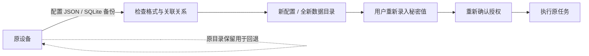

# 配置迁移与备份恢复

[项目首页](../README.zh-CN.md) / [文档中心](README.md) / 配置迁移与备份恢复

设置中的“数据维护”提供配置迁移、SQLite 一致性备份、恢复预检和精简诊断。所有在线操作都需要已配对的页面会话；恢复通过独立维护命令完成，不提供覆盖运行中数据库的按钮。

## 选择合适的文件

| 文件 | 包含 | 不包含 | 适合场景 |
|---|---|---|---|
| 配置 JSON | 凭据引用、连接定义、模板、普通参数定义和命令插槽 | 系统凭据库秘密值、授权、运行及输出历史 | 复制配置到另一设备，或追加一组模板 |
| SQLite 备份 | 配置、授权与执行记录、过滤后的输出、导入回执 | 系统凭据库秘密值、页面会话、MCP 令牌、PTY 进程 | 恢复完整配置与历史 |
| 诊断 JSON | 软件版本、平台、schema 版本、状态计数和固定错误代码计数 | 名称、主机、路径、UUID、参数、输出、事件正文 | 向维护者说明运行环境与故障概况 |

> [!WARNING]
> “不包含凭据库秘密值”不等于文件可以公开。配置中的普通命令参数、HTTP 请求正文、连接地址和说明会原样导出；备份还可能包含业务参数和过滤后的业务结果。不要在普通字段中直接写密码，也不要把配置或数据库备份作为公开诊断附件。



## 配置导出与导入

1. 打开“设置 → 数据维护 → 配置迁移”，选择“导出配置”。下载的 `secretbridge-configuration.json` 使用格式 `secretbridge-configuration`、格式版本 `1`。
2. 在目标设备选择配置文件，点击“检查导入”。文件上限为 8 MiB；最多 128 个凭据引用、128 个连接和 256 个模板，且导入后的目录也不能超过现有资源上限。
3. 预检成功后查看凭据引用、连接和模板数量，再点击“确认导入”。预检只在临时目录快照中运行，不写入当前配置，也不访问凭据库。
4. 前往凭据页，为新增引用重新录入秘密值。检查连接、程序和路径，再申请新的任务授权。

导入采用**追加**而非覆盖策略：为所有导入记录分配新 UUID，重建连接到凭据、模板到连接以及所有命名插槽到凭据的关系，保留模板启用状态。名称相同不会自动合并；原配置、已有历史与授权不受影响。未导出授权不会在目标设备自动获准。

确认请求携带预检返回的 SHA-256 摘要。服务会重新校验文件，并把导入结果与摘要一起持久化；如果网络中断、用户重复点击或服务随后重启，重新确认**同一个文件**只返回原导入回执，不重复新增。改变文件内容或重新导出会形成不同摘要，应当作一次新的导入意图。导入失败不会留下部分凭据或连接。

本机程序和工作目录需要在目标设备存在。私有 CA、SSH/Git/SFTP 的路径也需要在目标设备重新准备。Windows 程序路径不会自动转换成 Linux/macOS 路径；跨平台迁移时可先在副本中调整普通路径，再预检导入。普通命令配置不允许借导入绕过原有校验。

## 下载一致性备份

打开“备份与恢复”，点击“下载 SQLite 备份”。服务使用 SQLite 在线备份 API，将已提交页面复制为独立快照，包括仍在 WAL 中的已提交变更，不直接复制运行中的主数据库文件。输出文件可独立保存，不依赖同名 `-wal` 或 `-shm` 文件。

备份与预检上限为 256 MiB。备份复制有时间上限；出现存储忙或复制失败时不会下载一个部分成功的数据库。临时内存快照不会写入系统凭据库秘密值。请将文件保存到受访问控制保护的位置。

备份保存的是某一时刻的数据：备份时仍运行的任务可能在源设备稍后完成，但恢复端不会继续这些进程。PTY 进程、页面配对、IPC 连接和环境变量不会随备份重建。

## 恢复预检

选择备份后点击“检查备份”。预检检查 SQLite 文件头、受支持的 schema、完整性、外键、已知表集合、资源上限及模板配置。拒绝新于当前版本的 schema、未知表、视图或触发器，以及不符合当前配置校验的记录。当前支持 schema **14—15**，恢复到 schema **15**；更早版本先使用相应受支持版本升级并重新生成备份。

在线预检只在内存快照中检查，不替换当前配置。成功报告显示原 schema、恢复 schema、配置数量与运行数量，并明确说明需要重新录入秘密值、不会恢复有效授权。服务端的预检报告不是数字签名，也不能证明备份的来源；仅恢复自己信任的备份。

维护命令也可单独检查，不需要启动 Web 服务或读取系统凭据库：

```console
secretbridge-server --inspect-backup /absolute/path/secretbridge-backup.sqlite3
```

Windows 路径示例：

```powershell
.\secretbridge-server.exe --inspect-backup 'C:\SecretBridgeBackups\secretbridge-backup.sqlite3'
```

## 恢复到全新目录

先关闭后台代理和相关 MCP 桥接进程，准备一个**尚不存在的绝对数据目录**。父目录必须已经存在。维护命令要求显式设置 `SECRETBRIDGE_DATA_DIR`，不允许覆盖任何已存在目录，即使该目录是空的。

### Windows / PowerShell

```powershell
$env:SECRETBRIDGE_DATA_DIR = 'C:\SecretBridgeData\restored-20260919'
.\secretbridge-server.exe --restore-backup 'C:\SecretBridgeBackups\secretbridge-backup.sqlite3'
.\secretbridge-server.exe
```

### Linux / macOS

```bash
export SECRETBRIDGE_DATA_DIR=/var/tmp/secretbridge-restored-20260919
./secretbridge-server --restore-backup /var/tmp/secretbridge-backup.sqlite3
./secretbridge-server
```

实际使用请选择自己的私有目录；Unix 恢复目录权限设置为 `0700`，Windows 目录继承父目录 ACL。不要把数据目录放入公开仓库。启动服务和后续 MCP 桥接必须使用同一 `SECRETBRIDGE_DATA_DIR`；开发构建启动前还需准备 Web 构建资源，参见[开发者入门](开发者入门.md)。

恢复完成后：

- 配置、历史和原记录 UUID 保留；系统凭据库不会被复制、清空或修改。
- 所有凭据引用标记为“未配置”，必须重新录入秘密值。
- 待确认和已批准授权改为已撤销；历史中的已拒绝、已撤销及已过期记录保留。
- 排队和执行中的任务标记为中断失败，不自动重新执行。
- 页面与 MCP 会话需要重新连接；持久终端进程不会恢复。

然后完成“重新配置凭据 → 检查连接与程序路径 → 创建新授权 → 执行任务”。原数据目录不变，恢复失败也不覆盖它。需要回退时，停止新服务，将 `SECRETBRIDGE_DATA_DIR` 切回原目录再启动；不要让两个代理并发使用同一数据库。

## 自动升级与回滚副本

打开旧 schema 数据库前，服务先生成一致性的 `secretbridge.pre-migration-v<版本>-<UUID>.sqlite3` 副本，再执行现有版本迁移。备份失败时不继续迁移；迁移失败时把数据库恢复为升级前的完整快照，并报告初始化失败。成功升级后保留副本，不自动删除。

副本也是私有数据库备份。升级前文件可能含当前版本已移除的旧表；若不满足当前恢复预检，应通过兼容旧版本、全新目录进行恢复，而不是修改版本号绕过预检。不要直接将旧 schema 交给不支持它的二进制，也不要在服务运行时覆盖主数据库文件。

## 精简诊断

“诊断 → 下载诊断信息”生成 `secretbridge-diagnostics.json`，仅包含固定结构、状态计数和白名单错误代码；未知失败归入 `other_failure`，不复制数据库中的任意错误字符串。诊断用于描述环境和故障类别，不是包含原始日志的完整支持包。

常见维护错误：

| 错误 / 现象 | 处理 |
|---|---|
| `backup_unreadable` | 检查文件路径及读取权限；符号链接不作为备份输入 |
| `backup_invalid` | 使用本应用生成且 schema 受支持的完整备份；检查容量和程序路径 |
| `restore_requires_explicit_data_directory` | 显式设置 `SECRETBRIDGE_DATA_DIR` |
| `restore_requires_new_directory` | 使用尚不存在的绝对目录，确认父目录存在 |
| 页面配对已失效 | 重新配对，再重复预检或确认；不要换文件来重试不确定导入 |
| 导入达到资源上限 | 清理不需要的记录或导入到新目录；原配置不会被部分覆盖 |

## 实现与验证

目录模块使用内存 staging 和 SQLite 原子备份提交，导入时持有目录锁，避免覆盖并发历史变更；schema 15 增加 `configuration_imports` 表，仅保存摘要和数量回执。维护 HTTP 接口先校验页面会话和写操作 Origin，再解析较大的文件，不开放给 MCP 下载工具。

回归测试覆盖只读预检、摘要不匹配、失败不留部分记录、插槽 UUID 重映射、禁用状态、重开后的重复确认、WAL 一致性、异常 schema/触发器、升级回滚及恢复后的真实本机凭据命令执行。UI 检查使用模拟 API，覆盖下载、确认失败后重试、只读恢复预检、中英文和窄屏；不把模拟 API 测试等同于真实业务连接验收。

技术依据：[SQLite 在线备份](https://www.sqlite.org/backup.html)、[独立快照反序列化与 WAL 文件头](https://www.sqlite.org/c3ref/deserialize.html)。
